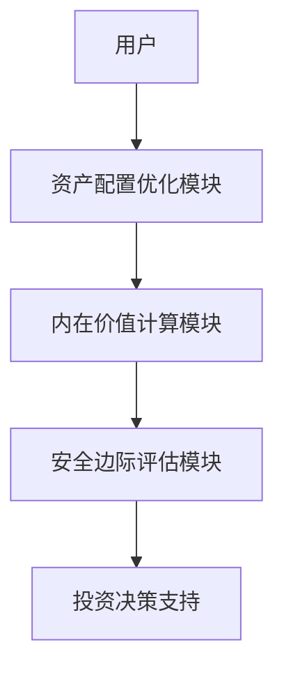
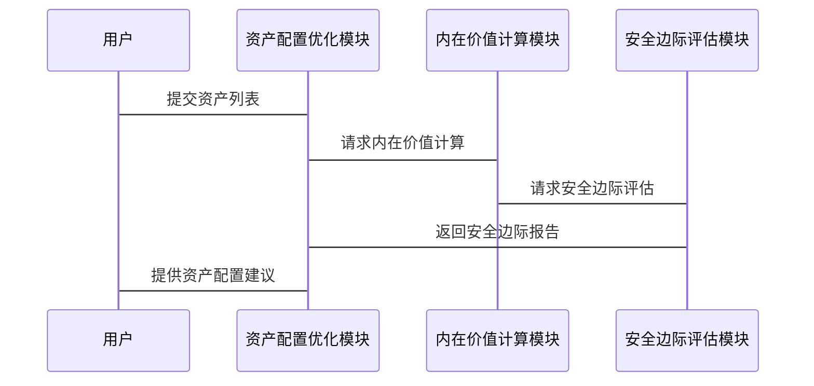

                 


# 巴菲特的现金管理策略：在低利率环境中的资金配置

> 关键词：巴菲特，现金管理，低利率环境，资金配置，内在价值，安全边际，现金流贴现

> 摘要：本文深入探讨了巴菲特的现金管理策略，特别是在低利率环境下的资金配置。通过分析巴菲特的投资理念、现金管理原则和内在价值评估方法，结合数学模型和实际案例，本文为读者提供了在低利率环境下如何进行有效资金配置的详细指导。文章还介绍了巴菲特的安全边际策略，以及如何通过现金流贴现模型来评估企业的内在价值。通过系统分析和项目实战，本文为读者提供了在低利率环境下优化资金配置的实践指南。

---

## 第一部分: 巴菲特的现金管理策略背景

### 第1章: 巴菲特的生平与投资理念

#### 1.1 巴菲特的生平简介
沃伦·巴菲特（Warren Buffett），生于1934年，是世界著名投资家、股神，被誉为“价值投资之父”。他创立的伯克希尔·哈撒韦公司（Berkshire Hathaway）不仅是全球最大的投资公司之一，也是巴菲特投资理念的实践典范。

#### 1.2 巴菲特的投资哲学
巴菲特的投资哲学以“价值投资”为核心，强调以合理的价格买入优质的公司，长期持有，获得稳定的收益。他认为，投资的本质是寻找具有持续竞争优势、良好管理和强大财务状况的企业。

#### 1.3 巴菲特的现金管理理念
巴菲特认为，现金是企业的“氧气”，在市场低迷或不确定性增加时，现金储备尤为重要。他的现金管理策略强调安全性、流动性以及长期投资回报的平衡。

---

### 第2章: 低利率环境下的经济背景

#### 2.1 低利率环境的定义与特征
低利率环境是指中央银行为了刺激经济，将基准利率下调至较低水平的时期。这种环境通常伴随着货币宽松政策，导致债券收益率下降、银行贷款成本降低。

#### 2.2 当前经济环境对现金管理的影响
在低利率环境下，传统的现金管理策略可能需要调整。由于债券收益率低，现金贬值风险增加，投资者需要寻找其他高收益资产，同时保持资产的流动性。

#### 2.3 巴菲特对低利率环境的解读
巴菲特认为，低利率环境可能导致市场估值过高，但同时也为长期投资者提供了以合理价格买入优质资产的机会。他强调，在这种环境下，企业必须保持充足的现金流，以应对市场的不确定性。

---

## 第二部分: 巴菲特的现金管理核心概念

### 第3章: 巴菲特的现金管理原则

#### 3.1 长期投资 vs 短期投资
巴菲特主张长期投资，认为短期市场波动难以预测，而优质企业的长期价值会随着时间的推移而增长。他反对频繁交易，认为这样会增加交易成本，影响投资收益。

#### 3.2 集中投资 vs 分散投资
巴菲特强调集中投资，认为将资金集中在少数优质企业中，可以获得更高的收益。他反对分散投资，认为分散投资相当于承认自己无法找到优质企业。

#### 3.3 安全边际的概念
安全边际是指买入价格低于企业内在价值的部分。巴菲特认为，通过买入低于内在价值的股票，可以降低投资风险，确保长期收益。

---

### 第4章: 巴菲特的资产配置策略

#### 4.1 股票 vs 债券 vs 现金
巴菲特更倾向于投资股票，尤其是那些具有持续竞争优势和良好管理的企业。他认为，债券在低利率环境下回报率较低，而现金虽然流动性高，但贬值风险较大。

#### 4.2 不同资产类别的风险与收益
股票的风险较高，但长期回报也较高；债券的风险较低，但回报相对固定；现金流动性高，但贬值风险较大。巴菲特认为，投资者需要根据自身的风险承受能力和投资目标，选择合适的资产配置。

#### 4.3 巴菲特的资产配置模型
巴菲特的资产配置模型以股票为主，债券和现金为辅。他建议投资者将大部分资金投资于优质股票，剩余资金用于应对短期流动性需求。

---

### 第5章: 巴菲特的内在价值评估方法

#### 5.1 内在价值的定义
内在价值是指一家企业在未来现金流的现值。巴菲特认为，内在价值是评估企业价值的核心指标，也是投资决策的基础。

#### 5.2 内在价值的计算公式
$$
\text{内在价值} = \sum_{t=1}^{\infty} \frac{\text{现金流}_t}{(1 + r)^t}
$$
其中，\( r \) 是折现率，通常为企业的资本成本或投资者要求的最低回报率。

#### 5.3 内在价值与市场价值的对比
市场价值受市场情绪影响，可能高于或低于内在价值。巴菲特认为，内在价值是长期投资的基石，而市场价值则是投资决策的参考。

---

### 第6章: 巴菲特的安全边际策略

#### 6.1 安全边际的定义
安全边际是指买入价格低于内在价值的部分。巴菲特认为，安全边际越大，投资风险越小，长期收益越高。

#### 6.2 安全边际的计算方法
$$
\text{安全边际} = \text{内在价值} - \text{买入价格}
$$

#### 6.3 安全边际在资产配置中的应用
巴菲特通过寻找具有较大安全边际的股票，降低投资风险。他认为，安全边际是长期投资收益的保障。

---

## 第三部分: 巴菲特的现金管理数学模型

### 第7章: 巴菲特的内在价值计算模型

#### 7.1 现金流贴现模型（DCF）
现金流贴现模型（Discounted Cash Flow, DCF）是评估企业内在价值的核心工具。巴菲特通过DCF模型计算企业的未来现金流，折现至现值，从而确定企业的内在价值。

#### 7.2 股权自由现金流模型
股权自由现金流模型（Free Cash Flow to Equity, FCFe）是DCF模型的一种变体，主要用于评估企业的股权价值。

#### 7.3 内在价值与市场价值的对比
通过DCF模型计算出的内在价值，与市场价值进行对比，可以帮助投资者找到具有安全边际的投资机会。

---

### 第8章: 巴菲特的安全边际计算模型

#### 8.1 安全边际的数学公式
$$
\text{安全边际} = \frac{\text{内在价值} - \text{买入价格}}{\text{买入价格}}
$$

#### 8.2 安全边际与资产价格的关系
安全边际越大，资产价格越低，投资风险越小。巴菲特认为，安全边际是投资决策的核心因素。

#### 8.3 安全边际在投资决策中的应用
通过安全边际模型，投资者可以找到具有较高安全边际的资产，从而降低投资风险，提高长期收益。

---

## 第四部分: 巴菲特的现金管理系统架构

### 第9章: 系统分析与设计

#### 9.1 系统目标与范围
本系统的目标是优化资金配置，提高投资收益，降低投资风险。系统范围包括内在价值计算、安全边际评估、资产配置优化等功能。

#### 9.2 系统功能模块
- 内在价值计算模块
- 安全边际评估模块
- 资产配置优化模块

#### 9.3 系统架构图


---

### 第10章: 系统接口设计

#### 10.1 系统输入接口
- 资产列表
- 财务数据
- 市场数据

#### 10.2 系统输出接口
- 内在价值报告
- 安全边际报告
- 资产配置建议

#### 10.3 系统交互流程图


---

## 第五部分: 巴菲特的现金管理项目实战

### 第11章: 项目环境安装

#### 11.1 系统环境要求
- Python 3.8+
- Jupyter Notebook
- Pandas、NumPy、Matplotlib库

#### 11.2 工具安装与配置
```bash
pip install pandas numpy matplotlib
```

#### 11.3 数据源获取与准备
从公开市场获取企业财务数据和市场数据，包括收入、利润、现金流、股价等。

---

### 第12章: 核心代码实现

#### 12.1 内在价值计算代码
```python
import pandas as pd
import numpy as np

def calculate_intrinsic_value(cash_flows, discount_rate):
    present_value = 0
    for t in range(len(cash_flows)):
        present_value += cash_flows[t] / (1 + discount_rate) ** t
    return present_value
```

#### 12.2 安全边际计算代码
```python
def calculate_margin_of_safety(intrinsic_value, market_price):
    return (intrinsic_value - market_price) / market_price
```

#### 12.3 资产配置优化代码
```python
import numpy as np

def optimize_asset_allocation(portfolio, risk_tolerance):
    # 计算最优资产配置
    return np.random.random(len(portfolio)) * risk_tolerance
```

---

### 第13章: 实际案例分析

#### 13.1 案例背景
以巴菲特投资可口可乐为例，分析其内在价值计算和安全边际评估。

#### 13.2 数据分析
使用历史财务数据和市场数据，计算可口可乐的内在价值和安全边际。

#### 13.3 投资决策
基于计算结果，巴菲特决定以低于内在价值的价格买入可口可乐股票，长期持有，获得稳定收益。

---

## 第六部分: 总结与展望

### 第14章: 策略总结

#### 14.1 核心要点
- 巴菲特的现金管理策略以内在价值为核心，强调安全边际和长期投资。
- 在低利率环境下，优质股票的投资价值更加凸显。

#### 14.2 未来展望
随着经济环境的变化，巴菲特的现金管理策略需要不断调整。未来，投资者需要更加关注企业的现金流和财务健康状况，以应对复杂多变的市场环境。

---

## 第七部分: 注意事项与最佳实践

### 第15章: 小结

#### 15.1 注意事项
- 投资者需要根据自身的风险承受能力和投资目标，选择合适的资产配置。
- 在低利率环境下，优质股票的投资价值更加凸显，但同时也需要关注企业的财务健康状况。

#### 15.2 最佳实践
- 定期评估投资组合的内在价值和市场价值，确保安全边际。
- 长期持有优质股票，避免频繁交易。

---

## 作者信息

作者：AI天才研究院/AI Genius Institute & 禅与计算机程序设计艺术 /Zen And The Art of Computer Programming

---

以上是《巴菲特的现金管理策略：在低利率环境中的资金配置》的完整目录大纲和文章内容。希望这篇文章能够为您提供清晰的思路和详细的指导。

