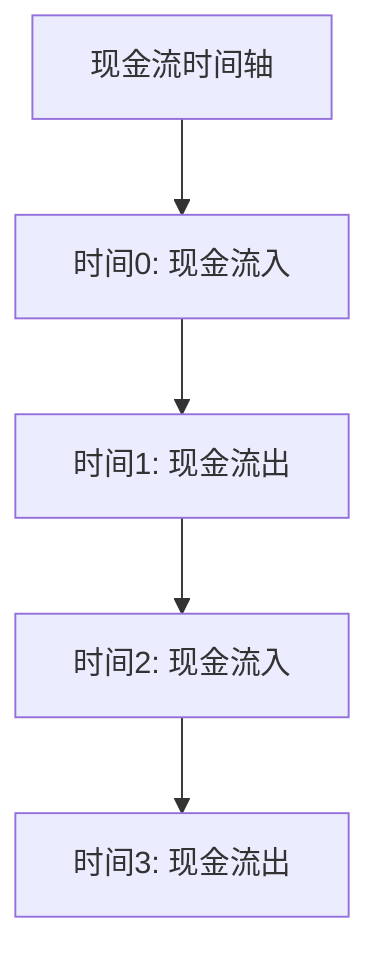

                 


# 巴菲特的现金管理艺术：在不确定性中保持灵活性

> 关键词：巴菲特，现金管理，现金流管理，风险管理，投资策略，安全边际

> 摘要：本文深入探讨了巴菲特的现金管理艺术，分析了他在投资过程中如何通过现金流管理保持灵活性，应对市场不确定性。文章从现金管理的理论基础、数学模型、算法原理、系统架构到实战案例，全面解析了巴菲特的现金管理策略，为读者提供了深刻的见解和实用的指导。

---

## 第一部分: 巴菲特的现金管理艺术概述

### 第1章: 现金管理的重要性与巴菲特的现金管理哲学

#### 1.1 现金管理的基本概念

现金管理是投资过程中至关重要的一环，它涉及到如何有效地管理和分配资金，以实现长期的财务目标。现金管理不仅仅是对资金的简单分配，更是对市场波动、经济周期和企业基本面的深刻理解。

- **现金管理的定义与作用**
现金管理是指通过合理规划和控制现金的流入和流出，以实现资金的保值和增值。在投资领域，现金管理的核心目标是确保资金的安全性，同时抓住投资机会，最大化投资收益。

- **巴菲特的现金管理哲学**
巴菲特的现金管理哲学植根于他的价值投资理念。他认为，现金是企业的“血液”，是应对市场不确定性的重要储备。他强调，在市场低迷时保持足够的现金储备，以便在廉价时买入优质资产；在市场繁荣时则谨慎投资，避免高位接盘。

- **现金管理在投资中的核心地位**
在巴菲特看来，现金管理不仅仅是技术性的问题，更是一种战略性的决策。通过科学的现金管理，投资者可以在市场波动中保持灵活性，抓住低估值资产的投资机会，实现长期的财富增长。

#### 1.2 巴菲特的投资理念

- **价值投资理论**
巴菲特的价值投资理论强调购买具有持续竞争优势和良好管理的企业。他认为，市场短期可能疯狂，但长期会回归理性，真正具有价值的企业最终会体现其内在价值。

- **长期投资策略**
巴菲特主张长期持有优质资产，避免频繁交易。他认为，短期市场的波动不应该影响长期的投资决策，真正优秀的企业在长期会带来稳定的回报。

- **安全边际概念**
安全边际是巴菲特投资策略中的重要组成部分。他通过低估企业的内在价值，确保以低于其实际价值的价格买入，从而降低投资风险。

#### 1.3 现金管理的核心目标

- **保持流动性**
现金管理的首要目标是确保资金的流动性。在市场出现极端情况时，有足够的现金储备应对突发需求。

- **把握投资机会**
通过合理的现金管理，投资者可以在市场低估时迅速行动，抓住优质资产的投资机会。

- **应对市场不确定性**
市场波动是不可避免的，通过现金管理，可以在不确定性中保持灵活性，避免在市场高峰期被迫出售资产。

---

## 第2章: 现金流管理的数学模型与算法原理

### 2.1 现金流的时间价值

现金流的时间价值是现金管理的重要理论基础。现值（Present Value，PV）和未来值（Future Value，FV）是评估现金流价值的关键工具。

#### 2.1.1 现值计算公式

现值计算公式用于评估未来现金流的当前价值，考虑了资金的时间价值。公式如下：

$$ PV = \frac{C}{(1 + r)^t} $$

其中：
- \( C \) 是未来现金流
- \( r \) 是贴现率
- \( t \) 是时间周期

#### 2.1.2 现金流的时间轴

以下是现金流的时间轴示意图：



#### 2.1.3 现金流的贴现率

贴现率是将未来现金流折算为现值的利率，反映了资金的时间价值和风险。选择合适的贴现率是现金管理的关键。

#### 2.1.4 现金流的现值计算（Python代码示例）

```python
def calculate_present_value(cash_flows, discount_rate):
    present_values = []
    for i, cash_flow in enumerate(cash_flows):
        pv = cash_flow / (1 + discount_rate) ** i
        present_values.append(pv)
    return present_values

# 示例数据
cash_flows = [100, 200, 300]
discount_rate = 0.1  # 10%

pv = calculate_present_value(cash_flows, discount_rate)
print("现值计算结果：", pv)
```

#### 2.1.5 现金流的净现值（Net Present Value, NPV）

净现值是将所有未来现金流的现值加总，减去初始投资。NPV用于评估项目的 profitability：

$$ NPV = \sum_{t=1}^{n} \frac{CF_t}{(1 + r)^t} - Initial Investment $$

---

## 第3章: 现金管理策略

### 3.1 巴菲特的现金管理策略

#### 3.1.1 选股标准

巴菲特选股注重企业的基本面，包括：

- **稳定的盈利能力**：企业应具备持续的盈利能力。
- **强大的财务状况**：企业应有健康的资产负债表。
- **良好的管理团队**：管理层应具备诚信和能力。
- **竞争优势**：企业应具备独特的竞争优势。

#### 3.1.2 安全边际

安全边际是指以低于企业内在价值的价格买入股票，确保在市场波动中能够承受价格波动的风险。

#### 3.1.3 分散投资策略

巴菲特强调分散投资，通过投资于多个优质企业来降低风险。

---

## 第4章: 风险管理

### 4.1 风险识别与评估

#### 4.1.1 风险来源

现金管理中的风险主要来自市场波动、企业基本面变化、流动性风险等。

#### 4.1.2 风险评估方法

常用的风

