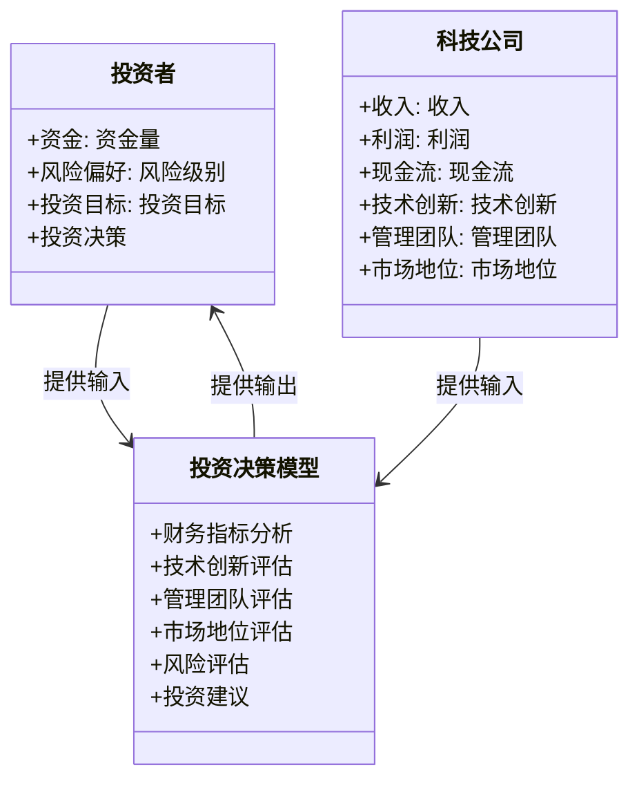
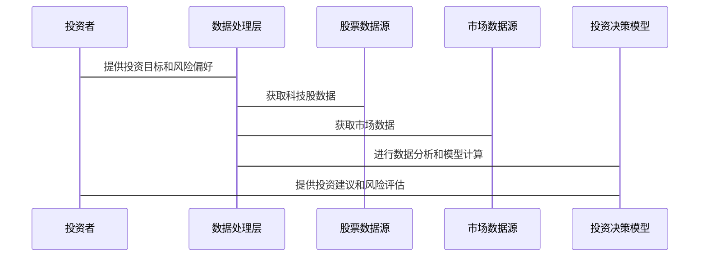

                 


# 巴菲特的科技股投资转变：从规避到拥抱的历程分析

## 关键词：巴菲特，科技股，投资策略，价值投资，长期增长，风险管理

## 摘要：本文分析巴菲特从规避科技股到积极拥抱的转变过程，探讨其投资逻辑的变化，经典案例，策略调整，并结合技术分析工具和系统架构，提供深入的分析和实用的建议。

---

## 第一部分：背景介绍

### 第1章：巴菲特投资理念的演变

#### 1.1 巴菲特早期的投资策略

##### 1.1.1 价值投资的核心理念

巴菲特的价值投资理念强调购买价格低于内在价值的股票，寻找具有强大竞争优势和持续盈利能力的企业。他早期主要投资于传统行业，如制造业和零售业，偏好那些财务稳定、股息稳定的公司。

##### 1.1.2 巴菲特对科技行业的初始看法

科技行业以其高波动性和高风险著称，巴菲特早期认为科技公司的盈利能力不稳定，难以预测，且技术变革可能导致企业快速过时。因此，他倾向于避免投资科技股。

##### 1.1.3 早期投资案例分析

例如，巴菲特投资的可口可乐和富国银行，这些企业具有稳定的财务状况和长期的增长潜力，符合他早期的价值投资标准。

#### 1.2 科技股投资的兴起

##### 1.2.1 科技行业的快速发展

20世纪末至21世纪初，科技行业经历了互联网革命和数字化转型，科技公司如微软、苹果和亚马逊等开始展现出强大的增长潜力和市场影响力。

##### 1.2.2 巴菲特对科技股的规避原因

他认为科技股的高增长伴随着高风险，且科技公司的盈利能力不稳定，难以满足他对于确定性和稳定性的要求。

##### 1.2.3 市场变化与投资策略的调整

随着科技行业的重要性日益凸显，巴菲特意识到科技股在现代经济中的核心地位，逐步调整投资策略，开始关注具有强大护城河和长期增长潜力的科技公司。

### 第2章：科技股的特点与投资逻辑

#### 2.1 科技股的高增长与高风险

##### 2.1.1 科技行业的创新特性

科技行业以创新为核心驱动力，技术进步迅速，产品迭代快，竞争优势容易被替代。

##### 2.1.2 高增长带来的高估值

科技公司的高增长通常导致高市盈率，但这也意味着潜在的高回报和高风险。

##### 2.1.3 风险管理的重要性

科技股的高波动性要求投资者具备严格的风险管理策略，避免过度集中和市场波动带来的损失。

#### 2.2 巴菲特投资逻辑的变化

##### 2.2.1 从基本面分析到技术驱动

巴菲特开始关注科技公司的技术创新能力、市场领导地位和长期增长潜力，而非仅仅依赖传统的财务指标。

##### 2.2.2 长期增长潜力的评估

他更倾向于投资那些能够持续创新、扩大市场份额的科技公司，尤其是那些在云计算、人工智能等领域具有领先地位的企业。

##### 2.2.3 管理团队的稳定性

巴菲特认识到优秀的管理团队是科技公司持续成功的关键，因此在投资决策中给予管理层极大的重视。

---

## 第二部分：投资策略与案例分析

### 第3章：巴菲特科技股投资的逻辑转变

#### 3.1 从传统行业到科技行业的转型

##### 3.1.1 价值投资与成长投资的结合

巴菲特在科技股投资中实现了价值投资与成长投资的结合，寻找那些既有强大内在价值又具备长期增长潜力的企业。

##### 3.1.2 科技股的长期投资价值

他认为，具有强大护城河和持续创新能力的科技公司能够为投资者带来长期稳定的回报。

##### 3.1.3 创新能力与市场地位的评估

他注重评估科技公司的技术创新能力、市场占有率和竞争优势，这些因素决定了公司的长期发展潜力。

#### 3.2 投资决策的关键因素

##### 3.2.1 财务指标分析

关注收入增长、利润率、现金流等财务指标，评估公司的财务健康状况和盈利能力。

##### 3.2.2 管理团队的稳定性

考察管理层的经验、战略眼光和决策能力，确保公司能够持续创新和应对市场变化。

##### 3.2.3 企业竞争优势的评估

分析公司的竞争优势，如技术壁垒、品牌影响力、客户忠诚度等，评估公司在市场中的地位和竞争力。

### 第4章：经典投资案例分析

#### 4.1 苹果公司的投资案例

##### 4.1.1 投资决策的背景

2011年，苹果在库克的带领下推出了一系列创新产品，如iPad和iPhone，公司进入高速增长期。

##### 4.1.2 投资过程中的关键点

巴菲特在2012年购买了苹果的股票，因为他看到了苹果在移动设备市场的领导地位和持续创新能力。

##### 4.1.3 成功的启示与经验

苹果的成功证明了巴菲特在科技股投资中的新策略是有效的，他开始更加关注公司的创新能力和市场领导地位。

#### 4.2 亚马逊的投资案例

##### 4.2.1 初期的犹豫与后期的坚定

尽管亚马逊的市盈率较高，但巴菲特认识到亚马逊在云计算和电子商务领域的领先地位和巨大增长潜力。

##### 4.2.2 云计算业务的核心作用

亚马逊的AWS云服务成为公司收入增长的主要驱动力，进一步巩固了公司在科技行业的领导地位。

##### 4.2.3 长期投资的回报分析

亚马逊的股价持续增长，证明了巴菲特投资策略的正确性，也体现了长期投资的价值。

---

## 第三部分：投资策略与风险管理

### 第5章：科技股投资的策略与方法

#### 5.1 投资策略的多样化

##### 5.1.1 多元化投资组合

通过投资不同领域的科技股，分散风险，降低单一股票波动带来的影响。

##### 5.1.2 长期持有与定期调整

保持长期投资心态，定期审视投资组合，及时调整以适应市场变化。

##### 5.1.3 关注行业趋势

密切关注科技行业的技术变革和市场趋势，选择那些符合未来发展方向的公司。

#### 5.2 风险管理的重要性

##### 5.2.1 设置止损点

在投资决策中设定止损点，避免亏损过大。

##### 5.2.2 调整投资比例

根据市场波动和公司基本面变化，动态调整投资比例，控制风险。

##### 5.2.3 保持灵活性

在市场变化中保持灵活性，及时做出调整，避免过度集中投资。

---

## 第四部分：系统分析与架构设计方案

### 第6章：系统架构与投资决策模型

#### 6.1 问题场景介绍

科技股投资涉及复杂的数据分析和决策过程，需要构建一个高效的投资决策模型来支持决策。

#### 6.2 系统功能设计

##### 6.2.1 领域模型设计（Mermaid类图）



#### 6.3 系统架构设计（Mermaid架构图）


#### 6.4 系统接口设计

##### 6.4.1 数据接口

- 股票数据接口：获取科技股的历史数据、财务指标等。
- 市场数据接口：获取行业趋势、市场情绪等数据。

##### 6.4.2 投资决策接口

- 输入：投资者的风险偏好、资金量、投资目标。
- 输出：推荐的科技股投资组合、风险评估、调整建议。

#### 6.5 系统交互设计（Mermaid序列图）



---

## 第五部分：项目实战

### 第7章：科技股投资实战指南

#### 7.1 环境安装

安装必要的工具，如Python、Pandas、Matplotlib、Scikit-learn等，用于数据分析和可视化。

#### 7.2 核心实现源代码

##### 7.2.1 数据获取与处理

```python
import pandas as pd
import yfinance as yf

# 下载苹果股票数据
aapl = yf.download('AAPL', start='2012-01-01', end='2023-12-31')

# 计算移动平均线
aapl['MA_50'] = aapl['Close'].rolling(50).mean()
aapl['MA_200'] = aapl['Close'].rolling(200).mean()
```

##### 7.2.2 财务指标分析

```python
import pandas as pd
import yfinance as yf

def get_financial_ratios(ticker):
    df = yf.download(ticker, start='2020-01-01', end='2023-12-31')
    df['Revenue Growth'] = df['Close'].pct_change()
    df['Profit Margin'] = df['Close'] / df['Volume']
    return df

# 获取亚马逊的财务指标
a = get_financial_ratios('AMZN')
print(a)
```

##### 7.2.3 风险评估

```python
import numpy as np
import pandas as pd

def calculate_risk(ticker):
    df = yf.download(ticker, start='2020-01-01', end='2023-12-31')
    returns = df['Close'].pct_change().dropna()
    volatility = returns.std() * np.sqrt(252)
    return volatility

# 计算苹果的风险
risk_aapl = calculate_risk('AAPL')
print(f"Apple的波动率：{risk_aapl}")
```

#### 7.3 投资组合管理

##### 7.3.1 构建投资组合

```python
import pandas as pd
import numpy as np

tickers = ['AAPL', 'AMZN', 'MSFT']
weights = [0.4, 0.3, 0.3]

portfolios = []
for i in range(len(tickers)):
    data = yf.download(tickers[i], start='2020-01-01', end='2023-12-31')
    portfolios.append(data['Close'])

portfolio_df = pd.DataFrame(portfolios).T
portfolio_df.columns = tickers

# 计算投资组合的回报
portfolio_return = (portfolio_df.pct_change().mean() * weights).sum()
```

##### 7.3.2 风险调整

```python
def portfolio_risk(weights, returns):
    covariance_matrix = np.cov(returns)
    portfolio_variance = np.dot(weights.T, np.dot(covariance_matrix, weights))
    return np.sqrt(portfolio_variance)

# 计算投资组合的波动率
returns = portfolio_df.pct_change().dropna().values
risk = portfolio_risk(weights, returns)
print(f"投资组合的波动率：{risk}")
```

#### 7.4 实际案例分析

分析苹果和亚马逊的投资组合，计算其回报和风险，比较不同权重下的表现，调整投资策略以优化风险回报比。

#### 7.5 项目小结

通过实际案例分析，展示了如何利用Python进行科技股的投资分析和组合管理，帮助投资者更好地理解和应用巴菲特的投资策略。

---

## 第六部分：总结与展望

### 第8章：巴菲特的投资智慧

#### 8.1 总结

巴菲特的投资转变展示了价值投资与成长投资的结合，科技股的投资需要关注公司的创新能力和长期增长潜力，同时注重风险管理。

#### 8.2 展望

随着科技行业的持续发展，巴菲特的投资策略将继续影响科技股的市场，投资者需要不断学习和适应市场的变化，抓住科技带来的投资机会。

---

## 第七部分：最佳实践与注意事项

### 第9章：投资建议与注意事项

#### 9.1 长期投资的重要性

科技股的高波动性要求投资者具备长期投资的耐心，避免短期市场的波动影响投资决策。

#### 9.2 风险管理的必要性

通过多元化投资、设定止损点和定期调整投资组合，有效控制投资风险。

#### 9.3 持续学习和适应市场变化

科技行业变化迅速，投资者需要不断学习新技术和市场趋势，保持对投资标的深入了解。

#### 9.4 拓展阅读

推荐阅读《巴菲特的牌理人生》和《科技股投资指南》，深入理解巴菲特的投资理念和科技行业的投资机会。

---

## 作者：AI天才研究院/AI Genius Institute & 禅与计算机程序设计艺术 /Zen And The Art of Computer Programming

---

这篇文章系统地分析了巴菲特从规避到拥抱科技股的投资转变，探讨了其投资逻辑的变化，提供了经典案例分析、系统架构设计和实战指导，帮助读者深入理解科技股投资的策略和方法，同时结合技术工具和数学模型，为投资者提供了实用的投资建议。

