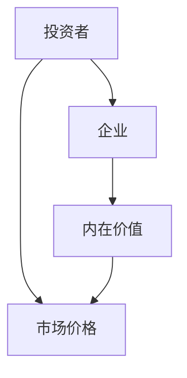
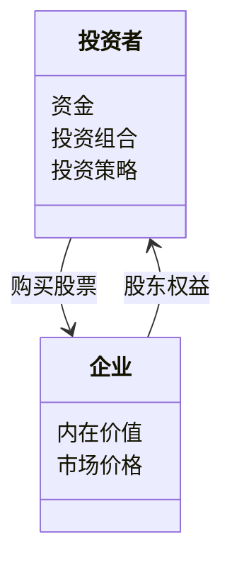
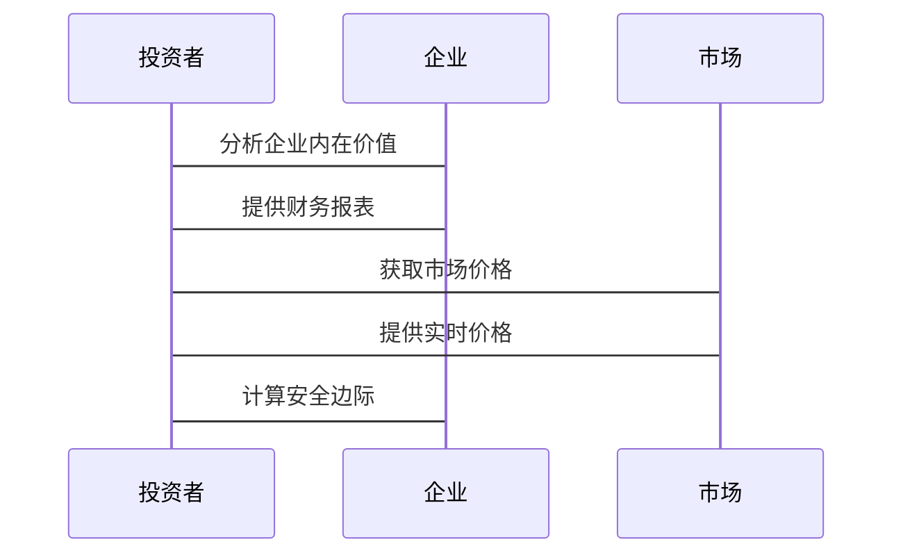

                 


```markdown
# 巴菲特的简单投资哲学：复杂中寻找简单

## 关键词：巴菲特, 投资哲学, 价值投资, 安全边际, 长期投资, 复杂性, 简单性

## 摘要：巴菲特的投资哲学以简单、长期和价值为核心，通过深入分析企业的内在价值和市场定价，强调安全边际和长期持有。本文从背景、核心概念、算法原理、系统架构到实际案例，全面解析巴菲特的投资智慧，揭示在复杂市场中寻找简单投资策略的深层逻辑。

---

# 第一部分：巴菲特投资哲学的背景与核心理念

## 第1章：巴菲特投资哲学的起源与核心理念

### 1.1 巴菲特的生平与投资哲学的形成
- **1.1.1 巴菲特的成长经历**
  - 早年经历：从格雷厄姆到巴菲特的转变
  - 投资理念的形成：价值投资的种子
- **1.1.2 巴菲特的投资哲学**
  - 价值投资的核心理念：寻找内在价值
  - 安全边际的重要性：避免重大损失
  - 长期投资的智慧：时间创造价值

### 1.2 价值投资的定义与特点
- **1.2.1 价值投资的定义**
  - 价值投资：寻找市场价格低于内在价值的股票
  - 内在价值：企业未来现金流的现值
- **1.2.2 价值投资的特点**
  - 长期视角：关注企业的长期盈利能力
  - 安全边际：买入价格低于内在价值
  - 高质量企业：选择具有强大护城河的企业

### 1.3 巴菲特投资哲学的核心要素
- **1.3.1 质量：企业的核心竞争力**
  - 企业护城河：竞争优势的来源
  - 财务健康：低负债、高利润率
- **1.3.2 价格：安全边际的概念**
  - 安全边际的计算：内在价值 - 市场价格
  - 避免过度支付：确保投资的安全性
- **1.3.3 时间：长期投资的价值**
  - 复利的力量：时间是价值投资者的好朋友
  - 长期持有：分享企业成长的成果

### 1.4 巴菲特投资哲学的边界与外延
- **1.4.1 投资的边界：能力圈的概念**
  - 能力圈的定义：投资者熟悉的领域
  - 超越能力圈的风险：避免盲目投资
- **1.4.2 投资的外延：分散与集中**
  - 分散投资：降低风险
  - 集中投资：提高收益
- **1.4.3 投资的误区：短期波动与长期价值**
  - 短期波动的迷惑性
  - 长期价值的稳定性

### 1.5 本章小结
- 巴菲特的投资哲学以价值投资为核心，强调内在价值、安全边际和长期持有。
- 投资者需要找到自己的能力圈，避免盲目投资，同时注重分散与集中相结合。

---

## 第2章：巴菲特投资哲学的核心概念与联系

### 2.1 核心概念原理
- **2.1.1 价值投资的核心原理**
  - 内在价值的计算：DCF模型的应用
  - 市场价格的波动：短期与长期的差异
- **2.1.2 安全边际的数学模型**
  - 安全边际 = 内在价值 - 市场价格
  - 安全边际的重要性：降低投资风险
- **2.1.3 长期投资的时间价值**
  - 复利效应：时间创造价值
  - 长期持有：分享企业成长的成果

### 2.2 核心概念属性特征对比表格
| 概念       | 特征1 | 特征2 | 特征3 |
|------------|-------|-------|-------|
| 价值投资   | 内在价值 | 安全边际 | 长期视角 |
| 短期交易   | 市场波动 | 高频操作 | 快速决策 |

### 2.3 ER实体关系图（Mermaid流程图）


### 2.4 本章小结
- 价值投资的核心概念包括内在价值、安全边际和长期视角。
- 通过对比表格和实体关系图，可以帮助投资者更好地理解这些概念之间的联系。

---

## 第3章：巴菲特投资哲学的算法原理

### 3.1 算法原理概述
- **3.1.1 价值评估算法**
  - 内在价值的计算：DCF模型
  - 市场价格的波动：Beta系数的应用
- **3.1.2 安全边际计算**
  - 安全边际的数学公式
  - 安全边际的实际应用
- **3.1.3 长期收益预测**
  - 长期收益的计算方法
  - 长期收益的影响因素

### 3.2 算法原理的数学模型
- **3.2.1 内在价值计算公式**
  $$ V = \frac{CF}{r} $$
  其中，CF为现金流，r为折现率。
- **3.2.2 安全边际计算公式**
  $$ \text{安全边际} = \text{内在价值} - \text{市场价格} $$

### 3.3 算法原理的详细讲解与举例
- **3.3.1 内在价值计算的详细步骤**
  - 确定企业的未来现金流
  - 选择合适的折现率
  - 计算内在价值
- **3.3.2 安全边际的实际应用**
  - 选择具有较高安全边际的股票
  - 定期检查安全边际的变化
- **3.3.3 长期收益预测的案例分析**
  - 假设一家企业的内在价值为100元，市场价格为80元
  - 计算安全边际：20元
  - 预测长期收益：随着企业成长，内在价值上升

### 3.4 本章小结
- 巴菲特的投资哲学通过算法原理，帮助投资者找到具有内在价值和安全边际的股票。
- 长期收益预测是价值投资的重要组成部分。

---

## 第4章：巴菲特投资哲学的系统分析与架构设计

### 4.1 投资决策框架
- **4.1.1 问题场景介绍**
  - 投资者需要在复杂的市场中找到简单而有效的投资策略
  - 如何通过系统化的方法进行投资决策
- **4.1.2 系统功能设计（领域模型Mermaid类图）**


### 4.2 系统架构设计（Mermaid架构图）


### 4.3 系统接口设计
- **4.3.1 投资者与企业的接口**
  - 投资者购买股票
  - 企业提供财务报表和市场信息
- **4.3.2 系统与市场的接口**
  - 获取市场数据
  - 分析市场趋势

### 4.4 系统交互Mermaid序列图


### 4.5 本章小结
- 系统化的方法可以帮助投资者更好地理解和应用巴菲特的投资哲学
- 通过架构设计和系统交互，投资者可以更清晰地进行投资决策

---

## 第5章：项目实战

### 5.1 环境安装与配置
- **5.1.1 投资分析工具的选择**
  - 使用Excel或Python进行投资分析
  - 学习必要的数据分析技能
- **5.1.2 数据源的获取**
  - 获取企业财务报表
  - 获取市场数据

### 5.2 系统核心实现源代码
- **5.2.1 内在价值计算的Python代码**
  ```python
  def calculate_intrinsic_value(cash_flow, discount_rate):
      return cash_flow / discount_rate
  ```
- **5.2.2 安全边际计算的Python代码**
  ```python
  def calculate_margin_of_safety(intrinsic_value, market_price):
      return intrinsic_value - market_price
  ```

### 5.3 代码应用解读与分析
- **5.3.1 内在价值计算的代码解读**
  - 函数参数：现金流和折现率
  - 计算过程：现金流除以折现率
  - 输出结果：内在价值
- **5.3.2 安全边际计算的代码解读**
  - 函数参数：内在价值和市场价格
  - 计算过程：内在价值减市场价格
  - 输出结果：安全边际

### 5.4 实际案例分析
- **5.4.1 案例背景**
  - 选择一家具体的公司进行分析
  - 获取其财务报表和市场数据
- **5.4.2 案例分析**
  - 计算内在价值
  - 计算安全边际
  - 判断是否符合投资条件

### 5.5 本章小结
- 通过实际案例分析，投资者可以更好地理解和应用巴菲特的投资哲学
- 代码实现帮助投资者更高效地进行投资分析

---

## 第6章：总结与展望

### 6.1 最佳实践 Tips
- **6.1.1 投资心态**
  - 长期持有，避免短期波动的影响
  - 保持耐心，等待价值的实现
- **6.1.2 风险管理**
  - 保持适度的分散投资
  - 定期检查投资组合
- **6.1.3 持续学习**
  - 关注企业的基本面变化
  - 学习新的投资知识和技能

### 6.2 本章小结
- 巴菲特的投资哲学以简单、长期和价值为核心
- 通过系统的分析和实践，投资者可以在复杂市场中找到简单而有效的投资策略

### 6.3 未来展望
- 价值投资的未来发展
- 技术进步对投资哲学的影响
- 投资者的角色转变：从被动到主动

---

## 作者：AI天才研究院/AI Genius Institute & 禅与计算机程序设计艺术 /Zen And The Art of Computer Programming
```

