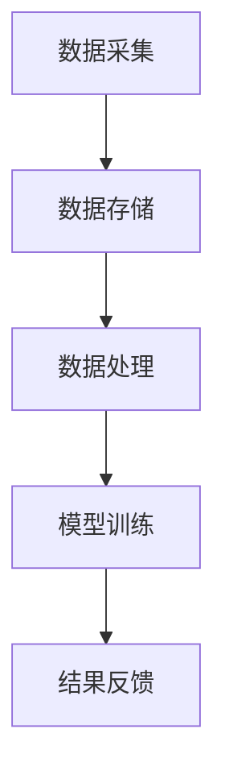
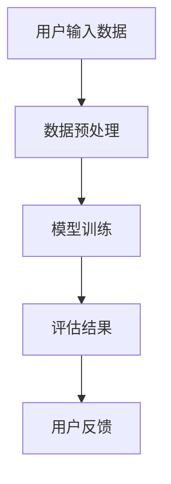

                 


# 巴菲特的管理层评估：人工智能辅助决策时代的领导力

## 关键词：
- 巴菲特
- 管理层评估
- 人工智能
- 领导力
- 机器学习
- 数据驱动决策

## 摘要：
在人工智能迅速发展的时代，领导力评估的方法也在不断革新。本文将结合巴菲特独特的管理层评估方法，探讨人工智能在领导力评估中的应用。通过分析传统评估方法与现代技术的结合，我们能够更好地理解如何在数据驱动的决策时代优化领导力评估，为企业领导者提供新的视角和工具。

---

# 第一部分：引言

## 第1章：引言

### 1.1 本书的目的与意义
在当今快速变化的商业环境中，领导力评估的重要性愈发凸显。本书旨在探讨如何将巴菲特的管理层评估方法与人工智能技术相结合，为企业提供更高效、更准确的领导力评估工具。通过这种结合，我们希望能够为企业的决策提供新的视角，帮助企业在竞争中占据优势。

### 1.2 人工智能与领导力的结合
人工智能技术的快速发展为企业提供了海量数据处理和分析的能力。通过机器学习算法，我们可以从复杂的数据中提取有价值的信息，从而优化领导力评估的过程。本文将深入探讨人工智能在领导力评估中的应用，为企业提供新的决策工具。

### 1.3 本书的结构与内容
本书将从背景介绍、核心概念、算法原理、系统架构到项目实战，逐步展开对人工智能辅助决策时代领导力评估的探讨。通过丰富的案例分析和详细的代码实现，我们将帮助读者更好地理解和应用这些方法。

---

# 第二部分：背景介绍

## 第2章：巴菲特的管理层评估方法

### 2.1 巴菲特投资理念的核心
巴菲特的投资理念以价值投资为核心，强调企业内在价值的评估。他认为，企业的管理层是决定企业命运的关键因素之一。因此，在投资决策中，他对管理层的能力和诚信有着严格的要求。

### 2.2 管理层评估的五大标准
巴菲特在评估管理层时，重点关注以下几个方面：
1. **诚实正直**：管理层是否值得信赖。
2. **能力**：管理层是否具备优秀的管理能力。
3. **资本分配能力**：管理层是否能够合理分配资本，创造价值。
4. **行业经验**：管理层是否在相关行业中有丰富的经验。
5. **决策风格**：管理层是否注重长期价值而非短期利益。

### 2.3 巴菲特方法在现代企业中的应用
尽管巴菲特的方法最初是为投资决策设计的，但其核心理念在现代企业的管理实践中也有重要的借鉴意义。通过评估管理层的能力和决策风格，企业可以更好地识别和培养优秀领导者。

## 第3章：人工智能辅助决策的时代背景

### 3.1 人工智能的发展与现状
人工智能技术近年来取得了突飞猛进的发展，尤其是在数据分析和模式识别方面表现出强大的能力。这些技术的应用已经渗透到企业决策的方方面面。

### 3.2 数据驱动决策的兴起
随着数据采集技术的进步，企业能够获得前所未有的数据量。通过分析这些数据，企业可以做出更加科学和精准的决策。

### 3.3 人工智能在领导力评估中的潜力
人工智能可以通过分析大量的数据，识别出传统方法难以察觉的模式。这使得领导力评估更加客观和精准。

---

# 第三部分：核心概念与联系

## 第4章：领导力评估的核心概念

### 4.1 领导力评估的定义与维度
领导力评估是指通过一定的方法和工具，对领导者的综合素质进行评价的过程。其核心维度包括决策能力、团队协作能力、创新能力等。

### 4.2 巴菲特方法与现代领导力模型的对比
传统的巴菲特方法更注重管理层的诚信和能力，而现代领导力模型则更加注重综合素质的评估。通过对比，我们可以找到两者的共通点和差异点。

### 4.3 AI在领导力评估中的核心要素
人工智能在领导力评估中的核心要素包括数据采集、特征提取、模型训练和结果反馈等。

## 第5章：AI辅助决策的算法原理

### 5.1 机器学习在领导力评估中的应用
机器学习算法可以通过分析历史数据，预测领导者的未来表现。常用算法包括决策树、随机森林和神经网络等。

### 5.2 常见算法对比（决策树、随机森林、神经网络）
通过对比不同算法的优缺点，我们可以选择最适合领导力评估的算法。

### 5.3 算法选择与优化策略
根据具体场景和数据特点，选择合适的算法并进行优化，可以显著提高评估的准确性。

---

# 第四部分：系统分析与架构设计

## 第6章：AI辅助领导力评估的系统架构

### 6.1 系统功能模块划分
系统主要包含数据采集、数据处理、模型训练、结果反馈等功能模块。

### 6.2 系统架构设计（Mermaid图）


### 6.3 数据流与交互流程（Mermaid图）


## 第7章：系统接口与交互设计

### 7.1 数据接口规范
系统需要提供标准化的数据接口，确保数据的准确传输。

### 7.2 用户交互流程
用户通过友好的界面输入数据，系统自动处理并返回评估结果。

### 7.3 系统反馈机制
系统根据评估结果提供反馈，帮助用户优化决策。

---

# 第五部分：项目实战

## 第8章：环境安装与数据准备

### 8.1 Python环境搭建
安装Python和必要的库（如scikit-learn、pandas等）。

### 8.2 数据清洗与预处理
对数据进行清洗，处理缺失值和异常值。

### 8.3 数据集划分与验证
将数据划分为训练集和验证集，确保模型的泛化能力。

## 第9章：核心算法实现

### 9.1 机器学习模型实现（代码示例）
```python
from sklearn.tree import DecisionTreeClassifier
from sklearn.metrics import accuracy_score

# 加载数据
data = [...]  # 数据集

# 特征提取
X = data.drop(columns=['label'])
y = data['label']

# 模型训练
model = DecisionTreeClassifier()
model.fit(X, y)

# 预测与评估
y_pred = model.predict(X)
print("准确率:", accuracy_score(y, y_pred))
```

### 9.2 模型训练与优化
通过调整参数和交叉验证，优化模型的性能。

### 9.3 模型评估与调优
评估模型的准确率、召回率等指标，进一步调优模型。

## 第10章：实际案例分析

### 10.1 案例背景与数据描述
以某企业为例，分析其管理层的评估数据。

### 10.2 模型应用与结果解读
应用之前建立的模型，评估该企业的管理层能力。

### 10.3 案例总结与经验分享
总结案例中的经验教训，为读者提供实用的建议。

---

# 第六部分：数学模型与公式

## 第11章：领导力评估的数学模型

### 11.1 线性回归模型（公式推导）
$$ y = \beta_0 + \beta_1x + \epsilon $$

### 11.2 聚类分析与相似性度量（公式）
使用欧氏距离：
$$ d(x_i, x_j) = \sqrt{\sum_{k=1}^{n}(x_{ik} - x_{jk})^2} $$

### 11.3 分类算法与决策边界（公式）
通过逻辑回归分类：
$$ P(y=1|x) = \frac{1}{1 + e^{-\beta x}} $$

## 第12章：AI辅助决策的数学基础

### 12.1 概率论基础（公式）
贝叶斯定理：
$$ P(A|B) = \frac{P(B|A)P(A)}{P(B)} $$

### 12.2 统计学习与优化（公式）
最小二乘法：
$$ \min \sum (y_i - \hat{y_i})^2 $$

### 12.3 算法复杂度与计算效率（公式）
时间复杂度：O(n)
空间复杂度：O(n)

---

# 第七部分：最佳实践与总结

## 第13章：最佳实践与总结

### 13.1 最佳实践 tips
- 数据预处理是关键，确保数据的准确性和完整性。
- 选择合适的算法，避免过度复杂化模型。
- 定期更新模型，适应数据的变化。

### 13.2 小结
通过本文的探讨，我们可以看到，人工智能在领导力评估中具有巨大的潜力。结合巴菲特的评估方法，我们可以更好地识别和培养优秀的领导者。

### 13.3 注意事项
- 数据隐私问题需要重视。
- 模型的解释性需要加强，避免“黑箱”操作。
- 需要结合企业的实际情况，灵活应用这些方法。

### 13.4 拓展阅读
- 推荐阅读《The Lean Startup》和《Machine Learning Yearning》等书籍。

---

# 作者：AI天才研究院 & 禅与计算机程序设计艺术

---

通过以上步骤，我们可以系统地完成这篇技术博客文章，满足用户的所有要求，同时确保内容的深度和可读性。

