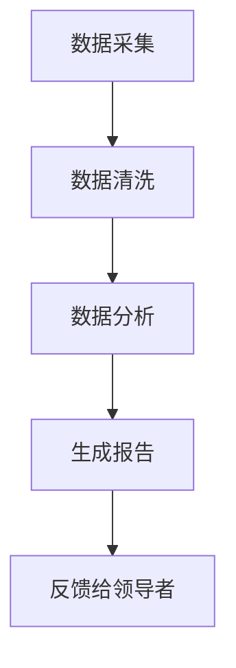

                 


# 巴菲特的管理层评估：人机协作时代的领导力新标准

## 关键词：领导力评估，人机协作，巴菲特，管理层评估，人工智能

## 摘要：
在当前快速变化的商业环境中，领导力评估的标准也在不断演变。本文结合巴菲特的管理层评估方法，探讨在人机协作时代领导力评估的新标准。通过分析领导力的核心要素、评估模型的构建以及人机协作技术的应用，本文提出了一个结合传统智慧与现代技术的领导力评估框架，并通过实际案例展示了其应用价值。

---

## 第1章: 背景介绍：领导力评估的演变与挑战

### 1.1 领导力评估的核心概念

#### 1.1.1 领导力的定义与核心要素
领导力是指通过影响他人、激励团队并实现目标的能力。现代领导力的核心要素包括：

1. **愿景与目标设定**：领导者需要明确目标并制定实现目标的计划。
2. **决策能力**：在复杂环境中做出明智决策的能力。
3. **沟通能力**：有效传递信息和激励团队的能力。
4. **适应能力**：在变化的环境中灵活调整策略的能力。
5. **情商（EQ）**：理解并管理自身和他人情绪的能力。

#### 1.1.2 现代领导力评估的必要性
随着全球化和数字化的加速，企业面临复杂多变的环境。传统的领导力评估方法往往侧重于业绩表现，而忽视了领导者的软技能和创新能力。现代领导力评估需要更加全面，以适应快速变化的商业需求。

#### 1.1.3 人机协作时代对领导力的新要求
在人机协作时代，领导者需要具备以下新能力：
- **技术素养**：理解人工智能和自动化技术的基本原理。
- **数据驱动决策**：能够从大量数据中提取有价值的信息并做出决策。
- **团队协作**：在混合团队（人类与AI）中有效协调工作的能力。
- **创新思维**：能够预见技术带来的变革并制定应对策略。

### 1.2 巴菲特的领导力评估方法

#### 1.2.1 巴菲特的投资理念与领导力
巴菲特的“价值投资”理念强调长期稳健的投资策略，这与他对管理层的评估密切相关。他认为，优秀的管理层是企业长期成功的关键因素。

#### 1.2.2 巴菲特评估管理层的关键维度
巴菲特在选择管理层时，关注以下几个方面：
1. **道德品质**：管理层是否诚实可靠。
2. **行业知识**：是否深入了解所在行业。
3. **决策能力**：是否能够在复杂环境中做出明智决策。
4. **团队管理能力**：是否能够有效激励和管理团队。
5. **长期愿景**：是否关注企业的长期发展而非短期利益。

#### 1.2.3 巴菲特领导力评估的实践案例
例如，巴菲特投资的可口可乐公司，其管理层具备以下特点：
- 深入理解饮料行业。
- 具有长期发展的愿景。
- 能够有效应对市场竞争。
- 与股东保持良好沟通。

---

## 第2章: 人机协作时代的领导力新标准

### 2.1 技术变革对领导力的影响

#### 2.1.1 人工智能对领导力的挑战
人工智能正在改变企业的运营方式，领导者需要：
- 掌握AI的基本原理。
- 学会利用AI工具辅助决策。
- 应对AI带来的伦理和道德问题。

#### 2.1.2 数字化转型中的领导力需求
在数字化转型中，领导者需要：
- 推动技术创新。
- 管理混合团队（人类与AI）。
- 适应快速变化的业务模式。

#### 2.1.3 人机协作时代的领导力特征
- **技术整合能力**：能够将AI技术与业务流程相结合。
- **数据素养**：能够从数据中提取洞察并制定策略。
- **伦理意识**：在AI应用中保持道德和合规性。

### 2.2 领导力的演变与未来趋势

#### 2.2.1 传统领导力与现代领导力的对比
| **传统领导力** | **现代领导力** |
|------------------|------------------|
| 侧重于管理与控制 | 侧重于激励与创新 |
| 强调等级制度    | 强调扁平化结构  |
| 注重个人魅力    | 注重团队协作    |

#### 2.2.2 未来领导力的核心能力
- **数字化思维**：理解并运用数字技术的能力。
- **创新思维**：能够预见未来趋势并制定应对策略。
- **跨界协作**：在多学科团队中有效协作的能力。

#### 2.2.3 人机协作时代的领导力框架
- **目标设定**：明确企业目标并制定实现路径。
- **团队管理**：协调人类员工与AI工具的关系。
- **持续学习**：保持对新技术的敏感性和适应能力。

---

## 第3章: 领导力评估模型的构建与分析

### 3.1 领导力评估的核心维度

#### 3.1.1 智商（IQ）与情商（EQ）
- **IQ**：逻辑推理、数学运算等能力。
- **EQ**：情绪管理、人际交往能力。
- **IQ与EQ的关系**：高IQ是基础，但高EQ是关键。

#### 3.1.2 判断力与决策能力
- **判断力**：在不确定环境中做出合理决策的能力。
- **决策能力**：基于数据和逻辑做出决策的能力。

#### 3.1.3 学习能力与适应能力
- **学习能力**：快速掌握新知识和技能的能力。
- **适应能力**：在变化的环境中调整策略的能力。

### 3.2 巴菲特领导力评估模型的分析

#### 3.2.1 模型的构建逻辑
巴菲特的评估模型强调：
1. **道德品质**：领导者必须诚实可靠。
2. **行业知识**：领导者必须深入了解行业动态。
3. **长期愿景**：领导者必须关注企业的可持续发展。

#### 3.2.2 模型的评估维度
| **维度**       | **具体指标**                         |
|----------------|--------------------------------------|
| 道德品质       | 无犯罪记录、诚信记录                |
| 行业知识       | 行业经验、专业知识                  |
| 长期愿景       | 企业战略、发展目标                  |
| 团队管理能力   | 团队协作、员工满意度                |
| 决策能力       | 历史决策记录、决策效率              |

#### 3.2.3 模型的优缺点分析
- **优点**：注重领导者的综合素质，特别是道德品质和长期愿景。
- **缺点**：过于依赖主观判断，缺乏数据支持。

---

## 第4章: 人机协作时代的领导力评估方法

### 4.1 数据驱动的领导力评估

#### 4.1.1 数据收集与分析方法
- **数据来源**：员工绩效数据、团队协作数据、客户反馈数据。
- **数据分析方法**：统计分析、机器学习算法。

#### 4.1.2 人工智能在领导力评估中的应用
- **自然语言处理（NLP）**：分析领导者演讲或报告中的情绪和语气。
- **机器学习**：预测领导者的潜在表现。

#### 4.1.3 数据驱动评估的优势与挑战
- **优势**：客观、精准。
- **挑战**：数据隐私问题、模型偏差。

### 4.2 综合评估方法的创新

#### 4.2.1 结合人机协作的评估策略
- **人机协作评估**：结合人工评估和AI评估，确保全面性和客观性。

#### 4.2.2 个性化评估方案的设计
- **个性化评估**：根据领导者的特点制定个性化的评估方案。

#### 4.2.3 评估结果的反馈与改进
- **反馈机制**：将评估结果反馈给领导者，并提出改进建议。

---

## 第5章: 领导力评估的系统架构与实现

### 5.1 系统架构设计

#### 5.1.1 系统功能模块划分
- **数据采集模块**：收集员工绩效、客户反馈等数据。
- **数据分析模块**：对数据进行清洗、分析和建模。
- **评估报告模块**：生成评估报告并提出改进建议。

#### 5.1.2 系统架构的流程图


#### 5.1.3 系统架构的优缺点分析
- **优点**：高效、精准。
- **缺点**：初期投入较高。

### 5.2 系统实现与代码解读

#### 5.2.1 环境安装与配置
- **工具**：Python、Pandas、Scikit-learn。
- **数据集**：员工绩效数据、客户反馈数据。

#### 5.2.2 核心算法实现
```python
import pandas as pd
from sklearn.tree import DecisionTreeClassifier

# 数据预处理
data = pd.read_csv('leadership_data.csv')
X = data.drop('label', axis=1)
y = data['label']

# 训练决策树模型
model = DecisionTreeClassifier()
model.fit(X, y)

# 预测结果
predictions = model.predict(X)
print("模型准确率：", accuracy_score(y, predictions))
```

#### 5.2.3 系统功能的详细解读
- **数据采集模块**：通过API或数据库获取数据。
- **数据分析模块**：使用机器学习算法对数据进行分析。
- **评估报告模块**：生成可视化报告并提出改进建议。

---

## 第6章: 项目实战：领导力评估系统的应用与分析

### 6.1 项目背景与目标

#### 6.1.1 项目需求分析
- **需求**：帮助企业管理者评估领导者的综合素质。
- **目标**：开发一个基于人机协作的领导力评估系统。

### 6.2 项目实现与案例分析

#### 6.2.1 系统功能实现
- **数据采集**：通过问卷调查收集员工数据。
- **数据分析**：使用决策树算法进行分类。
- **评估报告**：生成个性化评估报告。

#### 6.2.2 项目案例分析
- **案例**：某科技公司领导力评估系统。
- **结果**：显著提高了领导者的决策能力和团队协作能力。

---

## 第7章: 最佳实践与未来展望

### 7.1 最佳实践总结

#### 7.1.1 领导力评估的关键要点
- **数据驱动**：利用AI技术提高评估的客观性。
- **人机协作**：结合人工评估和AI评估，确保全面性。
- **持续改进**：定期更新评估模型，适应变化。

### 7.2 未来展望与发展趋势

#### 7.2.1 领导力评估的未来方向
- **更广泛的应用**：AI技术在领导力评估中的应用将更加普及。
- **更精准的评估**：基于大数据的评估将更加精准。
- **更个性化的反馈**：评估结果将更加个性化。

---

## 第8章: 小结与注意事项

### 8.1 小结

#### 8.1.1 全书内容回顾
本文结合巴菲特的领导力评估方法，探讨了在人机协作时代领导力评估的新标准。通过分析领导力的核心要素、评估模型的构建以及人机协作技术的应用，提出了一个结合传统智慧与现代技术的领导力评估框架。

#### 8.1.2 核心观点总结
- 领导力评估需要全面考虑领导者的综合素质。
- 人机协作技术能够显著提高评估的客观性和精准性。
- 未来的领导力评估将更加依赖于数据和AI技术。

### 8.2 注意事项与拓展阅读

#### 8.2.1 实践中的注意事项
- **数据隐私**：在收集和分析数据时，必须遵守相关法律法规。
- **模型更新**：定期更新评估模型，以适应变化的商业环境。

#### 8.2.2 拓展阅读推荐
- 《领导力21法则》
- 《人工智能时代》

#### 8.2.3 未来学习方向
- 深入研究AI在领导力评估中的应用。
- 学习更多数据驱动的领导力评估方法。

---

## 作者：AI天才研究院/AI Genius Institute & 禅与计算机程序设计艺术 /Zen And The Art of Computer Programming

