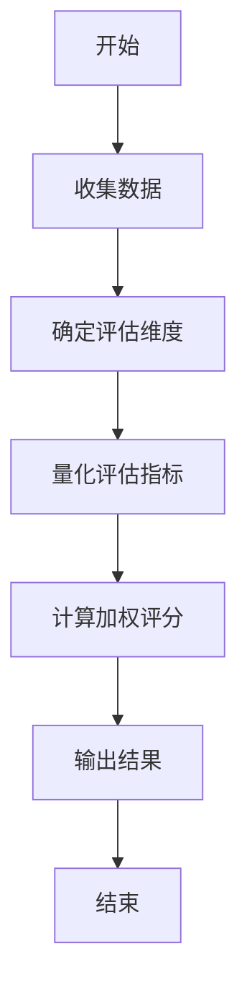
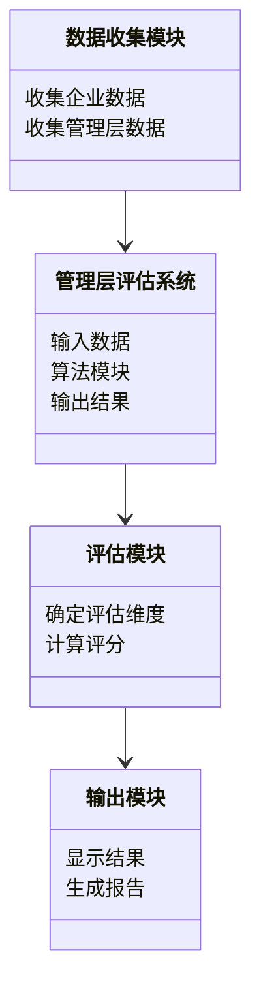
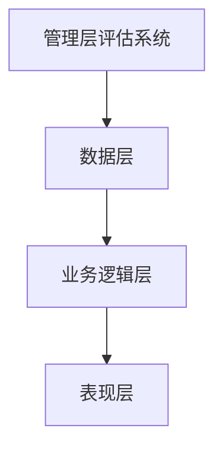

                 


# 巴菲特的管理层评估：如何识别优秀的企业领导者

## 关键词
巴菲特, 管理层评估, 领导力, 企业治理, 战略思维, 投资决策, 管理模型

## 摘要
本文深入探讨了巴菲特的管理层评估方法，分析了如何识别和培养优秀的企业领导者。通过结合技术与管理学的视角，本文详细阐述了管理层评估的核心概念、算法原理、系统架构以及实际案例分析，为读者提供了一套识别优秀领导者的实用框架和工具。

---

# 第一章: 巴菲特的管理层评估背景与重要性

## 1.1 优秀企业领导者的识别难题

### 1.1.1 企业领导者对企业发展的影响
企业领导者的决策和行为直接影响企业的战略方向、财务状况和长期发展。一个优秀的领导者能够带领企业应对市场变化，抓住机会，规避风险。

### 1.1.2 管理层评估的重要性
- 管理层评估是投资决策的重要依据。
- 优秀的管理层能够提升企业价值。
- 不称职的管理层可能导致企业危机。

### 1.1.3 巴菲特的管理层评估方法的独特性
- 侧重长期思维和企业治理。
- 强调管理层的价值观和决策能力。
- 结合定量分析和定性分析。

## 1.2 管理层评估的背景与意义

### 1.2.1 问题背景
- 市场经济中，企业领导者的能力参差不齐。
- 投资者难以准确评估管理层的真实能力。

### 1.2.2 问题描述
- 管理层评估缺乏统一标准。
- 评估方法过于主观或过于量化。

### 1.2.3 解决策略
- 结合定量与定性分析。
- 借鉴巴菲特的长期实践。

### 1.2.4 边界与外延
- 适用于上市公司和成长期企业。
- 不适用于初创期或非盈利组织。

---

# 第二章: 巴菲特管理层评估的核心概念

## 2.1 管理层评估的关键指标

### 2.1.1 战略思维能力
- 是否具备长期战略眼光。
- 是否能够识别行业趋势。

### 2.1.2 决策能力
- 决策的准确性和及时性。
- 决策的透明性和合理性。

### 2.1.3 企业治理能力
- 治理结构的完善性。
- 内部控制的有效性。

### 2.1.4 领导力与团队管理
- 领导风格。
- 团队凝聚力。

## 2.2 管理层评估的核心维度

### 2.2.1 企业领导者的价值观
- 是否以股东利益为核心。
- 是否注重长期价值创造。

### 2.2.2 长期思维
- 是否关注企业长期发展。
- 是否愿意投资未来。

### 2.2.3 企业治理结构
- 股权结构。
- 董事会构成。

### 2.2.4 企业财务健康状况
- 财务报表分析。
- 资产负债表解读。

## 2.3 管理层评估的框架与模型

### 2.3.1 巴菲特的评估框架
- 价值观、长期思维、治理能力三者结合。

### 2.3.2 模型优缺点
| 优点       | 缺点       |
|------------|------------|
| 定性与定量结合 | 主观性较强   |
| 长期视角    | 时间周期长  |

---

# 第三章: 巴菲特管理层评估的算法与数学模型

## 3.1 管理层评估的数学模型

### 3.1.1 管理层评估的流程



### 3.1.2 评估指标权重分配

$$
\text{总评分} = \sum_{i=1}^{n} w_i \times s_i
$$

其中，$w_i$ 是第 $i$ 个指标的权重，$s_i$ 是该指标的评分。

### 3.1.3 数学模型的实现

$$
\text{管理层能力评分} = 0.3 \times \text{战略思维} + 0.3 \times \text{决策能力} + 0.2 \times \text{治理能力} + 0.2 \times \text{领导力}
$$

---

# 第四章: 系统分析与架构设计

## 4.1 问题场景介绍

### 4.1.1 系统功能设计



## 4.2 系统架构设计



---

# 第五章: 项目实战

## 5.1 环境安装与数据收集

### 5.1.1 环境安装
- 数据库：MySQL
- 开发工具：Python + Pandas

### 5.1.2 数据收集
```python
import pandas as pd

data = pd.read_csv('leadership_data.csv')
```

---

# 第六章: 总结与展望

## 6.1 最佳实践 tips

### 6.1.1 关键要点
- 结合定量与定性分析。
- 注重长期思维和企业治理。

### 6.1.2 小结
- 巴菲特的管理层评估方法提供了一套系统的评估框架。
- 结合实际案例分析，可以更好地识别优秀领导者。

## 6.2 注意事项

### 6.2.1 理论与实践的结合
- 理论指导实践。
- 实践检验理论。

### 6.2.2 持续学习与更新
- 随着市场变化，评估方法也需要更新。

---

# 作者：AI天才研究院 & 禅与计算机程序设计艺术

