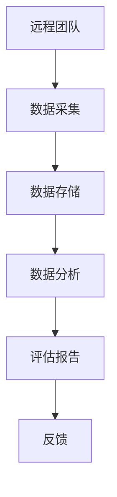

                 


# 巴菲特的管理层评估：远程办公时代的领导力新标准

> **关键词**：巴菲特、管理层评估、领导力、远程办公、管理新标准

> **摘要**：本文探讨了巴菲特的领导力理念在远程办公环境下的应用，分析了传统领导力评估在远程团队中的挑战，并提出了新的领导力评估标准。通过具体案例和系统分析，展示了如何在远程团队中有效评估和提升领导力。

---

# 巴菲特的管理层评估：远程办公时代的领导力新标准

## 引言

随着远程办公的普及，传统的领导力评估方法面临新的挑战。本文结合巴菲特的领导力理念，提出远程办公时代的领导力新标准，探讨如何在远程团队中有效评估和提升领导力。

---

## 第一部分：巴菲特的领导力理念

### 1.1 巴菲特的领导力核心思想

#### 1.1.1 巴菲特的领导力定义

巴菲特的领导力强调长期主义、价值创造和团队信任。他注重领导者的能力、性格和价值观，认为领导者应具备坚韧、正直和智慧。

#### 1.1.2 巴菲特领导力的核心要素

- **长期主义**：关注长期价值，而非短期收益。
- **价值创造**：通过创新和优化实现价值增长。
- **团队信任**：建立开放、透明的沟通环境，增强团队凝聚力。

#### 1.1.3 巴菲特领导力的实践案例

巴菲特在伯克希尔·哈撒韦的成功，归功于他对团队的信任和长期投资策略。他注重培养团队成员的能力，鼓励创新，并在决策中保持透明。

---

### 1.2 巴菲特的管理风格

#### 1.2.1 巴菲特的决策风格

巴菲特的决策风格以稳健、谨慎著称。他注重数据分析和长期规划，避免冒险决策。

#### 1.2.2 巴菲特的人才管理哲学

巴菲特注重人才的品德和能力，认为人才是企业最重要的资产。他尊重员工的个性和创造力，鼓励员工提出不同意见。

#### 1.2.3 巴菲特的长期主义理念

巴菲特的长期主义理念强调企业的持续发展和价值积累。他注重企业的核心竞争力，而非短期利润。

---

## 第二部分：远程办公时代的企业管理挑战

### 2.1 远程办公的兴起与影响

#### 2.1.1 远程办公的定义与发展

远程办公是指员工在非传统办公地点（如家中）使用数字工具完成工作任务。随着技术进步和疫情的影响，远程办公逐渐普及。

#### 2.1.2 远程办公对企业管理的影响

远程办公改变了传统的管理方式，使得管理者需要依赖数据而非直观观察来评估员工表现。同时，远程办公也提高了工作效率，减少了通勤成本。

#### 2.1.3 远程办公时代的领导力变革

远程办公时代，领导者需要具备更强的沟通能力和技术素养。领导者需要通过数据和反馈来评估团队表现，同时保持团队的凝聚力。

---

### 2.2 远程办公中的管理难题

#### 2.2.1 远程团队的沟通效率问题

远程团队面临沟通障碍，可能导致信息传递不畅，影响团队协作效率。

#### 2.2.2 远程团队的绩效评估挑战

传统的面对面评估难以适用于远程团队。管理者需要借助数据工具和反馈机制来评估员工表现。

#### 2.2.3 远程团队的凝聚力维护

远程办公环境下，团队成员之间的互动减少，可能导致凝聚力下降。

---

## 第三部分：远程办公时代的领导力新标准

### 3.1 领导力模型的演变

#### 3.1.1 传统领导力模型的局限性

传统领导力模型注重面对面的沟通和直接管理，难以适应远程办公环境。

#### 3.1.2 远程领导力模型的创新点

远程领导力模型强调数据驱动、目标导向和团队协作。领导者需要具备更强的技术素养和沟通能力。

#### 3.1.3 巴菲特领导力理念的远程适配

巴菲特的领导力理念在远程团队中依然适用。领导者需要通过数据和反馈来评估团队表现，同时保持对团队的信任和支持。

---

### 3.2 巴菲特领导力在远程团队中的应用

#### 3.2.1 巴菲特领导力理念的远程团队适用性

巴菲特的长期主义和价值创造理念在远程团队中依然重要。领导者需要关注团队的长期目标和价值创造。

#### 3.2.2 远程团队中的领导力关键指标

- **目标导向**：领导者需要设定清晰的目标，并通过数据和反馈跟踪团队表现。
- **团队协作**：领导者需要促进团队协作，确保团队成员之间的有效沟通。
- **员工发展**：领导者需要关注员工的职业发展，提供必要的支持和资源。

#### 3.2.3 巴菲特领导力理念的远程团队实践

通过数据驱动的管理、目标导向的领导和团队协作的促进，巴菲特的领导力理念可以在远程团队中得到有效应用。领导者需要具备技术素养和沟通能力，同时注重团队的长期发展。

---

## 第四部分：领导力评估体系的设计与实现

### 4.1 巴菲特领导力评估模型

#### 4.1.1 模型的构成要素

- **长期主义**：评估领导者是否关注长期目标。
- **价值创造**：评估领导者是否能够创造价值。
- **团队信任**：评估领导者是否能够建立团队信任。

#### 4.1.2 模型的评估维度

- **目标导向**：评估领导者是否能够设定和跟踪目标。
- **团队协作**：评估领导者是否能够促进团队协作。
- **员工发展**：评估领导者是否能够支持员工发展。

#### 4.1.3 模型的评估流程

1. 设定清晰的目标。
2. 定期跟踪团队表现。
3. 提供反馈和建议。
4. 评估员工发展需求。

---

### 4.2 远程团队领导力评估的特殊性

#### 4.2.1 远程团队的评估指标调整

- 强调目标导向和数据驱动。
- 注重团队协作和沟通效率。

#### 4.2.2 远程团队的评估工具选择

- 使用数据可视化工具（如Tableau）进行数据展示。
- 通过在线协作工具（如Slack、Teams）进行沟通和反馈。

#### 4.2.3 远程团队的评估周期优化

- 定期进行远程会议，确保团队沟通顺畅。
- 每季度进行一次全面评估，跟踪团队表现。

---

## 第五部分：远程团队领导力评估的系统分析

### 5.1 系统分析与架构设计

#### 5.1.1 系统分析框架

- **问题分析**：识别远程团队管理中的问题。
- **目标设定**：明确系统的功能需求。
- **方案设计**：设计系统的功能模块和接口。

#### 5.1.2 系统架构图



#### 5.1.3 系统接口设计

- 数据采集接口：从远程团队的协作工具中采集数据。
- 数据存储接口：将数据存储在云端数据库中。
- 数据分析接口：使用算法分析数据，生成评估报告。
- 反馈接口：将评估结果反馈给团队成员。

---

### 5.2 领导力评估的数学模型

#### 5.2.1 数学模型的构建

假设领导力评估的指标包括目标导向（T）、团队协作（C）和员工发展（D）。评估模型可以表示为：

$$
\text{领导力评估} = \alpha T + \beta C + \gamma D
$$

其中，$\alpha$, $\beta$, $\gamma$ 是权重系数，满足 $\alpha + \beta + \gamma = 1$。

#### 5.2.2 案例分析与应用

假设某远程团队的目标导向得分为80，团队协作得分为70，员工发展得分为90。权重系数分别为0.4、0.3和0.3。领导力评估得分为：

$$
0.4 \times 80 + 0.3 \times 70 + 0.3 \times 90 = 32 + 21 + 27 = 80
$$

---

## 第六部分：领导力评估的项目实战

### 6.1 项目环境与工具安装

#### 6.1.1 项目背景介绍

某科技公司采用远程办公模式，希望通过领导力评估模型优化团队管理。

#### 6.1.2 工具安装与配置

- 数据采集工具：Slack、Jira。
- 数据存储工具：AWS S3。
- 数据分析工具：Python、Pandas。

#### 6.1.3 项目核心代码实现

```python
import pandas as pd

# 数据采集
data = pd.read_csv('team_performance.csv')

# 数据分析
data['leadership_score'] = 0.4 * data['target_oriented'] + 0.3 * data['team_collaboration'] + 0.3 * data['employee_development']

# 数据可视化
data.plot.bar(x='employee_id', y='leadership_score')
```

#### 6.1.4 案例分析与应用

通过数据分析，发现某团队成员的领导力评分为80分，高于团队平均分75分。说明该领导者在目标导向和员工发展方面表现优异，但在团队协作方面有待提升。

---

## 第七部分：总结与建议

### 7.1 总结

远程办公时代的领导力评估需要结合巴菲特的领导力理念，注重目标导向、团队协作和员工发展。通过数据驱动的方法，领导者可以在远程团队中有效评估和提升领导力。

### 7.2 建议

- **数据驱动**：领导者需要依赖数据和反馈来评估团队表现。
- **目标导向**：设定清晰的目标，并定期跟踪进展。
- **团队协作**：促进团队协作，增强团队凝聚力。
- **员工发展**：关注员工的职业发展，提供必要的支持和资源。

---

## 作者信息

**作者：AI天才研究院/AI Genius Institute & 禅与计算机程序设计艺术 /Zen And The Art of Computer Programming**

---

# 结语

远程办公时代的领导力评估是一个复杂而重要的课题。通过结合巴菲特的领导力理念和现代管理技术，我们可以设计出有效的评估体系，帮助领导者在远程团队中取得成功。未来，随着技术的进步和管理理论的创新，远程领导力评估将变得更加科学和高效。

