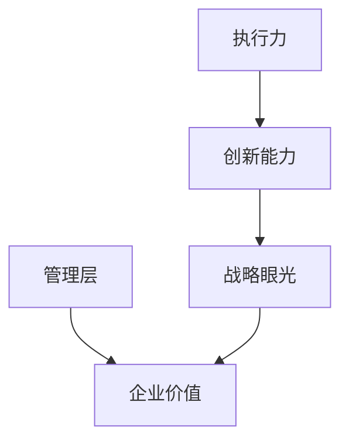
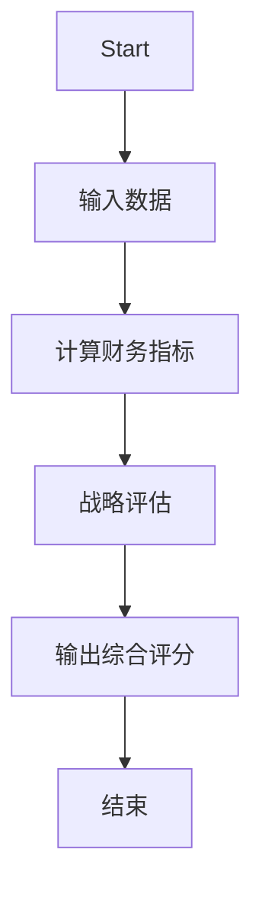

                 


# 巴菲特的管理层评估：量子时代的企业家精神新标准

---

## 关键词：  
巴菲特，管理层评估，企业家精神，量子时代，投资哲学，价值投资

---

## 摘要：  
本文以巴菲特的投资哲学为核心，结合量子时代的企业管理特点，探讨新时代下企业家精神的新标准。通过分析巴菲特的管理层评估方法，结合现代管理学理论，提出在快速变化的商业环境中，企业家精神需要具备的新特质。文章从背景介绍、核心概念、算法原理、系统架构等多个维度展开，结合实际案例和代码示例，深入剖析量子时代下企业领导力的演变与实践。

---

## 第一章：背景介绍

### 1.1 核心概念术语说明

| **术语**       | **定义**                                                                 |
|----------------|--------------------------------------------------------------------------|
| 巴菲特投资哲学 | 巴菲特的价值投资理念，强调长期投资、安全边际和管理层质量。                   |
| 量子时代       | 指当前快速变化的商业环境，强调创新、不确定性和技术驱动的商业变革。            |
| 管理层评估      | 对企业高管的能力、道德和战略眼光进行系统性分析的过程，以决定投资价值。          |
| 企业家精神     | 企业家在商业活动中展现的创新精神、领导力和决策能力。                          |

### 1.2 问题背景

在量子时代，企业面临的不确定性显著增加。传统的管理方法和投资评估标准已无法满足现代企业的需求。巴菲特的投资哲学虽然经典，但在快速变化的环境中，如何将其与现代企业管理相结合，成为新的挑战。

### 1.3 问题描述

现代企业的管理层需要具备更强的适应性、创新能力和执行力。传统的财务指标分析方法虽然重要，但忽略了管理层的战略思维和领导力。如何将巴菲特的管理层评估方法与现代管理理论相结合，是当前投资领域的重要课题。

### 1.4 问题解决

通过引入量子思维和现代管理学理论，优化巴菲特的管理层评估标准，提出适合新时代的企业家精神新标准。

### 1.5 边界与外延

- **边界**：本文主要聚焦于管理层评估方法的优化，不涉及企业日常运营的具体细节。
- **外延**：结合量子思维和现代管理学理论，扩展巴菲特投资哲学的应用场景。

### 1.6 概念结构与核心要素组成

- **核心要素**：诚信、能力、战略眼光。
- **关联性**：通过系统模型展示管理层评估如何影响企业价值。

---

## 第二章：核心概念与联系

### 2.1 核心概念原理

巴菲特的管理层评估方法以价值投资为核心，强调企业内在价值的长期增长。在量子时代，这一方法需要结合现代管理学理论，特别是量子管理和系统思维。

### 2.2 概念属性特征对比

| **属性**         | **传统管理层评估**                     | **量子时代新标准**                     |
|------------------|----------------------------------------|----------------------------------------|
| 评估维度         | 财务指标、短期业绩                     | 财务指标、长期战略、创新力             |
| 评估重点         | 过去表现、可量化指标                 | 未来潜力、不可量化因素（如创新）       |
| 评估方法         | 定量分析为主                           | 定量与定性分析结合                     |

### 2.3 实体关系图（Mermaid）



---

## 第三章：算法原理讲解

### 3.1 算法原理

结合巴菲特的管理层评估方法和现代管理学理论，提出一个综合评估模型，包括财务指标分析和战略评估两部分。

### 3.2 算法流程图（Mermaid）



### 3.3 数学模型与公式

#### 财务指标分析

- 净资产收益率（ROE）：
  $$ \text{ROE} = \frac{\text{净利润}}{\text{股东权益}} $$

#### 战略评估模型

- 创新能力评分：
  $$ \text{创新能力评分} = 0.3 \times \text{研发投入} + 0.4 \times \text{市场表现} + 0.3 \times \text{团队能力} $$

### 3.4 Python代码示例

```python
def calculate_roe(net_profit, equity):
    return net_profit / equity

def calculate_innovation_score(rnd, market_share, team_capability):
    return 0.3 * rnd + 0.4 * market_share + 0.3 * team_capability

# 示例计算
net_profit = 100
equity = 500
rnd = 10
market_share = 0.8
team_capability = 0.7

ro

