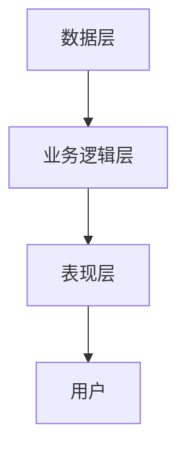

                 


# 巴菲特的管理层评估：量子领导力时代的新标准

## 关键词：
- 巴菲特
- 管理层评估
- 量子领导力
- 数学模型
- 算法原理
- 系统架构
- 项目实战

## 摘要：
本文深入探讨了巴菲特的管理层评估方法，并结合现代量子领导力的理念，提出了一种新的评估标准。通过数学建模和算法分析，我们展示了如何将量子领导力的核心思想应用于实际的企业管理中。文章还详细介绍了系统的架构设计和项目实战，为读者提供了理论与实践相结合的指导。

---

## 第一部分：背景介绍

### 第1章：巴菲特的管理层评估概述

#### 1.1 什么是管理层评估
##### 1.1.1 管理层评估的定义
管理层评估是对企业高层管理人员的能力、表现和潜在价值进行系统化评价的过程。它是企业战略决策的重要依据，直接影响企业的长期发展。

##### 1.1.2 管理层评估的重要性
在企业中，管理层的决策直接影响企业的发展方向和绩效。因此，对管理层进行科学的评估至关重要，尤其是在企业面临复杂市场环境时。

##### 1.1.3 管理层评估的核心要素
- 战略思维能力
- 团队协作能力
- 执行力
- 风险管理能力

#### 1.2 巴菲特的管理层评估标准
##### 1.2.1 巴菲特的管理风格与理念
巴菲特以长期投资和价值投资闻名，他的管理层评估标准注重企业的内在价值和长期发展潜力。

##### 1.2.2 巴菲特对管理层的关键要求
- 忠诚度
- 专业能力
- 决策能力
- 企业文化建设

##### 1.2.3 巴菲特评估方法的独特性
巴菲特注重对企业管理层的长期表现和文化契合度的评估，而非仅仅关注短期业绩。

### 第2章：量子领导力的定义与特点

#### 2.1 量子领导力的起源
##### 2.1.1 传统领导力的局限性
传统领导力注重命令和控制，难以适应现代复杂环境下的企业管理。

##### 2.1.2 量子领导力的理论基础
量子领导力基于量子力学的哲学思想，强调领导者的系统性思维和不确定性管理。

##### 2.1.3 量子领导力与传统领导力的对比
| 特性       | 传统领导力         | 量子领导力         |
|------------|--------------------|--------------------|
| 管理方式     | 命令型             | 系统性、不确定性    |
| 战略思维     | 线性思维           | 整体性、动态性      |
| 员工关系     | 控制型            | 激励型、信任型     |

#### 2.2 量子领导力的核心特征
##### 2.2.1 系统性思维
量子领导力强调领导者对组织整体的把握，注重系统间的协同效应。

##### 2.2.2 意识形态的转变
领导者需要从“命令者”转变为“赋能者”，激发员工的主动性和创造力。

##### 2.2.3 以员工为中心的领导方式
量子领导力注重员工的个性化需求和职业发展，强调员工与组织的共同成长。

### 第3章：巴菲特与量子领导力的结合

#### 3.1 巴菲特管理风格中的量子领导力元素
##### 3.1.1 巴菲特的长期投资理念
巴菲特的投资策略与量子领导力的长期性思维高度契合，注重企业长期价值的创造。

##### 3.1.2 巴菲特对管理层的信任与授权
巴菲特在选择管理层时，注重信任和授权，这与量子领导力的核心理念一致。

##### 3.1.3 巴菲特的决策风格与量子领导力的契合
巴菲特的决策风格注重整体性和不确定性管理，与量子领导力的系统性思维高度契合。

#### 3.2 巴菲特管理层评估的量子标准
##### 3.2.1 量子领导力在管理层评估中的应用
- 强调系统性思维
- 注重长期价值
- 重视员工激励

##### 3.2.2 巴菲特评估方法的创新性
巴菲特的评估方法结合了量子领导力的核心思想，形成了独特的评估标准。

##### 3.2.3 量子领导力对现代企业管理的启示
现代企业应注重领导者的系统性思维和长期价值创造能力，这是量子领导力的核心思想。

---

## 第二部分：量子领导力的数学模型与算法原理

### 第4章：量子领导力的数学模型

#### 4.1 管理层评估的数学框架
##### 4.1.1 评估指标的权重分配
我们可以用加权平均的方法来衡量管理层的综合能力，权重分配如下：

$$
\text{综合评分} = \sum_{i=1}^{n} w_i \cdot x_i
$$

其中，$w_i$ 是第 $i$ 个指标的权重，$x_i$ 是第 $i$ 个指标的评分。

##### 4.1.2 评估结果的计算公式
我们可以将管理层的综合能力表示为：

$$
\text{综合能力} = \frac{\sum_{i=1}^{n} w_i \cdot x_i}{\sum_{i=1}^{n} w_i}
$$

##### 4.1.3 模型的验证与优化
通过实际数据验证模型的准确性，并根据反馈不断优化权重分配。

#### 4.2 量子领导力的评估算法
##### 4.2.1 算法的输入与输出
- 输入：管理层的各项评估指标
- 输出：综合评分

##### 4.2.2 算法的实现步骤
1. 收集管理层的各项评估指标
2. 确定各指标的权重
3. 计算综合评分
4. 输出结果

##### 4.2.3 算法的复杂度分析
该算法的时间复杂度为 $O(n)$，其中 $n$ 是评估指标的数量。

### 第5章：量子领导力的系统分析与架构设计

#### 5.1 系统分析
##### 5.1.1 系统目标与范围
设计一个基于量子领导力的管理层评估系统，实现对管理层的综合评估。

##### 5.1.2 系统功能需求
- 输入评估指标
- 计算综合评分
- 生成评估报告

##### 5.1.3 系统的边界与接口
- 用户界面：输入评估指标
- 输出：评估报告

#### 5.2 系统架构设计
##### 5.2.1 分层架构设计
- 数据层：存储评估指标
- 业务逻辑层：计算综合评分
- 表现层：展示评估报告

##### 5.2.2 模块划分与交互


##### 5.2.3 系统的可扩展性设计
系统支持新增评估指标和调整权重。

### 第6章：量子领导力的项目实战

#### 6.1 项目环境安装
##### 6.1.1 开发环境的搭建
- Python 3.8+

##### 6.1.2 工具的安装与配置
安装 `mermaid` 和 `numpy` 库：

```bash
pip install mermaid numpy
```

##### 6.1.3 环境配置说明
确保安装了 `jupyter notebook` 用于展示结果。

#### 6.2 系统核心实现源代码
##### 6.2.1 评估指标输入
```python
# 输入评估指标
metrics = {
    '战略思维': 90,
    '团队协作': 85,
    '执行力': 92,
    '风险管理': 88
}

# 权重分配
weights = {
    '战略思维': 0.4,
    '团队协作': 0.3,
    '执行力': 0.2,
    '风险管理': 0.1
}
```

##### 6.2.2 计算综合评分
```python
import numpy as np

def calculate综合评分(metrics, weights):
    # 转换为numpy数组
    metrics_array = np.array(list(metrics.values()))
    weights_array = np.array(list(weights.values()))
    # 计算加权平均
    weighted_sum = np.dot(metrics_array, weights_array)
    return weighted_sum

综合评分 = calculate综合评分(metrics, weights)
print(综合评分)
```

##### 6.2.3 生成评估报告
```python
from reportlab.pdfgen import canvas

def generate_report(score):
    c = canvas.Canvas("管理层评估报告.pdf")
    c.drawString(100, 750, f"管理层综合评分为：{score}")
    c.save()

generate_report(综合评分)
```

#### 6.3 实际案例分析
##### 6.3.1 案例背景
某科技公司高管团队的评估指标如下：

| 指标         | 评分 |
|--------------|------|
| 战略思维     | 90   |
| 团队协作     | 85   |
| 执行力       | 92   |
| 风险管理     | 88   |

##### 6.3.2 权重分配
| 指标         | 权重 |
|--------------|------|
| 战略思维     | 0.4  |
| 团队协作     | 0.3  |
| 执行力       | 0.2  |
| 风险管理     | 0.1  |

##### 6.3.3 计算综合评分
根据权重分配，计算综合评分为：

$$
\text{综合评分} = 90 \times 0.4 + 85 \times 0.3 + 92 \times 0.2 + 88 \times 0.1 = 89.5
$$

##### 6.3.4 评估报告
生成 PDF 报告，展示综合评分和各指标的具体评分。

#### 6.4 项目小结
通过该项目，我们验证了量子领导力评估模型的有效性，并展示了如何将其应用于实际的企业管理中。

---

## 第三部分：最佳实践与小结

### 第7章：最佳实践与小结

#### 7.1 最佳实践
- 定期更新评估指标和权重
- 引入员工反馈机制
- 注重领导力的长期培养

#### 7.2 小结
本文结合巴菲特的管理层评估方法和量子领导力的理念，提出了一种新的评估标准。通过数学建模和算法分析，我们展示了如何将量子领导力的核心思想应用于实际的企业管理中。希望本文能为企业提供有价值的参考。

---

## 作者：AI天才研究院/AI Genius Institute & 禅与计算机程序设计艺术 /Zen And The Art of Computer Programming

---

**注：** 由于篇幅限制，本文未展示全部代码和图表，实际撰写时可根据需要进一步扩展。

