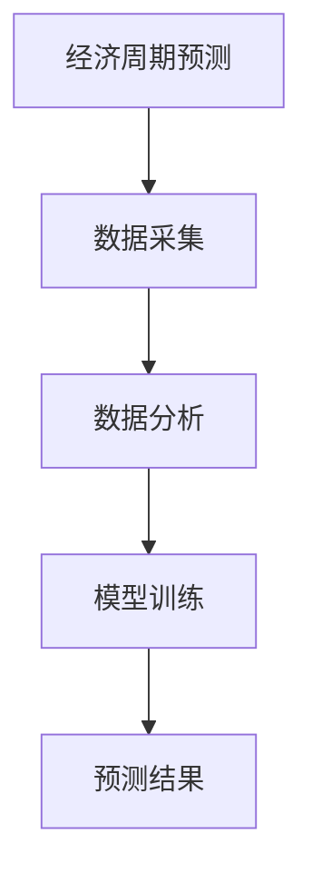
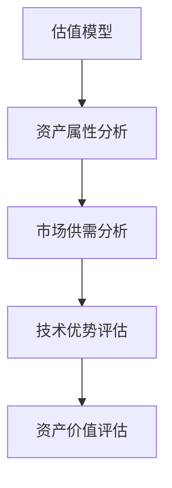

                 

# 巴菲特的经济周期投资法则：元宇宙经济周期的特点

## 关键词：
巴菲特，经济周期，投资法则，元宇宙，经济周期，价值投资，风险管理

## 摘要：
本文探讨了巴菲特的经济周期投资法则，并分析了其在元宇宙经济周期中的应用特点。文章从巴菲特的价值投资理念出发，结合元宇宙的经济体系，详细分析了元宇宙经济周期的独特性，并提出了在元宇宙环境下如何优化投资策略的方法。通过结合实际案例和数学模型，本文为投资者提供了在元宇宙经济周期中进行价值投资的指导。

---

## 第1章：巴菲特投资理念概述

### 1.1 巴菲特投资哲学的核心思想

#### 1.1.1 价值投资的定义与核心理念
价值投资是一种长期投资策略，强调以低于资产内在价值的价格买入优质资产。巴菲特的价值投资理念基于以下几个核心原则：
1. **安全边际**：买入价格低于内在价值，以确保投资的安全性。
2. **长期视角**：关注企业的长期盈利能力，而非短期市场波动。
3. **企业质量**：选择具有强大护城河、良好管理团队和持续盈利能力的企业。

#### 1.1.2 巴菲特的投资策略与成功案例
巴菲特的投资策略以“寻找伟大企业，长期持有”为核心。他的成功案例包括对可口可乐、IBM和苹果的投资，这些企业在巴菲特买入时都具有强大的竞争优势和长期增长潜力。

#### 1.1.3 巴菲特对经济周期的见解
巴菲特认为经济周期是不可预测的，但可以通过分析企业的基本面在经济周期中的表现，选择能够在衰退期中表现稳健的企业进行投资。他强调在市场恐慌时买入优质资产，而在市场繁荣时保持谨慎。

### 1.2 经济周期的基本原理

#### 1.2.1 经济周期的定义与分类
经济周期是指经济活动的波动，通常分为以下几个阶段：
1. **衰退期**：经济增长放缓，企业盈利下降。
2. **萧条期**：经济活动极度低迷，失业率上升。
3. **复苏期**：经济开始逐步恢复，企业盈利逐渐回升。
4. **繁荣期**：经济增长迅速，企业盈利达到高峰。

#### 1.2.2 经济周期对投资决策的影响
在不同的经济周期阶段，投资策略需要相应调整：
- **衰退期**：寻找具有防御性的企业，如公用事业、消费品行业。
- **萧条期**：寻找估值极低的优质资产，进行长期投资。
- **复苏期**：逐步增加对周期性行业的投资。
- **繁荣期**：保持谨慎，避免过度杠杆和高风险投资。

#### 1.2.3 巴菲特对经济周期的预测与应对策略
尽管巴菲特认为经济周期难以精确预测，但他强调在市场恐慌时买入优质资产，在市场狂热时保持冷静。他的应对策略包括：
1. **分散投资**：通过投资多个行业的优质企业降低风险。
2. **长期持有**：避免频繁交易，减少交易成本和税务负担。
3. **关注企业基本面**：选择那些在经济周期中表现稳健的企业。

---

## 第2章：元宇宙经济周期的特点

### 2.1 元宇宙经济体系的构成

#### 2.1.1 元宇宙的定义与基本特征
元宇宙是一个虚拟的、去中心化的数字世界，用户可以在其中进行社交、娱乐、交易等活动。元宇宙的经济体系主要包括以下要素：
1. **虚拟货币**：如比特币、以太坊等加密货币。
2. **数字资产**：如NFT（非同质化代币）。
3. **虚拟商品**：如虚拟土地、虚拟物品。
4. **智能合约**：用于自动执行交易和管理资产。

#### 2.1.2 元宇宙经济体系的核心要素
元宇宙的经济体系具有以下特点：
- **去中心化**：基于区块链技术，没有中央机构控制。
- **透明性**：所有交易记录在区块链上，公开透明。
- **可编程性**：通过智能合约实现自动化的交易和资产管理。

#### 2.1.3 元宇宙经济周期的特殊性
元宇宙的经济周期与传统经济周期有显著不同：
- **波动性**：由于市场的高度波动性和去中心化特性，元宇宙的经济周期可能更加频繁。
- **技术创新驱动**：技术进步（如区块链、人工智能）是推动元宇宙经济周期的核心因素。
- **全球性**：元宇宙经济不受地域限制，具有全球性。

### 2.2 元宇宙经济周期的驱动因素

#### 2.2.1 技术进步对经济周期的影响
技术进步是元宇宙经济周期的核心驱动力。例如，区块链技术的升级、人工智能的应用以及虚拟现实技术的改进都会对元宇宙的经济活动产生深远影响。

#### 2.2.2 用户行为与市场参与度的关联
用户行为是元宇宙经济周期的重要影响因素。用户的参与度、消费习惯和投资行为直接决定了元宇宙市场的供需关系。

#### 2.2.3 政策法规对经济周期的调节作用
政策法规对元宇宙经济周期的影响不容忽视。例如，政府对加密货币的监管政策可能会导致市场波动。

---

## 第3章：巴菲特经济周期投资法则与元宇宙的结合

### 3.1 巴菲特经济周期理论在元宇宙中的应用

#### 3.1.1 传统经济周期理论在元宇宙中的适用性
尽管元宇宙的经济体系与传统经济体系有显著不同，但巴菲特的经济周期理论仍然具有一定的参考价值。例如：
- 在衰退期，选择具有防御性的数字资产进行投资。
- 在繁荣期，保持谨慎，避免过度投资。

#### 3.1.2 元宇宙经济周期的独特性与挑战
元宇宙经济周期的独特性主要体现在以下几个方面：
- **技术创新驱动**：元宇宙的经济周期受技术进步的影响更大。
- **市场波动性**：元宇宙市场的波动性远高于传统市场。
- **监管不确定性**：元宇宙的监管政策尚不明确，这增加了投资的不确定性。

#### 3.1.3 巴菲特投资法则的调整与优化
在元宇宙环境下，巴菲特的投资法则需要进行适当的调整：
1. **关注技术创新**：选择那些具有技术创新优势的企业进行投资。
2. **分散投资风险**：通过投资多种类型的数字资产降低风险。
3. **长期视角**：保持长期投资策略，避免短期市场波动的干扰。

### 3.2 元宇宙经济周期分析框架

#### 3.2.1 元宇宙经济周期的指标体系
以下是元宇宙经济周期的关键指标：
- **市场流动性**：衡量市场的活跃程度。
- **交易量**：反映市场的供需关系。
- **资产价格波动性**：衡量市场的稳定性。
- **用户增长率**：反映市场的潜在需求。

#### 3.2.2 元宇宙经济周期的预测模型
以下是基于元宇宙经济周期的预测模型：

该模型通过采集元宇宙经济数据，利用机器学习算法进行分析和预测，最终得出经济周期的预测结果。

#### 3.2.3 元宇宙经济周期的风险管理策略
以下是一些有效的风险管理策略：
1. **分散投资**：通过投资多种类型的数字资产降低风险。
2. **设定止损点**：在市场波动较大时，设定止损点以避免重大损失。
3. **关注市场趋势**：及时关注市场趋势，调整投资策略。

---

## 第4章：价值投资在元宇宙中的实践

### 4.1 元宇宙中的价值评估方法

#### 4.1.1 元宇宙资产的价值构成
元宇宙资产的价值主要由以下几个因素决定：
1. **市场需求**：资产的市场需求越大，价值越高。
2. **技术优势**：资产的技术优势越明显，价值越高。
3. **稀缺性**：资产的稀缺性也是影响价值的重要因素。

#### 4.1.2 元宇宙资产的估值模型
以下是基于元宇宙资产的估值模型：

该模型通过分析资产的属性、市场需求和技术创新，最终得出资产的价值评估结果。

#### 4.1.3 元宇宙资产的长期投资价值
尽管元宇宙资产的市场价格可能波动较大，但具有强大技术优势和市场需求的资产仍然具有长期投资价值。

### 4.2 元宇宙中的投资策略

#### 4.2.1 价值投资在元宇宙中的具体应用
以下是价值投资在元宇宙中的具体应用：
1. **选择具有技术创新优势的企业**：例如，选择在区块链技术上有显著优势的企业。
2. **关注市场需求**：选择那些市场需求大的数字资产进行投资。
3. **长期持有**：保持长期投资策略，避免短期波动的干扰。

#### 4.2.2 元宇宙投资中的分散化策略
通过投资多种类型的数字资产，可以有效降低投资风险。

#### 4.2.3 元宇宙投资中的风险管理
以下是一些有效的风险管理策略：
1. **设定止损点**：在市场波动较大时，设定止损点以避免重大损失。
2. **关注市场趋势**：及时关注市场趋势，调整投资策略。

---

## 第5章：经济周期波动下的投资风险管理

### 5.1 元宇宙经济周期波动的特征

#### 5.1.1 元宇宙经济波动的周期性
元宇宙的经济波动具有明显的周期性，通常与技术创新、市场需求和政策法规等因素密切相关。

#### 5.1.2 元宇宙经济波动的突发性
由于元宇宙市场的高度波动性，经济波动往往具有突发性。

#### 5.1.3 元宇宙经济波动的复杂性
元宇宙经济波动的复杂性主要体现在以下几个方面：
- **多因素影响**：元宇宙经济波动受技术、市场、政策等多方面因素的影响。
- **全球性**：元宇宙经济波动具有全球性，影响范围广泛。

### 5.2 投资风险管理的策略与方法

#### 5.2.1 风险识别与评估
风险识别与评估是投资风险管理的第一步。以下是常见的风险类型：
1. **市场风险**：由于市场价格波动导致的投资损失。
2. **技术风险**：由于技术创新导致的资产贬值风险。
3. **政策风险**：由于政策法规变化导致的投资风险。

#### 5.2.2 风险分散与对冲
通过投资多种类型的数字资产，可以有效分散风险。此外，利用衍生品进行对冲也是常见的风险管理方法。

#### 5.2.3 风险管理策略的优化
以下是一些有效的风险管理策略：
1. **动态调整**：根据市场变化动态调整投资组合。
2. **定期评估**：定期评估投资组合的风险水平，并进行必要的调整。
3. **加强监控**：加强对市场趋势和政策法规的监控，及时调整投资策略。

---

## 结语

在元宇宙经济周期中，巴菲特的经济周期投资法则仍然具有重要的指导意义。通过结合元宇宙的经济特点和投资策略，投资者可以在复杂的市场环境中找到合适的投资机会。然而，元宇宙经济周期的独特性也带来了新的挑战，投资者需要不断学习和适应，以应对市场的变化。

---

## 作者：AI天才研究院/AI Genius Institute & 禅与计算机程序设计艺术 /Zen And The Art of Computer Programming

