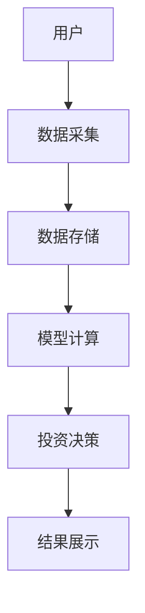
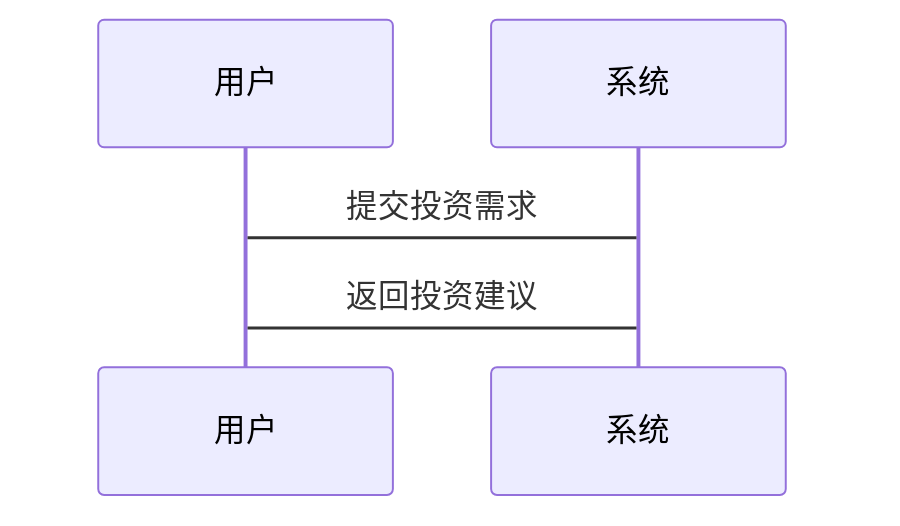

                 


# 巴菲特的经济周期投资法则：后疫情时代的经济复苏

> 关键词：巴菲特，经济周期，价值投资，后疫情时代，经济复苏，投资策略

> 摘要：本文深入探讨巴菲特的经济周期投资法则，结合后疫情时代的经济复苏背景，分析其投资理念在当前经济环境中的应用。通过系统化的分析和实战案例，帮助投资者理解如何在经济周期波动中把握投资机会。

---

## 第1章：经济周期与投资概述

### 1.1 经济周期的基本概念

经济周期是指经济活动在长期趋势中围绕趋势波动的过程，通常分为衰退、复苏、增长和繁荣四个阶段。经济周期对投资者的影响深远，尤其是在股票、债券和其他资产的投资中。

### 1.2 巴菲特的投资理念

巴菲特的价值投资理念强调购买价格低于内在价值的股票，并长期持有。他注重企业的财务健康、管理层能力和行业地位，认为市场先生是机会的提供者而非敌人。

---

## 第2章：巴菲特的经济周期投资法则

### 2.1 经济周期中的投资策略

#### 衰退期

在经济衰退期，企业盈利能力下降，市场情绪低迷。巴菲特建议投资者寻找基本面稳固、估值低廉的股票进行布局。

#### 恢复期

经济开始复苏，企业盈利逐步恢复，巴菲特建议增加对优质企业的投资。

#### 繁荣期

经济过热，市场估值偏高，巴菲特建议保持谨慎，避免追高。

### 2.2 巴菲特的选股标准

#### 企业护城河

企业护城河是巴菲特选股的重要标准，包括成本优势、品牌影响力和专利技术等。

#### 财务健康状况

巴菲特关注企业的盈利能力、资产负债表和现金流情况，避免高负债企业。

#### 管理层能力

管理层的诚信和能力直接影响企业的长期发展，巴菲特倾向于投资优秀管理者的公司。

---

## 第3章：后疫情时代的经济复苏

### 3.1 疫情对全球经济的影响

#### 经济活动的停滞与恢复

疫情导致全球经济活动暂停，企业面临供应链中断和需求下降的挑战。随着疫苗接种和政策支持，经济逐步复苏。

#### 产业链的断裂与重组

疫情暴露了全球产业链的脆弱性，推动企业重新布局供应链，增强抗风险能力。

#### 通货膨胀与货币政策

疫情后的货币政策宽松导致通货膨胀压力上升，央行逐步收紧政策以控制通胀。

### 3.2 后疫情时代的投资机会

#### 数字经济

数字化转型加速，科技企业在后疫情时代迎来发展机遇。

#### 新能源行业

碳中和目标推动新能源行业快速增长，巴菲特布局新能源企业。

#### 医疗健康

后疫情时代，医疗健康需求持续增长，相关企业投资价值凸显。

---

## 第4章：巴菲特投资法则的数学模型

### 4.1 价值投资的数学分析

#### 内在价值的计算公式

$$ V = \frac{CF}{r - g} $$

其中：
- \( V \) 是内在价值
- \( CF \) 是未来现金流
- \( r \) 是折现率
- \( g \) 是现金流增长率

#### 股价与内在价值的偏离分析

通过比较股价与内在价值的差异，投资者可以判断投资标的的估值是否合理。

### 4.2 投资组合的优化模型

#### 马科维茨投资组合理论

$$ \text{Minimize } \sigma^2 \text{ subject to } \mu \geq R_{min} $$

其中：
- \( \sigma^2 \) 是投资组合的方差
- \( \mu \) 是投资组合的预期收益
- \( R_{min} \) 是最低预期收益

---

## 第5章：系统分析与架构设计

### 5.1 投资决策系统的功能设计

#### 数据采集模块

负责收集市场数据，包括股票价格、财务报表等。

#### 模型计算模块

基于数学模型计算内在价值和投资评分。

#### 投资决策模块

根据模型结果生成投资建议。

### 5.2 系统架构设计



### 5.3 接口设计与交互流程

#### 用户交互序列图



---

## 第6章：项目实战与案例分析

### 6.1 环境安装与数据准备

#### 数据源的选择

包括股票价格、财务报表和行业数据。

#### 数据清洗与预处理

去除缺失值和异常值，确保数据质量。

### 6.2 核心代码实现

#### 内在价值计算函数

```python
def calculate_intrinsic_value(cash_flow, required_return, growth_rate):
    return cash_flow / (required_return - growth_rate)
```

#### 投资评分系统

```python
def calculate_investment_score(intrinsic_value, market_price):
    return (intrinsic_value / market_price) * 100
```

---

## 第7章：总结与展望

### 7.1 总结

巴菲特的经济周期投资法则在后疫情时代依然具有重要的指导意义。投资者应结合经济周期变化，选择优质企业进行长期投资。

### 7.2 展望

随着全球经济逐步复苏，投资者应关注科技、新能源和医疗健康等领域的机会，同时保持对经济周期的敏感性，灵活调整投资策略。

---

作者：AI天才研究院/AI Genius Institute & 禅与计算机程序设计艺术 /Zen And The Art of Computer Programming

