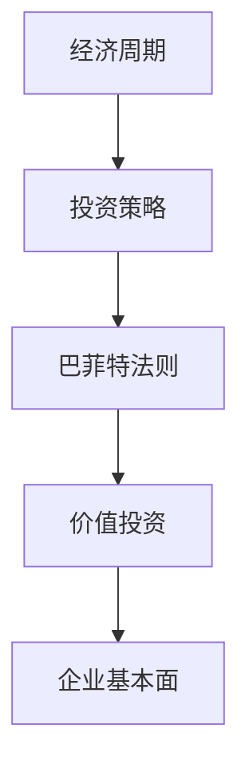
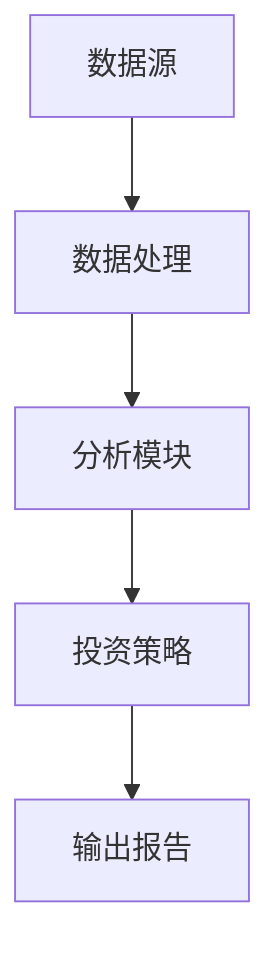
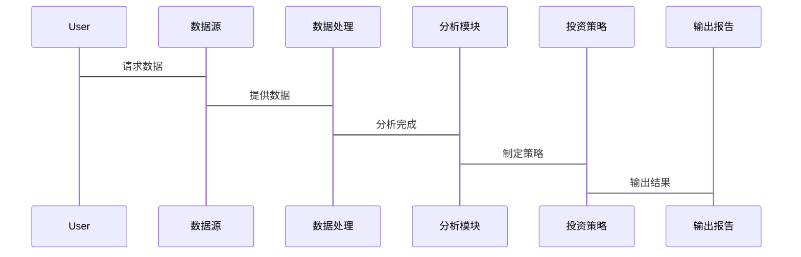

                 


# 巴菲特的经济周期投资法则：如何在不同阶段获利

## 关键词：
- 巴菲特投资法则
- 经济周期
- 投资策略
- 价值投资
- 风险管理
- 股票分析

## 摘要：
本文深入分析巴菲特的经济周期投资法则，探讨如何在不同的经济周期阶段制定有效的投资策略。通过背景介绍、核心概念与联系、算法原理讲解、数学模型、系统架构设计、项目实战、最佳实践和小结等部分，详细阐述巴菲特的投资理念、经济周期的各个阶段、价值评估方法、风险管理策略以及实际案例分析，为读者提供全面的指导。

---

## 目录

1. **背景介绍**
   1.1 经济周期的基本概念
   1.2 巴菲特的投资理念
   1.3 为什么研究经济周期对投资至关重要

2. **核心概念与联系**
   2.1 经济周期与投资策略的关系
   2.2 巴菲特策略如何适应不同阶段
   2.3 核心概念对比表
   2.4 实体关系图

3. **算法原理讲解**
   3.1 巴菲特的评估方法
   3.2 DCF模型的数学公式
   3.3 示例分析

4. **数学模型与公式**
   4.1 市盈率计算
   4.2 内在价值公式

5. **系统架构设计**
   5.1 数据收集模块
   5.2 分析模块
   5.3 投资策略模块
   5.4 系统架构图
   5.5 序列图

6. **项目实战**
   6.1 案例分析
   6.2 环境安装
   6.3 核心实现代码
   6.4 实战总结

7. **最佳实践与小结**
   7.1 投资建议
   7.2 注意事项
   7.3 拓展阅读

---

## 正文

### 第一部分：背景介绍

#### 1.1 经济周期的基本概念
经济周期是指经济活动的波动，通常分为复苏、繁荣、衰退和萧条四个阶段。了解经济周期有助于投资者制定有效的投资策略。

#### 1.2 巴菲特的投资理念
巴菲特倡导价值投资，强调长期投资和安全边际。他注重企业的基本面分析，寻找具有持续竞争优势的企业。

#### 1.3 为什么研究经济周期对投资至关重要
经济周期影响企业的盈利能力、股票估值和市场波动。了解经济周期有助于投资者在不同阶段做出明智的投资决策。

---

### 第二部分：核心概念与联系

#### 2.1 经济周期与投资策略的关系
经济周期的阶段决定了投资策略的调整方向。例如，在衰退阶段，寻找价值低估的企业；在繁荣阶段，关注防御性行业。

#### 2.2 巴菲特策略如何适应不同阶段
巴菲特的策略在不同经济阶段有不同的侧重点。例如，在衰退阶段，他倾向于购买优质企业的股票；在繁荣阶段，他更关注企业估值是否合理。

#### 2.3 核心概念对比表
| 经济阶段   | 投资策略         | 关注点           |
|------------|------------------|------------------|
| 复苏       | 增持成长股       | 企业盈利改善     |
| 繁荣       | 选择防御性行业   | 防范估值过高风险 |
| 衰退       | 购买价值股       | 企业估值被低估   |

#### 2.4 实体关系图


---

### 第三部分：算法原理讲解

#### 3.1 巴菲特的评估方法
巴菲特通过分析企业的基本面，包括盈利能力、财务状况和行业地位，来评估其内在价值。

#### 3.2 DCF模型的数学公式
现金流折现模型（DCF）用于评估企业的内在价值：
$$\text{内在价值} = \sum_{t=1}^{n} \frac{\text{现金流}_t}{(1 + r)^t}$$
其中，$r$ 是折现率，$n$ 是预测年数。

#### 3.3 示例分析
假设某企业未来3年的现金流分别为100万、120万和150万，折现率为10%：
$$\text{内在价值} = \frac{100}{1.1} + \frac{120}{1.1^2} + \frac{150}{1.1^3} \approx 333.33$$

---

### 第四部分：数学模型与公式

#### 4.1 市盈率计算
市盈率（P/E）用于衡量股票的估值：
$$P/E = \frac{\text{股价}}{\text{每股收益}}$$

#### 4.2 内在价值公式
$$\text{内在价值} = \text{净利润} \times \text{合理市盈率}$$

---

### 第五部分：系统架构设计

#### 5.1 数据收集模块
- 从财务报表中提取企业数据，包括收入、利润和现金流。

#### 5.2 分析模块
- 使用DCF模型计算内在价值，判断股票是否被低估。

#### 5.3 投资策略模块
- 根据经济周期阶段，制定相应的投资策略。

#### 5.4 系统架构图


#### 5.5 序列图


---

### 第六部分：项目实战

#### 6.1 案例分析
以某制造企业为例，分析其在衰退阶段的投资价值。

#### 6.2 环境安装
安装Python和相关库（如Pandas、NumPy）。

#### 6.3 核心实现代码
```python
import pandas as pd

def calculate_intrinsic_value(FCF, WACC, growth_rate, period):
    PV = 0
    for t in range(period):
        cash_flow = FCF * (1 + growth_rate) ** t
        PV += cash_flow / (1 + WACC) ** (t + 1)
    return PV

FCF = 100  # 自由现金流
WACC = 0.1  # 加权平均资本成本
growth_rate = 0.05
period = 5

intrinsic_value = calculate_intrinsic_value(FCF, WACC, growth_rate, period)
print(f"内在价值为：{intrinsic_value}")
```

#### 6.4 实战总结
通过代码分析，得出该企业的内在价值，判断其是否值得投资。

---

### 第七部分：最佳实践与小结

#### 7.1 投资建议
- 在衰退阶段，优先考虑具有强大财务状况的企业。
- 在繁荣阶段，关注估值合理的防御性行业。

#### 7.2 注意事项
- 避免盲目跟风，注重基本面分析。
- 定期审视投资组合，调整策略。

#### 7.3 拓展阅读
推荐阅读巴菲特的《聪明的投资者》和《投资的艺术》。

---

## 小结
本文系统地阐述了巴菲特的经济周期投资法则，从背景介绍到实际案例分析，为投资者提供了全面的指导。通过理解经济周期、掌握价值评估方法和风险管理策略，投资者可以在不同阶段制定有效的投资计划。

---

## 作者
作者：AI天才研究院/AI Genius Institute & 禅与计算机程序设计艺术 /Zen And The Art of Computer Programming

