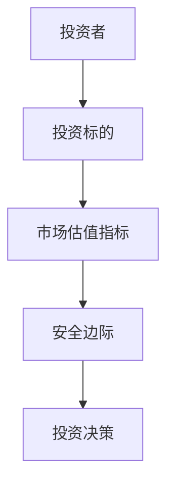
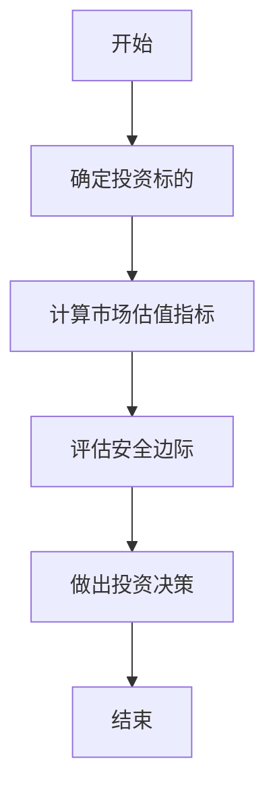
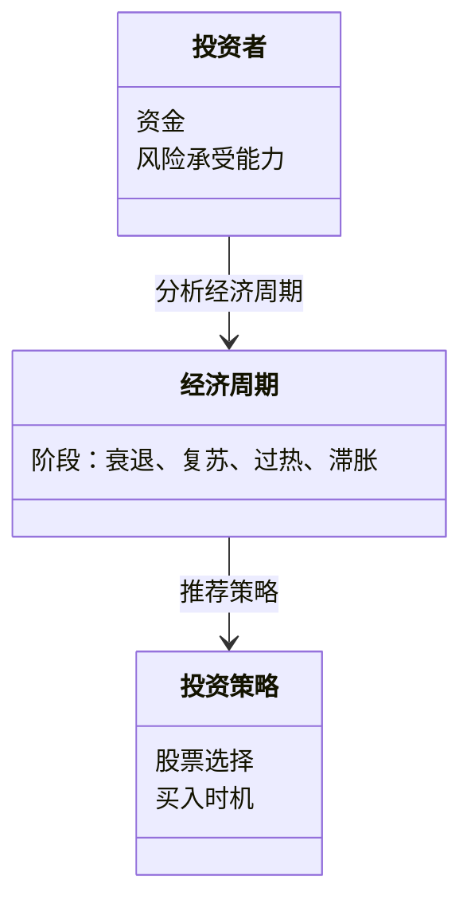
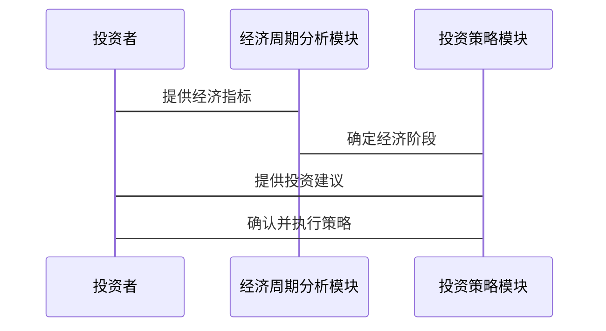

                 


# 巴菲特的经济周期投资策略

> 关键词：巴菲特, 投资策略, 经济周期, 价值投资, 安全边际

> 摘要：本文深入分析巴菲特的经济周期投资策略，涵盖其投资理念、核心概念、数学模型、系统分析及实际案例，提供详细的策略解读和实战分析。

---

# 第1章: 巴菲特投资理念与经济周期概述

## 1.1 巴菲特投资理念的核心思想

### 1.1.1 价值投资的定义与核心要素
- **价值投资**：寻找被市场低估的股票，关注企业的内在价值。
- **核心要素**：
  - 企业基本面：盈利能力、财务状况、竞争优势。
  - 安全边际：买入价格低于内在价值，降低风险。

### 1.1.2 巴菲特投资理念的形成与发展
- 受 mentor Benjamin Graham 影响，发展出价值投资理论。
- 强调长期投资、集中持股和安全边际。

### 1.1.3 巴菲特投资理念与经济周期的关系
- 经济周期影响企业盈利和股票估值。
- 巴菲特在衰退期寻找低估股票，复苏期加仓优质股。

## 1.2 经济周期的基本概念与特征

### 1.2.1 经济周期的定义与阶段划分
- **定义**：经济活动的波动，包括衰退、复苏、过热、滞胀。
- **阶段划分**：
  - 衰退期：GDP下降，失业率上升。
  - 复苏期：经济开始恢复，企业盈利回升。
  - 过热期：经济快速增长，可能出现泡沫。
  - 滞胀期：高通胀与低经济增长并存。

### 1.2.2 不同经济周期阶段的特征分析
- **衰退期**：企业盈利下降，股价被低估。
- **复苏期**：企业盈利恢复，股价逐渐上升。
- **过热期**：股价高估，风险增加。
- **滞胀期**：企业盈利受压，股价波动大。

### 1.2.3 经济周期对投资策略的影响
- 投资者需根据经济阶段调整策略，避免高位追涨，低位杀跌。

## 1.3 巴菲特经济周期投资策略的核心思想

### 1.3.1 巴菲特对经济周期的独到见解
- **逆周期投资**：衰退期寻找低估股票，复苏期加仓。
- **安全边际**：买入价格低于内在价值，抵御经济波动。

### 1.3.2 巴菲特投资策略的主要原则
- 长期投资，集中持股。
- 买入低估股票，持有优质企业。

### 1.3.3 巴菲特策略与其他投资策略的对比分析
- **价值投资 vs 技术分析**：基本面驱动 vs 市场趋势。
- **成长投资 vs 价值投资**：高增长 vs 低估值。

## 1.4 巴菲特投资策略的数学模型与公式

### 1.4.1 价值投资的数学模型
$$ V = \frac{E}{P} $$
- V：内在价值，E：净利润，P：股价。

### 1.4.2 安全边际的计算公式
$$ S = P \times (1 - \frac{E}{P}) $$
- S：安全边际，P：股价，E：净利润。

### 1.4.3 市场估值指标的计算公式
$$ PE = \frac{P}{E} $$
- PE：市盈率，P：股价，E：净利润。

## 1.5 本章小结
- 巴菲特的投资策略基于经济周期，强调价值投资和安全边际。

---

# 第2章: 巴菲特投资策略的核心概念与联系

## 2.1 核心概念的定义与属性

### 2.1.1 价值投资的核心概念
- **定义**：寻找被低估的股票，买入并长期持有。
- **属性**：注重企业基本面，强调安全边际。

### 2.1.2 安全边际的概念与属性
- **定义**：买入价格低于内在价值的部分，提供缓冲。
- **属性**：降低投资风险，应对市场波动。

### 2.1.3 市场估值指标的定义与特征
- **定义**：衡量市场估值的指标，如PE、PB。
- **特征**：帮助判断市场是否高估或低估。

## 2.2 核心概念的对比分析

### 2.2.1 价值投资与其他投资策略的对比
- **价值投资**：基于内在价值，长期持有。
- **成长投资**：基于未来增长，注重高市盈率。

### 2.2.2 安全边际与风险控制的对比
- **安全边际**：降低买入价格，降低风险。
- **风险控制**：通过分散投资降低风险。

### 2.2.3 市场估值指标与投资决策的关系
- 市场估值指标帮助判断投资时机和标的。

## 2.3 核心概念的ER实体关系图


## 2.4 本章小结
- 核心概念相互关联，构成巴菲特的投资体系。

---

# 第3章: 巴菲特经济周期投资策略的算法原理

## 3.1 算法原理的数学模型

### 3.1.1 价值投资的数学模型
$$ V = \frac{E}{P} $$
- V：内在价值，E：净利润，P：股价。

### 3.1.2 安全边际的计算公式
$$ S = P \times (1 - \frac{E}{P}) $$
- S：安全边际，P：股价，E：净利润。

### 3.1.3 市场估值指标的计算公式
$$ PE = \frac{P}{E} $$
- PE：市盈率，P：股价，E：净利润。

## 3.2 算法原理的流程图


## 3.3 算法原理的Python实现

### 3.3.1 价值投资模型的Python代码
```python
def calculate_intrinsic_value(enterprise_value, net_income):
    return enterprise_value / net_income

enterprise_value = 1000000  # 示例企业价值
net_income = 100000  # 示例净利润
intrinsic_value = calculate_intrinsic_value(enterprise_value, net_income)
print(f"内在价值为: {intrinsic_value}")
```

### 3.3.2 安全边际的计算代码
```python
def calculate_margin_of_safety.purchase_price, net_income):
    return purchase_price * (1 - (purchase_price / net_income))

purchase_price = 50  # 示例买入价格
net_income = 100  # 示例净利润
margin_of_safety = calculate_margin_of_safety(purchase_price, net_income)
print(f"安全边际为: {margin_of_safety}")
```

### 3.3.3 市场估值指标的计算代码
```python
def calculate_pe_ratio(price, earnings):
    return price / earnings

price = 100  # 示例股价
earnings = 20  # 示例净利润
pe_ratio = calculate_pe_ratio(price, earnings)
print(f"市盈率为: {pe_ratio}")
```

## 3.4 本章小结
- 巴菲特的投资策略通过数学模型和算法实现，提供可操作的指导。

---

# 第4章: 巴菲特经济周期投资策略的系统分析与架构设计

## 4.1 系统分析

### 4.1.1 问题场景介绍
- 投资者在不同经济周期阶段如何选择投资策略。

### 4.1.2 系统功能设计
- 系统目标：帮助投资者制定基于经济周期的投资策略。
- 功能模块：经济周期分析、投资策略推荐、风险评估。

### 4.1.3 领域模型


### 4.1.4 系统架构设计


## 4.2 系统接口设计

### 4.2.1 输入接口
- 经济指标输入：GDP、失业率、通胀率。
- 投资者信息输入：资金、风险承受能力。

### 4.2.2 输出接口
- 投资建议：股票选择、买入时机。
- 风险评估：潜在风险和应对措施。

## 4.3 系统交互设计

### 4.3.1 交互流程
1. 投资者输入经济指标和资金情况。
2. 系统分析经济周期阶段。
3. 根据阶段推荐投资策略。
4. 投资者确认并执行策略。

### 4.3.2 交互序列图


## 4.4 本章小结
- 系统化分析帮助投资者更好地应用巴菲特策略。

---

# 第5章: 巴菲特经济周期投资策略的项目实战

## 5.1 环境安装与配置

### 5.1.1 Python环境安装
- 安装Python 3.x。
- 安装依赖库：pandas、numpy、matplotlib。

### 5.1.2 数据获取
- 使用Yahoo Finance获取股票数据。
- 使用EconomicIndicator库获取经济指标。

## 5.2 系统核心实现源代码

### 5.2.1 经济周期分析模块
```python
import pandas as pd
import numpy as np

def determine_economic_phase(gdp_growth, unemployment_rate, inflation_rate):
    if gdp_growth < -2 and unemployment_rate > 8 and inflation_rate < 0:
        return "衰退期"
    elif gdp_growth > -1 and gdp_growth < 2 and unemployment_rate < 7:
        return "复苏期"
    elif gdp_growth > 3 and inflation_rate > 2:
        return "过热期"
    else:
        return "滞胀期"

# 示例数据
gdp_growth = -1.5
unemployment_rate = 6.5
inflation_rate = 1.5
economic_phase = determine_economic_phase(gdp_growth, unemployment_rate, inflation_rate)
print(f"当前经济阶段为: {economic_phase}")
```

### 5.2.2 投资策略模块
```python
def calculate_pe_ratio(price, earnings):
    return price / earnings

def calculate_margin_of_safety(price, intrinsic_value):
    return intrinsic_value - price

# 示例数据
price = 50
earnings = 10
intrinsic_value = 60
pe_ratio = calculate_pe_ratio(price, earnings)
margin_of_safety = calculate_margin_of_safety(price, intrinsic_value)
print(f"市盈率为: {pe_ratio}")
print(f"安全边际为: {margin_of_safety}")
```

## 5.3 代码应用解读与分析

### 5.3.1 经济周期分析模块解读
- 根据GDP增长率、失业率和通胀率判断经济阶段。

### 5.3.2 投资策略模块解读
- 计算市盈率和安全边际，指导买入时机。

## 5.4 实际案例分析

### 5.4.1 2008年金融危机案例
- **经济阶段**：衰退期。
- **投资策略**：寻找低估股票，增加现金储备。

### 5.4.2 2020年新冠疫情案例
- **经济阶段**：衰退期。
- **投资策略**：买入优质企业股票，长期持有。

## 5.5 项目小结
- 实战案例验证了巴菲特策略的有效性。

---

# 第6章: 巴菲特经济周期投资策略的最佳实践与注意事项

## 6.1 最佳实践 tips

### 6.1.1 长期投资
- 避免短期波动，坚持长期持有。

### 6.1.2 集中投资
- 重点投资少数优质企业，降低风险。

### 6.1.3 定期评估
- 定期检查投资组合，调整策略。

## 6.2 小结
- 巴菲特策略的有效性和局限性。

## 6.3 注意事项

### 6.3.1 风险控制
- 设置止损点，避免重大损失。

### 6.3.2 市场变化
- 灵活调整策略，应对市场变化。

### 6.3.3 个人能力
- 评估自身能力，避免超出能力范围投资。

## 6.4 拓展阅读
- 《巴菲特致股东的信》
- 《证券分析》（Benjamin Graham）

---

# 作者：AI天才研究院/AI Genius Institute & 禅与计算机程序设计艺术 /Zen And The Art of Computer Programming

---

这篇文章系统地分析了巴菲特的经济周期投资策略，从理论到实践，提供了详细的指导和案例分析，帮助投资者更好地理解和应用这些策略。

