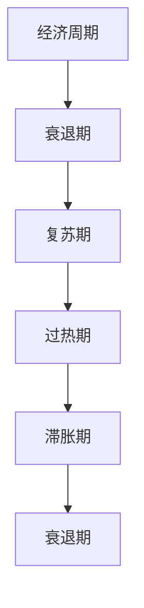

                 


```markdown
# 巴菲特的经济周期投资：后量化宽松时代的策略调整

> 关键词：经济周期，巴菲特投资，量化宽松，策略调整，投资策略

> 摘要：本文探讨了巴菲特在不同经济周期下的投资策略，特别是后量化宽松时代的调整。通过分析经济周期的阶段、巴菲特的核心投资理念，以及量化宽松政策的影响，本文详细阐述了在当前经济环境下如何调整投资策略，以应对市场的变化。文章结合实际案例和系统设计，提供了实用的投资指导。

---

## 第一部分：经济周期与巴菲特投资理念

### 第1章：经济周期概述

#### 1.1 经济周期的基本概念

- **1.1.1 经济周期的定义与特征**
  - 经济周期是指经济活动的波动，通常分为衰退、复苏、过热和滞胀四个阶段。
  - 每个阶段的特点：
    - 衰退期：GDP下降，失业率上升。
    - 复苏期：经济开始恢复，就业率改善。
    - 过热期：经济增长过快，通胀上升。
    - 滞胀期：高通胀与低经济增长并存。

- **1.1.2 经济周期对投资的影响**
  - 投资者需根据经济周期调整资产配置和投资策略。

- **1.1.3 经济周期的预测方法**
  - 使用GDP增长率、失业率、通胀率等指标进行分析。



#### 1.2 巴菲特投资理念的核心要素

- **1.2.1 巴菲特的投资哲学**
  - 价值投资：寻找市场低估的优质企业。
  - 长期投资：避免频繁交易，注重长期收益。

- **1.2.2 巴菲特的价值投资策略**
  - 质量优先：选择具有持续竞争优势的企业。
  - 估值考量：确保买入价格低于内在价值。

- **1.2.3 巴菲特对经济周期的洞察**
  - 在衰退期寻找被低估的企业，在复苏期布局优质资产。

### 第2章：量化宽松政策的背景与影响

#### 2.1 量化宽松政策的定义与实施

- **2.1.1 量化宽松的定义**
  - 中央银行通过购买政府债券或其他资产，增加市场流动性。

- **2.1.2 全球主要经济体的量化宽松历程**
  - 美联储、欧洲央行和日本央行的量化宽松措施。

- **2.1.3 量化宽松政策的短期与长期影响**
  - 短期：提升市场流动性，降低利率。
  - 长期：可能导致资产泡沫和通胀压力。

#### 2.2 量化宽松对资本市场的影响

- **2.2.1 股票市场的表现**
  - 股票价格上升，但可能透支未来收益。

- **2.2.2 债券市场的变化**
  - 利率下降，债券价格上涨。

- **2.2.3 资产泡沫的风险**
  - 过量流动性可能导致资产价格虚高。

### 第3章：巴菲特投资策略的经济周期调整

#### 3.1 不同经济周期下的投资策略

- **3.1.1 经济衰退期的投资策略**
  - 寻找基本面良好但被低估的企业。
  - 增加防御性资产的配置，如公用事业和消费品行业。

- **3.1.2 经济复苏期的投资策略**
  - 逐步增加对周期性行业的投资，如制造业和建筑业。
  - 保持对优质企业的长期投资。

- **3.1.3 经济过热期的投资策略**
  - 减少对高风险资产的配置，增加现金储备。
  - 谨慎选择股票，避免追高。

- **3.1.4 经济滞胀期的投资策略**
  - 选择具有抗通胀能力的资产，如房地产和黄金。
  - 保持适度的股票配置，注重企业的盈利能力和分红能力。

#### 3.2 巴菲特策略调整的核心原则

- **3.2.1 高质量企业的选择标准**
  - 具备持续竞争优势，良好财务状况，稳定的收益能力。

- **3.2.2 股价估值的方法与技巧**
  - 使用市盈率、市净率等指标，结合内在价值评估。

- **3.2.3 风险管理的策略**
  - 分散投资，设置止损点，定期评估投资组合。

### 第4章：后量化宽松时代的投资环境分析

#### 4.1 后量化宽松时代的经济特征

- **4.1.1 利率水平的变化**
  - 中央银行逐步退出量化宽松，利率可能上升。

- **4.1.2 货币政策的调整方向**
  - 从宽松转向稳健，控制通胀。

- **4.1.3 经济增长的动力转换**
  - 创新驱动，产业升级，内需增长。

#### 4.2 投资者面临的机遇与挑战

- **4.2.1 低利率环境下的投资机会**
  - 高分红股票、长期债券。

- **4.2.2 资产配置的多样化需求**
  - 股票、债券、房地产等多种资产配置。

- **4.2.3 全球化与本地化投资的平衡**
  - 全球化投资分散风险，本地化投资把握区域机会。

### 第5章：巴菲特策略在后量化宽松时代的应用

#### 5.1 巴菲特投资策略的适应性调整

- **5.1.1 企业质量评估的侧重点**
  - 强调企业的盈利能力和抗风险能力。

- **5.1.2 估值方法的创新**
  - 结合市场环境，动态调整估值指标。

- **5.1.3 风险管理的强化**
  - 增加对冲工具的使用，如期权和期货。

#### 5.2 具体投资领域的策略调整

- **5.2.1 公用事业板块的投资机会**
  - 防御性强，收益稳定。

- **5.2.2 消费品行业的投资机会**
  - 刚需性强，内需增长推动。

- **5.2.3 金融行业的投资机会**
  - 优质银行股，关注资产质量和流动性风险。

### 第6章：案例分析与实际操作

#### 6.1 典型案例分析

- **6.1.1 经济衰退期的成功投资案例**
  - 2008年金融危机后，巴菲特投资高盛和摩根士丹利。

- **6.1.2 经济复苏期的策略调整案例**
  - 2010年后，增加对制造业和科技行业的投资。

- **6.1.3 后量化宽松时代的实际操作案例**
  - 投资苹果公司，看好其长期增长潜力。

#### 6.2 投资组合的构建与管理

- **6.2.1 投资组合的构建原则**
  - 分散投资，注重资产配置的多样性。

- **6.2.2 投资组合的动态调整**
  - 根据经济环境变化，定期评估和调整。

- **6.2.3 风险管理的具体措施**
  - 设置止损点，使用对冲工具降低风险。

### 第7章：总结

- 本文系统分析了巴菲特在不同经济周期下的投资策略，特别是后量化宽松时代的调整。
- 强调了根据经济环境变化，灵活调整投资策略的重要性。
- 提供了实际案例和系统设计，帮助投资者更好地应对市场变化。

---

## 作者：AI天才研究院/AI Genius Institute & 禅与计算机程序设计艺术 /Zen And The Art of Computer Programming
```

