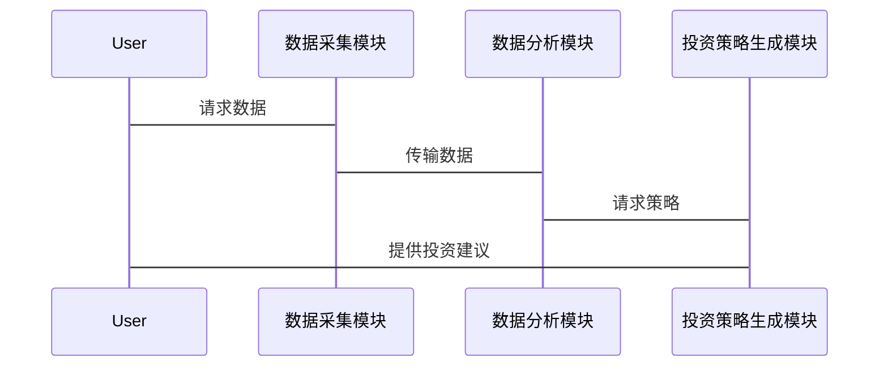

                 


```markdown
# 巴菲特的经济周期投资：数字货币政策影响下的策略调整

> 关键词：巴菲特, 经济周期, 数字货币政策, 投资策略, 系统架构

> 摘要：本文探讨了数字货币政策对经济周期的影响，以及巴菲特投资策略在这些变化中的调整。通过分析经济指标预测模型和投资组合优化算法，结合系统架构设计，展示了如何利用数字货币政策优化投资策略。文章还提供了项目实战和最佳实践，帮助读者在实际投资中应用这些策略。

---

# 第1章: 经济周期与数字货币政策概述

## 1.1 经济周期的基本概念
### 1.1.1 经济周期的定义与特征
经济周期是指经济活动在长期内的波动，通常分为衰退、复苏、繁荣和衰退四个阶段。每个阶段的特点不同，对投资的影响也不同。

### 1.1.2 经济周期的主要阶段
- 衰退：GDP下降，失业率上升。
- 复苏：经济开始恢复，企业利润回升。
- 繁荣：GDP高速增长，市场活跃。
- 衰退：经济再次放缓，市场波动。

### 1.1.3 经济周期对投资的影响
在衰退期，政府可能采取宽松货币政策，降低利率，增加货币供应。在繁荣期，政府可能加息以抑制通胀。

## 1.2 数字货币政策的定义与特点
### 1.2.1 数字货币政策的定义
数字货币政策是指通过数字化工具和平台实施的货币政策，包括数字货币的发行和管理。

### 1.2.2 数字货币政策的核心特征
- **实时性**：数字货币政策可以实时调整，响应经济变化。
- **精准性**：能够精准 targeting特定行业或群体。
- **透明性**：政策实施过程更加透明，便于公众监督。

### 1.2.3 数字货币政策与传统货币政策的区别
| 特性 | 数字货币政策 | 传统货币政策 |
|------|--------------|---------------|
| 实施速度 | 实时调整       | 延迟响应       |
| 精准度 | 高            | 较低           |
| 技术依赖 | 高            | 较低           |

## 1.3 巴菲特投资理念的背景介绍
### 1.3.1 巴菲特投资理念的核心原则
- 长期投资，价值投资。
- 寻找具有持续竞争优势的公司。
- 重视公司的财务健康状况。

### 1.3.2 巴菲特投资理念与经济周期的关系
巴菲特的投资策略在经济周期的不同阶段表现不同，他更倾向于在衰退期寻找被低估的投资标的。

### 1.3.3 巴菲特投资理念的演变
随着经济环境的变化，巴菲特的投资策略也在不断调整，尤其是在面对数字货币政策时，更加注重对宏观经济的分析。

## 1.4 本章小结
经济周期的变化对投资策略有重要影响，数字货币政策的出现为投资者提供了新的工具和策略。巴菲特的投资理念强调长期价值和宏观经济分析，这些理念在数字货币政策下需要进一步调整和优化。

---

# 第2章: 数字货币政策对经济周期的影响

## 2.1 数字货币政策的实施机制
### 2.1.1 数字货币的发行与流通
通过中央银行的数字化平台，发行数字货币并监控其流通情况。

### 2.1.2 数字货币政策的传导路径
- 数字货币的发行直接影响市场流动性。
- 利率调整影响企业和个人的借贷行为。

### 2.1.3 数字货币政策的调控目标
- 控制通货膨胀。
- 促进经济增长。
- 维护金融稳定。

## 2.2 数字货币政策对经济周期的调节作用
### 2.2.1 数字货币政策在经济衰退期的应对策略
- 增加货币供应，降低利率。
- 直接向企业和个人发放数字货币补贴。

### 2.2.2 数字货币政策在经济过热期的应对策略
- 减少货币供应，提高利率。
- 限制部分行业的信贷扩张。

### 2.2.3 数字货币政策对经济周期稳定性的影响
通过及时调整货币政策，数字货币政策能够更有效地熨平经济波动。

## 2.3 巴菲特投资策略与数字货币政策的结合
### 2.3.1 数字货币政策对巴菲特投资策略的影响
- 提供更多的市场信号。
- 改善投资决策的及时性和准确性。

### 2.3.2 巴菲特投资策略在数字货币政策下的调整
- 更加关注宏观经济指标。
- 调整投资组合的构成，以适应货币政策的变化。

### 2.3.3 巴菲特投资策略与数字货币政策的协同效应
通过利用数字货币政策提供的信息，巴菲特可以更好地识别投资机会和风险。

## 2.4 本章小结
数字货币政策能够更有效地调节经济周期，而巴菲特的投资策略需要在这些变化中灵活调整。通过结合数字货币政策的实时性和精准性，投资者可以更好地应对经济波动。

---

# 第3章: 数字货币政策下的投资策略优化

## 3.1 经济指标预测模型
### 3.1.1 经济指标预测模型的建立
- 使用GDP、失业率、通胀率等指标构建线性回归模型。

### 3.1.2 经济指标预测模型的实现
```python
import pandas as pd
import numpy as np
from sklearn.linear_model import LinearRegression

# 假设我们有GDP、失业率、通胀率等数据
data = pd.DataFrame({
    'GDP': [5, 6, 7, 8, 9],
    'Unemployment': [6, 5, 4, 3, 2],
    'Inflation': [2, 3, 4, 5, 6]
})

# 使用线性回归模型预测下一个季度的经济指标
model = LinearRegression()
model.fit(data[['GDP', 'Unemployment']], data['Inflation'])

# 预测
new_data = pd.DataFrame({
    'GDP': [10],
    'Unemployment': [1]
})
predicted_inflation = model.predict(new_data)
print(predicted_inflation)
```

### 3.1.3 经济指标预测模型的优缺点
- **优点**：简单易懂，计算速度快。
- **缺点**：可能无法捕捉复杂的经济关系。

## 3.2 投资组合优化模型
### 3.2.1 投资组合优化模型的建立
- 使用均值-方差优化模型，考虑数字货币政策下的资产回报和风险。

### 3.2.2 投资组合优化模型的实现
```python
import numpy as np

# 假设我们有资产的预期回报和协方差矩阵
returns = np.array([0.1, 0.15, 0.08])
covariance = np.array([
    [0.02, 0.01, 0.01],
    [0.01, 0.03, 0.02],
    [0.01, 0.02, 0.03]
])

# 使用均值-方差优化模型
covariance_inv = np.linalg.inv(covariance)
weights = covariance_inv.dot(np.ones(3)) / np.sum(covariance_inv.dot(np.ones(3)))

print(weights)
```

### 3.2.3 投资组合优化模型的应用
通过优化资产配置，投资者可以在数字货币政策变化下，最大化收益并最小化风险。

## 3.3 数字货币政策下的投资策略
### 3.3.1 基于经济指标的动态调整
- 定期重新评估经济指标，调整投资组合。

### 3.3.2 基于数字货币政策的资产配置
- 在经济衰退期，增加对数字货币资产的投资。
- 在经济过热期，减少对高风险资产的投资。

## 3.4 本章小结
通过建立经济指标预测模型和投资组合优化模型，投资者可以更好地应对数字货币政策下的经济周期变化，优化投资策略。

---

# 第4章: 系统分析与架构设计

## 4.1 系统功能设计
### 4.1.1 领域模型


### 4.1.2 系统功能模块
- 数据采集模块：收集经济指标和货币政策数据。
- 数据分析模块：应用模型进行预测和优化。
- 策略生成模块：生成投资策略并输出。

## 4.2 系统架构设计
### 4.2.1 系统架构


### 4.2.2 系统交互设计


## 4.3 系统实现
### 4.3.1 环境安装
- 安装Python和相关库（如Pandas、NumPy、Scikit-learn）。

### 4.3.2 核心代码实现
```python
import pandas as pd
from sklearn.linear_model import LinearRegression

# 数据预处理
data = pd.read_csv('economic_data.csv')
data.dropna(inplace=True)

# 建立模型
model = LinearRegression()
model.fit(data[['GDP', 'Unemployment']], data['Inflation'])

# 生成预测结果
predictions = model.predict(new_data)
```

### 4.3.3 案例分析
分析2020年新冠疫情对经济的影响，应用模型进行投资策略调整。

## 4.4 本章小结
通过系统设计与架构实现，投资者可以更高效地应对数字货币政策下的经济变化，优化投资策略。

---

# 第5章: 项目实战与最佳实践

## 5.1 项目实战
### 5.1.1 环境安装
- 安装必要的Python库和工具。

### 5.1.2 核心代码实现
```python
import pandas as pd
import numpy as np
from sklearn.linear_model import LinearRegression

# 数据加载与预处理
data = pd.read_csv('economic_data.csv')
data = data.dropna()

# 建立模型
model = LinearRegression()
model.fit(data[['GDP', 'Unemployment']], data['Inflation'])

# 预测未来经济指标
new_data = pd.DataFrame({
    'GDP': [预测值],
    'Unemployment': [预测值]
})
predicted_inflation = model.predict(new_data)
```

### 5.1.3 案例分析
分析某经济周期下的投资策略调整，展示如何利用模型优化投资组合。

## 5.2 最佳实践
### 5.2.1 小结
数字货币政策下的投资策略需要结合宏观经济分析和模型预测，实时调整投资组合。

### 5.2.2 注意事项
- 定期更新模型，确保数据的及时性。
- 风险管理是投资策略的重要组成部分。

### 5.2.3 拓展阅读
推荐阅读《投资学基础》和《货币政策与经济周期》等书籍，深入理解经济周期与投资策略的关系。

## 5.3 本章小结
通过项目实战和最佳实践，投资者可以更好地应用数字货币政策下的投资策略，优化投资回报。

---

# 作者

作者：AI天才研究院/AI Genius Institute & 禅与计算机程序设计艺术/Zen And The Art of Computer Programming
```

