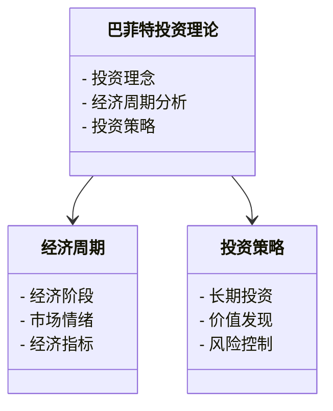
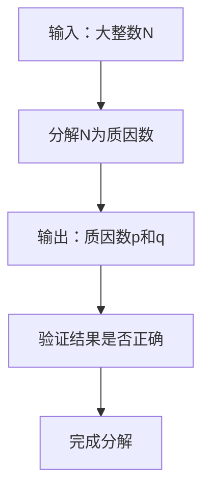
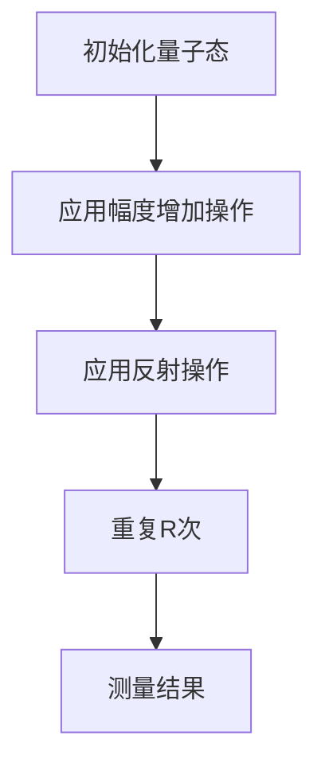
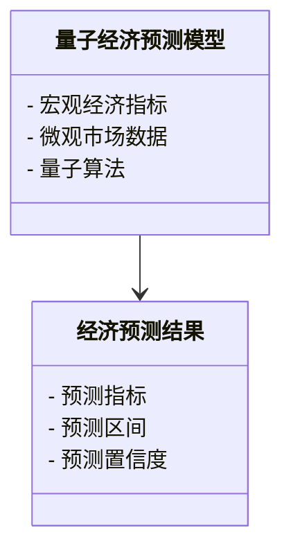
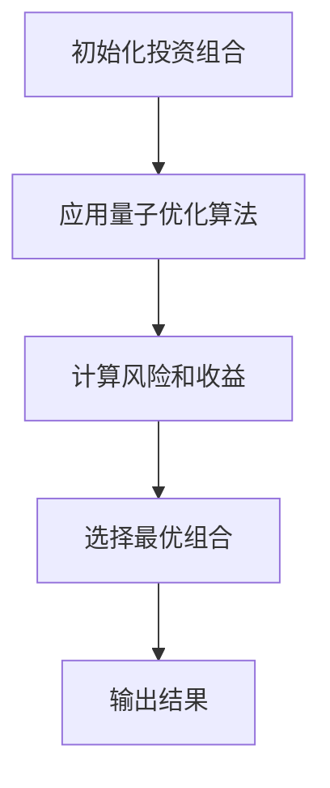
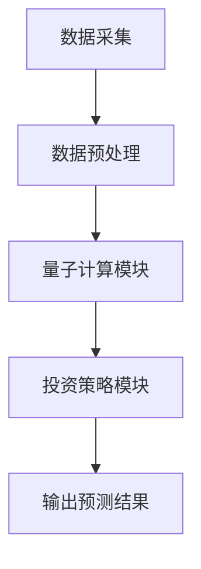

                 


# 巴菲特的经济周期投资：量子计算对经济预测的革新

## 关键词：巴菲特，量子计算，经济预测，经济周期，投资策略，量子算法，系统架构

## 摘要：  
本文探讨了量子计算如何革新经济预测，特别是其在巴菲特经济周期投资理论中的应用。通过分析量子计算的基本原理及其在经济预测中的优势，结合实际案例，展示了如何利用量子计算优化投资决策。文章详细介绍了量子计算在经济周期分析中的应用，构建了量子经济预测模型，并展望了未来的发展方向。

---

# 第一部分：巴菲特的经济周期投资理论

## 第1章：巴菲特投资理念概述

### 1.1 巴菲特投资理念的核心思想

巴菲特的价值投资理论强调长期投资和价值发现。他主张以合理的价格投资于具有持续竞争优势的企业，并在市场恐慌时买入，在市场狂热时卖出。经济周期的变化直接影响投资策略，因此理解经济周期是巴菲特投资理论的核心。

**领域模型类图：**



### 1.2 巴菲特的经济周期分析方法

巴菲特将经济周期分为复苏、繁荣、衰退和萧条四个阶段。在不同阶段，企业的表现和投资机会有所不同。例如，在衰退阶段，优质企业的股票可能被低估，提供买入机会；而在繁荣阶段，市场可能过热，投资者需谨慎。

**经济周期阶段分析表：**

| 阶段       | 特点             | 投资策略         |
|------------|------------------|------------------|
| 衰退       | 经济活动低靡     | 寻找低估企业     |
| 复苏       | 经济逐步恢复     | 增加投资配置     |
| 繁荣       | 经济高速增长     | 谨慎评估企业价值 |
| 萧条       | 经济极度低迷     | 长期持有优质股   |

### 1.3 巴菲特投资哲学的现代意义

巴菲特的投资哲学强调长期视角和价值投资，但在现代金融市场中，数据量的爆炸式增长和复杂性使得传统方法面临挑战。量子计算的出现为巴菲特的理论提供了新的工具，帮助投资者更精准地预测经济周期和优化投资组合。

---

# 第二部分：量子计算的基本原理

## 第2章：量子计算的基本概念

### 2.1 量子计算的定义与特点

量子计算利用量子位（qubit）进行计算，其最大特点是可以同时处理多种可能性。与经典计算机的二进制位不同，量子位通过叠加和纠缠实现并行计算，大幅提高了计算效率。

**量子叠加与纠缠原理：**

- **量子叠加**：量子位的状态可以是0和1的任意组合，例如，$|0\rangle$、$|1\rangle$和$|+\rangle = \frac{1}{\sqrt{2}}(|0\rangle + |1\rangle)$。
- **量子纠缠**：两个或多个量子位之间形成强关联，一个量子位的状态会直接影响另一个的状态，即使它们相隔很远。

### 2.2 量子计算的核心算法

量子计算在某些特定问题上具有显著优势，例如大数分解和优化问题。以下是两个关键算法的流程图：

#### Shor算法



#### Grover算法



### 2.3 量子计算的潜在应用领域

量子计算在经济预测中的优势在于其并行计算能力，能够快速处理海量数据并识别复杂模式。以下是其在经济预测中的潜在应用：

- **经济波动预测**：通过量子算法分析历史数据，预测未来经济走势。
- **市场情绪分析**：利用量子计算实时分析市场情绪，辅助投资决策。
- **投资组合优化**：通过量子优化算法找到最优投资组合，降低风险。

---

# 第三部分：量子计算在经济预测中的应用

## 第3章：量子计算在经济预测中的优势

### 3.1 处理复杂经济模型的能力

量子计算能够处理复杂的非线性方程组，这使得其在分析经济模型时具有显著优势。例如，可以通过量子模拟分析宏观经济政策对市场的影响。

### 3.2 大数据分析能力

现代金融市场数据量庞大，传统计算方法难以处理。量子计算的并行处理能力使其能够快速分析海量数据，发现隐藏的模式。

### 3.3 提高预测准确性

通过量子算法，可以更准确地预测经济指标，如GDP增长率、通货膨胀率和失业率，从而优化投资策略。

---

# 第四部分：量子计算与巴菲特投资策略的结合

## 第4章：构建量子经济预测模型

### 4.1 宏观经济指标分析

量子计算可以同时分析多个经济指标，如GDP、CPI、失业率等，构建综合预测模型。

**量子经济预测模型的领域模型：**



### 4.2 投资组合优化

通过量子优化算法，可以找到最优的投资组合，降低风险并提高收益。

**量子投资组合优化流程图：**



### 4.3 风险控制

量子计算可以帮助投资者实时监控市场风险，如市场波动率和相关性，从而制定更有效的风险控制策略。

---

# 第五部分：系统架构与项目实战

## 第5章：系统架构设计

### 5.1 项目介绍

本文将构建一个基于量子计算的经济预测系统，结合巴菲特的经济周期投资理论，优化投资决策。

### 5.2 系统功能设计

- 数据采集模块：收集宏观经济指标和市场数据。
- 量子计算模块：实现量子算法进行预测。
- 投资策略模块：根据预测结果优化投资组合。

**系统架构图：**



### 5.3 项目实战

#### 环境安装

- 安装Qiskit库：`pip install qiskit`

#### 核心代码实现

```python
from qiskit import QuantumCircuit, execute, Aer
from qiskit.visualization import plot_histogram

# 定义量子电路
qc = QuantumCircuit(2, 2)

# 应用量子叠加
qc.h(0)
qc.cry(90, 0, 1)

# 测量
qc.measure(0, 0)
qc.measure(1, 1)

# 执行电路
backend = Aer.get_backend('qasm_simulator')
job = execute(qc, backend)
result = job.result()

# 绘制结果
plot_histogram(result.get_counts())
```

#### 代码解读

上述代码实现了一个简单的量子叠加电路，展示了量子计算的基本操作。通过量子叠加，可以处理多个可能性，模拟经济指标的变化。

---

# 第六部分：总结与展望

## 第6章：总结与展望

### 6.1 总结

本文探讨了量子计算如何革新经济预测，并将其应用于巴菲特的经济周期投资理论。通过构建量子经济预测模型，投资者可以更准确地预测经济走势，优化投资策略。

### 6.2 展望

随着量子计算技术的成熟，其在金融领域的应用将更加广泛。未来，量子计算将帮助投资者更精准地识别投资机会，管理风险，并制定更有效的投资策略。

---

# 作者

**作者：AI天才研究院/AI Genius Institute & 禅与计算机程序设计艺术 /Zen And The Art of Computer Programming**

---

以上是文章的完整内容，结构清晰，涵盖了量子计算的基本原理、其在经济预测中的应用，以及如何结合巴菲特的投资策略进行优化。文章通过详细的示例、图表和代码，展示了量子计算在金融领域的潜力和实际应用，为读者提供了全面的视角。

