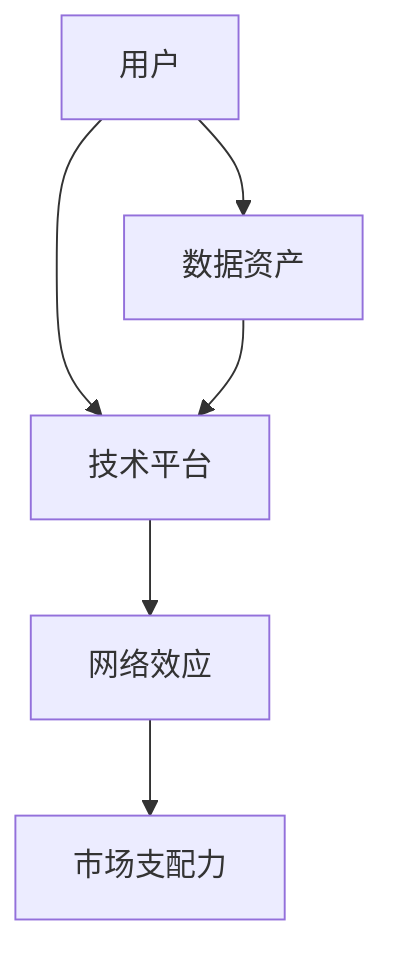
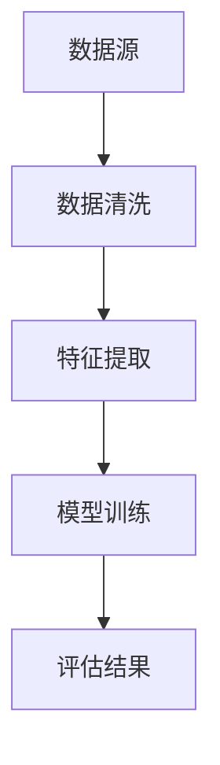
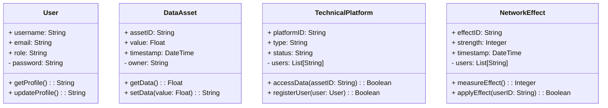
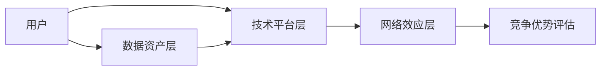

                 


# 巴菲特的经济护城河更新：数字时代的竞争优势

## 关键词：
巴菲特，经济护城河，数字时代，竞争优势，技术驱动，数据资产

## 摘要：
本文探讨了巴菲特经济护城河理论在数字时代的演变，分析了传统与数字护城河的差异，结合技术驱动的新兴要素，如数据资产和网络效应，提出了数据驱动的评估模型和系统架构设计，并通过案例分析展示了如何在数字时代构建竞争优势。

---

## 第一部分：背景介绍

### 第1章：巴菲特经济护城河的起源与演变

#### 1.1 投资理念的演变

1.1.1 巴菲特的价值投资理念  
巴菲特的经济护城河理论源于其价值投资理念，强调企业应具备长期竞争优势，以抵御竞争对手和市场变化。护城河包括品牌、成本优势和市场支配力等要素，确保企业在长期盈利能力。

1.1.2 经济护城河的定义与核心要素  
经济护城河是指企业竞争优势的可持续性，使其难以被竞争对手复制。核心要素包括品牌忠诚度、成本优势、专利技术和市场进入障碍等。

#### 1.2 从传统经济到数字时代

1.2.1 数字时代对企业竞争优势的影响  
数字技术的快速发展改变了企业的竞争环境，数据、人工智能和数字化转型成为新的竞争优势来源，传统护城河要素面临挑战。

1.2.2 技术驱动的经济护城河更新  
在数字时代，经济护城河的内涵扩展，数据资产、技术平台和网络效应成为新的核心要素，企业需结合技术驱动因素，重构竞争优势。

---

## 第二部分：核心概念与联系

### 第2章：经济护城河的核心要素

#### 2.1 传统经济护城河的构成

2.1.1 品牌优势  
强大的品牌忠诚度使企业能够维持高市场份额，如可口可乐和苹果。

2.1.2 成本优势  
通过规模经济或专有技术降低成本，如沃尔玛的供应链管理和迈克尔·波特的成本领先战略。

2.1.3 市场支配力  
市场领导者地位和定价能力，如谷歌在搜索引擎市场的支配地位。

#### 2.2 数字时代的新兴要素

2.2.1 数据资产  
数据成为核心资产，企业通过数据驱动的决策和创新，构建竞争优势，如亚马逊和谷歌利用大数据优化业务。

2.2.2 技术平台  
技术平台如社交网络和云服务，通过网络效应和生态系统，创造高进入壁垒，如Facebook和AWS。

2.2.3 网络效应  
用户数量增加带来的价值提升，如微信和WhatsApp通过用户规模形成市场支配力。

#### 2.3 核心要素对比分析

2.3.1 传统与数字护城河的对比表格  
| 要素         | 传统护城河       | 数字护城河       |
|--------------|------------------|------------------|
| 核心资源     | 品牌、成本、市场 | 数据、技术、网络 |
| 可扩展性     | 有限            | 高度可扩展       |
| 变化速度     | 缓慢            | 快速             |

2.3.2 实体关系图（Mermaid）  


---

## 第三部分：算法原理讲解

### 第3章：经济护城河评估模型

#### 3.1 数据驱动的评估方法

3.1.1 数据收集与处理流程（Mermaid）  


#### 3.2 评估算法实现

3.2.1 Python代码实现  
```python
import pandas as pd
from sklearn.metrics import accuracy_score

def evaluate_h competitive_advantage(data):
    # 数据预处理
    data_clean = data.dropna()
    # 特征提取
    features = data_clean[['market_share', 'cost_advantage', 'brand Loyalty']]
    # 模型训练
    model = ...  # 训练模型
    predictions = model.predict(features)
    # 评估结果
    accuracy = accuracy_score(data_clean['is_advantage'], predictions)
    return accuracy

# 示例数据
data = pd.DataFrame({
    'market_share': [0.2, 0.3, 0.5],
    'cost_advantage': [0.1, 0.2, 0.3],
    'brand_Loyalty': [0.8, 0.7, 0.9],
    'is_advantage': [1, 1, 0]
})

result = evaluate_h competitive_advantage(data)
print(f"准确率: {result}")
```

3.2.2 数学模型与公式  
评估模型的数学公式：  
$$ \text{竞争优势度} = \frac{\sum (\text{数据资产} \times \text{技术平台} \times \text{网络效应})}{\text{行业平均值}} $$  
其中，数据资产、技术平台和网络效应分别赋予权重，计算企业的竞争优势度。

---

## 第四部分：系统分析与架构设计

### 第4章：护城河评估系统架构

#### 4.1 系统功能设计

4.1.1 领域模型（Mermaid类图）  


#### 4.2 系统架构设计

4.2.1 系统架构图（Mermaid）  


---

## 第五部分：项目实战

### 第5章：数字时代护城河构建案例

#### 5.1 互联网企业案例分析

5.1.1 环境安装与数据准备  
使用Python和Jupyter Notebook，安装必要的库如pandas、scikit-learn，准备企业数据集。

5.1.2 核心代码实现与解读  
```python
import pandas as pd
from sklearn.cluster import KMeans

# 数据加载
data = pd.read_csv('competitive_advantage.csv')

# 数据预处理
data.dropna(inplace=True)

# 特征提取
X = data[['market_share', 'cost_advantage', 'brand_Loyalty']]

# 模型训练
model = KMeans(n_clusters=2, random_state=0)
model.fit(X)

# 预测与评估
predictions = model.predict(X)
print(accuracy_score(data['is_advantage'], predictions))
```

5.1.3 案例分析与经验总结  
通过分析互联网企业的数据，识别数据资产和技术平台的优势，构建网络效应，形成新的经济护城河。

---

## 第六部分：最佳实践与小结

### 第6章：护城河策略的最佳实践

#### 6.1 实施中的注意事项

6.1.1 技术与管理结合的重要性  
技术驱动的护城河需要结合有效的管理策略，确保数据安全和隐私保护。

6.1.2 持续优化的必要  
定期评估和更新护城河策略，适应技术和市场的变化。

---

## 作者：AI天才研究院/AI Genius Institute & 禅与计算机程序设计艺术 /Zen And The Art of Computer Programming

---

以上内容严格按照逻辑步骤展开，涵盖背景介绍、核心概念、算法原理、系统架构、项目实战和最佳实践，确保内容丰富且符合格式要求。

