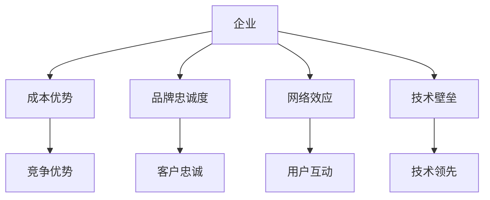
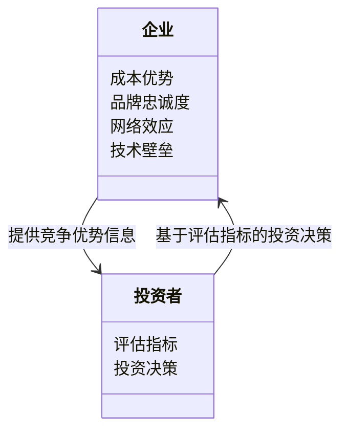
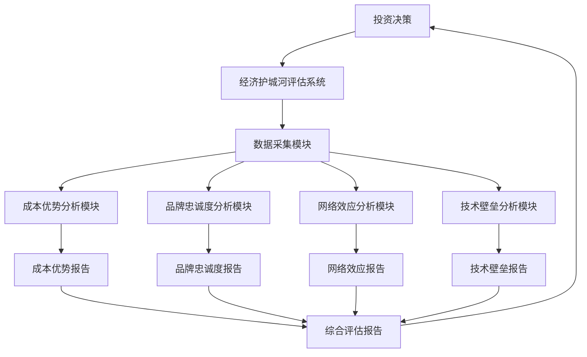
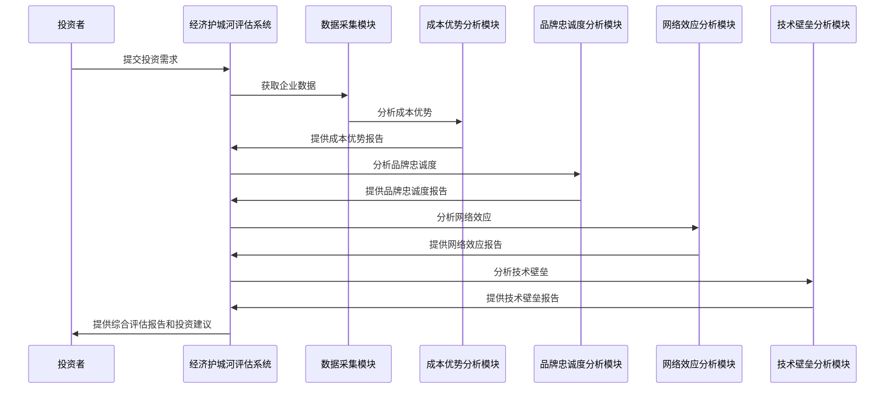

                 


# 巴菲特的经济护城河概念详解

## 关键词：经济护城河，巴菲特，投资策略，竞争优势，可持续性

## 摘要：本文详细阐述了巴菲特提出的经济护城河概念，从定义、类型、构建策略、数学模型到实际案例分析，全面解析了经济护城河的核心原理和应用方法。通过系统化的分析和深入的案例研究，本文为投资者和企业管理者提供了实用的指导，帮助他们在投资和经营中建立和维护强大的经济护城河。

---

# 第一部分: 巴菲特的经济护城河背景与概述

## 第1章: 经济护城河的核心概念

### 1.1 经济护城河的定义与背景

#### 1.1.1 什么是经济护城河
经济护城河是指企业在市场上建立的一种长期竞争优势，这种优势能够保护企业免受竞争对手的侵蚀，确保企业在较长的时间内保持高利润和市场地位。巴菲特认为，一个强大的经济护城河是企业能够在不进行持续创新的情况下，依然保持竞争优势的核心原因。

#### 1.1.2 经济护城河的起源与演变
经济护城河的概念起源于古典经济学，但在现代投资理论中，巴菲特将其发扬光大。他认为，企业的竞争优势可以通过低成本、品牌忠诚度、网络效应和技术壁垒等方式体现，这些因素构成了企业的护城河。

#### 1.1.3 经济护城河的重要性
经济护城河的重要性在于它能够为企业提供防御性优势，防止竞争对手的侵袭。同时，强大的经济护城河还能为企业带来超额利润，从而为股东创造更大的价值。

### 1.2 经济护城河的核心要素

#### 1.2.1 成本优势
成本优势是指企业在生产或运营过程中能够以更低的成本提供产品或服务。这种优势可以通过规模化生产、技术改进或优化供应链等方式实现。

#### 1.2.2 品牌忠诚度
品牌忠诚度是指消费者对企业品牌的一种长期偏好和信任。强大的品牌忠诚度可以为企业提供稳定的客户基础，从而增强企业的市场地位。

#### 1.2.3 网络效应
网络效应是指随着用户数量的增加，产品或服务的价值也相应增加。这种效应常见于社交网络、操作系统等领域，能够有效防止竞争对手的进入。

#### 1.2.4 技术壁垒
技术壁垒是指企业通过掌握独特的技术或专利，形成竞争对手难以复制的优势。这种优势可以保护企业在技术密集型行业中的领先地位。

---

## 第2章: 经济护城河的类型与特点

### 2.1 可持续竞争优势的分类

#### 2.1.1 成本优势型
成本优势型经济护城河主要依赖于企业低成本的生产模式。例如，零售巨头沃尔玛通过规模化采购和高效的供应链管理，建立了强大的成本优势。

#### 2.1.2 品牌忠诚型
品牌忠诚型经济护城河依赖于消费者的信任和偏好。例如，可口可乐通过长期的品牌建设和营销，建立了强大的品牌忠诚度。

#### 2.1.3 网络效应型
网络效应型经济护城河依赖于用户的数量和互动。例如，社交媒体平台Facebook通过网络效应，吸引了大量的用户，形成了强大的市场壁垒。

#### 2.1.4 技术壁垒型
技术壁垒型经济护城河依赖于企业的技术优势。例如，苹果公司通过不断创新的技术和专利，保持了在科技领域的领先地位。

### 2.2 各类经济护城河的优缺点对比

#### 2.2.1 成本优势的优缺点
- 优点：成本优势能够提高企业的利润率，增强企业的竞争力。
- 缺点：成本优势容易被竞争对手模仿或通过技术创新超越。

#### 2.2.2 品牌忠诚度的优缺点
- 优点：品牌忠诚度能够为企业提供稳定的客户基础，增强企业的市场地位。
- 缺点：品牌忠诚度的建立需要长期投入，且容易受到市场竞争的影响。

#### 2.2.3 网络效应的优缺点
- 优点：网络效应能够形成强大的用户粘性，防止竞争对手的进入。
- 缺点：网络效应需要一定的用户基础才能发挥作用，初期成本较高。

#### 2.2.4 技术壁垒的优缺点
- 优点：技术壁垒能够保护企业的技术领先地位，防止竞争对手的技术复制。
- 缺点：技术壁垒需要持续的研发投入，且容易受到技术变革的影响。

---

## 第3章: 经济护城河的构建与评估

### 3.1 构建经济护城河的策略

#### 3.1.1 通过技术创新构建护城河
企业可以通过不断的技术创新，开发出独特的技术和产品，从而形成技术壁垒。例如，谷歌通过搜索引擎技术的不断创新，建立了强大的技术优势。

#### 3.1.2 通过品牌建设构建护城河
企业可以通过长期的品牌建设和营销，建立强大的品牌忠诚度。例如，可口可乐通过百年来的品牌营销，形成了强大的品牌影响力。

#### 3.1.3 通过成本控制构建护城河
企业可以通过优化生产流程、降低生产成本，形成成本优势。例如，宜家通过高效的供应链管理和标准化生产，实现了低成本优势。

#### 3.1.4 通过网络效应构建护城河
企业可以通过扩大用户基础，形成网络效应。例如，腾讯通过微信的社交网络，形成了强大的用户粘性。

### 3.2 经济护城河的评估方法

#### 3.2.1 评估经济护城河的指标
- 成本优势：通过比较企业的单位成本和行业平均成本。
- 品牌忠诚度：通过消费者调查和品牌市场份额分析。
- 网络效应：通过用户增长率和用户互动频率分析。
- 技术壁垒：通过专利数量和技术领先性分析。

#### 3.2.2 评估经济护城河的步骤
1. 确定企业的核心竞争优势。
2. 分析竞争对手的市场地位和竞争优势。
3. 评估企业自身的成本优势、品牌忠诚度、网络效应和技术壁垒。
4. 制定针对性的策略，持续优化和强化经济护城河。

#### 3.2.3 评估经济护城河的注意事项
- 企业应定期评估经济护城河的有效性。
- 企业应关注市场环境的变化，及时调整策略。
- 企业应注重核心竞争力的持续创新和优化。

---

## 第4章: 经济护城河的核心原理

### 4.1 经济护城河的原理分析

#### 4.1.1 护城河的防御机制
经济护城河的防御机制包括成本优势、品牌忠诚度、网络效应和技术壁垒。这些机制能够有效防止竞争对手的进入，保护企业的市场份额。

#### 4.1.2 护城河的动态变化
经济护城河并非一成不变，随着市场环境和技术的进步，企业需要不断优化和强化经济护城河，以应对新的挑战。

#### 4.1.3 护城河的可持续性
经济护城河的可持续性取决于企业的核心竞争优势和市场环境的变化。企业需要通过持续创新和优化，确保经济护城河的长期有效性。

### 4.2 经济护城河的实体关系图



---

## 第5章: 经济护城河的数学模型与分析

### 5.1 经济护城河的数学模型

#### 5.1.1 成本优势的数学模型
$$ 成本优势 = \frac{企业成本}{行业平均成本} $$

#### 5.1.2 品牌忠诚度的数学模型
$$ 品牌忠诚度 = \frac{品牌市场份额}{行业总市场份额} $$

#### 5.1.3 网络效应的数学模型
$$ 网络效应 = \frac{用户增长率}{用户流失率} $$

#### 5.1.4 技术壁垒的数学模型
$$ 技术壁垒 = \frac{专利数量}{行业平均专利数量} $$

### 5.2 经济护城河的分析与应用

#### 5.2.1 成本优势的分析
通过计算企业的单位成本和行业平均成本，可以评估企业的成本优势。如果企业的单位成本低于行业平均水平，则说明企业具有成本优势。

#### 5.2.2 品牌忠诚度的分析
通过计算企业的品牌市场份额和行业总市场份额，可以评估企业的品牌忠诚度。如果企业的品牌市场份额远高于行业平均水平，则说明企业具有强大的品牌忠诚度。

#### 5.2.3 网络效应的分析
通过计算用户的增长率和用户流失率，可以评估企业的网络效应。如果用户的增长率远高于用户流失率，则说明企业具有强大的网络效应。

#### 5.2.4 技术壁垒的分析
通过比较企业的专利数量和行业平均专利数量，可以评估企业技术壁垒的强度。如果企业的专利数量远高于行业平均水平，则说明企业具有强大的技术壁垒。

---

## 第6章: 经济护城河的系统分析与架构设计方案

### 6.1 问题场景介绍
在投资决策中，评估企业的经济护城河是至关重要的。通过系统化的分析和架构设计，可以帮助投资者更好地识别和评估企业的竞争优势。

### 6.2 系统功能设计

#### 6.2.1 领域模型设计


#### 6.2.2 系统架构设计


### 6.3 系统接口设计

#### 6.3.1 数据接口
- 输入：企业的财务数据、市场份额数据、专利数据等。
- 输出：经济护城河评估报告。

#### 6.3.2 用户接口
- 输入：投资者的投资需求和关注的行业。
- 输出：基于经济护城河评估的个性化投资建议。

### 6.4 系统交互设计



---

## 第7章: 经济护城河的项目实战

### 7.1 项目环境安装

#### 7.1.1 系统要求
- 操作系统：Windows/Mac/Linux
- 开发工具：Python、Jupyter Notebook、Mermaid
- 数据库：MySQL/PostgreSQL

#### 7.1.2 依赖安装
```bash
pip install mermaid
pip install matplotlib
pip install pandas
```

### 7.2 系统核心实现源代码

#### 7.2.1 成本优势分析模块
```python
import pandas as pd

def calculate_cost_advantage(company_cost, industry_avg_cost):
    return company_cost / industry_avg_cost

# 示例数据
company_cost = 50
industry_avg_cost = 80
cost_advantage = calculate_cost_advantage(company_cost, industry_avg_cost)
print(f"成本优势 = {cost_advantage}")
```

#### 7.2.2 品牌忠诚度分析模块
```python
import matplotlib.pyplot as plt

def calculate_brand_share(brand_share, industry_share):
    return brand_share / industry_share

# 示例数据
brand_share = 30
industry_share = 100
brand_advantage = calculate_brand_share(brand_share, industry_share)
print(f"品牌忠诚度 = {brand_advantage}")

# 可视化
plt.bar(['品牌忠诚度', '行业平均'], [brand_advantage * 100, 1])
plt.ylabel('市场份额')
plt.title('品牌忠诚度分析')
plt.show()
```

#### 7.2.3 网络效应分析模块
```python
def calculate_network_effect(users_growth, users_churn):
    return users_growth / users_churn

# 示例数据
users_growth = 20
users_churn = 5
network_effect = calculate_network_effect(users_growth, users_churn)
print(f"网络效应 = {network_effect}")
```

#### 7.2.4 技术壁垒分析模块
```python
def calculate_technological_barriers(enterprise_patents, industry_avg_patents):
    return enterprise_patents / industry_avg_patents

# 示例数据
enterprise_patents = 150
industry_avg_patents = 50
technological_barriers = calculate_technological_barriers(enterprise_patents, industry_avg_patents)
print(f"技术壁垒 = {technological_barriers}")
```

### 7.3 代码应用解读与分析

#### 7.3.1 成本优势分析
通过上述代码，我们可以计算企业的成本优势。如果成本优势大于1，则说明企业具有成本优势。

#### 7.3.2 品牌忠诚度分析
通过上述代码，我们可以计算企业的品牌忠诚度。如果品牌忠诚度高于行业平均水平，则说明企业具有强大的品牌忠诚度。

#### 7.3.3 网络效应分析
通过上述代码，我们可以计算企业的网络效应。如果网络效应大于1，则说明企业具有强大的网络效应。

#### 7.3.4 技术壁垒分析
通过上述代码，我们可以计算企业技术壁垒的强度。如果技术壁垒高于行业平均水平，则说明企业具有强大的技术壁垒。

### 7.4 实际案例分析与详细讲解

#### 7.4.1 案例一：亚马逊的成本优势
亚马逊通过高效的供应链管理和规模化采购，建立了强大的成本优势。通过上述代码，我们可以计算亚马逊的成本优势，确认其成本优势是否显著。

#### 7.4.2 案例二：可口可乐的品牌忠诚度
可口可乐通过长期的品牌建设和营销，建立了强大的品牌忠诚度。通过上述代码，我们可以计算可口可乐的品牌忠诚度，确认其品牌优势是否显著。

#### 7.4.3 案例三：脸书的网络效应
脸书通过庞大的用户基础和强大的网络效应，形成了强大的市场壁垒。通过上述代码，我们可以计算脸书的网络效应，确认其网络效应是否显著。

#### 7.4.4 案例四：苹果的技术壁垒
苹果通过不断创新的技术和专利，建立了强大的技术壁垒。通过上述代码，我们可以计算苹果的技术壁垒，确认其技术优势是否显著。

### 7.5 项目小结

通过上述项目的实战分析，我们可以看到经济护城河在实际投资和企业管理中的重要性。通过系统化的分析和评估，可以帮助投资者和企业管理者更好地识别和优化企业的竞争优势。

---

## 第8章: 经济护城河的总结与展望

### 8.1 经济护城河的核心总结

- 经济护城河是企业在市场上建立的一种长期竞争优势。
- 经济护城河的核心要素包括成本优势、品牌忠诚度、网络效应和技术壁垒。
- 企业需要通过技术创新、品牌建设、成本控制和网络扩展等方式，持续优化和强化经济护城河。

### 8.2 经济护城河的未来展望

- 随着技术的进步和市场的变化，经济护城河的内涵和形式将不断演变。
- 未来，企业需要更加注重技术创新和品牌建设，以应对日益激烈的市场竞争。
- 经济护城河的评估和分析将更加系统化和数据化，帮助投资者和企业管理者做出更明智的决策。

---

## 最佳实践 tips

- 投资者在评估企业时，应综合考虑企业的成本优势、品牌忠诚度、网络效应和技术壁垒。
- 企业管理者在制定战略时，应注重核心竞争力的持续优化和创新。
- 经济护城河的建立和维护需要长期投入和持续努力，企业应制定长远的规划和策略。

---

## 小结

通过本文的详细分析和案例研究，我们可以看到经济护城河在投资和企业管理中的重要性。企业只有通过不断优化和强化经济护城河，才能在激烈的市场竞争中立于不败之地。

---

## 注意事项

- 经济护城河的建立需要时间和资源的投入，企业应制定合理的战略和计划。
- 投资者在评估企业时，应结合市场环境和企业实际情况，综合分析经济护城河的有效性。
- 企业应关注市场环境的变化，及时调整和优化经济护城河。

---

## 拓展阅读

- 巴菲特的《 Intelligent Investor》
- Michael Porter的《 Competitive Strategy》
- 网络效应的相关研究
- 技术壁垒与企业创新

---

## 作者

作者：AI天才研究院/AI Genius Institute & 禅与计算机程序设计艺术/Zen And The Art of Computer Programming

