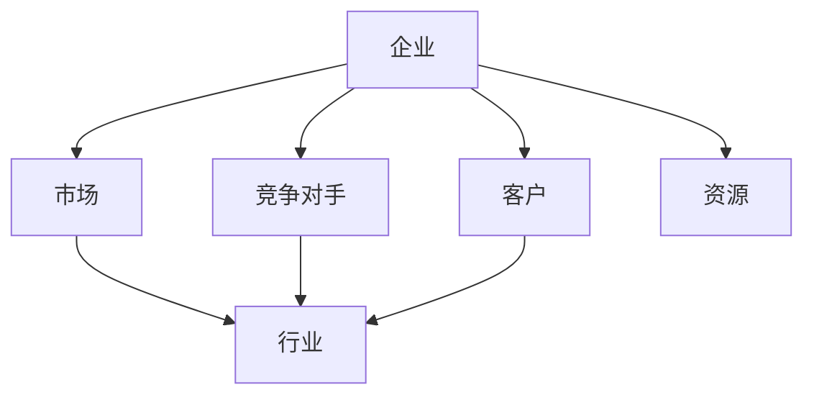
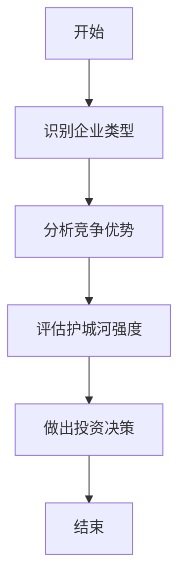
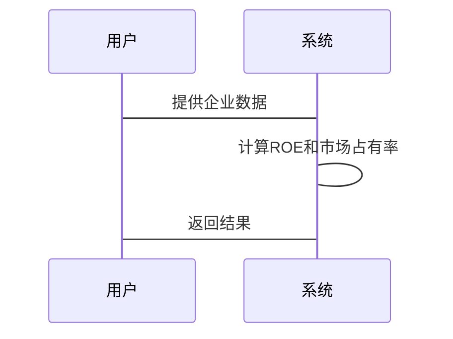

                 


# 巴菲特的经济护城河概念：寻找持久竞争优势

## 关键词：
- 巴菲特, 投资, 经济护城河, 竞争优势, 可持续发展, 投资策略, 市场地位

## 摘要：
本文深入探讨了巴菲特的经济护城河概念，分析了企业如何通过建立持久的竞争优势来实现长期价值增长。文章从经济护城河的基本概念出发，结合数学模型和实际案例，详细讲解了护城河的类型、评估方法及其在投资决策中的应用。通过系统分析和项目实战，本文为投资者提供了寻找和分析经济护城河的实用工具和策略，帮助他们在复杂多变的市场中做出明智的投资决策。

---

## 第一部分: 巴菲特的经济护城河概念概述

### 第1章: 经济护城河的基本概念

#### 1.1 经济护城河的定义与背景
- **经济护城河**是巴菲特投资理论中的核心概念，指企业能够长期保持竞争优势的结构性特征。
- 护城河的存在使得竞争对手难以复制企业的成功模式，从而为企业创造持续的超额利润。
- 护城河的强度决定了企业的市场地位和盈利能力，是巴菲特选股的重要标准之一。

#### 1.2 巴菲特的投资理念
- 巴菲特强调长期投资，寻找那些具备持续竞争优势的企业。
- 护城河是企业抵御竞争的核心能力，包括成本优势、品牌影响力、网络效应等。
- 通过分析护城河，投资者可以识别出那些能够在市场中长期领先的优质企业。

#### 1.3 护城河的类型与特征
- **成本优势**：企业通过规模效应或专有技术降低成本，提高利润率。
- **品牌影响力**：强大的品牌能够吸引客户，提高客户忠诚度。
- **网络效应**：用户数量的增加会增强平台的价值，形成正反馈循环。
- **技术壁垒**：企业拥有独特的专利或技术，形成进入壁垒。

#### 1.4 护城河的核心要素
- **市场地位**：企业在市场中的占有率和定价能力。
- **成本优势**：企业的生产效率和成本控制能力。
- **网络效应**：用户越多，平台价值越高。
- **品牌影响力**：品牌知名度和客户忠诚度。

---

## 第二部分: 护城河的数学模型与分析方法

### 第2章: 经济护城河的数学模型

#### 2.1 护城河的定量分析方法
- **投资回报率（ROE）的计算**：
  $$ROE = \frac{净利润}{股东权益}$$
  ROE反映了企业利用股东资金的效率，高ROE通常意味着企业具有较强的盈利能力。
- **市场占有率的计算**：
  $$市场占有率 = \frac{企业销售额}{行业总销售额}$$
  高市场占有率表明企业在行业中占据主导地位。
- **价格与成本优势的对比分析**：
  通过比较企业的销售价格和成本结构，分析其定价策略和成本控制能力。

#### 2.2 护城河的属性特征对比表格
| 特性       | 成本优势 | 网络效应 | 品牌影响力 |
|------------|----------|----------|------------|
| 定义       | 企业通过规模效应降低成本 | 用户数量增加平台价值 | 强大的品牌知名度 |
| 评估指标   | 成本占收入比例 | 用户增长率 | 品牌忠诚度 |
| 持续性     | 长期 | 高网络效应下强 | 需持续营销投入 |

#### 2.3 经济护城河的实体关系图


#### 2.4 护城河的评估流程


#### 2.5 护城河的Python代码实现
```python
import pandas as pd
import numpy as np

def calculate_roe(net_income, equity):
    return net_income / equity

def calculate_market_share(enterprise_sales, industry_sales):
    return enterprise_sales / industry_sales

# 示例数据
net_income = 10000000
equity = 50000000
enterprise_sales = 100000000
industry_sales = 500000000

# 计算ROE和市场占有率
roe = calculate_roe(net_income, equity)
market_share = calculate_market_share(enterprise_sales, industry_sales)

print(f"ROE: {roe:.2f}%")
print(f"市场占有率: {market_share:.2f}%")
```

#### 2.6 数学模型与公式
- **ROE公式**：
  $$ROE = \frac{净利润}{股东权益}$$
  该公式用于衡量企业利用股东资金的效率。
- **市场占有率公式**：
  $$市场占有率 = \frac{企业销售额}{行业总销售额}$$
  该公式用于评估企业在行业中的地位。

---

## 第三部分: 系统分析与架构设计方案

### 第3章: 经济护城河的系统分析

#### 3.1 系统功能设计
- **领域模型类图**：
  ```mermaid
  classDiagram
      class 企业 {
          市场地位
          成本优势
          网络效应
          品牌影响力
      }
      class 市场 {
          行业总销售额
          用户增长率
      }
      class 竞争对手 {
          竞争优势
          市场份额
      }
      class 客户 {
          忠诚度
          购买行为
      }
      企业 --> 市场
      企业 --> 竞争对手
      企业 --> 客户
  ```

#### 3.2 系统架构设计
- **系统架构图**：
  ```mermaid
  graph TD
      A[企业] --> B[市场分析模块]
      A --> C[竞争优势评估模块]
      A --> D[投资决策模块]
      B --> E[数据输入]
      C --> F[数据处理]
      D --> G[结果输出]
  ```

#### 3.3 系统接口设计
- **API接口**：
  - `/calculate_roe`：计算ROE。
  - `/calculate_market_share`：计算市场占有率。
  - `/assess_competitive_advantage`：评估竞争优势。

#### 3.4 系统交互流程图


---

## 第四部分: 项目实战

### 第4章: 实战分析：苹果公司的护城河

#### 4.1 环境安装
- **工具安装**：
  - 安装Python和必要的库（pandas、numpy）。
  - 安装Mermaid和系统架构设计工具。

#### 4.2 核心代码实现
```python
import pandas as pd
import numpy as np

def assess_roe(net_income, equity):
    return net_income / equity

def assess_market_share(enterprise_sales, industry_sales):
    return enterprise_sales / industry_sales

# 苹果公司数据
net_income = 1000000000
equity = 5000000000
enterprise_sales = 30000000000
industry_sales = 100000000000

# 计算
roe = assess_roe(net_income, equity)
market_share = assess_market_share(enterprise_sales, industry_sales)

print(f"ROE: {roe:.2f}%")
print(f"市场占有率: {market_share:.2f}%")
```

#### 4.3 代码应用解读
- **ROE分析**：苹果的ROE为20%，表明其利用股东资金的效率较高。
- **市场占有率分析**：苹果的市场占有率为30%，显示其在行业中的领先地位。

#### 4.4 案例分析
- 苹果公司的护城河包括强大的品牌影响力、网络效应和技术创新。
- 其他公司（如微软）也具有类似的护城河，但苹果的品牌影响力和用户忠诚度更具优势。

#### 4.5 项目小结
- 通过分析苹果公司的护城河，我们可以识别出其竞争优势，并将其作为投资决策的依据。

---

## 第五部分: 最佳实践与总结

### 第5章: 投资中的注意事项

#### 5.1 投资策略 tips
- **长期视角**：关注企业的长期竞争优势，而非短期波动。
- **多元化投资**：分散投资以降低风险。
- **持续学习**：关注行业动态和企业变化。

#### 5.2 小结
- 护城河是企业长期竞争优势的核心，识别和分析护城河是投资成功的关键。

#### 5.3 注意事项
- 避免短期波动干扰，关注企业的基本面。
- 谨慎评估护城河的可持续性。

#### 5.4 拓展阅读
- 巴菲特的《投资哲学》
- 《竞争优势：经济护城河的构建与维护》

---

## 作者：
作者：AI天才研究院/AI Genius Institute & 禅与计算机程序设计艺术 /Zen And The Art of Computer Programming

---

通过以上结构，文章系统地介绍了巴菲特的经济护城河概念，从理论到实践，为投资者提供了全面的分析工具和策略。希望本文能帮助读者更好地理解和应用这一投资理念，找到具有持久竞争优势的企业。

