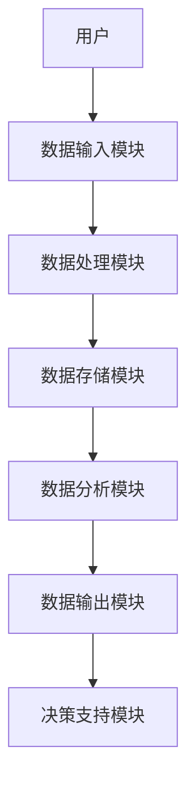
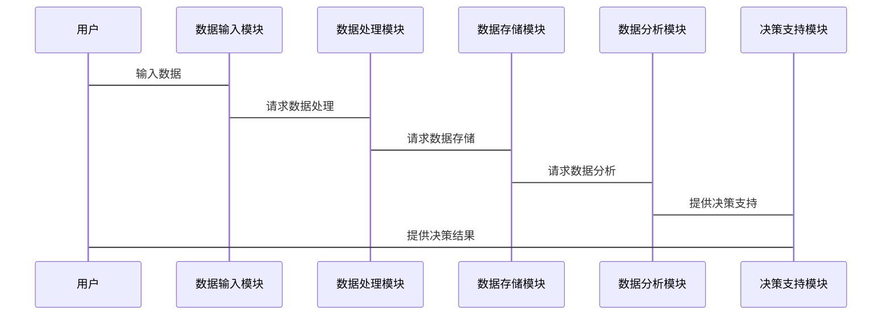

                 


# 巴菲特的经济护城河理论：数据主权时代的竞争优势

> 关键词：巴菲特、经济护城河、数据主权、竞争优势、企业战略、数据安全、技术壁垒

> 摘要：本文深入探讨巴菲特的经济护城河理论在数据主权时代的应用，分析数据主权如何成为企业构建竞争优势的核心要素。通过结合理论与实践，本文详细阐述了数据主权对企业战略的影响，以及如何利用数据主权构建可持续的经济护城河。

---

## 第一部分: 巴菲特的经济护城河理论

### 第1章: 经济护城河理论的背景与核心概念

#### 1.1 经济护城河的定义与起源

##### 1.1.1 经济护城河的定义
经济护城河是指企业在市场上形成的持久竞争优势，使其能够抵御竞争对手的侵蚀并保持长期的超额收益。这种优势通常来源于独特的资源、技术壁垒、品牌价值或成本优势。

##### 1.1.2 巴菲特对经济护城河的贡献
巴菲特在投资实践中强调，企业能否长期创造价值取决于其是否具备坚固的经济护城河。他将经济护城河视为企业长期竞争优势的核心，并通过分析护城河的深度和可持续性来评估企业的投资价值。

##### 1.1.3 经济护城河的核心要素
- **独特的资源**：企业拥有竞争对手无法复制的核心资源。
- **技术壁垒**：通过专利、技术领先性形成竞争障碍。
- **品牌价值**：强大的品牌影响力吸引客户并形成客户忠诚度。
- **成本优势**：通过规模效应或流程优化降低生产成本。

#### 1.2 经济护城河的类型与特点

##### 1.2.1 可持续的竞争优势
经济护城河的可持续性取决于其是否能够长期抵御竞争压力。例如，技术壁垒可以通过持续创新和技术更新来维持其有效性。

##### 1.2.2 品牌价值与客户忠诚度
强大的品牌价值能够吸引并留住客户，形成客户忠诚度，从而在竞争中占据优势。

##### 1.2.3 技术壁垒与专利优势
通过专利和技术领先性，企业能够阻止竞争对手进入市场，从而保持竞争优势。

##### 1.2.4 成本优势与规模效应
通过规模效应和成本优化，企业能够降低单位成本，从而在价格竞争中占据优势。

#### 1.3 经济护城河的边界与外延

##### 1.3.1 护城河的边界定义
经济护城河的边界是指企业竞争优势的范围和限制。例如，技术壁垒可能仅限于特定领域，而品牌价值可能局限于特定市场。

##### 1.3.2 护城河的外延与扩展
随着市场环境的变化，经济护城河需要不断扩展和调整。例如，企业可以通过技术创新、市场扩展或多元化战略来增强其护城河。

##### 1.3.3 护城河与企业生命周期的关系
经济护城河的有效性与企业生命周期密切相关。在企业成长阶段，护城河需要不断强化；在成熟阶段，护城河需要通过创新和优化来维持其有效性。

---

### 第2章: 数据主权时代的背景与挑战

#### 2.1 数据主权的定义与内涵

##### 2.1.1 数据主权的概念
数据主权是指数据的拥有者对数据的控制权和使用权，包括数据的存储、传输和处理等方面。数据主权的核心在于企业对数据的自主掌控，以及对数据安全和隐私的保护。

##### 2.1.2 数据主权的核心要素
- **数据控制权**：企业对数据的拥有权和管理权。
- **数据安全性**：通过技术手段保护数据不被未经授权的访问或泄露。
- **数据隐私**：确保数据的使用符合相关法律法规和用户隐私保护要求。

##### 2.1.3 数据主权的法律框架
数据主权的实现需要依靠法律法规的支持。例如，《通用数据保护条例》（GDPR）等法律法规为企业提供了数据保护的法律依据。

#### 2.2 数据主权时代的企业竞争优势

##### 2.2.1 数据作为核心资产
在数据主权时代，数据已成为企业最重要的资产之一。企业通过对数据的分析和利用，能够创造新的价值和竞争优势。

##### 2.2.2 数据主权对企业战略的影响
数据主权的实现需要企业在战略层面进行规划，包括数据的收集、存储、分析和利用等方面。数据主权战略的制定和实施能够为企业提供持续的竞争优势。

##### 2.2.3 数据主权时代的竞争特点
在数据主权时代，企业的竞争优势不再仅仅依赖于传统资源，而是更多地依赖于数据的控制和利用能力。数据主权成为企业构建经济护城河的重要组成部分。

#### 2.3 数据主权与经济护城河的结合

##### 2.3.1 数据主权是经济护城河的基础
数据主权为企业提供了竞争优势的核心资源，即数据的控制和利用能力。通过数据主权，企业能够构建强大的技术壁垒和品牌价值。

##### 2.3.2 经济护城河是数据主权的保障
经济护城河通过技术壁垒、成本优势和品牌价值等手段，为企业数据主权的实现提供了保障。强大的经济护城河能够有效防止竞争对手对数据的侵蚀。

##### 2.3.3 数据主权时代护城河的新特征
在数据主权时代，经济护城河的特征发生了变化。数据主权成为护城河的核心要素，企业需要通过数据的控制和利用能力来构建和维护护城河。

---

### 第3章: 数据主权时代经济护城河的核心概念

#### 3.1 数据主权与经济护城河的关系

##### 3.1.1 数据主权是经济护城河的基础
数据主权为企业提供了竞争优势的核心资源，即数据的控制和利用能力。通过数据主权，企业能够构建强大的技术壁垒和品牌价值。

##### 3.1.2 经济护城河是数据主权的保障
经济护城河通过技术壁垒、成本优势和品牌价值等手段，为企业数据主权的实现提供了保障。强大的经济护城河能够有效防止竞争对手对数据的侵蚀。

##### 3.1.3 数据主权与经济护城河的相互作用
数据主权和经济护城河之间存在相互作用关系。数据主权为企业提供竞争优势的核心资源，而经济护城河则通过技术壁垒、成本优势和品牌价值等手段，为企业数据主权的实现提供了保障。

#### 3.2 核心概念原理

##### 3.2.1 数据主权的法律与技术双重属性
数据主权不仅涉及法律层面的保护，还需要技术手段来实现数据的安全和隐私保护。

##### 3.2.2 经济护城河的可持续性与可扩展性
经济护城河的可持续性取决于其是否能够长期抵御竞争压力，而可扩展性则决定了其能否适应市场环境的变化。

##### 3.2.3 数据主权时代经济护城河的动态性
在数据主权时代，经济护城河需要不断动态调整，以适应数据技术的快速发展和市场竞争的变化。

#### 3.3 核心概念属性对比表格

| 属性         | 数据主权                     | 经济护城河                   |
|--------------|------------------------------|------------------------------|
| 定义         | 数据的控制权与使用权         | 企业的竞争优势与防御能力     |
| 核心要素     | 数据控制权、安全性、隐私     | 技术壁垒、品牌价值、成本优势 |
| 实现手段     | 数据加密、区块链技术         | 专利、品牌建设、规模效应       |
| 战略意义     | 企业核心竞争力               | 长期竞争优势与防御能力       |

---

## 第四部分: 数据主权时代经济护城河的技术实现

### 第4章: 数据主权与经济护城河的技术实现

#### 4.1 数据主权的技术实现

##### 4.1.1 数据加密技术
数据加密是保护数据主权的重要手段。通过加密技术，企业可以确保数据在传输和存储过程中的安全性。

##### 4.1.2 区块链技术
区块链技术通过去中心化和不可篡改的特性，为数据主权提供了新的实现方式。企业可以通过区块链技术实现数据的分布式存储和管理。

##### 4.1.3 数据访问控制
数据访问控制是通过技术手段限制未经授权的用户对数据的访问，从而保护数据主权。

#### 4.2 经济护城河的技术实现

##### 4.2.1 技术壁垒的构建
企业可以通过技术创新和专利申请，构建技术壁垒，防止竞争对手进入市场。

##### 4.2.2 品牌价值的提升
通过品牌建设，企业可以增强客户忠诚度，形成品牌价值，从而在竞争中占据优势。

##### 4.2.3 成本优势的实现
通过规模效应和流程优化，企业可以降低生产成本，从而在价格竞争中占据优势。

#### 4.3 数据主权与经济护城河的协同发展

##### 4.3.1 数据主权与技术壁垒的结合
通过数据主权的技术实现，企业可以构建强大的技术壁垒，从而在竞争中占据优势。

##### 4.3.2 数据主权与品牌价值的结合
通过数据主权的实现，企业可以提升品牌价值，增强客户忠诚度，从而在竞争中占据优势。

##### 4.3.3 数据主权与成本优势的结合
通过数据主权的实现，企业可以优化成本结构，降低生产成本，从而在价格竞争中占据优势。

---

## 第五部分: 数据主权时代经济护城河的系统分析与架构设计

### 第5章: 系统分析与架构设计方案

#### 5.1 项目背景与目标

##### 5.1.1 项目背景
在数据主权时代，企业需要通过技术手段实现数据的控制和利用，构建强大的经济护城河。

##### 5.1.2 项目目标
通过技术实现，构建数据主权为核心的企业竞争优势，实现数据的控制和利用，形成强大的经济护城河。

#### 5.2 系统功能设计

##### 5.2.1 数据主权实现模块
- 数据加密与解密
- 数据访问控制
- 数据隐私保护

##### 5.2.2 经济护城河构建模块
- 技术壁垒建设
- 品牌价值提升
- 成本优势优化

##### 5.2.3 数据分析与利用模块
- 数据收集与处理
- 数据分析与挖掘
- 数据驱动的决策支持

#### 5.3 系统架构设计

##### 5.3.1 系统架构图


##### 5.3.2 系统接口设计
- 数据输入接口：用户输入数据
- 数据处理接口：数据清洗和预处理
- 数据存储接口：数据存储和管理
- 数据分析接口：数据分析与挖掘
- 数据输出接口：数据可视化和决策支持

#### 5.4 系统交互设计

##### 5.4.1 交互流程图


---

## 第六部分: 数据主权时代经济护城河的项目实战

### 第6章: 项目实战与案例分析

#### 6.1 环境安装与配置

##### 6.1.1 数据加密技术
安装并配置数据加密工具，例如使用AES加密算法对数据进行加密。

##### 6.1.2 区块链技术
安装并配置区块链节点，例如使用以太坊进行数据的分布式存储和管理。

##### 6.1.3 数据访问控制
配置数据访问控制策略，例如使用RBAC（基于角色的访问控制）模型。

#### 6.2 核心代码实现

##### 6.2.1 数据加密代码
```python
import hashlib

def encrypt_data(data):
    return hashlib.sha256(data.encode()).hexdigest()
```

##### 6.2.2 区块链数据存储
```python
from blockchain import Block
import datetime

def create_block(previous_block_hash, data):
    block = Block(datetime.datetime.now(), previous_block_hash, data)
    return block
```

##### 6.2.3 数据访问控制
```python
from flask import Flask
from flask_restful import Resource, Api

app = Flask(__name__)
api = Api(app)

class DataResource(Resource):
    def get(self):
        return {"status": "success", "message": "Data accessed successfully"}

api.add_resource(DataResource, '/data')

if __name__ == '__main__':
    app.run(debug=True)
```

#### 6.3 实际案例分析

##### 6.3.1 数据主权实现案例
通过数据加密和区块链技术，实现企业数据的自主控制和管理。

##### 6.3.2 经济护城河构建案例
通过技术壁垒和品牌价值的提升，构建强大的经济护城河，抵御竞争对手的侵蚀。

##### 6.3.3 数据分析与利用案例
通过数据分析技术，挖掘数据价值，支持企业决策，实现数据驱动的竞争优势。

#### 6.4 项目小结

##### 6.4.1 项目成果
通过项目实战，企业能够实现数据的自主控制和管理，构建强大的经济护城河，抵御市场竞争压力。

##### 6.4.2 项目经验
数据主权的实现需要结合法律和技术手段，经济护城河的构建需要综合考虑技术壁垒、品牌价值和成本优势。

##### 6.4.3 项目总结
数据主权时代，企业需要通过技术创新和战略规划，构建强大的经济护城河，实现长期的竞争优势。

---

## 第七部分: 数据主权时代经济护城河的最佳实践

### 第7章: 最佳实践、小结与展望

#### 7.1 最佳实践

##### 7.1.1 数据主权的实现
企业应通过数据加密、区块链技术和数据访问控制等手段，实现数据的自主控制和管理。

##### 7.1.2 经济护城河的构建
企业应通过技术创新、品牌建设和成本优化，构建强大的经济护城河，抵御市场竞争压力。

##### 7.1.3 数据分析与利用
企业应通过数据分析技术，挖掘数据价值，支持企业决策，实现数据驱动的竞争优势。

#### 7.2 项目小结

##### 7.2.1 项目成果
通过项目实战，企业能够实现数据的自主控制和管理，构建强大的经济护城河，抵御市场竞争压力。

##### 7.2.2 项目经验
数据主权的实现需要结合法律和技术手段，经济护城河的构建需要综合考虑技术壁垒、品牌价值和成本优势。

##### 7.2.3 项目总结
数据主权时代，企业需要通过技术创新和战略规划，构建强大的经济护城河，实现长期的竞争优势。

#### 7.3 未来展望

##### 7.3.1 数据主权的未来发展
随着数据技术的不断发展，数据主权的实现将更加依赖于技术创新和法律完善。

##### 7.3.2 经济护城河的未来发展
经济护城河的构建将更加注重数据主权的实现，企业需要通过技术创新和战略调整，构建更加坚固的经济护城河。

##### 7.3.3 数据主权与经济护城河的协同发展
数据主权与经济护城河的协同发展将成为企业竞争的核心，企业需要通过技术创新和战略规划，实现数据主权与经济护城河的协同发展。

---

## 作者：AI天才研究院/AI Genius Institute & 禅与计算机程序设计艺术 /Zen And The Art of Computer Programming

