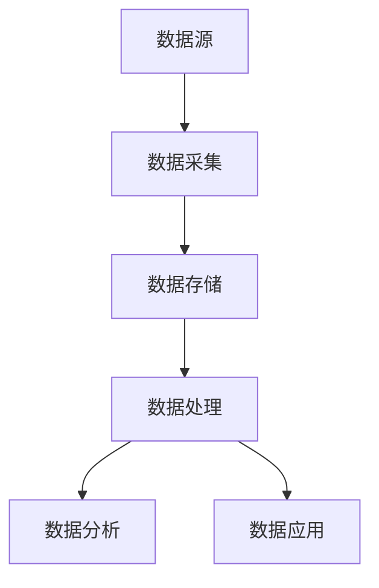
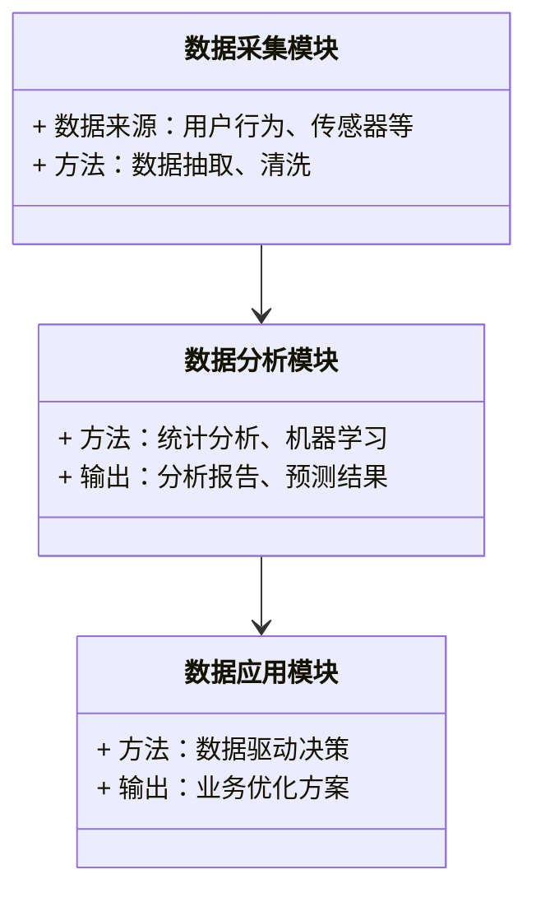
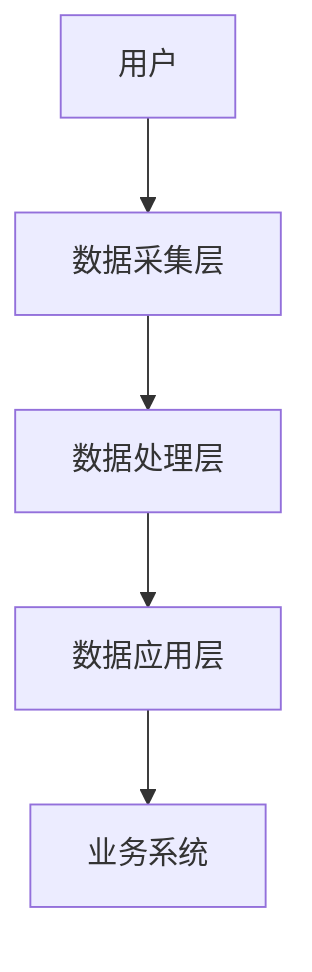

                 


# 巴菲特的经济护城河理论：数据经济时代的竞争优势

## 关键词：
- 巴菲特经济护城河
- 数据经济
- 竞争优势
- 数据安全
- 企业战略

## 摘要：
在数据经济时代，企业的竞争优势不再仅仅依赖于传统的资源和成本优势，而是更多地依赖于数据的收集、分析和应用能力。本文将深入探讨巴菲特的经济护城河理论在数据经济中的应用，分析如何通过数据构建新的竞争优势，保持企业的长期繁荣。文章结合理论与实际案例，详细讲解了数据作为核心资产的重要性，以及如何在数据驱动的环境中构建和维护经济护城河。

---

## 第一部分：经济护城河理论概述

### 第1章：经济护城河的核心概念

#### 1.1 经济护城河的定义与背景
- 经济护城河是指企业通过构建难以被竞争对手复制的竞争优势，从而在市场中占据长期优势地位。
- 巴菲特的护城河理论强调企业应具备可持续的竞争优势，如品牌忠诚度、成本优势、资源垄断和技术壁垒。
- 在数据经济时代，数据成为最重要的生产要素，企业需要通过数据的收集、分析和应用能力构建新的护城河。

#### 1.2 护城河的类型与特征
| 护城河类型 | 特征 | 示例 |
|------------|------|------|
| 成本优势   | 低成本生产模式 | 制造业企业的规模效应 |
| 资源优势   | 数据资源的垄断性 | 数据平台企业的用户数据 |
| 品牌优势   | 品牌忠诚度       | 消费品牌企业的客户黏性 |
| 技术优势   | 技术创新与专利   | 科技企业的研发能力 |

#### 1.3 护城河的构建与维护
- 数据驱动的护城河构建：通过数据的收集、分析和应用，形成独特的数据资产。
- 技术创新与数据整合：利用人工智能和大数据技术，提升数据分析能力，增强竞争优势。
- 企业生态系统：构建一个涵盖数据、技术、品牌和资源的生态系统，形成多层次的护城河。

---

## 第二部分：数据经济时代的竞争优势

### 第2章：数据作为核心资产

#### 2.1 数据的采集、存储与处理
- 数据的采集：通过各种渠道（如传感器、用户行为数据）收集数据。
- 数据的存储：使用分布式存储系统（如Hadoop、云存储）进行数据存储。
- 数据的处理：通过ETL（数据抽取、转换、加载）流程对数据进行清洗和预处理。



#### 2.2 数据的分析与价值挖掘
- 数据分析方法：使用统计分析、机器学习和深度学习等技术对数据进行分析。
- 数据价值挖掘：通过数据分析发现市场趋势、用户行为和潜在机会。

```python
import pandas as pd
from sklearn.cluster import KMeans

# 示例数据：用户行为数据
data = pd.DataFrame({
    '用户ID': [1, 2, 3, 4, 5],
    '购买频率': [3, 2, 5, 1, 4],
    '购买金额': [100, 80, 150, 50, 200]
})

# 使用K-means算法进行聚类分析
model = KMeans(n_clusters=2, random_state=0)
model.fit(data[['购买频率', '购买金额']])
print(model.labels_)
```

#### 2.3 数据驱动的决策优势
- 数据驱动的决策：通过数据分析结果制定企业战略和运营决策。
- 数据驱动的创新：利用数据发现新的市场机会和商业模式。

---

### 第3章：数据安全与隐私保护

#### 3.1 数据安全的重要性
- 数据泄露的风险：数据泄露可能导致企业声誉受损和经济损失。
- 数据安全的技术保障：使用加密技术、防火墙和入侵检测系统保护数据安全。

#### 3.2 数据隐私的法律框架
- 数据隐私的合规要求：遵守《通用数据保护条例》（GDPR）等数据隐私法规。
- 数据隐私保护措施：通过匿名化、脱敏等技术保护用户隐私。

#### 3.3 数据安全的最佳实践
- 定期进行安全演练：模拟攻击场景，测试系统的安全性。
- 建立安全监控系统：实时监控数据访问和操作，发现异常及时响应。

---

## 第三部分：系统分析与架构设计方案

### 第4章：系统架构设计

#### 4.1 问题场景介绍
- 企业需要构建一个数据驱动的护城河，通过数据分析提升市场竞争力。

#### 4.2 系统功能设计
- 数据采集模块：负责数据的采集和预处理。
- 数据分析模块：对数据进行建模和分析，发现市场趋势和用户行为。
- 数据应用模块：将分析结果应用于业务决策和产品优化。



#### 4.3 系统架构设计
- 分层架构：数据采集层、数据处理层、数据应用层。
- 微服务架构：每个功能模块独立开发和部署。



---

## 第四部分：项目实战

### 第5章：项目实战与案例分析

#### 5.1 环境安装
- 数据处理工具：安装Python、Pandas、NumPy。
- 数据分析框架：安装Scikit-learn、TensorFlow。

#### 5.2 核心代码实现
```python
import pandas as pd
from sklearn.tree import DecisionTreeClassifier

# 示例数据：用户购买记录
data = pd.DataFrame({
    '用户ID': [1, 2, 3, 4, 5],
    '产品类别': ['A', 'B', 'A', 'C', 'B'],
    '购买次数': [2, 3, 4, 1, 2]
})

# 使用决策树模型进行分类
model = DecisionTreeClassifier()
model.fit(data[['购买次数', '产品类别']], data['用户ID'])
print(model.predict([[3, 'B']]))
```

#### 5.3 案例分析
- 某电商平台通过数据分析优化推荐算法，提升了用户购买转化率。

---

## 第五部分：总结与展望

### 第6章：总结与最佳实践

#### 6.1 最佳实践 tips
- 数据安全：定期进行安全演练，建立安全监控系统。
- 持续优化：根据市场变化和技术进步，不断优化数据分析模型。

#### 6.2 小结
在数据经济时代，企业需要通过数据的收集、分析和应用能力构建新的护城河，保持竞争优势。

#### 6.3 注意事项
- 数据隐私：遵守相关法律法规，保护用户隐私。
- 技术过时：随着技术的发展，及时更新数据分析方法和工具。

#### 6.4 拓展阅读
- 《数据驱动的决策》
- 《人工智能与大数据》
- 《巴菲特的护城河》

---

## 附录

### A. 术语表
- 经济护城河：企业通过构建难以被竞争对手复制的竞争优势。
- 数据经济：以数据为生产要素的经济形态。
- 机器学习：一种人工智能技术，用于数据建模和预测。

### B. 参考文献
1. 巴菲特投资思想的现代启示录
2. 数据驱动的企业战略
3. 人工智能与大数据分析

### C. 索引
- 数据采集
- 数据分析
- 数据安全

---

## 作者
作者：AI天才研究院 & 禅与计算机程序设计艺术

