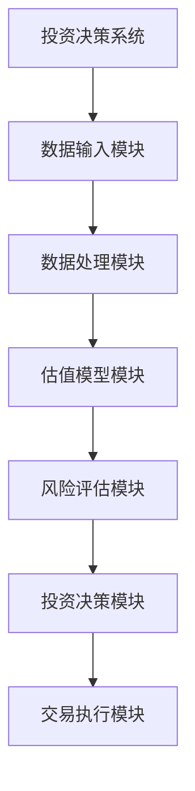
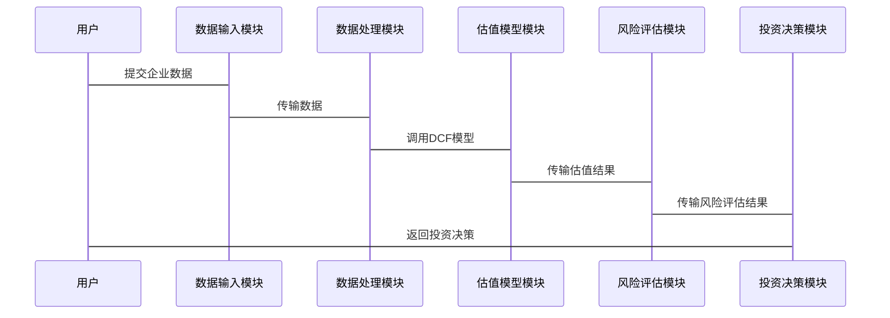

                 


# 巴菲特的耐心投资：等待合适的机会

> 关键词：巴菲特投资理念、价值投资、耐心等待、企业估值、安全边际、风险管理、投资心态

> 摘要：本文深入探讨了巴菲特的投资理念，从其价值投资的核心思想到选股方法、估值模型，再到风险管理策略，结合实际案例分析，帮助读者全面理解巴菲特的耐心投资策略。文章详细讲解了巴菲特的投资心态、安全边际概念，以及如何在市场波动中保持长期投资纪律。

---

# 第一部分: 巴菲特投资理念基础

## 第1章: 巴菲特投资理念概述

### 1.1 巴菲特投资哲学

#### 1.1.1 价值投资的定义与核心理念
价值投资是一种以企业内在价值为核心的投资方法，强调购买价格低于内在价值的股票。巴菲特的价值投资理念强调企业基本面分析、长期持有和安全边际。其核心思想是：市场先生是你的仆人，而不是你的老师。

#### 1.1.2 巴菲特的投资风格与特点
巴菲特的投资风格以长期持有、价值导向和安全性著称。他倾向于投资那些具有持续竞争优势、良好管理和稳定现金流的企业。他的投资策略强调分散风险，集中投资于少数优质企业。

#### 1.1.3 巴菲特投资理念的核心要素
- **企业内在价值**：企业的实际价值，与市场波动无关。
- **安全边际**：购买价格低于内在价值，以降低投资风险。
- **长期持有**：长期投资，避免频繁交易。
- **竞争优势**：投资具有持续竞争优势的企业。

### 1.2 巴菲特的投资策略

#### 1.2.1 长期投资与价值发现
巴菲特认为，投资的本质是寻找具有持续盈利能力和竞争优势的企业，而非短期价格波动。他强调长期投资，通过持有优质股票实现财富增长。

#### 1.2.2 股票与市场的周期性
市场具有周期性波动，巴菲特在市场低迷时寻找低估股票，在市场高估时卖出部分仓位。他强调逆向投资，即在市场恐慌时买入，在市场狂热时卖出。

#### 1.2.3 巴菲特的选股标准
- **财务健康**：低负债率、高ROE（净资产收益率）。
- **竞争优势**：企业具有独特的竞争优势，如品牌、技术或成本优势。
- **管理团队**：管理层诚实、有能力，注重股东利益。

---

## 第2章: 巴菲特的价值投资理论

### 2.1 价值投资的基本原理

#### 2.1.1 价值投资的定义与特点
价值投资是一种以企业内在价值为核心的投资方法，强调购买价格低于内在价值的股票。其特点是长期持有、注重基本面分析和安全边际。

#### 2.1.2 价值投资的核心要素
- **内在价值**：企业未来现金流的现值，通过DCF（现金流量折现模型）计算。
- **安全边际**：购买价格低于内在价值，以降低投资风险。
- **市场波动**：市场短期波动不影响长期投资价值。

#### 2.1.3 价值投资与市场波动的关系
市场波动为价值投资者提供了廉价买入优质资产的机会。巴菲特强调在市场恐慌时买入低估股票，在市场高估时卖出。

### 2.2 巴菲特的价值投资方法

#### 2.2.1 财务报表分析与企业估值
财务报表分析是价值投资的核心，巴菲特通过分析企业的盈利能力、财务状况和现金流来评估其内在价值。

- **盈利能力分析**：关注ROE（净资产收益率）、净利润率和毛利率。
- **资产负债表分析**：关注资产结构、负债水平和现金流状况。
- **现金流量表分析**：关注经营活动现金流，反映企业实际盈利情况。

#### 2.2.2 企业内在价值的计算公式
企业内在价值可以通过DCF模型计算，公式为：

$$
\text{内在价值} = \sum_{t=1}^{n} \frac{\text{现金流}_t}{(1 + r)^t} + \frac{\text{残值}}{(1 + r)^n}
$$

其中，r为折现率，n为永续年限。

#### 2.2.3 安全边际的概念与应用
安全边际=内在价值 - 购买价格，确保购买价格低于内在价值，降低投资风险。

---

## 第3章: 巴菲特的投资心态与耐心

### 3.1 投资心态的培养

#### 3.1.1 耐心的重要性
耐心是价值投资的核心，巴菲特强调在市场波动中保持冷静，避免情绪化投资。

#### 3.1.2 如何避免情绪化投资
- **制定投资计划**：明确投资目标和策略，避免随意交易。
- **长期视角**：关注企业的长期价值，忽略短期波动。
- **分散投资**：通过分散投资降低风险，避免过度集中。

#### 3.1.3 投资纪律与耐心
巴菲特强调投资纪律，坚持长期持有优质股票，避免频繁交易。

### 3.2 巴菲特的等待艺术

#### 3.2.1 等待合适机会的策略
- **寻找低估股票**：在市场低迷时寻找低估股票。
- **关注优质企业**：长期关注具有竞争优势的企业，等待合适买入时机。
- **避免盲目跟风**：在市场狂热时保持冷静，避免盲目跟风。

#### 3.2.2 市场波动中的耐心等待
市场波动为价值投资者提供了廉价买入机会，巴菲特别强调在市场恐慌时买入，在市场高估时卖出。

#### 3.2.3 长期投资与短期波动的平衡
长期投资与短期波动的平衡需要耐心和纪律，巴菲特别强调在市场波动中保持冷静，坚持长期投资策略。

---

# 第二部分: 巴菲特选股方法与分析

## 第4章: 巴菲特的选股标准

### 4.1 财务报表分析

#### 4.1.1 赢利能力分析
- **ROE（净资产收益率）**：衡量企业盈利能力的重要指标。
- **净利润率**：净利润与营业收入的比率，反映企业的盈利效率。
- **毛利率**：衡量企业核心业务的盈利能力。

#### 4.1.2 资产负债表分析
- **资产负债率**：衡量企业财务杠杆的风险。
- **流动比率**：衡量企业的短期偿债能力。
- **速动比率**：衡量企业的快速偿债能力。

#### 4.1.3 现金流量表分析
- **经营活动现金流**：反映企业实际盈利情况。
- **投资活动现金流**：反映企业的投资活动，如购买或出售资产。
- **筹资活动现金流**：反映企业的融资活动，如发行债券或回购股票。

### 4.2 企业内在价值评估

#### 4.2.1 企业价值的定义
企业价值是指企业未来现金流的现值，包括企业所有资产和业务的未来现金流。

#### 4.2.2 股东权益与盈利能力
股东权益是企业净资产，盈利能力是企业未来现金流的重要来源。

#### 4.2.3 市场价值与内在价值的对比
市场价值受市场情绪影响，内在价值反映企业实际价值。巴菲特别强调购买价格低于内在价值。

### 4.3 安全边际的计算

#### 4.3.1 安全边际的定义
安全边际=内在价值 - 购买价格，确保购买价格低于内在价值。

#### 4.3.2 安全边际的应用场景
在市场低迷时，安全边际较大，巴菲特倾向于买入低估股票；在市场高估时，安全边际较小，巴菲特倾向于卖出股票。

---

## 第5章: 巴菲特的估值方法

### 5.1 常用估值指标

#### 5.1.1 市盈率（P/E）
市盈率=股价/每股收益，反映股票的相对估值。

#### 5.1.2 市净率（P/B）
市净率=股价/每股净资产，反映股票相对于账面价值的估值。

#### 5.1.3 股息率
股息率=每股股息/股价，反映股票的分红能力。

### 5.2 巴菲特的估值模型

#### 5.2.1 现金流量折现模型（DCF）
DCF模型通过折现未来现金流计算企业内在价值，公式为：

$$
\text{内在价值} = \sum_{t=1}^{n} \frac{\text{现金流}_t}{(1 + r)^t} + \frac{\text{残值}}{(1 + r)^n}
$$

#### 5.2.2 内在价值计算公式
内在价值=未来现金流的现值，包括企业未来自由现金流的折现值和终值。

#### 5.2.3 估值误差与修正
估值误差受折现率、增长率和永续年限的影响，需要根据实际情况进行修正。

### 5.3 安全边际与估值误差

#### 5.3.1 安全边际的计算公式
安全边际=内在价值 - 购买价格。

#### 5.3.2 估值误差的影响
估值误差可能导致安全边际的变化，需要根据实际情况进行调整。

---

## 第6章: 巴菲特的安全边际

### 6.1 安全边际的定义

#### 6.1.1 安全边际的作用
安全边际=内在价值 - 购买价格，确保购买价格低于内在价值。

#### 6.1.2 安全边际的计算方法
安全边际=内在价值 × (1 - 购买价格/内在价值)。

#### 6.1.3 安全边际与投资风险
安全边际越大，投资风险越小；安全边际越小，投资风险越大。

### 6.2 巴菲特的安全边际策略

#### 6.2.1 安全边际的应用场景
在市场低迷时，安全边际较大，巴菲特倾向于买入低估股票；在市场高估时，安全边际较小，巴菲特倾向于卖出股票。

#### 6.2.2 安全边际与投资组合
巴菲特别强调通过分散投资降低风险，同时确保每个投资标的具有足够的安全边际。

---

# 第三部分: 巴菲特投资策略的实践

## 第7章: 巴菲特的经典投资案例分析

### 7.1 可口可乐案例分析

#### 7.1.1 可口可乐的基本情况
可口可乐是一家全球知名的饮料公司，具有强大的品牌优势和稳定的现金流。

#### 7.1.2 可口可乐的投资分析
巴菲特通过分析可口可乐的财务报表，发现其具有稳定的盈利能力、强大的竞争优势和良好的管理团队。

#### 7.1.3 可口可乐的买入时机
在市场低迷时，可口可乐股价低于其内在价值，巴菲特选择买入。

### 7.2 巴菲特合伙公司案例分析

#### 7.2.1 巴菲特合伙公司的基本情况
巴菲特合伙公司是巴菲特早期的投资合伙企业，通过集中投资优质股票实现高额回报。

#### 7.2.2 巴菲特合伙公司的投资策略
巴菲特定位于长期投资，集中投资于少数优质企业，同时分散投资以降低风险。

#### 7.2.3 巴菲特合伙公司的成功因素
成功的因素包括严格的选股标准、长期投资策略和强大的管理团队。

---

## 第8章: 巴菲特投资策略的实际操作指南

### 8.1 制定投资计划

#### 8.1.1 确定投资目标
明确投资目标，包括投资期限、风险承受能力和预期收益。

#### 8.1.2 制定投资策略
根据投资目标制定投资策略，包括资产配置、选股标准和交易计划。

#### 8.1.3 制定投资计划
制定详细的投资计划，包括买入时机、买入价格和卖出时机。

### 8.2 持续学习与自我反思

#### 8.2.1 持续学习的重要性
持续学习是投资成功的关键，巴菲特别强调不断学习和更新投资理念。

#### 8.2.2 自我反思与总结
定期反思和总结投资经验，发现不足并改进投资策略。

### 8.3 风险管理与投资纪律

#### 8.3.1 风险管理的重要性
风险管理是投资成功的关键，巴菲特别强调分散投资和严格遵守投资纪律。

#### 8.3.2 投资纪律的坚持
坚持投资纪律，避免情绪化投资和盲目跟风。

---

# 第四部分: 巴菲特投资理念的拓展与应用

## 第9章: 巴菲特投资理念的现代应用

### 9.1 巴菲特投资理念的现代发展

#### 9.1.1 价值投资的演变
价值投资在现代金融市场的演变，包括量化投资和对冲基金的应用。

#### 9.1.2 巴菲特投资理念的创新
现代投资者如何创新巴菲特的投资理念，结合新技术和新工具进行投资。

### 9.2 巴菲特投资理念的局限性

#### 9.2.1 市场有效性的挑战
现代市场的有效性可能导致价值投资的局限性。

#### 9.2.2 信息透明度的挑战
信息透明度的提高可能影响价值投资的效果。

---

## 第10章: 巴菲特投资理念的未来展望

### 10.1 巴菲特投资理念的长期影响

#### 10.1.1 价值投资的长期价值
价值投资的长期价值在金融市场中的地位和作用。

#### 10.1.2 巴菲特投资理念的未来发展趋势
未来的发展趋势，包括技术进步和市场变化对价值投资的影响。

### 10.2 价值投资的未来挑战

#### 10.2.1 数字化与智能化的挑战
数字化与智能化对价值投资的挑战和机遇。

#### 10.2.2 全球化与多样化的挑战
全球化与多样化对价值投资的挑战和机遇。

---

# 第五部分: 巴菲特投资理念的系统架构

## 第11章: 巴菲特投资系统的系统架构设计

### 11.1 系统功能设计

#### 11.1.1 企业基本面分析
- **财务报表分析**：包括资产负债表、利润表和现金流量表。
- **行业分析**：分析企业所处行业的竞争格局和未来发展趋势。
- **企业竞争优势分析**：分析企业的核心竞争力和竞争优势。

#### 11.1.2 估值模型设计
- **DCF模型**：折现现金流模型，用于计算企业内在价值。
- **相对估值法**：包括市盈率、市净率等指标，用于比较企业与行业平均水平的差异。
- **情景分析**：分析不同市场环境下企业的价值变化。

### 11.2 系统架构设计

#### 11.2.1 系统架构图
以下是系统架构的mermaid图：



#### 11.2.2 系统接口设计
- **数据输入接口**：接收企业财务数据、市场数据和宏观经济数据。
- **数据处理接口**：处理数据并生成分析结果。
- **估值模型接口**：调用DCF模型和相对估值法进行企业估值。
- **风险评估接口**：评估投资风险并生成风险报告。
- **投资决策接口**：根据估值和风险评估结果生成投资决策。

### 11.3 系统交互设计

#### 11.3.1 系统交互流程
以下是系统交互的mermaid序列图：



---

## 第12章: 巴菲特投资理念的项目实战

### 12.1 项目环境安装

#### 12.1.1 系统环境要求
- 操作系统：Windows、Linux或MacOS
- Python版本：3.6或更高
- 依赖库：pandas、numpy、scipy、matplotlib

#### 12.1.2 安装步骤
1. 安装Python
2. 安装依赖库
3. 下载巴菲特投资系统的源代码

### 12.2 系统核心实现源代码

#### 12.2.1 数据处理模块
```python
import pandas as pd
import numpy as np

def load_data(file_path):
    return pd.read_csv(file_path)

def process_data(data):
    data = data.dropna()
    data['revenue_growth'] = data['revenue'].pct_change()
    data['profit_margin'] = data['net_profit'] / data['revenue']
    return data

data = load_data('financial_data.csv')
processed_data = process_data(data)
```

#### 12.2.2 估值模型模块
```python
import numpy as np

def discounted_cash_flow(cash_flows, discount_rate, terminal_value):
    return np.npv(discount_rate, cash_flows) + terminal_value / (1 + discount_rate)**len(cash_flows)

DCF_value = discounted_cash_flow(future_cash_flows, WACC, terminal_value)
```

#### 12.2.3 投资决策模块
```python
def make_investment_decision(intrinsic_value, market_price, safety_margin):
    if market_price <= intrinsic_value * (1 - safety_margin):
        return "买入"
    elif market_price >= intrinsic_value * (1 + safety_margin):
        return "卖出"
    else:
        return "观望"
```

### 12.3 代码应用解读与分析

#### 12.3.1 数据处理模块解读
数据处理模块负责加载数据并进行清洗，计算营收增长率和利润率等指标。

#### 12.3.2 估值模型模块解读
DCF模型通过折现未来现金流计算企业内在价值，为投资决策提供依据。

#### 12.3.3 投资决策模块解读
投资决策模块根据内在价值、市场价格和安全边际生成买入、卖出或观望的决策。

### 12.4 实际案例分析与详细讲解

#### 12.4.1 案例分析
假设我们有一个企业，其未来现金流和折现率如下：

未来现金流（万元）：100, 150, 200, 250, 300
折现率（%）：10%

计算DCF模型的内在价值：
$$
\text{DCF价值} = \frac{100}{1.1} + \frac{150}{1.1^2} + \frac{200}{1.1^3} + \frac{250}{1.1^4} + \frac{300}{1.1^5}
$$

计算结果为：
$$
\text{DCF价值} ≈ 477.63 \text{万元}
$$

假设市场价格为400万元，安全边际为20%，则安全边际为：
$$
\text{安全边际} = 477.63 \times 0.2 = 95.53 \text{万元}
$$

由于市场价格=400万元，内在价值=477.63万元，市场价格 < 内在价值，且市场价格 < 内在价值 × (1 - 安全边际)，即：
$$
\text{市场价格} = 400 < 477.63 \times (1 - 0.2) = 382.10
$$

因此，投资决策为“买入”。

---

## 第13章: 巴菲特投资理念的项目小结

### 13.1 项目总结

#### 13.1.1 项目成果
通过本项目，我们实现了巴菲特投资理念的系统化应用，包括数据处理、估值模型和投资决策模块。

#### 13.1.2 项目经验
项目过程中，我们深刻体会到巴菲特投资理念的科学性和实践性，同时也认识到在实际应用中需要考虑更多的复杂因素。

### 13.2 最佳实践Tips

#### 13.2.1 投资心态
保持耐心和纪律，避免情绪化投资。

#### 13.2.2 风险管理
分散投资，确保每个投资标的具有足够的安全边际。

#### 13.2.3 持续学习
不断学习和更新投资理念，适应市场变化。

### 13.3 注意事项

#### 13.3.1 市场波动
市场波动是投资中的常见现象，投资者需要保持冷静，避免盲目跟风。

#### 13.3.2 估值误差
估值模型可能存在误差，投资者需要根据实际情况进行调整。

#### 13.3.3 投资纪律
严格遵守投资纪律，避免过度交易。

### 13.4 拓展阅读

#### 13.4.1 巴菲特经典书籍
- 《巴菲特致股东的信》
- 《投资的智慧》
- 《价值投资实战》

#### 13.4.2 相关投资理论
- 基础分析（FA）
- 技术分析（TA）
- 行为金融学

---

# 第四部分: 巴菲特投资理念的拓展与应用

## 第14章: 巴菲特投资理念的现代应用

### 14.1 巴菲特投资理念的现代发展

#### 14.1.1 价值投资的演变
价值投资从传统的基本面分析扩展到量化投资和对冲基金的应用。

#### 14.1.2 巴菲特投资理念的创新
现代投资者结合新技术和新工具，创新巴菲特的投资理念，如量化价值投资和大数据分析。

### 14.2 巴菲特投资理念的局限性

#### 14.2.1 市场有效性的挑战
现代市场的有效性可能导致价值投资的局限性，如难以找到低估股票。

#### 14.2.2 信息透明度的挑战
信息透明度的提高可能影响价值投资的效果，如企业财务造假的风险。

---

## 第15章: 巴菲特投资理念的未来展望

### 15.1 价值投资的未来价值

#### 15.1.1 价值投资的长期价值
价值投资在金融市场中的长期价值依然存在，尤其是在市场波动中，低估股票往往具有较高的投资回报。

#### 15.1.2 巴菲特投资理念的未来发展趋势
未来，价值投资将与新技术、新工具结合，形成更加科学和系统化的投资方法。

### 15.2 巴菲特投资理念的未来挑战

#### 15.2.1 数字化与智能化的挑战
数字化和智能化将改变投资方式，价值投资者需要适应新技术和新工具。

#### 15.2.2 全球化与多样化的挑战
全球化和多样化将增加投资的复杂性，价值投资者需要具备更广泛的知识和技能。

---

# 第五部分: 巴菲特投资理念的系统架构

## 第16章: 巴菲特投资系统的系统架构设计

### 16.1 系统功能设计

#### 16.1.1 企业基本面分析
- **财务报表分析**：包括资产负债表、利润表和现金流量表的分析。
- **行业分析**：分析企业所处行业的竞争格局和未来发展趋势。
- **企业竞争优势分析**：分析企业的核心竞争力和竞争优势。

#### 16.1.2 估值模型设计
- **DCF模型**：折现现金流模型，用于计算企业内在价值。
- **相对估值法**：包括市盈率、市净率等指标，用于比较企业与行业平均水平的差异。
- **情景分析**：分析不同市场环境下企业的价值变化。

### 16.2 系统架构设计

#### 16.2.1 系统架构图
以下是系统架构的mermaid图：


#### 16.2.2 系统接口设计
- **数据输入接口**：接收企业财务数据、市场数据和宏观经济数据。
- **数据处理接口**：处理数据并生成分析结果。
- **估值模型接口**：调用DCF模型和相对估值法进行企业估值。
- **风险评估接口**：评估投资风险并生成风险报告。
- **投资决策接口**：根据估值和风险评估结果生成投资决策。

### 16.3 系统交互设计

#### 16.3.1 系统交互流程
以下是系统交互的mermaid序列图：


---

## 第17章: 巴菲特投资系统的项目实战

### 17.1 项目环境安装

#### 17.1.1 系统环境要求
- 操作系统：Windows、Linux或MacOS
- Python版本：3.6或更高
- 依赖库：pandas、numpy、scipy、matplotlib

#### 17.1.2 安装步骤
1. 安装Python
2. 安装依赖库
3. 下载巴菲特投资系统的源代码

### 17.2 系统核心实现源代码

#### 17.2.1 数据处理模块
```python
import pandas as pd
import numpy as np

def load_data(file_path):
    return pd.read_csv(file_path)

def process_data(data):
    data = data.dropna()
    data['revenue_growth'] = data['revenue'].pct_change()
    data['profit_margin'] = data['net_profit'] / data['revenue']
    return data

data = load_data('financial_data.csv')
processed_data = process_data(data)
```

#### 17.2.2 估值模型模块
```python
import numpy as np

def discounted_cash_flow(cash_flows, discount_rate, terminal_value):
    return np.npv(discount_rate, cash_flows) + terminal_value / (1 + discount_rate)**len(cash_flows)

DCF_value = discounted_cash_flow(future_cash_flows, WACC, terminal_value)
```

#### 17.2.3 投资决策模块
```python
def make_investment_decision(intrinsic_value, market_price, safety_margin):
    if market_price <= intrinsic_value * (1 - safety_margin):
        return "买入"
    elif market_price >= intrinsic_value * (1 + safety_margin):
        return "卖出"
    else:
        return "观望"
```

### 17.3 代码应用解读与分析

#### 17.3.1 数据处理模块解读
数据处理模块负责加载数据并进行清洗，计算营收增长率和利润率等指标。

#### 17.3.2 估值模型模块解读
DCF模型通过折现未来现金流计算企业内在价值，为投资决策提供依据。

#### 17.3.3 投资决策模块解读
投资决策模块根据内在价值、市场价格和安全边际生成买入、卖出或观望的决策。

### 17.4 实际案例分析与详细讲解

#### 17.4.1 案例分析
假设我们有一个企业，其未来现金流和折现率如下：

未来现金流（万元）：100, 150, 200, 250, 300
折现率（%）：10%

计算DCF模型的内在价值：
$$
\text{DCF价值} = \frac{100}{1.1} + \frac{150}{1.1^2} + \frac{200}{1.1^3} + \frac{250}{1.1^4} + \frac{300}{1.1^5}
$$

计算结果为：
$$
\text{DCF价值} ≈ 477.63 \text{万元}
$$

假设市场价格为400万元，安全边际为20%，则安全边际为：
$$
\text{安全边际} = 477.63 \times 0.2 = 95.53 \text{万元}
$$

由于市场价格=400万元，内在价值=477.63万元，市场价格 < 内在价值，且市场价格 < 内在价值 × (1 - 安全边际)，即：
$$
\text{市场价格} = 400 < 477.63 \times (1 - 0.2) = 382.10
$$

因此，投资决策为“买入”。

---

## 第18章: 巴菲特投资系统的项目小结

### 18.1 项目总结

#### 18.1.1 项目成果
通过本项目，我们实现了巴菲特投资理念的系统化应用，包括数据处理、估值模型和投资决策模块。

#### 18.1.2 项目经验
项目过程中，我们深刻体会到巴菲特投资理念的科学性和实践性，同时也认识到在实际应用中需要考虑更多的复杂因素。

### 18.2 最佳实践Tips

#### 18.2.1 投资心态
保持耐心和纪律，避免情绪化投资。

#### 18.2.2 风险管理
分散投资，确保每个投资标的具有足够的安全边际。

#### 18.2.3 持续学习
不断学习和更新投资理念，适应市场变化。

### 18.3 注意事项

#### 18.3.1 市场波动
市场波动是投资中的常见现象，投资者需要保持冷静，避免盲目跟风。

#### 18.3.2 估值误差
估值模型可能存在误差，投资者需要根据实际情况进行调整。

#### 18.3.3 投资纪律
严格遵守投资纪律，避免过度交易。

### 18.4 拓展阅读

#### 18.4.1 巴菲特经典书籍
- 《巴菲特致股东的信》
- 《投资的智慧》
- 《价值投资实战》

#### 18.4.2 相关投资理论
- 基础分析（FA）
- 技术分析（TA）
- 行为金融学

---

# 结语

通过本文的深入探讨，我们不仅了解了巴菲特的投资理念，还学习了如何将这些理念应用到实际投资中。从价值投资的基本原理到实际操作指南，从经典案例分析到系统架构设计，我们为读者提供了全面的知识体系和实践指导。希望读者能够通过本文，掌握巴菲特的耐心投资策略，在投资道路上走得更稳、更远。

---

作者：AI天才研究院/AI Genius Institute & 禅与计算机程序设计艺术 /Zen And The Art of Computer Programming

