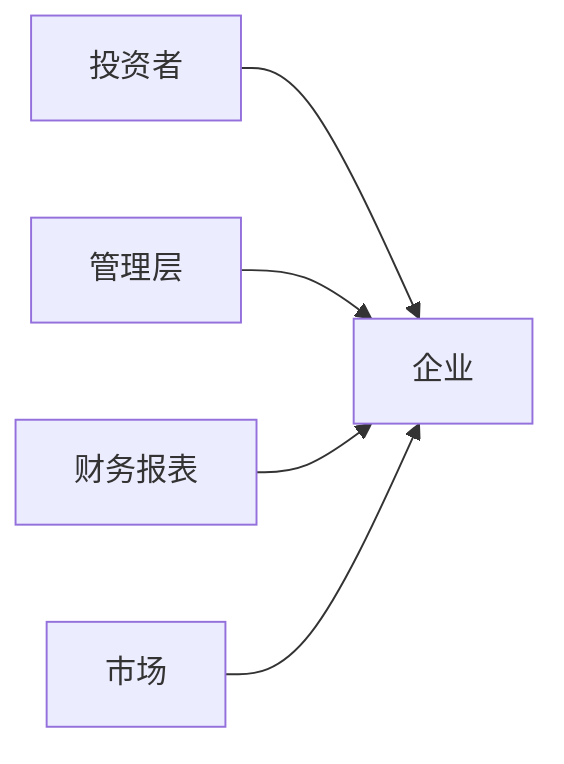
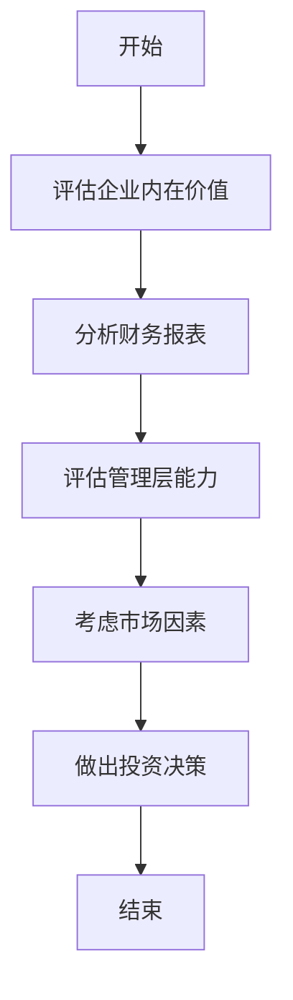

                 


# 巴菲特的股东信：投资智慧的结晶

## 关键词：巴菲特，股东信，价值投资，投资智慧，投资策略

## 摘要：本文通过深入分析巴菲特的股东信，揭示其投资智慧和策略。从投资哲学、核心概念到具体案例分析，详细讲解价值投资模型，结合系统架构设计和项目实战，帮助读者理解并应用巴菲特的投资智慧。

---

## 第1章：巴菲特的投资哲学概述

### 1.1 投资的核心概念

#### 1.1.1 投资的基本问题背景

投资是将资金配置到各种资产中，以实现财富增值的过程。投资者通过分析市场、企业财务和经济趋势，做出投资决策。

#### 1.1.2 投资的目标与方法

目标：资本增值和收入。方法包括价值投资、成长投资、指数投资等。

#### 1.1.3 价值投资的定义与特点

价值投资：购买低于其内在价值的股票，长期持有。特点：注重内在价值，长期视角，安全边际。

#### 1.1.4 投资的边界与外延

边界：资金、市场、风险。外延：涵盖股票、债券等多种资产。

#### 1.1.5 投资概念的核心要素组成

要素：企业分析、市场分析、风险管理。

---

### 1.2 巴菲特投资哲学的核心要素

#### 1.2.1 企业的长期价值

巴菲特关注企业的盈利能力、竞争优势和可持续发展。

#### 1.2.2 财务状况的稳健性

重视低负债、高收益、稳定的现金流。

#### 1.2.3 管理层的诚信与能力

管理层应具备诚信和卓越的管理能力。

#### 1.2.4 市场先生的理性与非理性

市场波动是机会，避免受情绪影响。

---

## 第2章：巴菲特投资策略的核心原理

### 2.1 价值投资模型的原理

价值投资模型基于企业的内在价值，计算其合理股价，与市场价对比。

### 2.2 价值投资模型的ER实体关系图



---

## 第3章：价值投资模型的算法原理

### 3.1 价值投资模型的流程图



---

## 第4章：数学模型与公式

### 4.1 市盈率计算公式

$$市盈率 = \frac{股价}{每股收益}$$

### 4.2 市净率计算公式

$$市净率 = \frac{股价}{每股净资产}$$

---

## 第5章：系统分析与架构设计方案

### 5.1 案例分析：可口可乐的投资分析

#### 5.1.1 企业的竞争优势

可口可乐的品牌和全球分销网络。

#### 5.1.2 财务状况

稳定的现金流和低负债。

#### 5.1.3 管理层能力

管理层的决策和执行能力。

---

## 第6章：项目实战

### 6.1 环境安装

安装Python和数据分析库，如Pandas和NumPy。

### 6.2 核心代码实现

```python
def calculate_intrinsic_value(company):
    # 计算每股收益
    eps = company['净利润'] / company['总股本']
    # 计算合理市盈率
    fair_pe = 15
    # 计算内在价值
    intrinsic_value = eps * fair_pe
    return intrinsic_value

# 示例公司数据
company_data = {
    '净利润': 100,
    '总股本': 10,
    '现金流': 50,
    '负债': 20
}

# 计算内在价值
intrinsic_value = calculate_intrinsic_value(company_data)
print(f"企业的内在价值为：{intrinsic_value}")
```

### 6.3 项目小结

通过代码实现，读者可以计算企业的内在价值，辅助投资决策。

---

## 第7章：最佳实践与注意事项

### 7.1 投资经验总结

长期投资、分散风险、关注企业质量。

### 7.2 投资注意事项

避免短期波动，保持投资纪律，持续学习。

### 7.3 项目小结

通过系统分析和项目实战，读者掌握了价值投资模型的应用。

---

## 拓展阅读

- 巴菲特的《聪明的投资者》
- 《投资最重要的事情》

---

## 作者：AI天才研究院/AI Genius Institute & 禅与计算机程序设计艺术 /Zen And The Art of Computer Programming

