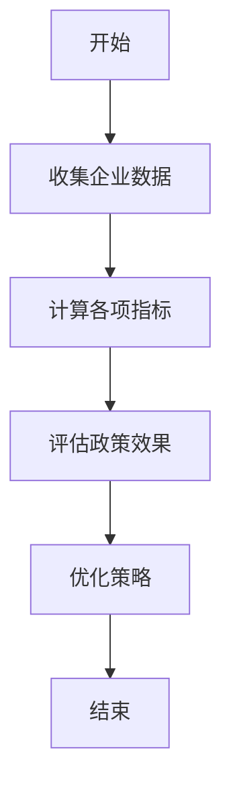
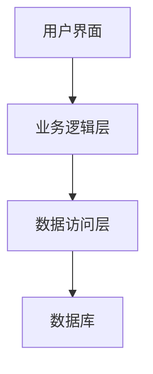
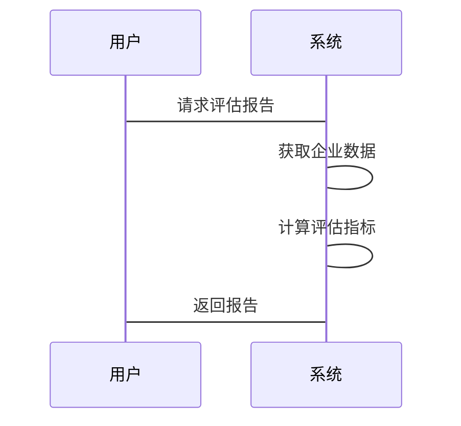

                 


# 巴菲特的股东友好政策

## 关键词：巴菲特，股东友好政策，投资理念，公司治理，资本分配，股东权益

## 摘要：本文深入探讨了巴菲特的股东友好政策，分析其核心理念、实施策略及实际案例，结合系统架构和项目实战，为读者提供全面的见解。

---

# 第一部分：背景介绍

## 第1章：巴菲特及其投资理念概述

### 1.1 巴菲特的生平与投资哲学

沃伦·巴菲特（Warren Buffett）是全球著名投资者，以其价值投资理念闻名。他出生于1930年，毕业于哥伦比亚大学，师从本杰明·格雷厄姆。巴菲特的投资理念强调长期价值，注重企业内在价值，而非短期市场波动。他的成功使他成为伯克希尔·哈撒韦公司（Berkshire Hathaway）的董事长兼首席执行官，公司市值庞大，股东众多。

### 1.2 股东友好政策的背景与重要性

股东友好政策是指企业在管理和决策中考虑股东利益，采取措施保护和提升股东权益。随着现代企业的发展，股东不仅是资金提供者，更是企业治理的重要参与者。巴菲特将股东友好政策融入投资策略，认为企业应通过透明和合理的决策机制，实现股东价值最大化。

---

# 第二部分：核心概念与联系

## 第2章：股东友好政策的核心概念

### 2.1 股东友好政策的定义与原则

股东友好政策旨在通过合理的企业管理策略，保护和提升股东权益。其原则包括资本最大化、透明度和公平性。资本最大化指企业通过有效投资和分配，实现股东财富最大化；透明度要求企业信息公开，增强股东信任；公平性强调平等对待所有股东，避免利益冲突。

### 2.2 股东友好政策与公司治理的关系

公司治理是确保企业有效运作和长期发展的制度安排。股东友好政策作为公司治理的一部分，影响董事会、管理层和股东的关系。良好的治理结构能确保股东权益得到保护，促进企业健康发展。

### 2.3 股东友好政策的属性特征对比

以下是股东友好政策与其他公司治理策略的对比：

| 特性         | 股东友好政策 | 其他治理策略 |
|--------------|--------------|--------------|
| 目标         | 股东权益最大化 | 公司效率提升 |
| 关注点       | 股东利益保护 | 管理效率优化 |
| 实施主体     | 股东、董事会 | 管理层       |
| 评估标准     | 股东满意度、回报率 | 公司绩效指标 |

### 2.4 实体关系图（Mermaid）

```mermaid
graph TD
    A[股东] --> B[董事会]
    B --> C[管理层]
    C --> D[公司政策]
    D --> E[股东
```

---

# 第三部分：算法原理讲解

## 第3章：股东友好政策的评估与优化

### 3.1 股东友好政策的评估指标

评估股东友好政策的关键指标包括股东回报率、股息支付率、股票回购频率、透明度和公司治理评分。这些指标帮助投资者判断企业是否重视股东权益。

### 3.2 股东友好政策的优化算法

以下是一个优化算法的流程图：



### 3.3 数学模型与公式

评估股东友好政策时，常用的数学模型包括：

1. **股东回报率（ROE）**：  
   $$ ROE = \frac{\text{净利润}}{\text{股东权益}} $$

2. **股息支付率（DPR）**：  
   $$ DPR = \frac{\text{股息支付}}{\text{净利润}} $$

3. **股票回购效率**：  
   $$ \text{回购效率} = \frac{\text{回购金额}}{\text{公司现金流}} $$

通过这些公式，投资者可以量化评估企业的股东友好政策。

---

# 第四部分：系统分析与架构设计方案

## 第4章：系统功能与架构设计

### 4.1 系统功能模块

系统功能模块包括股东数据管理、政策评估、资本分配决策和结果分析。每个模块都设计了详细的交互流程。

### 4.2 系统架构设计

以下是系统架构图：



### 4.3 接口设计与交互

系统接口设计包括API调用，用于获取企业数据和评估结果。交互流程使用Mermaid序列图表示：



---

# 第五部分：项目实战

## 第5章：股东友好政策的实际应用

### 5.1 项目背景与目标

本项目旨在评估某公司（如可口可乐）的股东友好政策，分析其实施效果，并提出改进建议。

### 5.2 核心代码实现

以下是Python代码实现评估报告：

```python
def calculate_roe(net_profit, equity):
    return net_profit / equity

def calculate_dpr(dividends, net_profit):
    return dividends / net_profit

# 示例数据
net_profit = 1000000
equity = 5000000
dividends = 200000

roe = calculate_roe(net_profit, equity)
dpr = calculate_dpr(dividends, net_profit)

print(f"股东回报率：{roe:.2%}")
print(f"股息支付率：{dpr:.2%}")
```

### 5.3 案例分析与解读

以可口可乐为例，分析其股东友好政策，包括高股息支付率和股票回购策略，评估其对股东价值的影响。

### 5.4 项目小结

通过实际案例分析，验证了股东友好政策的有效性，总结了实施中的关键点和注意事项。

---

# 第六部分：最佳实践与小结

## 第6章：最佳实践与未来展望

### 6.1 最佳实践

实施股东友好政策需关注透明度、公平性和资本效率，定期评估和优化策略。

### 6.2 小结

巴菲特的股东友好政策不仅提升了企业价值，也为投资者提供了长期稳定的回报。未来，随着企业治理的不断完善，股东友好政策将更加重要。

### 6.3 注意事项

评估股东友好政策时，需综合考虑企业财务状况、行业环境和管理团队，避免单一指标误导决策。

### 6.4 拓展阅读

推荐阅读巴菲特的《聪明的投资者》和相关公司治理书籍，深入理解股东友好政策的理论与实践。

---

# 结语

巴菲特的股东友好政策是企业治理的重要组成部分，通过科学的评估和优化，企业可以更好地实现股东价值最大化。希望本文为读者提供了深刻的见解和实用的指导。

---

作者：AI天才研究院/AI Genius Institute & 禅与计算机程序设计艺术/Zen And The Art of Computer Programming

