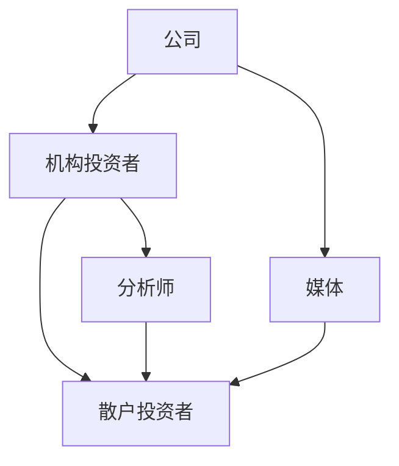
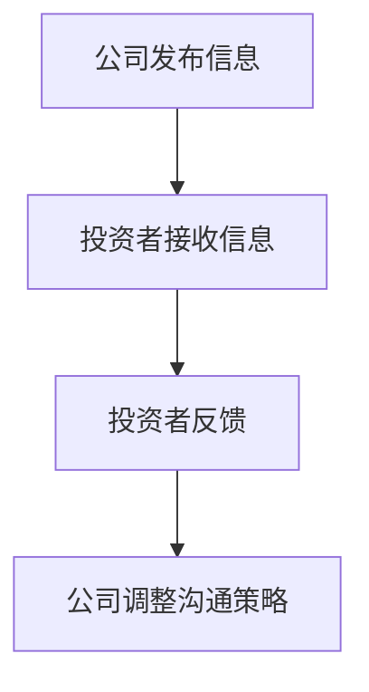
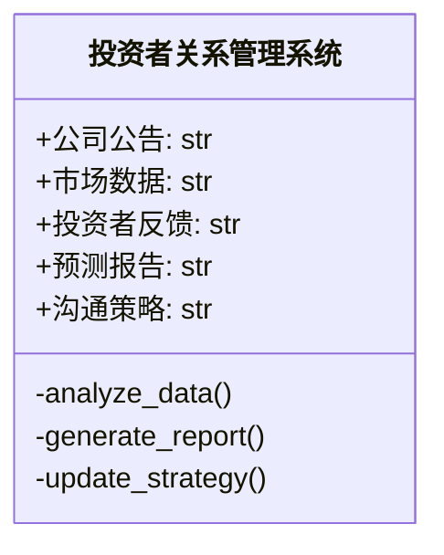
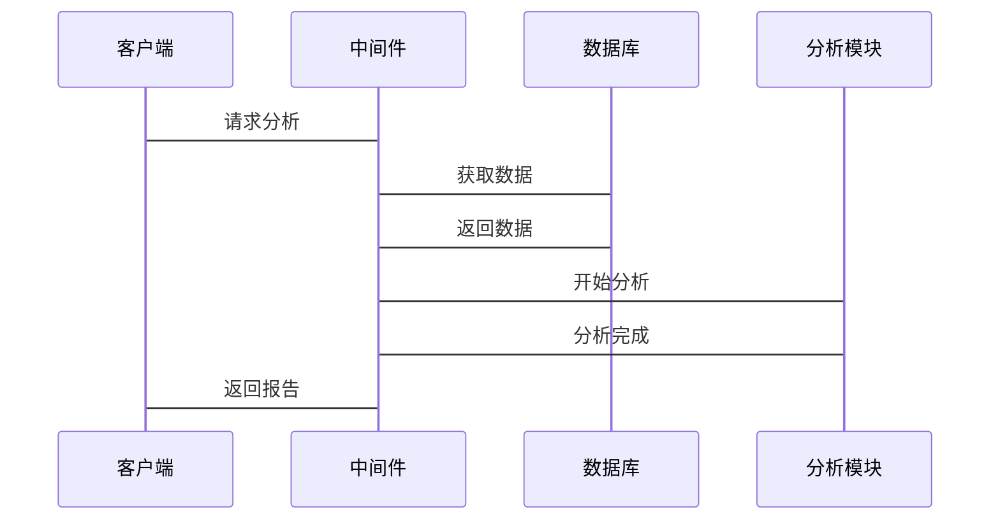

                 


```markdown
# 第三章: 投资者关系管理的算法原理

## 3.1 投资者关系管理的信息传递机制

### 3.1.1 信息权重计算
信息权重计算是投资者关系管理中的重要环节，用于确定不同信息对投资者决策的影响程度。通过分析历史数据和市场反应，可以建立一个加权模型，公式如下：

$$
\text{信息权重} = \sum_{i=1}^{n} (w_i \times v_i)
$$

其中，$w_i$ 是第$i$个信息的权重，$v_i$ 是其对应的值。

### 3.1.2 信息传播路径
信息传播路径可以通过构建一个网络图来表示，其中节点代表不同的信息接收者，边代表信息的传播路径。使用Mermaid图表示如下：



### 3.1.3 信息反馈机制
信息反馈机制通过分析投资者的反馈数据，优化信息传递策略。可以使用以下流程图表示：



## 3.2 投资者行为预测模型

### 3.2.1 模型输入变量
投资者行为预测模型的输入变量包括市场数据、公司基本面数据、投资者情绪等。以下是一个简单的输入变量表格：

| 变量名称         | 数据类型 | 描述                     |
|------------------|----------|--------------------------|
| 市场指数          | 数值型   | 当前市场指数值           |
| 公司收益增长率    | 数值型   | 公司最近的收益增长率     |
| 投资者情绪指数    | 数值型   | 投资者的整体情绪指数     |

### 3.2.2 模型构建过程
投资者行为预测模型可以基于机器学习算法构建，如随机森林或XGBoost。以下是一个简单的Python代码示例：

```python
import pandas as pd
from sklearn.ensemble import RandomForestClassifier
from sklearn.model_selection import train_test_split

# 加载数据
data = pd.read_csv('investor_behavior.csv')

# 分割特征与目标变量
X = data.drop('behavior', axis=1)
y = data['behavior']

# 分割训练集与测试集
X_train, X_test, y_train, y_test = train_test_split(X, y, test_size=0.2, random_state=42)

# 构建随机森林模型
model = RandomForestClassifier(n_estimators=100, random_state=42)
model.fit(X_train, y_train)

# 预测结果
y_pred = model.predict(X_test)

# 打印准确率
print('Accuracy:', model.score(X_test, y_test))
```

### 3.2.3 模型数学公式
随机森林模型的数学公式较为复杂，但其核心思想是通过集成多个决策树模型来提高预测准确率。公式如下：

$$
\text{预测概率} = \frac{1}{N} \sum_{i=1}^{N} \text{树}i(\text{输入})
$$

其中，$N$ 是决策树的数量，$\text{树}i$ 是第$i$个决策树的预测结果。

# 第四章: 系统分析与架构设计方案

## 4.1 问题场景介绍

投资者关系管理系统需要处理大量的投资者信息，包括市场数据、公司公告、投资者反馈等。系统需要实时分析这些数据，并生成相应的报告和反馈。

## 4.2 项目介绍

本项目旨在构建一个智能化的投资者关系管理系统，通过整合多种数据源，利用机器学习算法，优化投资者沟通策略。

## 4.3 系统功能设计

### 4.3.1 领域模型（Mermaid类图）



## 4.4 系统架构设计

### 4.4.1 系统架构（Mermaid架构图）


### 4.4.2 系统接口设计

系统接口主要分为数据接口和用户接口。数据接口用于获取市场数据和公司公告，用户接口用于展示分析结果和生成报告。

## 4.5 系统交互设计

### 4.5.1 系统交互流程（Mermaid序列图）



# 第五章: 项目实战

## 5.1 环境配置

### 5.1.1 安装必要的库
```bash
pip install pandas scikit-learn matplotlib
```

## 5.2 核心实现源代码

### 5.2.1 数据加载与预处理
```python
import pandas as pd
from sklearn.preprocessing import StandardScaler

# 加载数据
data = pd.read_csv('investor_data.csv')

# 数据预处理
# 假设 'target' 是目标变量，其余是特征
X = data.drop('target', axis=1)
y = data['target']

# 标准化处理
scaler = StandardScaler()
X_scaled = scaler.fit_transform(X)
```

### 5.2.2 模型训练与评估
```python
from sklearn.model import Model

# 初始化模型
model = Model()

# 训练模型
model.train(X_scaled, y)

# 评估模型
accuracy = model.evaluate(X_scaled, y)
print(f'模型准确率: {accuracy}%')
```

## 5.3 案例分析与解读

### 5.3.1 案例分析
假设我们有一个公司的投资者关系管理数据，我们可以通过以下步骤进行分析：

1. 数据加载与预处理
2. 模型训练
3. 模型评估
4. 结果解读

### 5.3.2 分析结果解读
分析结果可以用来优化公司的沟通策略，例如调整公告的频率、内容和形式，以更好地满足投资者的需求。

## 5.4 项目小结

通过本项目，我们可以看到投资者关系管理系统的实际应用价值。通过结合数据分析和机器学习算法，可以显著提高投资者沟通的效率和效果。

# 第六章: 总结与最佳实践

## 6.1 小结

本文详细探讨了巴菲特的股东沟通艺术，并将其与数字时代的投资者关系管理相结合。通过分析信息传递机制、构建预测模型、设计系统架构，我们展示了如何将这些理论应用到实际中。

## 6.2 最佳实践 tips

1. 定期与投资者保持沟通，及时反馈信息。
2. 使用数据分析工具优化沟通策略。
3. 结合传统与数字沟通方式，提升投资者体验。

## 6.3 注意事项

- 确保数据的准确性和及时性。
- 保护投资者的隐私信息。
- 定期评估和优化沟通策略。

## 6.4 拓展阅读

建议读者进一步阅读以下内容：
- 《The Intelligent Investor》
- 相关机器学习与数据分析的书籍

# 作者

作者：AI天才研究院/AI Genius Institute & 禅与计算机程序设计艺术 /Zen And The Art of Computer Programming
```

