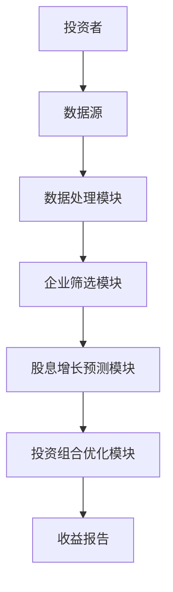
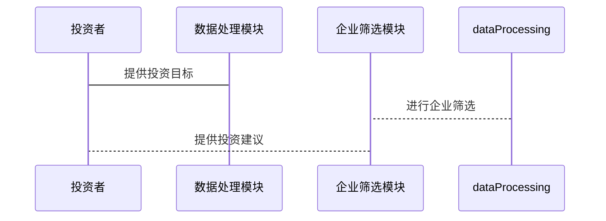

                 


# 巴菲特的股息增长策略更新：在低息环境中的收益来源

## 关键词
巴菲特, 股息增长策略, 低息环境, 投资收益, 股息模型, 股权投资

## 摘要
本文深入分析了巴菲特的股息增长策略在低息环境中的应用，探讨其收益来源。通过背景介绍、核心概念、数学模型和实际案例的详细分析，揭示了股息增长策略的内在逻辑与实际操作方法，为投资者提供有益的指导。

---

# 第一部分: 巴菲特的股息增长策略概述

## 第1章: 巴菲特的股息增长策略概述

### 1.1 股息增长策略的核心概念
#### 1.1.1 股息增长策略的定义
股息增长策略是指通过投资那些能够持续增长股息的公司，以实现资本增值和稳定现金流的投资方法。

#### 1.1.2 股息增长策略的背景与演变
股息增长策略起源于价值投资理念，巴菲特认为，投资于具有稳定增长股息的公司能够带来长期稳定的收益。

#### 1.1.3 股息增长策略的核心要素
- **股息支付率**：公司支付股息的能力。
- **股息增长率**：股息的年增长率。
- **折现率**：用于评估未来现金流的贴现率。

### 1.2 巴菲特股息增长策略的特点
#### 1.2.1 长期投资视角
巴菲特强调长期投资，关注企业的内在价值，而非短期市场波动。

#### 1.2.2 优质企业的筛选标准
- **稳定的盈利能力**：ROE高。
- **低负债率**：财务健康。
- **持续增长的股息**：股息增长历史稳定。

#### 1.2.3 股息增长的可持续性分析
关注企业的盈利能力和现金流，确保股息增长的可持续性。

### 1.3 低息环境下的股息增长策略
#### 1.3.1 低息环境的定义与特征
低息环境指市场利率较低，导致债券收益率下降，投资者转向股票等风险资产寻求收益。

#### 1.3.2 低息环境下股息增长策略的优势
- **股息吸引力增强**：低利率环境下，股息高的股票更具吸引力。
- **资本增值潜力**：低息环境下，高股息股票的估值上升，带来资本增值。

#### 1.3.3 低息环境对投资收益的影响
低息环境可能导致债券收益率下降，但高股息股票的吸引力增加，股息再投资效应显著。

---

# 第二部分: 股息增长策略的数学模型与算法原理

## 第2章: 股息增长模型的数学分析

### 2.1 股息增长模型的基本公式
股息增长模型（Dividend Growth Model）用于评估股票的内在价值：

$$ V = \frac{D_1}{k - g} $$

其中：
- $V$ 为股票价值
- $D_1$ 为第一年预期股息
- $k$ 为折现率
- $g$ 为股息增长率

### 2.2 股息增长模型的假设条件
- 恒定股息增长率假设
- 企业永续经营假设
- 投资者无限投资期限假设

### 2.3 股息增长模型的适用性分析
- **高增长企业**：适用于股息增长率稳定的公司。
- **稳定增长企业**：适用于股息稳步增长的公司。
- **低增长企业**：不适用于股息增长不稳定或无增长的公司。

### 2.4 股息增长模型的优缺点
- **优点**：简单易用，能够快速评估股票价值。
- **缺点**：假设条件严格，实际应用中可能不准确。

---

# 第三部分: 低息环境下的股息增长策略分析

## 第3章: 低息环境对股息增长策略的影响

### 3.1 低息环境下的市场特征
#### 3.1.1 利率水平对企业融资成本的影响
低利率环境下，企业融资成本降低，有助于扩大投资和生产。

#### 3.1.2 低利率环境下的资产配置策略
投资者转向股票等风险资产，以寻求更高的收益。

#### 3.1.3 低利率环境下的股票估值变化
低利率导致债券收益率下降，股票估值上升，高股息股票更具吸引力。

### 3.2 低息环境下股息增长策略的优势
#### 3.2.1 股息吸引力增强
低利率环境下，股息高的股票更具吸引力，因为它们提供了稳定的现金流。

#### 3.2.2 资本增值潜力
高股息股票在低息环境下估值上升，带来资本增值潜力。

### 3.3 低息环境下股息增长策略的风险
#### 3.3.1 利率上升的风险
如果利率上升，债券收益率提高，可能会影响高股息股票的估值。

#### 3.3.2 市场波动风险
低息环境下，市场波动可能影响股票价格，股息增长策略需要考虑市场风险。

---

# 第四部分: 股息增长策略的系统分析与架构设计

## 第4章: 系统分析与架构设计方案

### 4.1 问题场景介绍
在低息环境下，投资者如何选择具有稳定股息增长的公司，以实现收益最大化。

### 4.2 系统功能设计
#### 4.2.1 数据收集模块
- 收集企业的财务数据、股息历史、行业信息等。

#### 4.2.2 企业筛选模块
- 根据股息增长率、股息支付率、ROE等指标筛选优质企业。

#### 4.2.3 股息增长预测模块
- 使用股息增长模型预测未来股息增长率。

#### 4.2.4 投资组合优化模块
- 根据风险偏好和收益目标优化投资组合。

### 4.3 系统架构设计
#### 4.3.1 系统架构图


#### 4.3.2 系统接口设计
- 数据接口：与数据库或API连接，获取企业数据。
- 用户接口：供投资者输入参数，输出投资建议。

#### 4.3.3 系统交互设计


---

# 第五部分: 项目实战

## 第5章: 项目实战

### 5.1 环境安装
- 安装Python和相关库（pandas, numpy, matplotlib）。

### 5.2 核心实现源代码
```python
import pandas as pd
import numpy as np

def calculate_intrinsic_value(dividends, growth_rate, discount_rate):
    """
    计算股票的内在价值
    """
    return dividends * (1 + growth_rate) / (discount_rate - growth_rate)

# 示例数据
dividends = 1.0  # 当前股息
growth_rate = 0.05  # 股息增长率
discount_rate = 0.08  # 折现率

intrinsic_value = calculate_intrinsic_value(dividends, growth_rate, discount_rate)
print(f"股票的内在价值为：{intrinsic_value:.2f}")
```

### 5.3 代码应用解读
- 使用股息增长模型计算股票的内在价值，帮助投资者判断股票是否被低估或高估。

### 5.4 案例分析
以某公司为例，分析其股息增长潜力，计算其内在价值，制定投资策略。

### 5.5 项目小结
通过实际案例分析，验证股息增长策略的有效性，并总结经验教训。

---

# 第六部分: 总结与展望

## 第6章: 总结与展望

### 6.1 最佳实践 tips
- **长期投资**：坚持长期投资，避免短期波动影响。
- **优质企业筛选**：选择具有稳定股息增长和良好财务状况的企业。
- **风险管理**：分散投资，控制风险。

### 6.2 本章小结
本文详细分析了巴菲特的股息增长策略在低息环境中的应用，揭示了其内在逻辑和实际操作方法。

### 6.3 注意事项
- **市场风险**：注意市场波动对股息策略的影响。
- **利率风险**：关注利率变化对股息策略的影响。

### 6.4 拓展阅读
推荐相关书籍和文章，帮助读者深入学习股息增长策略。

---

# 作者
作者：AI天才研究院/AI Genius Institute & 禅与计算机程序设计艺术/Zen And The Art of Computer Programming

