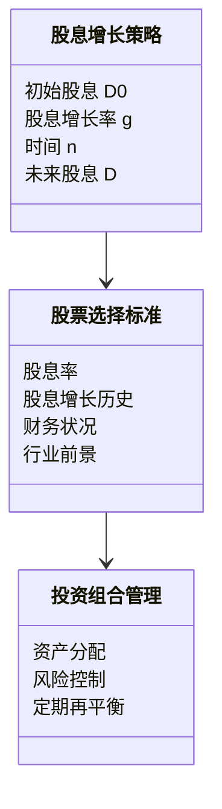
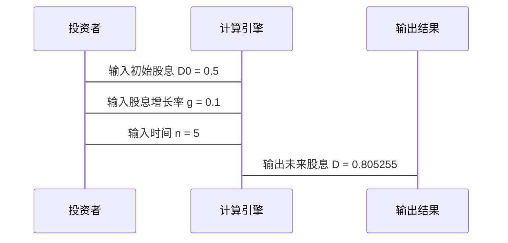

                 


# 巴菲特的股息增长策略：通货膨胀时代的收益来源

## 关键词：巴菲特，股息增长策略，通货膨胀，投资收益，股息模型，投资策略，系统分析

## 摘要：  
在通货膨胀的时代背景下，股息增长策略作为一种稳健的投资方式，备受投资者关注。本文通过分析巴菲特的股息增长策略，探讨其在通货膨胀环境下的收益来源。文章从股息增长策略的基本概念出发，结合数学模型和实际案例，详细分析了股息增长策略的系统架构、算法原理、项目实战以及在通货膨胀下的应用。通过系统分析和实践验证，本文为投资者提供了在通货膨胀时代利用股息增长策略实现收益的有效方法。

---

# 正文

## 第一章：股息增长策略的背景与基础

### 1.1 股息增长策略的定义与重要性  
股息增长策略是一种基于股息再投资的投资策略，其核心在于选择那些能够持续增长股息的公司进行投资。股息增长策略的关键在于通过复利效应，实现长期稳定的收益。  

#### 1.1.1 股息的定义与作用  
股息是公司分配给股东的利润部分，是股东投资回报的重要来源之一。股息的增长意味着公司盈利能力的提升和对股东的持续回报能力的增强。  

#### 1.1.2 股息增长策略的核心概念  
股息增长策略强调选择那些股息持续增长的公司，通过长期持有和股息再投资，实现资产的稳健增长。  

#### 1.1.3 股息增长策略在投资中的重要性  
股息增长策略能够为投资者提供稳定的现金流，同时通过复利效应实现资产的长期增值。尤其是在通货膨胀环境下，股息增长能够部分抵消通胀对购买力的侵蚀。  

### 1.2 巴菲特的投资理念与股息增长策略  
巴菲特作为全球著名投资者，其投资理念深刻影响了股息增长策略的发展。  

#### 1.2.1 巴菲特的投资哲学  
巴菲特的投资哲学强调价值投资，即选择那些具有持续盈利能力、良好治理结构和长期增长潜力的公司。  

#### 1.2.2 巴菲特与股息增长策略的关联  
巴菲特本人并不直接强调股息增长策略，但其投资理念与股息增长策略在本质上是一致的。他倾向于选择那些能够持续增长收益、并能够稳定分配股息的公司。  

#### 1.2.3 巴菲特对股息增长策略的实践  
巴菲特的投资组合中包含了许多股息增长稳定的公司，如可口可乐和苹果。他通过长期持有这些公司，获得了稳定的股息收益和资本增值。  

### 1.3 股息增长策略在通货膨胀时代的应用  
在通货膨胀环境下，股息增长策略的优势更加明显。  

#### 1.3.1 通货膨胀对投资的影响  
通货膨胀会导致货币购买力下降，固定收益资产的实际收益受损。因此，寻找能够抵御通胀的投资方式尤为重要。  

#### 1.3.2 股息增长策略在通货膨胀中的优势  
股息增长策略通过持续的股息增长，能够部分抵消通胀的影响。此外，股息增长型股票通常具有较强的抗跌性，在市场波动中表现较为稳定。  

#### 1.3.3 通货膨胀时代选择股息增长策略的必要性  
在通货膨胀环境下，股息增长策略能够为投资者提供稳定的现金流和长期增值的潜力。通过选择股息增长稳定的公司，投资者可以在通胀中实现财富的保值与增值。  

---

## 第二章：股息增长策略的数学模型与分析  

### 2.1 股息增长模型的建立  
股息增长模型是股息增长策略的核心工具之一。  

#### 2.1.1 股息增长模型的定义  
股息增长模型是用来预测股票未来股息的数学公式，通常基于股息增长率和贴现率进行计算。  

#### 2.1.2 股息增长模型的数学表达式  
股息增长模型可以表示为：  
$$ D = D_0 \times (1 + g)^n $$  
其中，$D$ 表示未来股息，$D_0$ 表示初始股息，$g$ 表示股息增长率，$n$ 表示时间。  

#### 2.1.3 模型的假设与限制  
股息增长模型的假设包括股息增长率 $g$ 是恒定的，以及股息增长率不超过贴现率。这些假设在实际应用中需要根据市场变化进行调整。  

---

## 第三章：股息增长策略的系统分析与架构设计  

### 3.1 股息增长投资的系统架构  
股息增长投资的系统架构包括以下几个关键模块：  

#### 3.1.1 投资目标设定  
明确投资目标是股息增长策略的第一步，包括收益目标和风险承受能力。  

#### 3.1.2 资产配置策略  
根据投资目标和市场环境，制定合理的资产配置策略，包括股票和债券的比例分配。  

#### 3.1.3 投资组合管理  
通过定期调整投资组合，优化股息增长潜力，降低风险。  

### 3.2 股息增长投资的领域模型  


---

## 第四章：项目实战：股息增长策略的应用  

### 4.1 项目介绍  
以苹果公司为例，分析其股息增长策略的应用。  

#### 4.1.1 项目背景  
苹果公司是全球市值最大的公司之一，具有稳定的股息增长历史和强大的盈利能力。  

#### 4.1.2 项目目标  
通过分析苹果公司的股息增长情况，验证股息增长模型的可行性。  

### 4.2 系统核心实现源代码  
以下是一个简单的股息增长模型实现代码：  
```python
def dividend_growth_model(D0, g, n):
    D = D0 * (1 + g) ** n
    return D
```

#### 4.2.1 代码应用解读  
该函数计算了公司在未来 $n$ 年的股息，假设股息增长率 $g$ 是恒定的。  

#### 4.2.2 实际案例分析  
以苹果公司为例，假设初始股息 $D_0 = 0.5$ 美元，股息增长率 $g = 0.1$，时间为 $n = 5$ 年。根据模型计算，未来股息为：  
$$ D = 0.5 \times (1 + 0.1)^5 = 0.5 \times 1.61051 = 0.805255 \text{ 美元} $$  

### 4.3 系统交互与流程分析  
以下是一个股息增长模型的交互流程图：  


---

## 第五章：总结与展望  

### 5.1 总结  
本文通过分析巴菲特的股息增长策略，探讨了其在通货膨胀环境下的应用。股息增长策略通过持续的股息增长，为投资者提供了稳定的现金流和长期增值的潜力。  

### 5.2 未来展望  
未来的研究可以进一步探讨股息增长策略与其他投资策略的结合，以及在不同市场环境下的表现。  

---

## 作者：AI天才研究院 & 禅与计算机程序设计艺术

