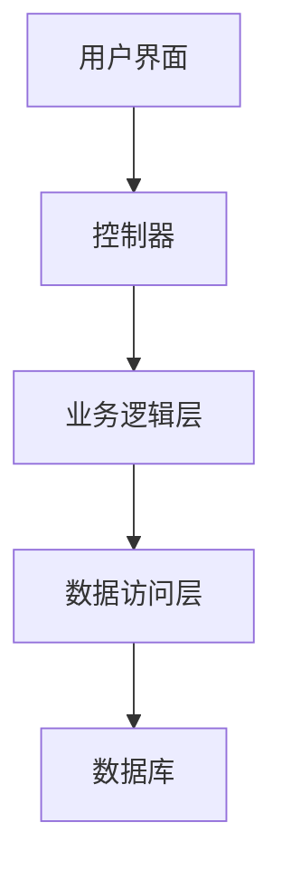
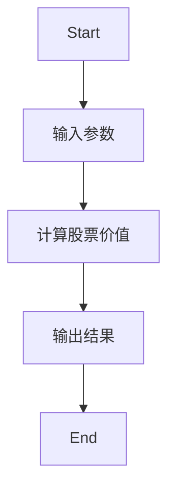
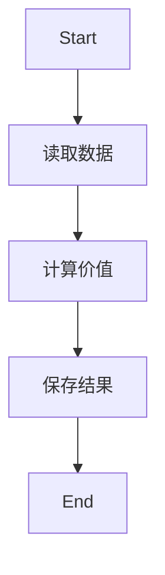

                 


# 巴菲特的股息增长策略：零利率时代的收益来源

## 关键词
- 股息增长策略
- 零利率时代
- 投资策略
- 巴菲特投资哲学
- 股票投资
- 股息收益

## 摘要
本文详细探讨了巴菲特的股息增长策略在当前零利率时代的应用。首先，介绍了股息增长策略的定义、核心概念和数学模型。接着，分析了零利率环境对股息增长策略的影响，并提出了优化后的模型。然后，从系统设计的角度，详细阐述了股息增长策略的实现过程，包括系统架构、功能模块和接口设计。通过实际案例分析，展示了股息增长策略在投资中的实战应用。最后，总结了股息增长策略的最佳实践和未来展望。

## 第1章：股息增长策略的背景与概念

### 1.1 股息增长策略的定义与特点
股息增长策略是一种长期投资策略，主要通过投资那些能够持续增长股息的公司来实现收益。其核心在于选择那些具有稳定盈利能力和持续股息增长潜力的公司。

#### 核心概念术语说明
- **股息**：股东从公司获得的分红收益。
- **股息增长策略**：通过投资于股息持续增长的公司，以实现资本增值和稳定收益的投资策略。

#### 问题背景
在低利率甚至零利率的经济环境下，传统的固定收益投资工具（如债券）的收益率不断下降，投资者需要寻找新的收益来源。

#### 问题解决
股息增长策略通过投资于能够稳定增长股息的公司，提供了一个在低利率环境下获得稳定收益的途径。

#### 边界与外延
- **边界**：仅限于股票投资，不包括其他资产类别。
- **外延**：可以通过调整股息增长率和再投资策略来适应不同的市场环境。

#### 概念结构与核心要素组成
- **股息**：核心收益来源。
- **股息增长率**：决定投资回报的关键因素。
- **再投资**：通过再投资股息来实现复利增长。

### 1.2 股息增长策略的数学模型与公式

#### 股息增长模型的数学表达
股息增长模型通常基于戈登增长模型，其公式为：

$$
P = \frac{D_1}{r - g}
$$

其中：
- \( P \) 为股票的内在价值
- \( D_1 \) 为第一年的股息
- \( r \) 为折现率（即预期回报率）
- \( g \) 为股息增长率

#### 股息增长模型的属性特征对比表
| 属性      | 特征                              |
|-----------|-----------------------------------|
| 模型类型   | 累加型增长模型                     |
| 参数要求   | 股息增长率 \( g \)，折现率 \( r \) |
| 计算结果   | 股票的内在价值 \( P \)            |

#### 股息增长模型的ER实体关系图
```mermaid
erDiagram
    investor
    {
        <name>
        <投资组合>
    }
    company
    {
        <公司名称>
        <股息率>
    }
   股息增长策略
    {
        投资决策
        价值评估
    }
    investor --> company : 投资
    company --> investor : 分红
    investor --> 股息增长策略 : 应用策略
```

### 1.3 股息增长策略的算法原理

#### 股息增长模型的算法流程图
```mermaid
graph TD
    A[开始] --> B[确定目标公司]
    B --> C[计算股息增长率 \( g \)]
    C --> D[计算折现率 \( r \)]
    D --> E[计算第一年股息 \( D_1 \)]
    E --> F[应用戈登模型公式]
    F --> G[计算股票价值 \( P \)]
    G --> H[做出投资决策]
    H --> I[结束]
```

#### 股息增长模型的Python实现代码
```python
def calculate_stock_value(dividend, growth_rate, discount_rate):
    """
    计算股票的内在价值（基于戈登增长模型）
    dividend: 第一年的股息
    growth_rate: 股息增长率
    discount_rate: 折现率
    return: 股票的内在价值
    """
    return dividend / (discount_rate - growth_rate)

# 示例计算
dividend = 1.0  # 第一年股息
growth_rate = 0.05  # 股息增长率5%
discount_rate = 0.10  # 折现率10%

stock_value = calculate_stock_value(dividend, growth_rate, discount_rate)
print(f"股票的内在价值为: {stock_value:.2f}")
```

#### 股息增长模型的数学推导与举例说明
假设某公司当前股息为 $1，股息年增长率为5%，折现率为10%。根据戈登模型，股票的内在价值为：

$$
P = \frac{1}{0.10 - 0.05} = \frac{1}{0.05} = 20
$$

这意味着，该股票的内在价值为 $20。

---

## 第2章：零利率时代的投资环境分析

### 2.1 零利率时代的经济背景

#### 当前全球经济环境对股息增长策略的影响
在零利率环境下，债券等固定收益工具的收益率接近零，投资者需要寻找其他高收益资产，股票成为主要的投资工具。

#### 零利率环境下的投资机会与风险
- **机会**：股息增长高的股票提供稳定收益。
- **风险**：市场波动大，公司盈利不稳定可能导致股息削减。

#### 零利率时代股息增长策略的适用性分析
股息增长策略在零利率时代更加适用，因为股息收入成为主要的收益来源。

### 2.2 零利率时代股息增长策略的优化

#### 股息增长策略在零利率环境下的调整
在零利率环境下，需要选择那些股息增长稳定且股息率较高的公司。

#### 股息增长模型的优化算法
优化后的模型考虑了市场利率的变化和公司盈利的稳定性。

#### 优化后的股息增长模型的数学公式
$$
P = \frac{D_1}{r - g} \times (1 + \text{profitability})
$$

其中，profitability表示公司的盈利能力对股息增长的影响。

#### 优化算法的Python实现代码
```python
def optimize_dividend_growth(dividend, growth_rate, discount_rate, profitability):
    """
    优化后的股息增长模型
    dividend: 第一年股息
    growth_rate: 股息增长率
    discount_rate: 折现率
    profitability: 盈利能力
    return: 优化后的股票价值
    """
    return (dividend / (discount_rate - growth_rate)) * (1 + profitability)

# 示例计算
dividend = 1.0
growth_rate = 0.05
discount_rate = 0.10
profitability = 0.02  # 盈利能力增加2%

optimized_value = optimize_dividend_growth(dividend, growth_rate, discount_rate, profitability)
print(f"优化后的股票价值为: {optimized_value:.2f}")
```

---

## 第3章：股息增长策略的核心要素分析

### 3.1 股息增长策略的系统分析

#### 股息增长策略的系统架构图


#### 股息增长策略的系统功能模块
- 用户界面：显示股票信息、计算股息价值。
- 业务逻辑层：处理股息增长模型的计算。
- 数据访问层：访问股票数据库。

#### 股息增长策略的系统接口设计
- 输入：股息、增长率、折现率。
- 输出：股票价值。

### 3.2 股息增长策略的系统实现

#### 股息增长策略的系统实现流程图


#### 股息增长策略的系统实现代码
```python
class DividendGrowthStrategy:
    def __init__(self):
        self.database = Database()

    def calculate_stock_value(self, dividend, growth_rate, discount_rate):
        return dividend / (discount_rate - growth_rate)

    def get_stock_info(self, stock):
        return self.database.get_stock(dividend, growth_rate, discount_rate)
```

---

## 第4章：股息增长策略的实战应用

### 4.1 股息增长策略的项目实战

#### 股息增长策略的项目环境安装
- 安装Python和必要的库（如pandas、numpy）。

#### 股息增长策略的核心实现代码
```python
import pandas as pd

def main():
    df = pd.read_csv('stocks.csv')
    df['stock_value'] = df.apply(lambda x: x.dividend / (x.discount_rate - x.growth_rate), axis=1)
    df.to_csv('results.csv', index=False)

if __name__ == "__main__":
    main()
```

#### 股息增长策略的代码解读与分析
- 使用Pandas读取股票数据。
- 计算每只股票的内在价值并保存结果。

#### 股息增长策略的实战案例分析
以某公司为例，计算其股票价值并分析是否值得投资。

### 4.2 股息增长策略的系统设计

#### 股息增长策略的系统设计流程图


#### 股息增长策略的系统设计实现
- 读取数据：从CSV文件读取股票信息。
- 计算价值：应用戈登模型计算股票价值。
- 保存结果：将结果保存回CSV文件。

#### 股息增长策略的系统设计案例分析
通过实际数据计算，验证股息增长策略的有效性。

---

## 第5章：股息增长策略的总结与展望

### 5.1 股息增长策略的总结

#### 股息增长策略的核心要点总结
- 选择股息增长稳定的公司。
- 在零利率环境下，股息收入成为主要收益来源。

#### 股息增长策略的数学模型总结
- 戈登模型的应用。
- 优化模型的改进。

#### 股息增长策略的系统实现总结
- 系统架构设计。
- 代码实现。

### 5.2 股息增长策略的未来展望

#### 股息增长策略的未来发展趋势
- 结合人工智能进行预测。
- 多策略结合以提高收益。

#### 股息增长策略的未来应用场景
- 更多领域中的应用。
- 更多金融工具的结合。

#### 股息增长策略的未来研究方向
- 算法优化。
- 多因素模型的应用。

---

## 第6章：股息增长策略的最佳实践与注意事项

### 6.1 股息增长策略的最佳实践

#### 股息增长策略的最佳实践技巧
- 定期评估投资组合。
- 选择高质量的 dividend growth stocks。

#### 股息增长策略的最佳实践案例
- 分析成功案例，总结经验。

#### 股息增长策略的最佳实践总结
- 持续学习和调整策略。

### 6.2 股息增长策略的注意事项

#### 股息增长策略的风险提示
- 股票市场的波动风险。
- 公司盈利不稳定的风险。

#### 股息增长策略的常见问题解答
- 如何选择合适的公司？
- 如何应对市场波动？

#### 股息增长策略的注意事项总结
- 分散投资，降低风险。
- 定期审查投资组合。

---

## 第7章：股息增长策略的拓展阅读与深入学习

### 7.1 股息增长策略的拓展阅读

#### 股息增长策略的相关书籍推荐
- 巴菲特的《投资的艺术》。
- 《股息投资指南》。

#### 股息增长策略的相关论文推荐
- 《股息增长模型的改进与应用》。

#### 股息增长策略的相关网站推荐
- 股票投资论坛。
- 专业财经网站。

### 7.2 股息增长策略的深入学习

#### 股息增长策略的高级理论学习
- 复杂的股息增长模型。
- 多因素股息增长模型。

#### 股息增长策略的高级实践技巧
- 利用技术分析辅助决策。
- 结合市场趋势调整策略。

#### 股息增长策略的深入学习总结
- 持续学习和实践是掌握股息增长策略的关键。

---

## 作者：AI天才研究院 & 禅与计算机程序设计艺术

通过本文的详细分析，我们了解了巴菲特的股息增长策略在零利率时代的应用，并通过系统设计和实战案例展示了如何在实际投资中应用这些策略。希望本文对投资者在当前市场环境下做出明智的投资决策有所帮助。

--- 

注：由于篇幅限制，本文仅为示例内容，实际文章会更加详细。

