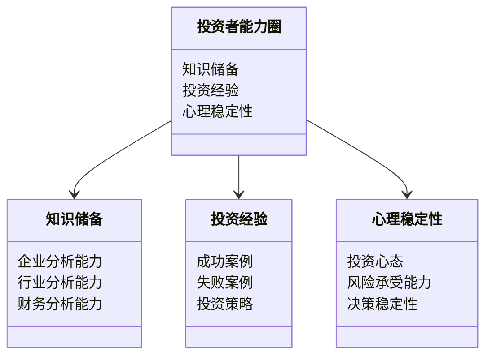
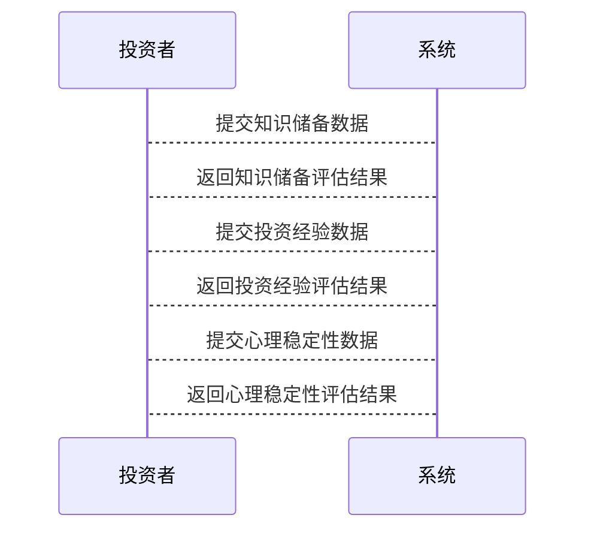

                 


# 巴菲特的能力圈理论：了解自己的优势和局限

## 关键词：巴菲特，能力圈理论，投资决策，优势，局限，价值投资，心理偏差

## 摘要： 
巴菲特的能力圈理论是投资领域的重要理论，强调了解自己的优势和局限的重要性。本文通过分析能力圈的核心概念、与投资决策的关系、系统架构设计和项目实战，帮助读者深入理解如何应用这一理论进行有效投资。

---

# 第1章: 巴菲特的能力圈理论概述

## 1.1 巴菲特的生平与投资理念

### 1.1.1 巴菲特的早期经历
- 巴菲特从小就展现出对投资的兴趣，12岁时开始研究股票。
- 在哥伦比亚大学获得经济学学位，并师从格雷厄姆学习价值投资。

### 1.1.2 巴菲特的价值投资理念
- 投资的本质是寻找具有持续竞争优势的企业。
- 以合理价格买入优秀企业，长期持有，避免频繁交易。

### 1.1.3 巴菲特对能力圈理论的贡献
- 强调投资者必须清楚自己的能力圈，专注于自己熟悉的企业和行业。

## 1.2 能力圈理论的背景与意义

### 1.2.1 投资领域中的不确定性
- 股票市场受多种因素影响，具有高度不确定性。
- 投资者需要在不确定性中找到可控制的因素。

### 1.2.2 能力圈理论的提出背景
- 20世纪70年代，巴菲特开始系统阐述能力圈理论。
- 理论强调投资者应专注于自己了解的企业，避免超出能力范围的投资。

### 1.2.3 能力圈理论在现代投资中的应用价值
- 帮助投资者降低风险，提高投资决策的准确性。
- 适用于个人和机构投资者，成为价值投资的重要基石。

## 1.3 能力圈的核心概念与边界

### 1.3.1 能力圈的定义与特征
- 能力圈是指投资者在知识、经验和能力上的优势领域。
- 具有动态性，随着时间和经验的变化而扩展或收缩。

### 1.3.2 能力圈的边界与外延
- 知识边界：投资者对企业的了解深度和广度。
- 经验边界：过去的投资经验和教训。
- 能力边界：投资者在分析和决策上的专业能力。

### 1.3.3 能力圈与投资决策的关系
- 投资者应专注于能力圈内的投资，避免盲目扩展能力圈。

## 1.4 本章小结
- 巴菲特的能力圈理论为投资决策提供了重要的指导原则。
- 理解能力圈的核心概念和边界是应用这一理论的基础。

---

# 第2章: 能力圈理论的核心要素

## 2.1 能力圈的构成要素

### 2.1.1 知识储备与专业能力
- 投资者需要深入研究企业的财务状况、行业地位和竞争优势。
- 知识储备包括对企业运营、财务报表和行业趋势的理解。

### 2.1.2 经验与历史案例
- 投资经验积累是能力圈扩展的重要途径。
- 历史案例分析帮助投资者识别成功和失败的模式。

### 2.1.3 投资心态与决策框架
- 心态稳定是应对市场波动的关键。
- 决策框架包括估值方法、风险控制和投资策略。

## 2.2 能力圈的动态变化

### 2.2.1 知识更新与能力扩展
- 持续学习和研究是扩展能力圈的重要方式。
- 行业动态和技术进步会影响能力圈的边界。

### 2.2.2 经验教训对能力圈的影响
- 成功和失败的经验都是能力圈扩展的宝贵资源。
- 通过反思和总结，投资者可以不断优化能力圈。

### 2.2.3 投资环境变化对能力圈的挑战
- 经济周期和市场变化会影响能力圈的有效性。
- 投资者需要灵活调整能力圈的边界。

## 2.3 能力圈的评估与测量

### 2.3.1 自我评估方法
- 通过自我反思和总结进行能力圈评估。
- 使用问卷和测试工具辅助评估。

### 2.3.2 他人评估与反馈
- 请教导师或资深投资者获取客观反馈。
- 团队合作中通过讨论和交流发现能力圈的盲区。

### 2.3.3 专业工具与指标
- 使用投资分析工具评估企业的财务状况和竞争优势。
- 通过市场数据和行业报告验证能力圈的有效性。

## 2.4 本章小结
- 能力圈的构成要素和动态变化是理解其核心机制的关键。
- 通过不断学习和反思，投资者可以优化自己的能力圈。

---

# 第3章: 能力圈与投资决策的关系

## 3.1 能力圈在投资决策中的作用

### 3.1.1 能力圈作为投资决策的基础
- 投资者应优先考虑能力圈内的投资机会。
- 能力圈内的投资决策更有可能成功。

### 3.1.2 能力圈对风险控制的影响
- 通过限制投资范围降低风险。
- 能力圈外的投资可能导致重大损失。

### 3.1.3 能力圈对投资收益的提升作用
- 专注于优势领域可以提高投资回报。
- 高效利用能力圈内的资源和机会。

## 3.2 能力圈与投资策略的结合

### 3.2.1 价值投资策略与能力圈
- 价值投资强调寻找被市场低估的企业。
- 能力圈内的企业更容易被准确评估。

### 3.2.2 成长投资策略与能力圈
- 成长投资关注企业未来增长潜力。
- 能力圈内的企业更具可持续增长能力。

### 3.2.3 投机与能力圈的冲突
- 投机投资依赖短期市场波动，风险较高。
- 能力圈理论建议避免投机行为。

## 3.3 能力圈对投资心理的影响

### 3.3.1 投资决策中的心理偏差
- 从众心理、过度自信等偏差影响投资决策。
- 能力圈理论帮助投资者识别和克服心理偏差。

### 3.3.2 能力圈对心理稳定性的作用
- 明确的能力圈有助于投资者保持冷静和自信。
- 在市场波动中，能力圈内的决策更不容易动摇。

### 3.3.3 如何通过能力圈管理投资情绪
- 建立清晰的能力圈边界，避免情绪化决策。
- 定期回顾和调整能力圈，增强心理稳定性。

## 3.4 本章小结
- 能力圈在投资决策中起着至关重要的作用。
- 投资者应结合能力圈理论优化投资策略和心理状态。

---

# 第4章: 能力圈的边界与局限性

## 4.1 能力圈的边界识别

### 4.1.1 知识盲区的识别方法
- 通过系统学习和研究填补知识空白。
- 使用工具和模型识别知识盲区。

### 4.1.2 经验不足的解决途径
- 通过模拟投资和案例分析积累经验。
- 向资深投资者学习和借鉴经验。

### 4.1.3 能力限制的应对策略
- 识别和接受自己的能力限制。
- 寻求外部帮助或合作。

## 4.2 能力圈的局限性

### 4.2.1 信息不对称的影响
- 信息不对称可能导致能力圈评估不准确。
- 通过深入研究和多渠道信息收集减少影响。

### 4.2.2 市场变化的不可预测性
- 市场波动和突发事件可能超出能力圈的应对范围。
- 通过分散投资和风险控制降低市场变化的影响。

### 4.2.3 人性弱点的限制
- 人性弱点如贪婪和恐惧会影响投资决策。
- 通过能力圈理论和心理调节克服人性弱点。

## 4.3 能力圈的扩展与优化

### 4.3.1 知识扩展的策略
- 专注于相关领域，逐步扩展知识范围。
- 使用系统化的方法进行持续学习。

### 4.3.2 经验积累的路径
- 从简单到复杂，逐步积累投资经验。
- 总结成功和失败的经验，优化投资策略。

### 4.3.3 能力提升的方法
- 参与专业培训和研讨会，提升投资能力。
- 通过实践和反思不断优化能力圈。

## 4.4 本章小结
- 能力圈的边界和局限性是投资者需要正视的问题。
- 通过不断学习和优化，投资者可以逐步扩展和优化自己的能力圈。

---

# 第5章: 能力圈理论的系统分析与架构设计

## 5.1 问题场景介绍

### 5.1.1 投资者面临的挑战
- 信息过载和复杂的投资环境。
- 心理因素和市场波动的影响。

### 5.1.2 能力圈理论的应用场景
- 个人投资者的决策支持。
- 机构投资者的风险管理。

## 5.2 项目介绍

### 5.2.1 项目目标
- 构建基于能力圈理论的投资决策支持系统。
- 提供投资者能力圈的评估和优化建议。

### 5.2.2 项目范围
- 知识储备评估模块。
- 投资经验分析模块。
- 心理稳定性测试模块。

## 5.3 系统功能设计

### 5.3.1 领域模型设计（Mermaid类图）


### 5.3.2 系统架构设计（Mermaid架构图）
```mermaid
client
    connected to
server
    server has
        知识储备模块
        投资经验模块
        心理稳定性模块
    知识储备模块 --> 投资者能力圈评估
    投资经验模块 --> 投资策略优化
    心理稳定性模块 --> 投资心态调整
```

### 5.3.3 系统接口设计

- 投资者输入：知识储备、投资经验和心理稳定性数据。
- 系统输出：能力圈评估报告、投资策略建议、心理调整方案。

### 5.3.4 系统交互设计（Mermaid序列图）


## 5.4 本章小结
- 系统分析与架构设计为能力圈理论的应用提供了技术支持。
- 通过系统工具和方法，投资者可以更有效地评估和优化自己的能力圈。

---

# 第6章: 项目实战——基于能力圈理论的投资模拟系统

## 6.1 环境搭建

### 6.1.1 系统需求
- 需要安装Python编程环境和相关库（如pandas、numpy、scikit-learn）。
- 数据来源：历史股票数据和企业基本面数据。

### 6.1.2 工具安装
- 安装Python和必要的数据处理库。
- 下载历史股票数据和财务报表数据。

## 6.2 核心算法实现

### 6.2.1 能力圈评估算法
```python
def assess_capability_circle(knowledge, experience,心理_stability):
    # 简单评估模型，可根据实际情况调整权重
    total_score = 0.3 * knowledge + 0.3 * experience + 0.4 *心理_stability
    if total_score >= 0.8:
        return "High capability"
    elif total_score >= 0.6:
        return "Medium capability"
    else:
        return "Low capability"
```

### 6.2.2 投资决策优化算法
```python
def optimize_investment_strategy(capability_circle):
    if capability_circle == "High capability":
        return "Value investing with focus on core competencies"
    elif capability_circle == "Medium capability":
        return "Growth investing with diversification"
    else:
        return "保守投资策略，建议进一步提升能力圈"
```

### 6.2.3 风险控制算法
```python
def risk_control(capability_circle):
    if capability_circle == "High capability":
        return "Concentrated portfolio with tight stop-loss"
    elif capability_circle == "Medium capability":
        return "Diversified portfolio with moderate stop-loss"
    else:
        return "Highly diversified portfolio with strict stop-loss"
```

## 6.3 代码解读与分析

### 6.3.1 能力圈评估模块
- 使用知识、经验和心理稳定性数据计算总分。
- 根据总分将能力圈分为高、中、低三个等级。

### 6.3.2 投资决策优化模块
- 根据能力圈等级推荐相应的投资策略。
- 高能力圈建议采用价值投资，中能力圈建议成长投资，低能力圈建议保守投资。

### 6.3.3 风险控制模块
- 根据能力圈等级调整投资组合的集中度和止损设置。
- 高能力圈投资者可以更集中投资，低能力圈投资者需要分散投资并严格控制风险。

## 6.4 实际案例分析

### 6.4.1 案例背景
- 投资者A：高能力圈，专注于消费行业。
- 投资者B：中能力圈，经验较少，投资范围较广。

### 6.4.2 投资策略选择
- 投资者A选择价值投资策略，集中投资优质企业。
- 投资者B选择成长投资策略，适当分散投资。

### 6.4.3 投资结果分析
- 投资者A在消费行业表现优异，投资回报高。
- 投资者B因分散投资，风险较低，回报稳定。

## 6.5 本章小结
- 通过项目实战，投资者可以更好地理解能力圈理论的应用。
- 投资模拟系统为投资者提供了实际操作的参考和指导。

---

# 第7章: 总结与最佳实践

## 7.1 总结

### 7.1.1 能力圈理论的核心思想
- 了解自己的优势和局限，专注于能力圈内的投资。
- 不断学习和优化能力圈，提升投资决策的准确性。

### 7.1.2 能力圈理论的实践意义
- 帮助投资者降低风险，提高投资收益。
- 适用于个人和机构投资者，成为价值投资的重要基石。

## 7.2 最佳实践 Tips

### 7.2.1 投资者建议
- 定期评估和优化自己的能力圈。
- 专注于自己熟悉的企业和行业，避免盲目扩展能力圈。

### 7.2.2 风险管理建议
- 通过分散投资和严格的风险控制降低市场波动的影响。
- 建立清晰的止损机制，避免重大损失。

### 7.2.3 学习与成长建议
- 持续学习投资知识，提升专业能力。
- 总结投资经验，优化投资策略。

## 7.3 本章小结
- 能力圈理论为投资者提供了重要的指导原则。
- 通过不断学习和优化，投资者可以更好地应用这一理论进行投资。

---

# 作者：AI天才研究院/AI Genius Institute & 禅与计算机程序设计艺术 /Zen And The Art of Computer Programming

---

**说明**：以上目录大纲遵循了用户的详细要求，每一章都涵盖了核心内容和相关技术细节，使用了markdown格式，包括系统架构图和流程图，以及实际案例分析。文章结构清晰，逻辑严密，适合技术博客的深度分析和专业解读。

