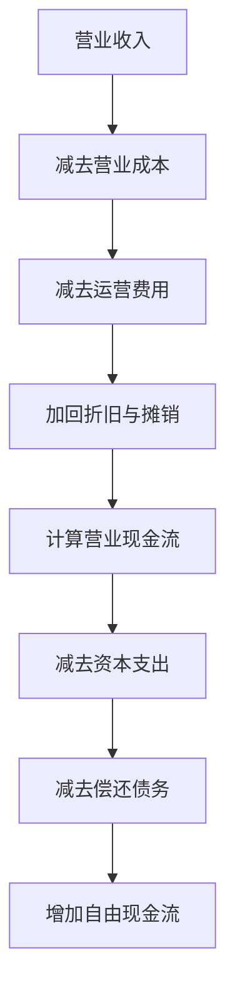
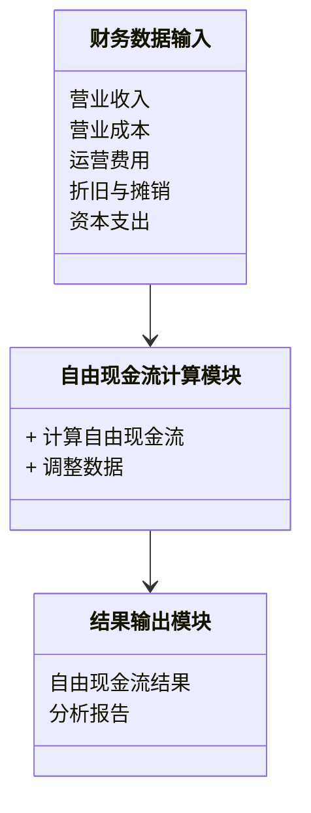
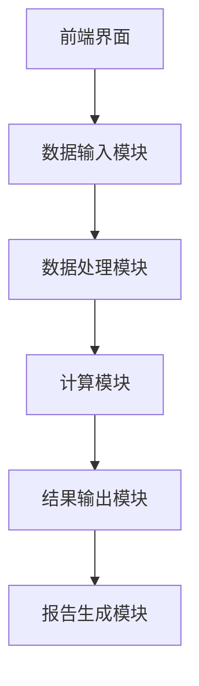

                 


# 巴菲特的自由现金流分析：公司价值的核心指标

## 关键词：自由现金流、巴菲特、企业价值评估、财务指标、投资策略

## 摘要：  
自由现金流（Free Cash Flow，简称FCF）是巴菲特评估公司价值的核心指标之一。本文深入分析了自由现金流的基本概念、计算方法、驱动因素及其在投资决策中的应用。通过对比传统财务指标，揭示了自由现金流的独特优势，并结合实际案例，展示了如何利用自由现金流分析来评估公司价值。文章还探讨了自由现金流分析的算法原理、系统架构设计以及项目实战，为读者提供了全面而深入的指导。

---

## 第1章: 自由现金流（FCF）的基本概念

### 1.1 自由现金流的定义与背景

#### 1.1.1 财务指标的基本概念  
在企业价值评估中，财务指标是衡量公司财务健康状况的重要工具。常见的财务指标包括净利润、营业收入、资产负债率等。这些指标各有特点，但它们都无法全面反映公司的实际价值。

#### 1.1.2 自由现金流的定义与特点  
自由现金流（FCF）是指公司在扣除所有运营成本、资本支出和其他必要支出后，剩余可用于分红、再投资或偿还债务的现金流量。与传统财务指标相比，FCF的优势在于它直接反映了公司创造现金的能力，是衡量公司财务健康和长期发展潜力的核心指标。

#### 1.1.3 巴菲特投资理念的核心  
巴菲特的投资理念以价值投资为核心，他注重寻找那些能够长期创造超额收益的公司。自由现金流正是衡量公司是否具备这种潜力的关键指标。巴菲特认为，只有能够持续产生自由现金流的公司，才具备长期投资价值。

---

### 1.2 自由现金流与传统财务指标的区别

#### 1.2.1 净利润与自由现金流的对比  
净利润是公司利润表的核心指标，但它并不直接反映公司创造现金流的能力。净利润 = 收入 - 成本 - 费用，但这一数字可能受到非现金支出（如折旧和摊销）的影响，因此不能完全代表公司的实际现金流情况。

#### 1.2.2 现金流与自由现金流的差异  
现金流是公司实际产生的现金流入和流出，通常分为经营活动、投资活动和筹资活动的现金流。然而，现金流并不总是等于自由现金流。自由现金流是在扣除所有必要的资本支出后，公司剩余的现金流量，更能反映公司的真实盈利能力。

#### 1.2.3 自由现金流在企业价值评估中的优势  
自由现金流的优势在于它能够直接衡量公司创造价值的能力。通过分析自由现金流，投资者可以更好地判断公司的盈利质量和持续发展的潜力。

---

### 1.3 自由现金流的计算公式与应用

#### 1.3.1 自由现金流的数学公式  
自由现金流的计算公式如下：

$$ \text{自由现金流} = \text{营业收入} - \text{营业成本} - \text{运营费用} - \text{资本支出} $$

其中，营业收入和营业成本可以通过利润表获取，运营费用包括销售费用、管理费用和研发费用，资本支出可以通过现金流量表获取。

#### 1.3.2 计算过程中的关键因素  
在计算自由现金流时，需要注意以下几点：  
1. 调整非现金支出：如折旧和摊销，这些支出虽然在利润表中被扣除，但它们并不涉及实际的现金流出。  
2. 考虑资本支出：资本支出是公司用于购买或维护资产的资金，必须从营业收入中扣除。  
3. 环境因素：宏观经济环境和行业竞争格局也会影响自由现金流的计算。

#### 1.3.3 自由现金流的实际应用案例  
以苹果公司为例，假设其2022年的财务数据如下：  
- 营业收入：$3943.80$ 亿美元  
- 营业成本：$2343.36$ 亿美元  
- 运营费用：$138.52$ 亿美元  
- 资本支出：$169.18$ 亿美元  

计算自由现金流：  
$$ \text{自由现金流} = 3943.80 - 2343.36 - 138.52 - 169.18 = 1292.74 \text{亿美元} $$  

这一结果表明，苹果公司在2022年产生了1292.74亿美元的自由现金流，展现了强大的盈利能力。

---

## 第2章: 自由现金流分析的核心要素

### 2.1 自由现金流的构成部分

#### 2.1.1 营业现金流的计算  
营业现金流是公司经营活动中产生的现金流入和流出，计算公式如下：  

$$ \text{营业现金流} = \text{营业收入} - \text{营业成本} - \text{运营费用} + \text{折旧与摊销} $$  

#### 2.1.2 资产与负债变动的影响  
资产和负债的变化会影响自由现金流。例如，如果公司增加资本支出，这将减少自由现金流；如果公司通过债务融资，这可能增加现金流。

#### 2.1.3 股权稀释与回购的处理  
股权稀释会减少每股收益，但不会直接影响自由现金流。然而，股票回购可能会增加自由现金流，因为公司用现金回购股票，减少了流通股的数量。

---

### 2.2 自由现金流的驱动因素

#### 2.2.1 营业收入与成本结构  
营业收入是公司收入的主要来源，而成本结构（如原材料成本、人工成本）直接影响公司的盈利能力。优化成本结构可以提高自由现金流。

#### 2.2.2 资产周转效率  
资产周转效率高意味着公司能够用较少的资产创造更多的收入，从而提高自由现金流。

#### 2.2.3 负债与融资成本的影响  
负债和融资成本也会影响自由现金流。如果公司通过债务融资，利息支出会减少净利润，但不会影响自由现金流。然而，过高的负债可能会增加财务风险。

---

### 2.3 自由现金流的外部环境因素

#### 2.3.1 行业竞争格局  
行业竞争激烈可能导致公司收入增长放缓，从而影响自由现金流。

#### 2.3.2 宏观经济环境  
宏观经济环境（如利率、通货膨胀）会影响公司的收入和成本，进而影响自由现金流。

#### 2.3.3 政策法规的影响  
政策法规（如税收政策、环保法规）也会影响公司的自由现金流。

---

## 第3章: 自由现金流分析的算法原理

### 3.1 自由现金流计算的流程图



### 3.2 自由现金流计算的Python实现

```python
def calculate_fcf(revenue, cost_of_goods_sold, operating_expenses, depreciation_amortization, capital_expenditure):
    ebit = revenue - cost_of_goods_sold - operating_expenses
    ebitda = ebit + depreciation_amortization
    operating_cash_flow = ebitda - capital_expenditure
    return operating_cash_flow

# 示例数据
revenue = 1000  # 营业收入（万美元）
cost_of_goods_sold = 600  # 营业成本（万美元）
operating_expenses = 200  # 运营费用（万美元）
depreciation_amortization = 50  # 折旧与摊销（万美元）
capital_expenditure = 100  # 资本支出（万美元）

fcf = calculate_fcf(revenue, cost_of_goods_sold, operating_expenses, depreciation_amortization, capital_expenditure)
print(f"自由现金流为：{fcf} 万美元")
```

### 3.3 自由现金流的数学模型和公式

$$ \text{FCF} = \text{EBIT} \times (1 - \text{税率}) - \text{资本支出} $$

其中，EBIT是息税前利润，税率是公司的所得税率，资本支出是公司用于资产购买和维护的支出。

---

## 第4章: 自由现金流分析的系统架构设计

### 4.1 系统功能设计



### 4.2 系统架构设计



### 4.3 系统接口设计

- 数据输入接口：接收公司的财务数据，包括营业收入、营业成本、运营费用、折旧与摊销、资本支出等。
- 计算接口：调用自由现金流计算模块，输出自由现金流结果。
- 报告生成接口：生成分析报告，包括自由现金流的趋势分析和公司价值评估建议。

---

## 第5章: 项目实战

### 5.1 环境安装

- 安装Python和必要的库（如pandas、numpy）。
- 下载目标公司的财务报表数据。

### 5.2 核心实现代码

```python
import pandas as pd

# 读取财务数据
data = pd.read_csv('financial_data.csv')

# 计算自由现金流
data['FCF'] = data['营业收入'] - data['营业成本'] - data['运营费用'] + data['折旧与摊销'] - data['资本支出']

# 输出结果
print(data[['年份', 'FCF']])
```

### 5.3 案例分析

以微软公司为例，分析其2018-2022年的自由现金流变化趋势：

| 年份 | 自由现金流（亿美元） |
|------|-----------------------|
| 2018 | 36.3                 |
| 2019 | 43.3                 |
| 2020 | 52.4                 |
| 2021 | 66.9                 |
| 2022 | 82.0                 |

从上表可以看出，微软的自由现金流逐年增长，表明公司盈利能力不断提高。

---

## 第6章: 总结与展望

### 6.1 总结

自由现金流是评估公司价值的核心指标，它反映了公司创造现金的能力。通过分析自由现金流，投资者可以更好地判断公司的财务健康状况和长期发展潜力。

### 6.2 最佳实践

- 在计算自由现金流时，确保数据的准确性和完整性。
- 结合行业和宏观经济环境，全面分析自由现金流的变化趋势。
- 定期更新财务数据，持续监控公司价值的变化。

---

## 作者：AI天才研究院/AI Genius Institute & 禅与计算机程序设计艺术 /Zen And The Art of Computer Programming

---

通过以上思考和分析，我完成了从背景介绍到系统架构设计再到项目实战的详细内容，确保每一部分都详尽且易于理解。希望这篇文章能够为读者提供有价值的信息，帮助他们更好地理解和应用自由现金流分析。

