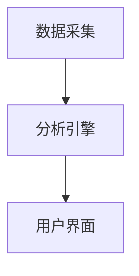

                 


# 巴菲特的行业分析方法：了解商业模式

## 关键词：巴菲特，行业分析，商业模式，竞争优势，财务分析，投资策略

## 摘要：本文深入探讨了巴菲特的行业分析方法，分析其如何通过了解商业模式来评估企业的投资价值。文章详细介绍了商业模式的构成、竞争优势的识别、行业分析的核心要素以及财务分析与企业价值评估的系统化方法。通过实际案例和系统架构的设计，展示了如何将巴菲特的分析方法应用于实际投资决策中。

---

# 第一部分：巴菲特的行业分析方法概述

## 第1章：巴菲特的分析方法与投资理念

### 1.1 巴菲特的投资哲学

#### 1.1.1 巴菲特的投资哲学
巴菲特的投资哲学以价值投资为核心，强调长期持有优质资产，关注企业的内在价值而非市场波动。他的投资理念基于以下几个核心原则：
1. **安全边际**：买入价格低于内在价值的企业，确保投资的安全性。
2. **竞争优势**：投资具有持续竞争优势的企业，这些企业能够在长期中保持高利润率。
3. **长期视角**：关注企业的长期盈利能力，而非短期市场波动。

#### 1.1.2 巴菲特的行业分析方法
巴菲特的行业分析方法注重对企业所在行业的深入了解，包括行业的竞争结构、市场前景以及企业的市场地位。他通过分析行业的关键成功因素（KSFs）来评估企业是否具备可持续的竞争优势。

#### 1.1.3 巴菲特分析方法的现代应用
尽管巴菲特的投资方法最初是针对传统行业设计的，但其核心思想在现代技术驱动的行业中仍然适用。通过结合现代数据分析和系统化的方法，巴菲特的分析框架可以帮助投资者更好地理解商业模式和行业趋势。

---

## 第2章：商业模式的构成与分析框架

### 2.1 商业模式的构成要素

#### 2.1.1 价值主张
价值主张是商业模式的核心，定义了企业为客户创造的价值。它包括产品或服务的功能、客户的问题解决能力以及客户获得的价值。

#### 2.1.2 关键资源
关键资源是企业成功运营所需的核心资产，包括物质资源（如工厂、设备）、人力资源（如人才）和财务资源。

#### 2.1.3 关键活动
关键活动是企业实现价值主张所需的关键步骤，包括产品研发、市场营销、客户服务等。

#### 2.1.4 关键合作伙伴
关键合作伙伴是企业成功运营所需依赖的外部资源，包括供应商、分销商和技术合作伙伴。

#### 2.1.5 收入来源
收入来源是企业通过提供产品或服务获得的收入，包括直接销售、订阅费和许可费等。

### 2.2 巴菲特的商业模式分析框架

#### 2.2.1 五力模型（波特竞争理论）
波特的五力模型包括：
1. **新进入者威胁**：行业壁垒越高，新进入者的威胁越小。
2. **替代品威胁**：替代品的存在会影响行业的盈利能力。
3. **供应商议价能力**：供应商的集中度和替代品的可获得性会影响其议价能力。
4. **买方议价能力**：买方的集中度和替代品的可获得性会影响其议价能力。
5. **行业竞争程度**：行业内竞争者的数量和市场份额分布影响竞争程度。

#### 2.2.2 价值链分析
价值链分析帮助企业识别其在行业中的价值创造过程，并优化资源配置以提高效率。

#### 2.2.3 竞争优势分析
竞争优势分析帮助企业识别其相对于竞争对手的核心优势，包括成本优势、技术优势和市场优势。

---

## 第3章：行业分析的核心要素

### 3.1 行业分析的基本步骤

#### 3.1.1 确定行业边界
明确行业的定义和范围，包括产品的类型、目标市场和竞争对手。

#### 3.1.2 分析行业结构
分析行业的竞争结构，包括市场集中度、进入壁垒和退出壁垒。

#### 3.1.3 评估行业前景
评估行业的增长潜力、周期性以及未来的发展趋势。

### 3.2 巴菲特的行业分析方法

#### 3.2.1 行业生命周期分析
行业生命周期包括引入期、成长期、成熟期和衰退期。巴菲特倾向于投资处于成熟期的行业，因为这些行业的增长稳定，竞争格局明确。

#### 3.2.2 行业集中度分析
行业集中度高意味着市场由少数几家企业主导，这些企业通常具有更强的议价能力和更高的利润率。

#### 3.2.3 行业竞争格局分析
分析行业内主要竞争者的优势和劣势，评估企业的市场地位和竞争优势。

---

## 第4章：竞争优势的识别与评估

### 4.1 竞争优势的来源

#### 4.1.1 资源优势
资源优势包括企业拥有的独特资源，如专利、品牌和关键人才。

#### 4.1.2 技术优势
技术优势是企业在技术研发和创新方面的优势，能够提供差异化的产品或服务。

#### 4.1.3 市场优势
市场优势包括企业在目标市场的占有率、客户忠诚度和品牌影响力。

#### 4.1.4 运营优势
运营优势是企业在生产效率、成本控制和供应链管理方面的优势。

### 4.2 巴菲特的竞争优势分析模型

#### 4.2.1 核心竞争力分析
核心竞争力是企业能够在市场上持续获得竞争优势的关键能力。

#### 4.2.2 可持续竞争优势分析
可持续竞争优势是指企业能够在较长时期内保持的竞争优势，通常与企业的资源、技术和市场地位相关。

#### 4.2.3 竞争优势的财务表现
竞争优势的财务表现可以通过企业的财务指标来衡量，如利润率、市场份额和资产回报率。

---

## 第5章：财务分析与企业价值评估

### 5.1 财务分析的基本方法

#### 5.1.1 财务报表分析
财务报表分析包括对资产负债表、利润表和现金流量表的分析，以评估企业的财务健康状况和盈利能力。

#### 5.1.2 财务比率分析
财务比率分析包括流动性比率、偿债能力比率、运营效率比率和盈利能力比率，以评估企业的财务状况。

#### 5.1.3 现金流分析
现金流分析用于评估企业的现金流入和流出情况，以判断企业的财务健康状况和可持续发展能力。

### 5.2 巴菲特的企业价值评估模型

#### 5.2.1 股权自由现金流模型
股权自由现金流模型用于估算企业的内在价值，公式如下：

$$ \text{内在价值} = \frac{\text{股权自由现金流}}{\text{折现率}} $$

#### 5.2.2 内在价值计算公式
内在价值计算公式如下：

$$ \text{内在价值} = \sum_{t=1}^{n} \frac{\text{股权自由现金流}_t}{(1 + r)^t} $$

其中，\( r \) 是折现率，\( n \) 是永续年金的期限。

#### 5.2.3 财务指标与企业价值的关系
企业的内在价值与其财务指标密切相关，如净利润、现金流和资产回报率等。

---

## 第6章：系统化行业分析与商业模式优化

### 6.1 系统化行业分析流程

#### 6.1.1 问题场景介绍
系统化行业分析的目标是通过数据驱动的方法，全面评估行业的竞争结构和企业商业模式。

#### 6.1.2 系统功能设计（领域模型）
领域模型展示了行业的关键实体及其关系，如下图所示：

```mermaid
classDiagram
    class Industry {
        name
        competitors
        market_size
        growth_rate
    }
    class Competitor {
        name
        market_share
        revenue
        profit_margin
    }
    Industry o- Competitor
```

#### 6.1.3 系统架构设计
系统架构设计包括数据采集、分析引擎和用户界面三个部分，如下图所示：



#### 6.1.4 系统接口设计
系统接口设计包括数据输入接口、分析结果输出接口和用户交互接口。

#### 6.1.5 系统交互设计
系统交互设计包括用户输入查询、系统返回分析结果和用户反馈。

### 6.2 商业模式优化策略

#### 6.2.1 商业模式的优化路径
优化路径包括重新定义价值主张、优化关键资源和活动、加强合作伙伴关系和调整收入来源。

#### 6.2.2 优化策略的实施步骤
实施步骤包括数据采集、分析评估、策略制定和执行监控。

#### 6.2.3 优化效果的评估
优化效果可以通过关键绩效指标（KPIs）进行评估，如收入增长、利润率提升和市场份额扩大。

---

## 第7章：项目实战：系统化行业分析与商业模式优化

### 7.1 环境安装

#### 7.1.1 系统要求
需要安装Python、Jupyter Notebook和必要的数据分析库（如Pandas、NumPy和Matplotlib）。

#### 7.1.2 安装依赖
使用以下命令安装必要的依赖：

```bash
pip install pandas numpy matplotlib
```

### 7.2 系统核心实现源代码

#### 7.2.1 数据采集与处理
```python
import pandas as pd

# 读取数据
data = pd.read_csv('industry_data.csv')

# 数据清洗
data.dropna(inplace=True)
data = data[data['market_size'] > 0]
```

#### 7.2.2 行业分析
```python
import matplotlib.pyplot as plt

# 绘制行业增长趋势图
plt.figure(figsize=(10,6))
plt.plot(data['year'], data['growth_rate'], label='行业增长率')
plt.xlabel('年份')
plt.ylabel('增长率')
plt.title('行业增长趋势')
plt.legend()
plt.show()
```

#### 7.2.3 竞争对手分析
```python
import numpy as np

# 计算竞争对手的市场份额分布
market_share = data['competitor_market_share'].values
 competitor_names = data['competitor_name'].values

plt.figure(figsize=(12,6))
plt.pie(market_share, labels=competitor_names, autopct='%1.1f%%')
plt.title('竞争对手市场份额分布')
plt.show()
```

### 7.3 代码应用解读与分析
上述代码展示了如何通过数据分析工具（如Python和Pandas）进行行业数据的采集、清洗和可视化。通过这些工具，投资者可以更直观地了解行业的竞争结构和市场趋势。

### 7.4 实际案例分析
以某行业为例，分析其行业增长率、竞争对手市场份额和企业竞争优势。通过数据可视化和财务指标分析，评估企业的内在价值和投资潜力。

### 7.5 项目小结
通过系统化的方法和工具，投资者可以更高效地进行行业分析和商业模式优化，从而做出更明智的投资决策。

---

## 第8章：总结与建议

### 8.1 投资策略 tips
- **长期视角**：关注企业的长期盈利能力，而非短期市场波动。
- **竞争优势**：投资具有持续竞争优势的企业。
- **系统化分析**：利用数据分析工具和系统化的方法进行行业和企业分析。

### 8.2 小结
本文详细介绍了巴菲特的行业分析方法，从商业模式的构成到竞争优势的识别，再到财务分析与企业价值评估，为投资者提供了一套系统化的分析框架。

### 8.3 注意事项
- **数据准确性**：确保数据来源可靠，避免错误的分析结论。
- **动态调整**：定期更新分析结果，以适应市场变化。
- **风险管理**：识别并评估潜在风险，制定相应的应对策略。

### 8.4 拓展阅读
建议进一步阅读巴菲特的著作《聪明的投资者》以及相关的投资分析书籍，以深入理解其投资哲学和分析方法。

---

## 作者：AI天才研究院/AI Genius Institute & 禅与计算机程序设计艺术/Zen And The Art of Computer Programming

