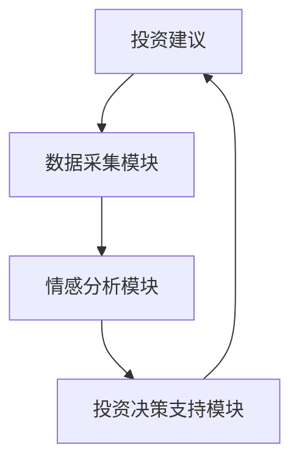
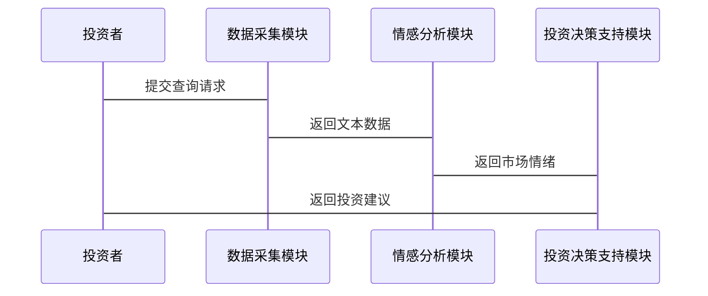

                 


```markdown
# 巴菲特的行为金融学应用：社交媒体时代的群体心理

> 关键词：巴菲特，行为金融学，社交媒体，群体心理，投资策略，价值投资

> 摘要：本文从巴菲特的投资哲学出发，结合行为金融学的理论框架，深入分析社交媒体时代群体心理对投资决策的影响。通过详细阐述巴菲特的投资策略、行为金融学的核心概念以及社交媒体在信息传播和情绪影响中的作用，探讨如何在现代金融市场中有效应用这些理论。文章还结合实际案例，展示如何利用技术手段分析市场情绪，帮助投资者做出更理性的决策。

---

## 第一部分: 巴菲特的行为金融学应用基础

### 第1章: 巴菲特投资理念与行为金融学概述

#### 1.1 巴菲特投资理念的核心思想

##### 1.1.1 价值投资的定义与核心要素
价值投资是一种以企业基本面分析为基础的投资策略，强调以低于内在价值的价格买入优质资产。核心要素包括：
- **内在价值**：企业未来现金流的现值。
- **安全边际**：买入价格与内在价值的差距，确保投资的安全性。
- **长期视角**：关注企业的长期盈利能力，而非短期市场波动。

##### 1.1.2 巴菲特投资策略的演变
巴菲特的投资策略经历了从“烟蒂投资”到“护城河投资”的演变：
- **早期策略**：寻找被市场低估的“烟蒂”企业，注重短期价值。
- **中期策略**：关注具有竞争优势的“蓝筹股”，注重企业的盈利能力和管理团队。
- **后期策略**：强调企业护城河和长期可持续发展，注重企业的品牌、护城河和管理层道德。

##### 1.1.3 巴菲特投资哲学的现代意义
在现代金融市场中，巴菲特的投资哲学依然具有重要价值，尤其是在应对市场波动和避免情绪化决策方面提供了宝贵的指导。

#### 1.2 行为金融学的基本概念

##### 1.2.1 行为金融学的定义与研究范围
行为金融学是研究投资者心理和行为对金融市场影响的学科，与传统金融学不同，它强调人类行为的非理性特征。

##### 1.2.2 群体心理与市场情绪的关系
群体心理是行为金融学的核心概念之一。市场情绪是投资者集体心理的外在表现，二者相互作用，影响市场价格波动。

##### 1.2.3 行为金融学与传统金融学的对比
- **传统金融学**：假设投资者是理性的，市场是有效的。
- **行为金融学**：承认投资者的非理性行为，并研究其对市场的影响。

#### 1.3 社交媒体时代的行为金融学特征

##### 1.3.1 社交媒体对群体心理的影响
社交媒体的兴起使得信息传播速度更快、范围更广，放大了群体心理的波动。

##### 1.3.2 现代市场中的信息传播与情绪扩散
社交媒体时代，信息传播速度和广度的增加，使得市场情绪的波动更加剧烈。

##### 1.3.3 巴菲特投资理念在社交媒体时代的适用性
尽管社交媒体改变了信息传播的方式，但巴菲特的价值投资理念依然有效，尤其是在识别企业内在价值和避免情绪化决策方面。

### 第2章: 巴菲特投资决策中的行为金融学分析

#### 2.1 巴菲特投资决策的核心步骤

##### 2.1.1 企业基本面分析
巴菲特注重对企业内在价值的评估，包括盈利能力、财务状况、行业地位等。

##### 2.1.2 市场情绪与投资机会的识别
通过分析市场情绪，巴菲特能够识别出被市场低估的投资机会。

##### 2.1.3 安全边际的计算与应用
安全边际是巴菲特投资策略的核心，通过买入价格与内在价值的差距，降低投资风险。

#### 2.2 行为金融学中的认知偏差与投资决策

##### 2.2.1 羊群效应的定义与表现
羊群效应是指投资者模仿他人决策的行为，导致市场波动加剧。

##### 2.2.2 过度自信与从众心理
投资者常常过度自信，认为自己能够预测市场走势，从而做出从众决策。

##### 2.2.3 前景理论与损失厌恶
前景理论指出，投资者对损失的厌恶程度高于对收益的追求，导致他们在决策中更加谨慎。

#### 2.3 巴菲特投资决策中的行为金融学策略

##### 2.3.1 逆向投资的原理与应用
逆向投资是指在市场恐慌时买入，在市场狂热时卖出，利用市场的非理性波动获取超额收益。

##### 2.3.2 市场恐慌与抄底机会
在市场恐慌时，许多优质资产被低估，提供了抄底的机会。

##### 2.3.3 长期投资与价值发现
巴菲特强调长期投资，避免短期市场波动的干扰，专注于发现具有长期价值的企业。

### 第3章: 社交媒体时代群体心理的特征与影响

#### 3.1 社交媒体对群体心理的塑造作用

##### 3.1.1 社交媒体的信息传播机制
社交媒体通过即时信息传播，使得市场情绪迅速扩散，放大了群体心理的波动。

##### 3.1.2 网络舆论的形成与扩散
社交媒体上的舆论形成速度快，影响力大，容易引发市场恐慌或狂热。

##### 3.1.3 社交媒体时代的从众行为
投资者在社交媒体上容易受到从众心理的影响，导致投资决策的非理性。

#### 3.2 群体心理与市场情绪的互动关系

##### 3.2.1 市场情绪的周期性波动
市场情绪通常呈现周期性波动，从乐观到悲观，再从悲观到乐观，形成市场的周期性波动。

##### 3.2.2 群体心理对市场波动的放大效应
群体心理的放大效应使得市场波动更加剧烈，尤其是在社交媒体时代。

##### 3.2.3 社交媒体时代的市场泡沫与崩盘
社交媒体时代，市场泡沫的形成和崩盘速度更快，幅度更大。

#### 3.3 巴菲特投资理念在社交媒体时代的挑战与机遇

##### 3.3.1 挑战：信息过载与情绪干扰
社交媒体时代，信息过载和情绪干扰使得投资者更难保持理性的决策。

##### 3.3.2 机遇：识别市场情绪与价值机会
通过分析社交媒体上的信息，投资者可以更快速地识别市场情绪，发现被市场低估的价值机会。

---

## 第二部分: 行为金融学的算法实现与系统架构

### 第4章: 基于情感分析的投资决策支持系统

#### 4.1 系统应用场景与目标
- **应用场景**：帮助投资者实时分析市场情绪，识别投资机会。
- **目标**：通过情感分析技术，辅助投资者做出更理性的决策。

#### 4.2 系统功能模块设计
##### 4.2.1 数据采集模块
- **功能**：采集社交媒体上的文本数据，包括新闻、评论、论坛帖子等。
- **技术实现**：使用Tweepy等Python库，爬取社交媒体数据。

##### 4.2.2 情感分析模块
- **功能**：对采集到的文本进行情感分析，识别市场情绪。
- **技术实现**：使用TextBlob等Python库，结合自然语言处理技术。

##### 4.2.3 投资决策支持模块
- **功能**：根据市场情绪和企业基本面分析，生成投资建议。
- **技术实现**：结合情感分析结果和企业基本面数据，生成投资策略。

#### 4.3 系统架构设计
##### 4.3.1 系统架构图


##### 4.3.2 系统交互流程


---

## 第三部分: 项目实战

### 第5章: 社交媒体数据采集与分析

#### 5.1 环境安装与配置
- **Python版本**：建议使用Python 3.8以上版本。
- **库的安装**：使用pip安装Tweepy、TextBlob等库。

#### 5.2 核心实现源代码

##### 5.2.1 数据采集代码
```python
import tweepy

# 授权信息
API_KEY = 'your_api_key'
API_SECRET_KEY = 'your_api_secret_key'
ACCESS_TOKEN = 'your_access_token'
ACCESS_TOKEN_SECRET = 'your_access_token_secret'

# 连接Twitter API
auth = tweepy.OAuthHandler(API_KEY, API_SECRET_KEY)
auth.set_access_token(ACCESS_TOKEN, ACCESS_TOKEN_SECRET)
api = tweepy.API(auth)

# 采集推文
def get_tweets(query, max_num=100):
    tweets = []
    for tweet in tweepy.Cursor(api.search, query=query, lang="en").items(max_num):
        tweets.append(tweet.text)
    return tweets

tweets = get_tweets("Bitcoin", max_num=200)
```

##### 5.2.2 情感分析代码
```python
from textblob import TextBlob

def analyze_sentiment(text):
    blob = TextBlob(text)
    return blob.sentiment.polarity

positive_tweets = 0
neutral_tweets = 0
negative_tweets = 0

for tweet in tweets:
    sentiment = analyze_sentiment(tweet)
    if sentiment > 0:
        positive_tweets += 1
    elif sentiment < 0:
        negative_tweets += 1
    else:
        neutral_tweets += 1

total_tweets = len(tweets)
print(f"Positive: {positive_tweets}, Neutral: {neutral_tweets}, Negative: {negative_tweets}")
```

#### 5.3 实际案例分析

##### 5.3.1 案例背景
分析社交媒体上关于“Bitcoin”的讨论，识别市场情绪。

##### 5.3.2 数据分析与解读
- **Positive tweets**: 120
- **Neutral tweets**: 50
- **Negative tweets**: 30

##### 5.3.3 投资建议
根据市场情绪分析，当前市场情绪较为乐观，可以考虑买入。

#### 5.4 项目小结
通过社交媒体数据采集与分析，投资者可以更快速地识别市场情绪，辅助投资决策。

---

## 第四部分: 结论与展望

### 第6章: 结论与展望

#### 6.1 结论
本文从巴菲特的投资哲学出发，结合行为金融学的理论框架，分析了社交媒体时代群体心理对投资决策的影响。通过技术手段，如情感分析和大数据分析，投资者可以更理性地做出决策。

#### 6.2 展望
未来，随着人工智能和大数据技术的发展，行为金融学在投资领域的应用将更加广泛和深入。投资者需要结合技术手段，更好地应对市场波动和群体心理的影响。

---

## 作者：AI天才研究院/AI Genius Institute & 禅与计算机程序设计艺术 /Zen And The Art of Computer Programming
```

