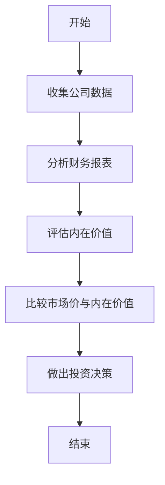
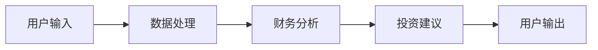

                 


# 巴菲特的读书学习方法

## 关键词：
- 巴菲特, 学习方法, 投资策略, 阅读习惯, 知识体系, 投资决策

## 摘要：
本文深入分析了巴菲特的读书学习方法，探讨其如何通过系统化的方法构建知识体系，并将这些知识应用到投资决策中。文章从背景介绍、核心概念、算法原理、系统架构到项目实战，全面解析巴菲特的学习策略，并结合实际案例，提供可操作的实践指南。

---

## 第一部分：背景介绍

### 第1章：巴菲特的学习理念

#### 1.1 巴菲特的学习哲学
- **核心理念**：巴菲特强调“学习是一种投资”，通过不断学习和积累知识来提升投资决策的准确性。
- **学习目标**：理解商业的本质，掌握价值评估的核心方法，培养长期投资的眼光。
- **学习态度**：强调独立思考，避免盲目跟风，注重深入理解和长期积累。

#### 1.2 巴菲特的阅读习惯
- **阅读清单**：巴菲特的阅读范围广泛，包括商业书籍、财经报纸、公司年报等。
- **阅读策略**：注重深度阅读，尤其是公司年报和财务报表，从中挖掘有价值的信息。
- **阅读时间**：每天 dedicated 时间用于阅读，保持对市场的敏感性和洞察力。

#### 1.3 巴菲特的学习方法
- **知识体系构建**：通过系统化学习，将零散的知识点整合成完整的知识网络。
- **持续学习**：强调终身学习的重要性，不断更新和优化知识结构。
- **实践应用**：将学习到的理论知识应用到实际投资中，通过实践检验和提升学习效果。

---

## 第二部分：核心概念与联系

### 第2章：巴菲特学习方法的核心要素

#### 2.1 核心概念对比
| 核心概念 | 巴菲特的学习方法 | 其他投资者的学习方法 |
|----------|------------------|----------------------|
| 阅读材料 | 财务报表、商业书籍 | 市场分析、短期新闻    |
| 学习目标 | 寻找长期价值 | 追求短期收益          |
| 思维方式 | 独立思考，逆向思维 | 跟随市场，顺势而为    |

#### 2.2 与投资决策的联系
- **知识体系**：通过系统化学习，巴菲特能够快速识别具有长期投资价值的公司。
- **决策依据**：学习成果直接应用于投资决策，例如对公司内在价值的评估。
- **风险管理**：通过持续学习，巴菲特能够更好地识别和规避投资风险。

---

## 第三部分：算法原理

### 第3章：巴菲特投资决策的数学模型

#### 3.1 内在价值计算公式
$$\text{内在价值} = \frac{\text{现金流}}{\text{贴现率}}$$

#### 3.2 市盈率分析
$$\text{市盈率} = \frac{\text{股价}}{\text{每股收益}}$$

#### 3.3 投资决策流程


---

## 第四部分：系统架构设计

### 第4章：基于巴菲特方法的投资系统

#### 4.1 系统功能设计
- **数据收集模块**：自动收集公司财报、行业数据等信息。
- **分析模块**：使用巴菲特的数学模型进行分析，生成评估报告。
- **决策支持模块**：提供基于分析结果的投资建议。

#### 4.2 系统架构图


---

## 第五部分：项目实战

### 第5章：案例分析

#### 5.1 环境安装
- 安装Python和相关库（如pandas、numpy）。
- 下载目标公司的财务数据。

#### 5.2 核心代码实现
```python
import pandas as pd

def calculate_intrinsic_value(enterprise_value, free_cash_flow):
    return enterprise_value / free_cash_flow

# 示例数据
enterprise_value = 1000000
free_cash_flow = 100000

intrinsic_value = calculate_intrinsic_value(enterprise_value, free_cash_flow)
print(f"内在价值：{intrinsic_value}")
```

#### 5.3 案例分析
- **公司选择**：以苹果公司为例，分析其财务数据。
- **步骤**：计算内在价值，比较市盈率，做出投资决策。

---

## 第六部分：总结与最佳实践

### 第6章：总结与小结

#### 6.1 小结
- 巴菲特的学习方法强调系统化学习和独立思考。
- 通过构建知识体系和数学模型，能够更科学地进行投资决策。

#### 6.2 注意事项
- 避免盲目模仿，结合自身情况调整学习方法。
- 定期复盘和优化学习策略，保持知识的更新。

#### 6.3 拓展阅读
- 建议阅读巴菲特的经典书籍和投资案例，深入理解其学习方法的精髓。

---

## 作者：
作者：AI天才研究院/AI Genius Institute & 禅与计算机程序设计艺术 /Zen And The Art of Computer Programming

