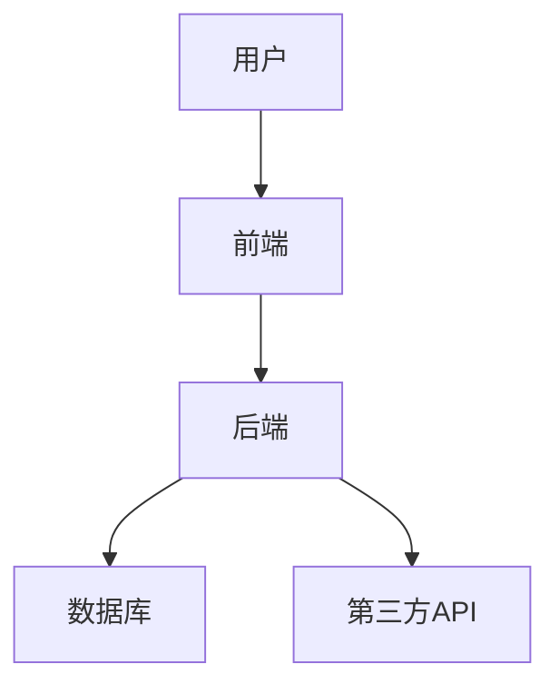
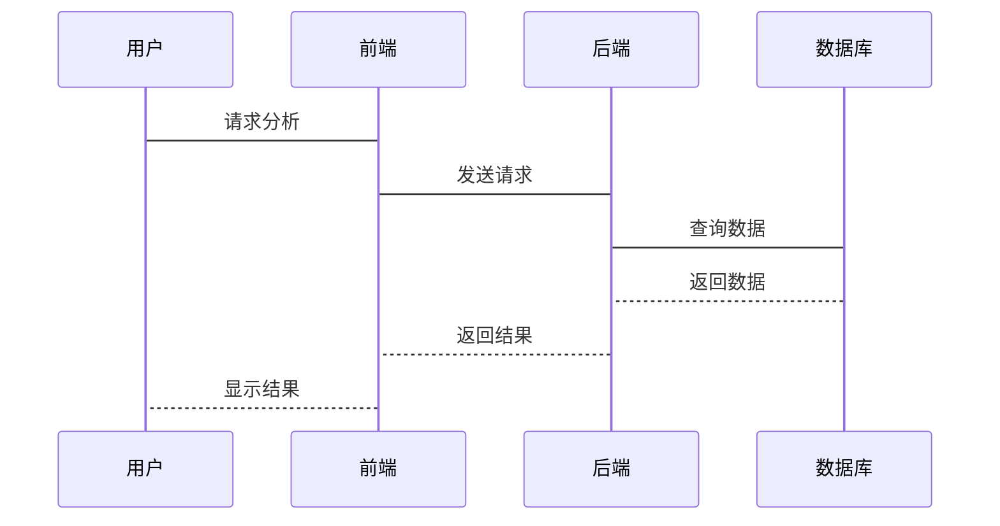

                 


# 巴菲特的财务报表分析：解读数字经济时代的新指标

---

## 关键词：
巴菲特，财务报表分析，数字经济，新指标，投资策略，价值投资

---

## 摘要：
本文深入探讨了巴菲特的财务报表分析方法，并结合数字经济时代的新特点，分析了传统财务指标与新兴指标之间的关系。文章从巴菲特的核心理念出发，详细解读了利润表、资产负债表和现金流量表的关键指标，并结合数字经济中的新业务模式，提出了用户生命周期价值、网络效应和数据资产估值等新指标。通过案例分析和系统设计，本文展示了如何将传统财务分析方法与新指标相结合，为投资者提供更全面的决策支持。

---

## 第一部分：巴菲特的财务报表分析基础

### 第1章：巴菲特的财务报表分析概述

#### 1.1 巴菲特的财务报表分析方法
##### 1.1.1 价值投资的核心理念
巴菲特的价值投资理念强调长期持有优质资产，注重企业的基本面分析。他的核心观点是：  
1. 投资的目标是寻找具有持续竞争优势的企业。  
2. 企业的价值取决于其未来现金流的折现值。  
3. 财务报表是评估企业价值的核心工具。

##### 1.1.2 财务报表分析在投资决策中的作用
财务报表分析是巴菲特投资决策的核心步骤。通过分析利润表、资产负债表和现金流量表，巴菲特能够评估企业的盈利能力、财务健康状况和现金流稳定性。

##### 1.1.3 数字经济时代的新挑战
数字经济时代，企业的业务模式和收入来源发生了巨大变化。传统财务指标可能无法完全反映企业的价值，因此需要引入新的指标，如用户生命周期价值（CLV）和网络效应。

---

#### 1.2 财务报表分析的基本框架
##### 1.2.1 利润表的核心指标
利润表反映了企业在一定会计期间内的经营成果。以下是利润表中最重要的几个指标：
1. 营业收入：企业的核心收入来源。
2. 毛利润：营业收入减去营业成本。
3. 净利润：利润表的核心指标，反映了企业的整体盈利能力。

##### 1.2.2 资产负债表的关键要素
资产负债表反映了企业在某一特定时点的财务状况。以下是资产负债表中最重要的几个要素：
1. 资产：企业拥有的资源，包括流动资产和非流动资产。
2. 负债：企业需要偿还的债务。
3. 所有者权益：企业净资产的值。

##### 1.2.3 现金流量表的重要性
现金流量表反映了企业在一定会计期间内的现金流入和流出情况。以下是现金流量表中最重要的几个部分：
1. 经营活动现金流：企业日常经营活动产生的现金流。
2. 投资活动现金流：企业投资活动产生的现金流。
3. 筹资活动现金流：企业筹资活动产生的现金流。

---

#### 1.3 巴菲特的选股标准
##### 1.3.1 高ROE（净资产收益率）的重要性
ROE（净资产收益率）是衡量企业盈利能力的重要指标。巴菲特认为，高ROE的企业具有更强的盈利能力。

##### 1.3.2 高ROA（资产净利率）的意义
ROA（资产净利率）是衡量企业资产使用效率的重要指标。高ROA的企业能够更有效地利用资产。

##### 1.3.3 高质量的财务数据要求
巴菲特非常注重财务数据的质量。他认为，高质量的财务数据是投资决策的基础。

---

### 第2章：财务报表分析的核心指标

#### 2.1 利润表分析
##### 2.1.1 营业收入与成本的分析
营业收入是企业的核心收入来源，而成本则是影响企业盈利能力的关键因素。通过分析营业收入与成本的变动，可以评估企业的成本控制能力。

##### 2.1.2 净利润的计算与影响因素
净利润是利润表的核心指标，其计算公式为：
$$ \text{净利润} = \text{营业收入} - \text{营业成本} - \text{税金及附加} - \text{销售费用} - \text{管理费用} - \text{研发费用} $$

##### 2.1.3 毛利率和净利率的对比
毛利率和净利率是衡量企业盈利能力的两个重要指标。毛利率反映了企业的成本控制能力，而净利率则反映了企业的整体盈利能力。

#### 2.2 资产负债表分析
##### 2.2.1 资产结构的合理性
资产结构的合理性是衡量企业财务健康状况的重要指标。通过分析资产结构，可以评估企业的经营风险。

##### 2.2.2 负债水平的健康性
负债水平的健康性是衡量企业财务健康状况的另一个重要指标。通过分析负债水平，可以评估企业的偿债能力。

##### 2.2.3 所有者权益的变化
所有者权益的变化反映了企业净资产的变动情况。通过分析所有者权益的变化，可以评估企业的财务稳定性。

#### 2.3 现金流量表分析
##### 2.3.1 经营活动现金流的重要性
经营活动现金流是企业日常经营活动产生的现金流。健康的经营活动现金流是企业财务健康的重要标志。

##### 2.3.2 投资活动现金流的解读
投资活动现金流反映了企业在投资活动中的现金流情况。通过分析投资活动现金流，可以评估企业的投资策略。

##### 2.3.3 筹资活动现金流的分析
筹资活动现金流反映了企业在筹资活动中的现金流情况。通过分析筹资活动现金流，可以评估企业的融资能力。

---

### 第3章：巴菲特的选股标准与财务指标

#### 3.1 高ROE的选股策略
##### 3.1.1 ROE的计算公式
ROE（净资产收益率）的计算公式为：
$$ \text{ROE} = \frac{\text{净利润}}{\text{净资产}} $$

##### 3.1.2 高ROE公司的特征
高ROE的公司通常具有较强的盈利能力，但需要注意的是，高ROE并不一定意味着公司具有长期竞争优势。

##### 3.1.3 如何避免高ROE的陷阱
为了避免高ROE的陷阱，投资者需要关注公司的财务杠杆和资产周转率。

#### 3.2 高ROA的选股策略
##### 3.2.1 ROA的计算公式
ROA（资产净利率）的计算公式为：
$$ \text{ROA} = \frac{\text{净利润}}{\text{总资产}} $$

##### 3.2.2 高ROA公司的特征
高ROA的公司通常具有较高的资产使用效率，但需要注意的是，高ROA并不一定意味着公司具有长期竞争优势。

##### 3.2.3 如何结合ROE和ROA进行分析
通过结合ROE和ROA进行分析，可以更全面地评估公司的盈利能力。

#### 3.3 高质量财务数据的判断
##### 3.3.1 财务数据的真实性
财务数据的真实性是投资决策的基础。投资者需要关注财务数据的来源和审计意见。

##### 3.3.2 财务数据的透明度
财务数据的透明度是衡量公司治理的重要指标。透明度高的公司通常具有较高的财务信誉。

##### 3.3.3 财务数据的可比性
财务数据的可比性是评估公司业绩的重要因素。投资者需要关注行业特点和会计政策的差异。

---

### 第4章：数字经济时代的新指标

#### 4.1 数字经济的核心特征
##### 4.1.1 数字经济的定义与特点
数字经济是指以数字技术为核心驱动力的经济形态。其核心特征包括数字化、网络化和智能化。

##### 4.1.2 数字经济对传统财务指标的影响
数字经济对传统财务指标的影响主要体现在收入来源和成本结构的变化上。例如，互联网企业的主要收入来源是用户付费，而传统企业的收入来源是产品销售。

##### 4.1.3 数字经济中的新业务模式
数字经济中的新业务模式包括订阅制、广告模式和数据变现等。

#### 4.2 数字经济时代的新财务指标
##### 4.2.1 用户生命周期价值（CLV）
用户生命周期价值（CLV）是衡量用户对企业价值的重要指标。其计算公式为：
$$ \text{CLV} = \text{平均收入} \times \text{用户生命周期长度} - \text{获取成本} $$

##### 4.2.2 网络效应的量化
网络效应是指随着用户数量的增加，产品或服务的价值也增加。网络效应的量化可以通过用户增长速度和用户参与度来衡量。

##### 4.2.3 数据资产的估值
数据资产是数字经济中的重要资源。数据资产的估值需要考虑数据的稀缺性、可用性和潜在价值。

#### 4.3 新指标与传统指标的结合
##### 4.3.1 如何将CLV与ROE结合
通过将CLV与ROE结合，可以更全面地评估企业的盈利能力。例如，互联网企业的CLV可以作为ROE的补充指标。

##### 4.3.2 如何将网络效应与ROA结合
通过将网络效应与ROA结合，可以评估企业的资产使用效率。例如，社交平台的网络效应可以提高资产的使用效率。

##### 4.3.3 如何将数据资产与现金流结合
通过将数据资产与现金流结合，可以评估企业的财务健康状况。例如，数据资产的变现能力可以影响企业的现金流。

---

### 第5章：系统架构与项目实战

#### 5.1 系统架构设计
##### 5.1.1 问题场景介绍
数字经济时代，企业的财务分析需要结合传统指标和新指标。为了实现这一目标，我们需要设计一个综合性的财务分析系统。

##### 5.1.2 系统功能设计
系统功能包括数据采集、指标计算、数据分析和结果展示。

##### 5.1.3 系统架构设计
以下是系统的架构图：



##### 5.1.4 系统接口设计
系统接口包括数据接口和用户接口。数据接口用于获取企业的财务数据，用户接口用于展示分析结果。

##### 5.1.5 系统交互设计
以下是系统的交互图：



#### 5.2 项目实战
##### 5.2.1 环境安装
需要安装Python、Jupyter Notebook和相关库（如Pandas、Matplotlib）。

##### 5.2.2 核心实现源代码
以下是实现用户生命周期价值（CLV）的Python代码：

```python
import pandas as pd
import numpy as np

# 假设我们有一个用户数据表，包含用户ID、购买金额和购买频率
data = {
    '用户ID': [1, 2, 3, 4, 5],
    '购买金额': [100, 200, 300, 400, 500],
    '购买频率': [1, 2, 3, 4, 5]
}
df = pd.DataFrame(data)

# 计算CLV
def calculate_clv(row):
    return row['购买金额'] * row['购买频率']

df['CLV'] = df.apply(lambda row: calculate_clv(row), axis=1)
print(df)
```

##### 5.2.3 代码应用解读与分析
通过上述代码，我们可以计算出每个用户的CLV。CLV可以帮助我们评估用户的生命周期价值，从而为投资决策提供支持。

##### 5.2.4 实际案例分析
以一家互联网公司为例，通过分析其用户数据，我们可以计算出用户的CLV，并结合ROE等传统指标，评估其投资价值。

##### 5.2.5 项目小结
通过项目实战，我们可以将理论知识应用于实际投资决策中，从而提高我们的分析能力。

---

### 第6章：总结与展望

#### 6.1 总结
本文从巴菲特的财务报表分析方法出发，结合数字经济时代的新特点，分析了传统财务指标与新指标之间的关系。通过系统设计和项目实战，我们展示了如何将传统财务分析方法与新指标相结合，为投资者提供更全面的决策支持。

#### 6.2 展望
未来，随着数字经济的进一步发展，我们将需要更多的新指标来评估企业的价值。投资者需要不断学习和创新，以适应数字经济时代的变化。

---

## 作者：AI天才研究院/AI Genius Institute & 禅与计算机程序设计艺术 /Zen And The Art of Computer Programming

