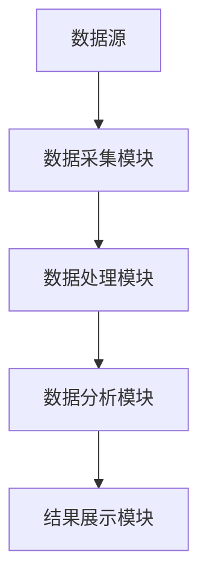

                 


# 巴菲特的财务报表分析：解读数据驱动企业的新指标

> **关键词**：巴菲特、财务报表分析、数据驱动、企业分析、新指标  
> **摘要**：本文深入探讨了巴菲特的财务报表分析方法，并结合现代数据驱动技术，引入新的分析指标，为企业分析提供新的视角和工具。文章从巴菲特的核心理念出发，分析其经典指标的数学模型，结合系统架构设计，最终通过实际案例展示新指标的应用，为企业分析提供实践指导。

---

## 第一部分：巴菲特的财务报表分析基础

### 第1章：财务报表分析的背景与重要性

#### 1.1 财务报表分析的核心概念

**1.1.1 什么是财务报表分析**

财务报表分析是通过对企业的财务报表（资产负债表、利润表、现金流量表）进行深入研究，评估企业的财务状况、经营成果和现金流量，从而为企业决策提供支持。它是企业分析的重要组成部分，也是投资者评估企业价值的关键工具。

**1.1.2 财务报表分析的三大报表**

1. **资产负债表**：反映企业在某一特定日期的资产、负债和所有者权益的状况。
2. **利润表**：反映企业在一定会计期间的收入、费用和利润情况。
3. **现金流量表**：反映企业在一定会计期间的现金流入和流出情况。

**1.1.3 财务报表分析的工具与方法**

- **比率分析法**：通过计算各项财务指标，评估企业的盈利能力、偿债能力和运营效率。
- **趋势分析法**：通过比较不同期间的财务数据，分析企业的财务状况变化趋势。
- **行业比较法**：将企业的财务指标与行业平均水平进行对比，评估企业的行业地位。

#### 1.2 巴菲特的分析框架

**1.2.1 巴菲特的价值投资理念**

巴菲特的价值投资理念强调长期投资、安全边际和内在价值。他认为，企业的内在价值是其未来现金流的现值，而财务报表分析是评估企业内在价值的重要工具。

**1.2.2 巴菲特的财务报表分析方法**

巴菲特通过分析企业的财务报表，重点关注企业的盈利能力、财务健康状况和成长能力。他特别关注以下几个方面：
- **盈利能力**：通过ROE（股东权益回报率）、ROA（资产回报率）、EPS（每股收益）等指标评估企业的盈利能力。
- **财务健康状况**：通过流动比率、速动比率、负债率等指标评估企业的偿债能力和财务风险。
- **成长能力**：通过收入增长率、净利润增长率等指标评估企业的成长潜力。

**1.2.3 巴菲特分析框架的核心要素**

- **盈利能力**：ROE、ROA、EPS等指标。
- **财务健康状况**：流动比率、速动比率、负债率等指标。
- **成长能力**：收入增长率、净利润增长率等指标。

#### 1.3 数据驱动的企业分析新趋势

**1.3.1 数据驱动的定义与特点**

数据驱动是指通过收集、处理和分析大量数据，利用数据的洞察力来支持决策的过程。数据驱动的企业分析强调数据的准确性和实时性，依赖于先进的数据分析工具和技术。

**1.3.2 数据驱动在企业分析中的应用**

- **预测分析**：通过历史数据和机器学习模型，预测企业的未来财务状况和市场表现。
- **实时监控**：利用实时数据，及时发现和解决问题，优化企业运营。
- **决策支持**：通过数据驱动的分析，为企业战略决策提供科学依据。

**1.3.3 新指标对企业分析的影响**

随着数据技术的发展，一些新的指标和方法逐渐被引入企业分析，例如：
- **EBITDA**：息税折旧及摊销前利润，用于评估企业的经营效率。
- **经济利润**：通过扣除资本成本，评估企业的真正盈利能力。

---

### 第2章：巴菲特的核心分析指标

#### 2.1 核心指标解析

**2.1.1 股东权益回报率（ROE）**

ROE是衡量企业盈利能力的重要指标，公式为：
$$ROE = \frac{\text{净利润}}{\text{股东权益}}$$

ROE越高，说明企业利用股东权益创造利润的能力越强。例如，假设某企业净利润为1000万元，股东权益为5000万元，则ROE为20%。

**2.1.2 资产回报率（ROA）**

ROA是衡量企业资产利用效率的重要指标，公式为：
$$ROA = \frac{\text{净利润}}{\text{总资产}}$$

ROA越高，说明企业利用资产创造利润的能力越强。例如，假设某企业净利润为1000万元，总资产为1亿元，则ROA为10%。

**2.1.3 每股收益（EPS）**

EPS是衡量企业每股股票盈利能力的指标，公式为：
$$EPS = \frac{\text{净利润}}{\text{普通股股数}}$$

EPS越高，说明每股股票的盈利能力越强。例如，假设某企业净利润为1000万元，普通股股数为1000万股，则EPS为1元。

#### 2.2 核心指标之间的关系

**2.2.1 ROE、ROA和EPS的关系**

ROE、ROA和EPS之间存在密切关系。例如，ROE可以通过ROA和资产使用效率来影响EPS，进而影响企业的整体价值。

**2.2.2 指标之间的相互影响**

ROE、ROA和EPS指标相互关联，共同反映了企业的盈利能力。ROE高意味着股东权益回报高，ROA高意味着资产利用效率高，而EPS高意味着每股盈利能力高。

**2.2.3 指标对企业价值的影响**

高ROE、高ROA和高EPS通常意味着企业具有较高的盈利能力，从而提升企业的市场价值和股东信心。

#### 2.3 新指标的引入

**2.3.1 新指标的定义与特点**

新指标包括EBITDA、经济利润等，这些指标能够更全面地反映企业的财务状况和盈利能力。

**2.3.2 新指标与传统指标的对比**

- **EBITDA**：与ROE、ROA等传统指标相比，EBITDA更注重企业经营的现金流情况，不考虑利息、税金、折旧和摊销等因素。
- **经济利润**：与EPS相比，经济利润考虑了资本成本，能够更准确地衡量企业的真正盈利能力。

**2.3.3 新指标对企业分析的补充作用**

新指标能够弥补传统指标的不足，提供更全面的财务分析视角。例如，EBITDA可以帮助企业更好地评估其经营效率，而经济利润可以帮助企业更好地评估其资本回报率。

---

### 第3章：巴菲特的财务报表分析方法

#### 3.1 从单个指标到整体分析

**3.1.1 单个指标的分析步骤**

1. **数据收集**：收集企业的财务报表数据。
2. **数据清洗**：处理数据中的异常值和缺失值。
3. **指标计算**：根据公式计算ROE、ROA、EPS等指标。
4. **结果解读**：分析指标的含义和对企业价值的影响。

**3.1.2 多个指标的综合分析**

通过综合分析多个指标，可以更全面地评估企业的财务状况和盈利能力。例如，结合ROE、ROA和EPS指标，可以更好地判断企业的综合盈利能力。

**3.1.3 分析结果的综合判断**

综合判断分析结果，得出企业的财务状况和投资价值。例如，如果ROE、ROA和EPS均较高，说明企业具有较高的盈利能力，值得投资。

#### 3.2 财务报表分析的步骤

**3.2.1 收集数据**

收集企业的财务报表数据，包括资产负债表、利润表和现金流量表。

**3.2.2 数据清洗与预处理**

处理数据中的异常值和缺失值，确保数据的准确性和完整性。

**3.2.3 数据分析与建模**

使用数据分析工具（如Excel、Python等）对数据进行分析，建立数学模型（如ROE、ROA模型）。

**3.2.4 结果解读与决策**

根据分析结果，解读企业的财务状况，制定投资决策。

#### 3.3 巴菲特分析方法的数学模型

**3.3.1 ROE的计算公式**

$$ROE = \frac{\text{净利润}}{\text{股东权益}}$$

**3.3.2 ROA的计算公式**

$$ROA = \frac{\text{净利润}}{\text{总资产}}$$

**3.3.3 EPS的计算公式**

$$EPS = \frac{\text{净利润}}{\text{普通股股数}}$$

---

### 第4章：系统架构与数据驱动分析

#### 4.1 数据驱动分析的系统架构

**4.1.1 数据采集模块**

通过API或数据库接口采集企业的财务数据。

**4.1.2 数据处理模块**

对采集的数据进行清洗和预处理，确保数据的准确性和完整性。

**4.1.3 数据分析模块**

使用数据分析工具（如Python、R）对数据进行分析，计算ROE、ROA、EPS等指标。

**4.1.4 结果展示模块**

将分析结果以图表或报告的形式展示，帮助用户理解和决策。

#### 4.2 系统架构的Mermaid图



#### 4.3 数据分析模块的功能设计

**4.3.1 数据清洗与预处理**

使用Python的Pandas库对数据进行清洗和预处理：
```python
import pandas as pd

# 读取数据
data = pd.read_csv('financial_data.csv')

# 处理缺失值
data.dropna(inplace=True)

# 处理异常值
data = data[data['收入'] > 0]
```

**4.3.2 指标计算与分析**

计算ROE、ROA、EPS等指标：
```python
# 计算ROE
data['ROE'] = data['净利润'] / data['股东权益']

# 计算ROA
data['ROA'] = data['净利润'] / data['总资产']

# 计算EPS
data['EPS'] = data['净利润'] / data['普通股股数']
```

**4.3.3 可视化展示**

使用Matplotlib或Seaborn库对分析结果进行可视化展示：
```python
import matplotlib.pyplot as plt

# 绘制ROE趋势图
plt.plot(data['年份'], data['ROE'])
plt.xlabel('年份')
plt.ylabel('ROE')
plt.title('ROE趋势图')
plt.show()
```

---

## 第五章：项目实战

### 5.1 环境安装

安装必要的数据分析工具和库：
- Python 3.8+
- Pandas、NumPy、Matplotlib、Seaborn
- Jupyter Notebook（可选）

### 5.2 系统核心实现源代码

以下是一个完整的Python代码示例：
```python
import pandas as pd
import matplotlib.pyplot as plt

# 读取数据
data = pd.read_csv('financial_data.csv')

# 数据清洗
data.dropna(inplace=True)
data = data[data['收入'] > 0]

# 计算指标
data['ROE'] = data['净利润'] / data['股东权益']
data['ROA'] = data['净利润'] / data['总资产']
data['EPS'] = data['净利润'] / data['普通股股数']

# 可视化
plt.figure(figsize=(12, 6))
plt.plot(data['年份'], data['ROE'], label='ROE')
plt.plot(data['年份'], data['ROA'], label='ROA')
plt.plot(data['年份'], data['EPS'], label='EPS')
plt.xlabel('年份')
plt.ylabel('比率')
plt.title('ROE、ROA和EPS趋势图')
plt.legend()
plt.show()
```

### 5.3 代码应用解读与分析

上述代码展示了如何使用Python进行数据清洗、计算和可视化。通过计算ROE、ROA和EPS等指标，并绘制趋势图，可以直观地分析企业的财务状况和盈利能力。

### 5.4 实际案例分析

以某公司为例，分析其财务状况：
1. **数据收集**：收集该公司的财务报表数据。
2. **数据清洗**：处理数据中的异常值和缺失值。
3. **指标计算**：计算ROE、ROA和EPS等指标。
4. **结果解读**：根据计算结果，评估企业的盈利能力，制定投资决策。

### 5.5 项目小结

通过项目实战，我们可以看到，巴菲特的财务报表分析方法在现代数据驱动分析中仍然具有重要的应用价值。结合Python等数据分析工具，我们可以更高效地计算和分析财务指标，为企业决策提供科学依据。

---

## 第六章：总结与展望

### 6.1 总结

本文从巴菲特的财务报表分析方法出发，结合现代数据驱动技术，引入新的分析指标，为企业分析提供了新的视角和工具。通过系统的分析和实际案例的展示，我们看到了这些方法在实践中的应用价值。

### 6.2 最佳实践 tips

1. 在进行财务报表分析时，建议结合多个指标进行综合分析，以全面评估企业的财务状况。
2. 数据清洗和预处理是数据分析的重要步骤，建议在分析前仔细处理数据。
3. 可视化是数据展示的重要手段，建议使用图表直观展示分析结果。

### 6.3 小结

巴菲特的财务报表分析方法不仅是投资决策的重要工具，也是企业分析的重要参考。通过本文的介绍，我们看到了这些方法在现代数据驱动分析中的应用潜力。

### 6.4 注意事项

在进行财务报表分析时，需要注意数据的准确性和完整性，避免因数据问题导致分析结果的偏差。同时，需要结合企业的实际情况，灵活运用各种分析方法和工具。

### 6.5 拓展阅读

1. 巴菲特的《投资哲学》
2. 数据分析工具：《Python数据分析实战》
3. 财务报表分析：《财务报表分析与股票投资》

---

## 作者信息

作者：AI天才研究院/AI Genius Institute  
联系邮箱：contact@aigenius.org  
个人简介：专注于人工智能、大数据分析和程序设计，致力于通过技术创新为企业提供智能化解决方案。

---

**全文完**

