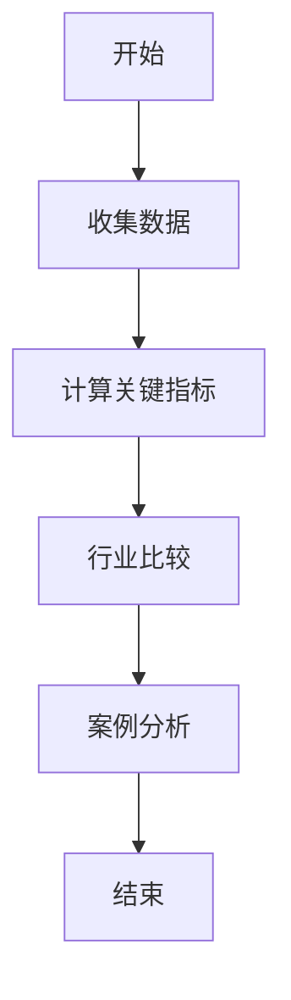
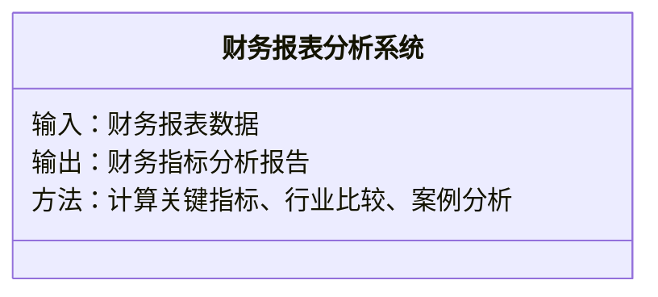
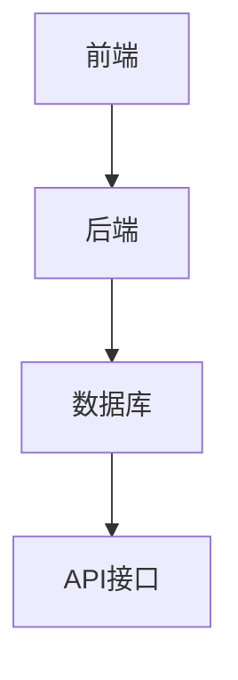

                 


# 巴菲特的财务报表分析：解读量子科技公司的新指标

> 关键词：巴菲特，财务报表分析，量子科技，投资策略，新指标

> 摘要：本文详细探讨巴菲特的财务报表分析方法，特别是针对量子科技公司的新指标。通过分析核心财务指标、量子科技公司的独特性以及实际案例，揭示如何结合传统与创新方法进行投资决策。

---

# 第1章 巴菲特的投资理念与财务报表分析概述

## 1.1 巴菲特的价值投资理论

### 1.1.1 价值投资的核心理念

价值投资是巴菲特投资哲学的核心，强调以低于内在价值的价格买入优质资产。通过分析财务报表，巴菲特评估公司的盈利能力、成长潜力和财务健康状况，寻找具有长期竞争优势的企业。

### 1.1.2 财务报表分析的重要性

财务报表是企业财务状况的晴雨表。通过分析资产负债表、利润表和现金流量表，巴菲特识别企业的财务风险、盈利能力和现金流健康状况。

### 1.1.3 科技公司的财务分析挑战

量子科技公司作为高科技企业，研发投入大、无形资产多、客户获取成本高，传统财务指标可能无法全面反映其价值。因此，需要引入新指标，如研发投入占收入比例、客户获取成本等。

---

# 第2章 财务报表核心指标分析

## 2.1 资产负债表分析

### 2.1.1 资产、负债与所有者权益的构成

资产分为流动资产和非流动资产，负债分为流动负债和非流动负债。所有者权益包括股本、资本公积、盈余公积和未分配利润。分析这些部分有助于评估企业的偿债能力和资本结构。

### 2.1.2 资产负债率与偿债能力分析

$$\text{资产负债率} = \frac{\text{总负债}}{\text{总资产}} \times 100\%$$

低资产负债率表明企业财务风险较低，但可能资本利用效率不高。高资产负债率可能意味着较高的偿债压力，但也可能带来更高的杠杆收益。

### 2.1.3 资产周转率与运营效率分析

$$\text{资产周转率} = \frac{\text{营业收入}}{\text{平均总资产}}$$

高资产周转率表明企业利用资产产生收入的能力强。对于科技公司，资产周转率可能较低，但高研发投入可能带来未来的收益增长。

## 2.2 利润表分析

### 2.2.1 收入与成本的构成

营业收入包括主营业务收入和其他业务收入。营业成本包括直接材料、直接人工和制造费用。分析收入和成本结构有助于评估企业的盈利能力和成本控制能力。

### 2.2.2 净利润与盈利能力分析

$$\text{净利润} = \text{营业收入} - \text{营业成本} - \text{税金及附加} - \text{销售费用} - \text{管理费用} - \text{研发费用} - \text{财务费用}$$

净利润是企业盈利能力的核心指标。对于科技公司，高研发投入可能会影响短期净利润，但可能带来长期的收益增长。

### 2.2.3 毛利率与营业利润率的计算

$$\text{毛利率} = \frac{\text{营业收入} - \text{营业成本}}{\text{营业收入}} \times 100\%$$

$$\text{营业利润率} = \frac{\text{营业利润}}{\text{营业收入}} \times 100\%$$

毛利率和营业利润率反映了企业的定价能力和成本控制能力。对于科技公司，高毛利率可能表明产品具有较高的附加值和市场竞争力。

## 2.3 现金流量表分析

### 2.3.1 经营活动、投资活动与筹资活动的现金流

经营活动现金流反映了企业主营业务的现金流入和流出。投资活动现金流反映了企业投资于长期资产的现金流出。筹资活动现金流反映了企业通过融资活动获得或偿还的债务。

### 2.3.2 现金流量与企业流动性分析

$$\text{现金流动性比率} = \frac{\text{经营活动现金流净额}}{\text{流动负债}}$$

该比率越高，企业偿还短期债务的能力越强。对于科技公司，经营活动现金流净额可能为负，但通过外部融资维持流动性。

### 2.3.3 现金流量表对财务健康度的评估

通过分析现金流量表，可以评估企业的现金流健康状况，预测未来的财务风险和流动性。

## 2.4 财务指标综合分析

### 2.4.1 常见财务指标的综合运用

综合运用ROE、ROA、毛利率等指标，全面评估企业的盈利能力、资产利用效率和财务健康状况。

### 2.4.2 财务指标的行业比较

将企业的财务指标与行业平均水平进行比较，评估企业的相对表现。

---

# 第3章 巴菲特的财务报表分析方法

## 3.1 巴菲特的十二条投资原则

### 3.1.1 投资原则一：只投资你理解的公司

巴菲特强调投资于自己理解的行业和公司，避免盲目跟风。

### 3.1.2 投资原则二：注重企业的盈利能力

通过分析净利润、毛利率等指标，评估企业的盈利能力。

### 3.1.3 投资原则三：关注企业的财务健康状况

通过分析资产负债率、现金流等指标，评估企业的财务健康状况。

## 3.2 巴菲特的财务分析方法

### 3.2.1 财务报表分析的步骤

1. **收集数据**：获取企业的财务报表和相关行业数据。
2. **计算关键指标**：计算ROE、ROA、毛利率等关键指标。
3. **行业比较**：将企业的财务指标与行业平均水平进行比较。
4. **案例分析**：通过实际案例分析，验证分析方法的有效性。

### 3.2.2 巴菲特的经典案例分析

以巴菲特分析可口可乐为例，说明如何通过财务报表分析评估企业的长期竞争优势。

---

# 第4章 量子科技公司的财务报表分析

## 4.1 量子科技公司的独特性

### 4.1.1 高研发投入

量子科技公司的研发投入占比较高，需要通过分析研发投入占收入比例，评估其对长期收益的影响。

### 4.1.2 无形资产的重要性

量子科技公司依赖无形资产（如专利、技术）创造价值，需要通过分析无形资产价值和研发投入的匹配性，评估其长期发展潜力。

### 4.1.3 客户获取成本

量子科技公司可能面临较高的客户获取成本，需要通过分析客户获取成本占收入比例，评估其客户获取效率和未来的客户群扩展能力。

## 4.2 新指标的引入与分析

### 4.2.1 研发投入占收入比例

$$\text{研发投入占收入比例} = \frac{\text{研发费用}}{\text{营业收入}} \times 100\%$$

高研发投入比例可能表明公司致力于技术创新，但也可能影响短期 profitability。

### 4.2.2 无形资产价值评估

通过分析无形资产的账面价值和市场价值，评估其对公司的长期价值影响。

### 4.2.3 客户获取成本

$$\text{客户获取成本} = \text{销售费用} - \text{广告费用} - \text{其他销售费用}$$

高客户获取成本可能表明公司在市场竞争中投入较大，但也可能通过获取更多的客户带来长期收益。

---

# 第5章 数学模型与算法原理

## 5.1 财务指标的计算与分析

### 5.1.1 ROE计算

$$\text{ROE} = \frac{\text{净利润}}{\text{平均所有者权益}} \times 100\%$$

ROE反映了股东投资的回报率。对于科技公司，高ROE可能表明公司有效地利用股东资金创造利润。

### 5.1.2 ROA计算

$$\text{ROA} = \frac{\text{净利润}}{\text{平均总资产}} \times 100\%$$

ROA反映了资产的使用效率。对于科技公司，高ROA可能表明公司有效地利用资产创造利润。

## 5.2 算法流程图



---

# 第6章 系统分析与架构设计

## 6.1 问题场景介绍

### 6.1.1 背景介绍

量子科技公司面临高研发投入和客户获取成本高的挑战，需要通过财务报表分析评估其长期发展潜力。

### 6.1.2 项目介绍

通过构建一个财务报表分析系统，帮助投资者评估量子科技公司的财务健康状况和长期发展潜力。

## 6.2 系统功能设计

### 6.2.1 领域模型



### 6.2.2 系统架构设计



---

# 第7章 项目实战

## 7.1 环境安装

### 7.1.1 安装Python

```bash
python --version
pip install numpy pandas matplotlib
```

## 7.2 核心实现

### 7.2.1 计算ROE

```python
import pandas as pd

# 读取财务报表数据
df = pd.read_csv('financials.csv')

# 计算ROE
roe = df['净利润'] / df['平均所有者权益'] * 100
print('ROE:', roe)
```

### 7.2.2 绘制ROE趋势图

```python
import matplotlib.pyplot as plt

plt.plot(df['年份'], df['ROE'])
plt.title('ROE 趋势图')
plt.xlabel('年份')
plt.ylabel('ROE (%)')
plt.show()
```

## 7.3 实际案例分析

### 7.3.1 量子科技公司案例

分析某量子科技公司的财务报表，计算其ROE、研发投入占收入比例等指标，评估其财务健康状况和长期发展潜力。

---

# 第8章 总结与展望

## 8.1 总结

通过分析巴菲特的财务报表分析方法，特别是针对量子科技公司的新指标，投资者可以更好地评估企业的长期价值。结合传统财务指标和行业特点，制定合理的投资策略。

## 8.2 展望

未来，随着量子科技的快速发展，更多的新指标和分析方法将被引入，投资者需要不断学习和更新分析工具，以应对新的挑战。

---

作者：AI天才研究院/AI Genius Institute & 禅与计算机程序设计艺术 /Zen And The Art of Computer Programming

