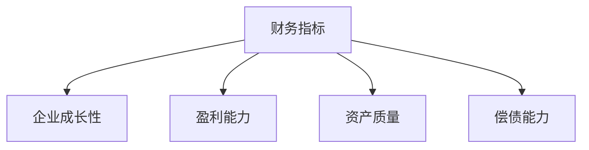
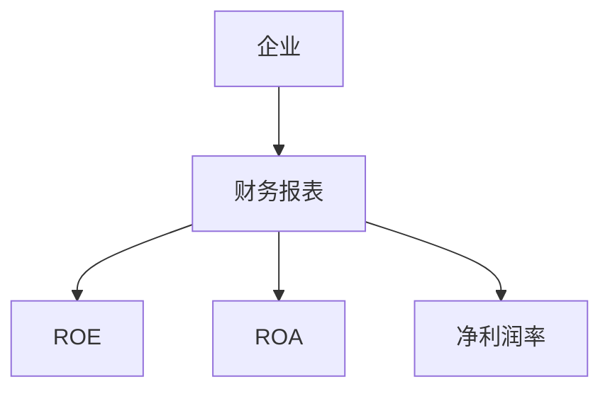
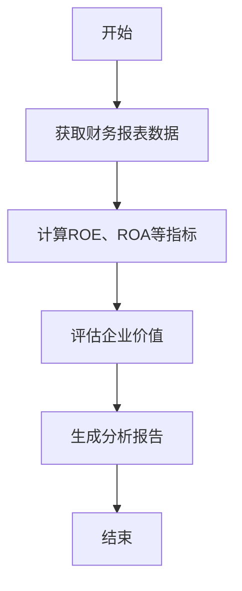

                 


# 巴菲特的财务报表深度解析：数字背后的商业逻辑

> **关键词**：巴菲特、财务报表分析、ROE、ROA、企业价值评估、投资哲学、投资策略  
> **摘要**：本文深入解析巴菲特的财务报表分析方法，探讨其背后的商业逻辑。通过详细讲解ROE、ROA等关键财务指标，结合实际案例和系统架构设计，帮助读者掌握巴菲特的投资哲学和财务分析框架，实现对企业价值的准确评估。

---

## 第一部分: 巴菲特的财务报表分析基础

### 第1章: 巴菲特投资理念与财务报表分析概述

#### 1.1 巴菲特投资哲学与财务报表分析的关系
##### 1.1.1 巴菲特的投资哲学概述
巴菲特的投资哲学以“价值投资”为核心，强调通过深入分析企业的财务状况、行业地位和管理团队，寻找具有持续竞争优势的企业。他的投资策略注重长期稳健回报，而非短期市场波动。

##### 1.1.2 财务报表分析在巴菲特投资中的核心地位
财务报表是巴菲特评估企业价值的核心工具。通过分析财务报表，他能够识别企业的盈利能力、资产质量、偿债能力等关键指标，进而判断企业是否具有长期投资价值。

##### 1.1.3 巴菲特分析方法的演变与特点
巴菲特的财务分析方法经历了多年演变，形成了以ROE（股东权益回报率）和ROA（资产回报率）为核心的分析体系。他强调通过财务指标的量化分析，结合企业基本面，寻找具有持续盈利能力的企业。

---

#### 1.2 财务报表分析的基本框架
##### 1.2.1 财务报表的构成与作用
财务报表主要包括资产负债表、利润表和现金流量表。这些报表分别反映了企业的财务状况、经营成果和现金流量，是分析企业价值的重要依据。

##### 1.2.2 巴菲特的财务报表分析框架
巴菲特的分析框架强调以下几点：
1. **盈利能力**：通过ROE、ROA等指标评估企业的盈利能力。
2. **资产质量**：分析企业的资产结构和资产周转率，判断资产的效率和质量。
3. **偿债能力**：通过资产负债率、流动比率等指标评估企业的偿债能力。
4. **成长能力**：分析企业的收入增长率和净利润增长率，判断企业的成长潜力。

##### 1.2.3 财务报表分析的边界与外延
巴菲特的财务分析不仅关注财务报表本身，还注重将财务数据与企业实际经营状况相结合。他强调分析企业的竞争优势、行业地位和管理团队，以全面评估企业的长期价值。

---

## 第二部分: 巴菲特的财务报表分析核心概念

### 第2章: 核心概念与定义

#### 2.1 核心概念与定义
##### 2.1.1 财务报表的核心要素
- **资产负债表**：反映企业在某一特定时点的资产、负债和所有者权益。
- **利润表**：反映企业在一定会计期间内的收入、费用和利润。
- **现金流量表**：反映企业在一定会计期间内的现金流入和流出情况。

##### 2.1.2 巴菲特的财务比率分析方法
巴菲特常用以下财务比率进行分析：
- **ROE（股东权益回报率）**：衡量企业每单位股东权益创造的净利润。
- **ROA（资产回报率）**：衡量企业每单位资产创造的净利润。
- **净利润率**：衡量企业每单位收入创造的净利润。

##### 2.1.3 企业价值评估的关键指标
- **市盈率（P/E）**：股价与每股收益的比率，反映市场对企业的估值。
- **市净率（P/B）**：股价与每股净资产的比率，反映企业资产的估值。
- **股息率**：股息与股价的比率，反映企业的分红能力。

---

#### 2.2 核心概念的联系与对比
##### 2.2.1 财务比率与企业价值的对比分析
通过对比ROE、ROA等财务比率，可以评估企业的盈利能力。例如，ROE高的企业可能具有更强的盈利能力，但需要结合企业的资产规模和行业特点进行综合分析。

##### 2.2.2 财务报表项目与企业经营状况的关系
企业资产质量、负债结构和收入来源等都与财务报表项目密切相关。例如，高负债率可能意味着企业面临较高的偿债压力，而高收入增长率可能表明企业具有较强的市场竞争力。

##### 2.2.3 财务指标与企业成长性的实体关系图
通过Mermaid图展示财务指标与企业成长性的关系：


---

### 第3章: 巴菲特的财务指标分析方法

#### 3.1 核心财务指标的计算与分析
##### 3.1.1 股东权益回报率（ROE）的计算
$$ROE = \frac{\text{净利润}}{\text{股东权益}}$$
ROE越高，表明企业每单位股东权益创造的净利润越高，企业的盈利能力越强。

##### 3.1.2 资产回报率（ROA）的计算
$$ROA = \frac{\text{净利润}}{\text{总资产}}$$
ROA越高，表明企业每单位资产创造的净利润越高，企业的资产利用效率越高。

##### 3.1.3 净利润率（Net Profit Margin）的计算
$$\text{净利润率} = \frac{\text{净利润}}{\text{营业收入}} \times 100\%$$
净利润率越高，表明企业每单位收入创造的净利润越高，企业的盈利能力越强。

---

#### 3.2 财务指标分析的数学模型与公式
##### 3.2.1 ROE的计算公式
$$ROE = \frac{\text{净利润}}{\text{股东权益}}$$
例如，某企业净利润为100万元，股东权益为500万元，则ROE = 100/500 = 0.2，即20%。

##### 3.2.2 ROA的计算公式
$$ROA = \frac{\text{净利润}}{\text{总资产}}$$
例如，某企业净利润为80万元，总资产为400万元，则ROA = 80/400 = 0.2，即20%。

##### 3.2.3 净利润率的计算公式
$$\text{净利润率} = \frac{\text{净利润}}{\text{营业收入}} \times 100\%$$
例如，某企业净利润为60万元，营业收入为300万元，则净利润率 = (60/300) × 100% = 20%。

---

## 第三部分: 巴菲特财务分析的系统架构

### 第4章: 系统分析与架构设计

#### 4.1 系统分析框架
##### 4.1.1 企业分析模型
通过Mermaid图展示企业分析模型：


##### 4.1.2 财务报表分析的系统架构
系统架构包括以下模块：
1. **数据输入**：获取企业的财务报表数据。
2. **数据处理**：计算各项财务指标。
3. **分析与评估**：根据财务指标评估企业价值。
4. **结果输出**：生成分析报告。

##### 4.1.3 分析流程图
通过Mermaid图展示分析流程：


#### 4.2 系统架构设计
##### 4.2.1 分析框架的模块划分
系统分为数据输入、数据处理、分析与评估、结果输出四个模块。

##### 4.2.2 各模块之间的关系
- 数据输入模块提供财务报表数据。
- 数据处理模块计算各项财务指标。
- 分析与评估模块根据财务指标评估企业价值。
- 结果输出模块生成分析报告。

##### 4.2.3 系统接口设计
系统接口包括：
- 数据输入接口：接收财务报表数据。
- 数据处理接口：调用财务指标计算函数。
- 结果输出接口：生成分析报告。

---

## 第四部分: 巴菲特分析方法的实战应用

### 第5章: 实战案例分析

#### 5.1 实战案例分析
##### 5.1.1 可口可乐的财务分析
通过分析可口可乐的财务报表，计算其ROE、ROA和净利润率，评估其盈利能力。

##### 5.1.2 苹果公司的财务分析
通过分析苹果公司的财务报表，计算其ROE、ROA和净利润率，评估其资产利用效率和盈利能力。

##### 5.1.3 案例分析的总结与启示
总结案例分析的结果，得出可口可乐和苹果公司的财务表现，为读者提供实际操作的参考。

#### 5.2 代码实现与解读
##### 5.2.1 财务指标计算的Python代码
```python
def calculate_roe(net_profit, shareholders_equity):
    return net_profit / shareholders_equity

def calculate_roa(net_profit, total_assets):
    return net_profit / total_assets

def calculate_net_profit_margin(net_profit, operating_revenue):
    return (net_profit / operating_revenue) * 100

# 示例数据
net_profit = 1000000  # 净利润（元）
shareholders_equity = 5000000  # 股东权益（元）
total_assets = 4000000  # 总资产（元）
operating_revenue = 3000000  # 营业收入（元）

# 计算财务指标
roe = calculate_roe(net_profit, shareholders_equity)
roa = calculate_roa(net_profit, total_assets)
net_profit_margin = calculate_net_profit_margin(net_profit, operating_revenue)

print(f"ROE: {roe:.2f}%")
print(f"ROA: {roa:.2f}%")
print(f"Net Profit Margin: {net_profit_margin:.2f}%")
```

##### 5.2.2 代码应用解读与分析
通过代码实现财务指标的计算，帮助读者理解财务指标的具体含义和计算方法。同时，结合实际案例数据，解读计算结果的实际意义。

---

## 第五部分: 总结与展望

### 第6章: 总结与展望

#### 6.1 总结
本文深入解析了巴菲特的财务报表分析方法，探讨了其背后的商业逻辑。通过详细讲解ROE、ROA等关键财务指标，结合实际案例和系统架构设计，帮助读者掌握巴菲特的投资哲学和财务分析框架。

#### 6.2 未来的研究方向
未来的研究可以结合人工智能技术，进一步优化财务报表分析的方法。例如，通过机器学习模型预测企业的财务表现，或者利用大数据技术分析企业的市场风险。

---

## 作者信息

**作者**：AI天才研究院/AI Genius Institute & 禅与计算机程序设计艺术 /Zen And The Art of Computer Programming

---

以上是《巴菲特的财务报表深度解析：数字背后的商业逻辑》的文章内容，希望对您有所帮助！

