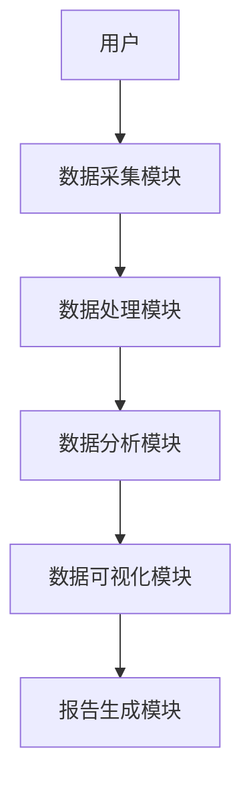

                 


```markdown
# 巴菲特的财务报表深度解析：洞察公司真实价值

## 关键词：巴菲特, 财务报表, 企业估值, 投资策略, 财务分析

## 摘要： 
本文深入解析巴菲特的财务报表分析方法，揭示其如何通过财务数据洞察企业的真实价值。通过系统化的分析框架，结合实际案例，详细阐述利润表、资产负债表和现金流量表的核心要素及其在企业估值中的应用。同时，探讨巴菲特的投资策略和选股标准，帮助读者掌握基于财务报表的投资分析方法。

---

# 第一部分: 财务报表分析的背景与重要性

## 第1章: 财务报表分析的背景与重要性

### 1.1 财务报表分析的核心概念

#### 1.1.1 财务报表的定义与结构
财务报表是企业财务状况、经营成果和现金流量的正式记录，主要包括利润表、资产负债表和现金流量表。这些报表为企业内外部利益相关者提供了重要的财务信息，用于评估企业的价值和投资潜力。

**利润表（Income Statement）**：反映企业在一定会计期间内的收入、费用和利润情况，是衡量企业盈利能力的关键工具。

**资产负债表（Balance Sheet）**：展示企业在某一特定时点的资产、负债和所有者权益的状况，是评估企业财务健康状况的重要依据。

**现金流量表（Cash Flow Statement）**：记录企业在一定会计期间内的现金流入和流出情况，分为经营活动、投资活动和筹资活动的现金流。

#### 1.1.2 巴菲特投资理念与财务报表分析的联系
巴菲特的投资理念以“价值投资”为核心，他注重企业的内在价值，而非市场波动。他认为，企业的内在价值可以通过对其财务报表的深入分析来评估。以下是巴菲特对财务报表分析的特别关注点：

- **持续性与稳定性**：巴菲特倾向于投资那些具有持续盈利能力的企业，因此他特别关注利润表中营业收入的持续性和稳定性。
- **护城河**：他寻找那些具有强大竞争优势（护城河）的企业，这些企业在行业中具有领先地位，能够长期保持高利润率。
- **管理层能力**：巴菲特重视管理层的诚信与能力，认为优秀的管理层能够通过有效的决策和管理，为企业创造更大的价值。

#### 1.1.3 财务报表分析在企业估值中的作用
财务报表分析是企业估值的核心工具。通过对财务报表的分析，投资者可以评估企业的盈利能力、成长潜力、财务健康状况和风险水平。巴菲特通过分析财务报表，能够准确地判断企业的内在价值，从而做出明智的投资决策。

---

### 1.2 财务报表分析的基本方法

#### 1.2.1 基本财务指标计算方法
以下是常见的财务指标及其计算公式：

- **净利润率（Net Profit Margin）**：净利润 / 营业收入 × 100%。该指标反映了企业的整体盈利能力。
- **总资产周转率（Asset Turnover）**：营业收入 / 平均总资产。该指标衡量了企业资产的使用效率。
- **债务-to- equity ratio（债务与股权比率）**：总负债 / 所有者权益。该指标反映了企业的财务杠杆程度。

#### 1.2.2 财务报表分析的步骤与流程
1. 收集企业的财务报表数据。
2. 梳理企业的财务报表结构，确保数据的完整性和准确性。
3. 计算关键财务指标，如净利润率、总资产周转率等。
4. 进行横向和纵向比较，分析企业的财务表现。
5. 评估企业的财务健康状况，判断其投资价值。

#### 1.2.3 财务报表分析的常见误区
- **忽略行业特点**：不同行业的财务指标有不同的标准，投资者需要结合行业特点进行分析。
- **过于依赖财务数据**：财务数据只能反映企业的过去表现，不能完全预测未来。
- **忽视非财务信息**：企业的市场地位、管理团队等因素也会影响其价值。

---

### 1.3 本书的核心目标与框架

#### 1.3.1 本书的核心目标
本书旨在通过深入解析巴菲特的财务报表分析方法，帮助读者掌握企业估值的核心技能。结合实际案例，详细讲解利润表、资产负债表和现金流量表的分析方法，并提供实用的工具和策略。

#### 1.3.2 本书的分析框架
1. 利润表分析：盈利能力、收入结构和成本控制。
2. 资产负债表分析：资产质量、负债结构和财务杠杆。
3. 现金流量表分析：现金流健康和企业流动性。
4. 巴菲特的选股标准：护城河、管理层能力和财务健康状况。

#### 1.3.3 本书的结构安排
- 第一部分：利润表和资产负债表的深度解析。
- 第二部分：现金流量表的分析方法。
- 第三部分：系统架构与工具应用。
- 第四部分：实战分析与案例研究。
- 第五部分：总结与展望。

---

## 第2章: 利润表的深度解析

### 2.1 利润表的核心要素

#### 2.1.1 收入的构成与分类
收入是利润表的核心要素，主要包括营业收入和其他收入。营业收入是企业主营业务产生的收入，而其他收入则包括投资收益、利息收入等。

**营业收入的构成**：
1. **销售收入**：企业销售商品或服务所获得的收入。
2. **劳务收入**：提供劳务服务所获得的收入。
3. **租赁收入**：出租资产所获得的收入。

**收入的分类**：
1. **主营业务收入**：企业主要经营活动所产生的收入。
2. **其他业务收入**：企业次要经营活动所产生的收入。

#### 2.1.2 成本与费用的分类与计算
成本和费用是利润表中扣除收入的部分，主要包括营业成本、销售费用、管理费用和财务费用等。

**营业成本**：与主营业务直接相关的成本，如原材料成本、人工成本等。
**销售费用**：销售产品或服务所产生的费用，如广告费、运输费等。
**管理费用**：企业行政管理所产生的费用，如工资、租金等。
**财务费用**：企业筹资活动所产生的费用，如利息支出等。

#### 2.1.3 净利润的计算与意义
净利润是利润表的核心指标，计算公式如下：

$$ \text{净利润} = \text{营业收入} - \text{营业成本} - \text{费用} - \text{税费} $$

净利润反映了企业在一定会计期间内的整体盈利能力，是评估企业价值的重要指标。

---

### 2.2 利润表的分析方法

#### 2.2.1 盈利能力分析
盈利能力分析是利润表分析的核心内容，主要包括以下几个方面：

1. **净利润率**：衡量企业整体盈利能力的指标。
2. **营业利润率**：衡量企业主营业务的盈利能力。
3. **净资产收益率（ROE）**：衡量企业使用股东资产创造利润的能力。

#### 2.2.2 收入与成本结构分析
收入与成本结构分析是利润表分析的重要内容，主要包括以下几个方面：

1. **收入构成分析**：分析收入的主要来源及其占比。
2. **成本结构分析**：分析成本的主要构成及其占比。
3. **毛利率分析**：毛利率 = （营业收入 - 营业成本） / 营业收入 × 100%。毛利率反映了企业的成本控制能力。

#### 2.2.3 利润表趋势分析
通过比较不同会计期间的利润表数据，可以分析企业的财务表现趋势。例如，通过比较过去三年的净利润增长率，可以判断企业的盈利能力是否持续增长。

---

### 2.3 巴菲特对利润表的特别关注点

#### 2.3.1 持续性与稳定性
巴菲特倾向于投资那些具有持续盈利能力的企业，因此他特别关注利润表的持续性和稳定性。他认为，只有那些能够持续创造利润的企业，才能为投资者带来长期的回报。

#### 2.3.2 营业利润率的重要性
营业利润率是衡量企业主营业务盈利能力的重要指标。巴菲特认为，高营业利润率的企业具有更强的定价能力和成本控制能力，能够在竞争中占据优势。

#### 2.3.3 非经常性损益的考量
非经常性损益是指企业偶发性或特殊性交易产生的损益，如出售资产、重组损失等。巴菲特认为，非经常性损益不能代表企业的持续盈利能力，因此在分析利润表时，他更关注企业的经常性损益。

---

## 第3章: 资产负债表的深度解析

### 3.1 资产负债表的核心要素

#### 3.1.1 资产的构成与分类
资产是企业过去的交易或事项形成的，由企业拥有或控制的资源。资产可以分为流动资产和非流动资产。

**流动资产**：指能够在一年内变现或消耗的资产，包括现金、应收账款、存货等。
**非流动资产**：指无法在一年内变现或消耗的资产，包括固定资产、无形资产等。

#### 3.1.2 负债的构成与分类
负债是企业过去的交易或事项形成的，预期会导致经济利益流出的义务。负债可以分为流动负债和非流动负债。

**流动负债**：指在一年内需要偿还的债务，包括应付账款、短期借款等。
**非流动负债**：指在一年以上需要偿还的债务，包括长期借款、债券等。

#### 3.1.3 所有者权益的构成
所有者权益是企业资产减去负债后的余额，主要包括股本、资本公积、盈余公积和未分配利润等。

---

### 3.2 资产负债表的分析方法

#### 3.2.1 资产结构分析
资产结构分析是通过比较不同类型的资产占比，判断企业的资产构成是否合理。例如，如果企业的流动资产占比过高，可能表明企业存在过多的库存或应收账款，影响资金周转效率。

#### 3.2.2 负债结构分析
负债结构分析是通过比较不同类型的负债占比，判断企业的债务风险。例如，如果企业的流动负债占比过高，可能表明企业面临较大的短期偿债压力。

#### 3.2.3 资产负债表趋势分析
通过比较不同会计期间的资产负债表数据，可以分析企业的财务状况趋势。例如，通过比较过去三年的资产负债率变化，可以判断企业的财务杠杆是否合理。

---

### 3.3 巴菲特对资产负债表的特别关注点

#### 3.3.1 资产的流动性与质量
巴菲特认为，资产的流动性与质量是衡量企业财务健康状况的重要指标。他倾向于投资那些资产流动性高、质量优良的企业，以确保企业的偿债能力和经营稳定性。

#### 3.3.2 负债的偿付压力
巴菲特认为，企业的负债结构和偿付能力是影响企业价值的重要因素。他特别关注企业的流动负债占比和短期偿债能力，以判断企业是否面临较大的财务风险。

#### 3.3.3 所有者权益的变动分析
巴菲特认为，所有者权益的变动反映了企业的盈利能力和发展潜力。他倾向于投资那些所有者权益持续增长的企业，以确保企业的长期价值。

---

## 第4章: 现金流量表的深度解析

### 4.1 现金流量表的核心要素

#### 4.1.1 经营活动现金流
经营活动现金流是企业在日常经营活动中产生的现金流，主要包括销售商品、提供劳务所收到的现金，以及支付的现金。

**经营活动现金流的计算公式**：
$$ \text{经营活动现金流} = \text{营业收入} - \text{应收账款} - \text{应付账款} $$

#### 4.1.2 投资活动现金流
投资活动现金流是企业在投资活动中产生的现金流，主要包括购买和出售固定资产、长期投资等。

**投资活动现金流的计算公式**：
$$ \text{投资活动现金流} = \text{固定资产投资} + \text{长期投资} $$

#### 4.1.3 筹资活动现金流
筹资活动现金流是企业在筹资活动中产生的现金流，主要包括吸收投资、发行债券、偿还债务等。

**筹资活动现金流的计算公式**：
$$ \text{筹资活动现金流} = \text{吸收投资} - \text{偿还债务} $$

---

### 4.2 现金流量表的分析方法

#### 4.2.1 现金流结构分析
现金流结构分析是通过比较不同类型的现金流占比，判断企业的现金来源和用途。例如，如果经营活动现金流占比过高，可能表明企业依赖经营活动获取现金流，而投资活动现金流占比过低，可能表明企业缺乏投资活动。

#### 4.2.2 现金流健康分析
现金流健康分析是通过分析企业的现金净流量和现金储备，判断企业的现金流健康状况。例如，如果企业的现金净流量为正，且现金储备充足，表明企业的现金流健康。

#### 4.2.3 现金流趋势分析
通过比较不同会计期间的现金流量表数据，可以分析企业的现金流趋势。例如，通过比较过去三年的经营活动现金流变化，可以判断企业的经营活动是否持续产生现金流。

---

### 4.3 巴菲特对现金流量表的特别关注点

#### 4.3.1 现金流的健康性
巴菲特认为，现金流是企业的生命线。他特别关注企业的现金流健康性，认为只有那些能够持续产生现金流的企业，才能为投资者带来长期的回报。

#### 4.3.2 现金流的可持续性
巴菲特认为，现金流的可持续性是衡量企业价值的重要指标。他倾向于投资那些能够持续产生现金流的企业，以确保企业的长期发展。

#### 4.3.3 现金流的风险管理
巴菲特认为，现金流的风险管理是企业财务健康的重要组成部分。他特别关注企业的现金流波动性，以判断企业是否面临较大的现金流风险。

---

## 第5章: 系统架构与工具应用

### 5.1 系统架构设计

#### 5.1.1 系统功能设计
系统功能设计包括数据采集、数据处理、数据分析和数据可视化。以下是系统功能的详细描述：

1. **数据采集**：从企业的财务报表中提取利润表、资产负债表和现金流量表的数据。
2. **数据处理**：对提取的数据进行清洗、转换和标准化处理。
3. **数据分析**：利用数据分析工具，计算财务指标、生成图表和报告。
4. **数据可视化**：通过可视化工具，将分析结果以图表形式展示，帮助用户更直观地理解数据。

#### 5.1.2 系统架构设计
以下是系统架构的Mermaid图：



---

### 5.2 巴菲特投资策略的算法实现

#### 5.2.1 算法原理
以下是巴菲特投资策略的算法原理：

1. **数据采集**：从企业的财务报表中采集利润表、资产负债表和现金流量表的数据。
2. **数据处理**：对采集的数据进行清洗、转换和标准化处理。
3. **数据分析**：计算关键财务指标，如净利润率、总资产周转率等。
4. **企业估值**：根据财务指标和巴菲特的投资标准，评估企业的内在价值。
5. **投资决策**：根据企业估值结果，决定是否进行投资。

#### 5.2.2 算法实现
以下是巴菲特投资策略的Python代码实现：

```python
import pandas as pd
import numpy as np

# 数据采集
df_income = pd.read_csv('income.csv')
df_balance = pd.read_csv('balance.csv')
df_cash_flow = pd.read_csv('cash_flow.csv')

# 数据处理
df_income['净利润率'] = (df_income['净利润'] / df_income['营业收入']) * 100
df_balance['资产负债率'] = (df_balance['总负债'] / df_balance['总资产']) * 100

# 数据分析
net_profit_margin = df_income['净利润率'].mean()
asset_liability_ratio = df_balance['资产负债率'].mean()

# 企业估值
intrinsic_value = (net_profit_margin * asset_liability_ratio) / 100

# 投资决策
if intrinsic_value > df_income['股价'].mean():
    print("值得投资")
else:
    print("不值得投资")
```

---

## 第6章: 实战分析与案例研究

### 6.1 案例分析：苹果公司

#### 6.1.1 财务报表分析
以下是苹果公司2020年的财务报表分析：

1. **利润表分析**：
   - 营业收入：3943.8亿美元
   - 净利润：998.9亿美元
   - 净利润率：25.3%

2. **资产负债表分析**：
   - 总资产：3785.7亿美元
   - 总负债：1614.9亿美元
   - 资产负债率：42.7%

3. **现金流量表分析**：
   - 经营活动现金流：1205.3亿美元
   - 投资活动现金流：-435.8亿美元
   - 筹资活动现金流：-11.4亿美元

#### 6.1.2 投资决策
根据苹果公司的财务报表分析结果，结合巴菲特的投资标准，苹果公司具有强大的护城河、高效的管理层和健康的财务状况，因此值得投资。

---

## 第7章: 总结与展望

### 7.1 本书总结
通过本书的分析，我们深入解析了巴菲特的财务报表分析方法，掌握了利润表、资产负债表和现金流量表的核心要素及其在企业估值中的应用。同时，我们还探讨了巴菲特的投资策略和选股标准，帮助读者掌握基于财务报表的投资分析方法。

### 7.2 未来展望
随着人工智能和大数据技术的不断发展，财务报表分析将更加智能化和自动化。未来，投资者可以利用更先进的工具和技术，进一步提升财务报表分析的效率和准确性。同时，巴菲特的投资理念也将继续指导投资者，帮助他们在复杂的市场环境中做出明智的投资决策。

---

## 作者：AI天才研究院/AI Genius Institute & 禅与计算机程序设计艺术 /Zen And The Art of Computer Programming
```

