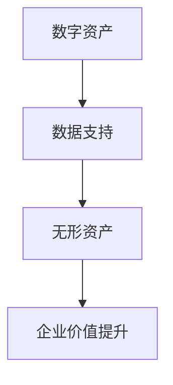
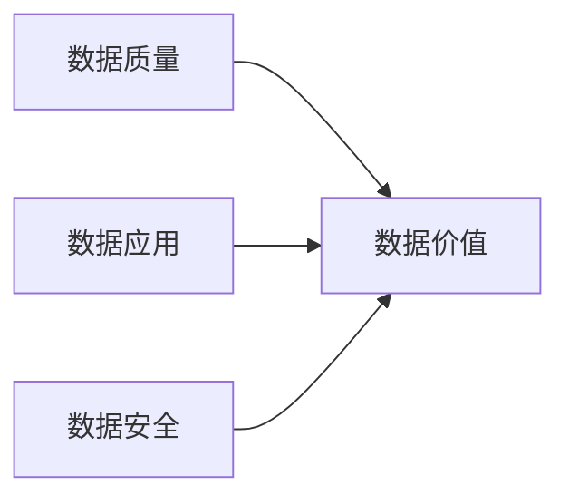
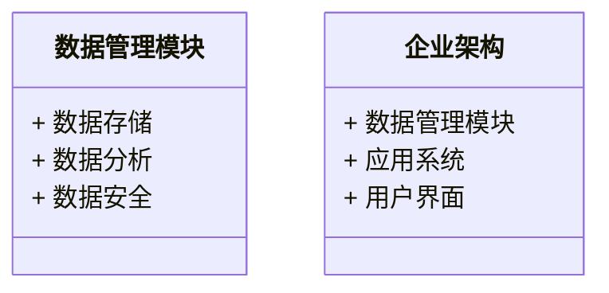
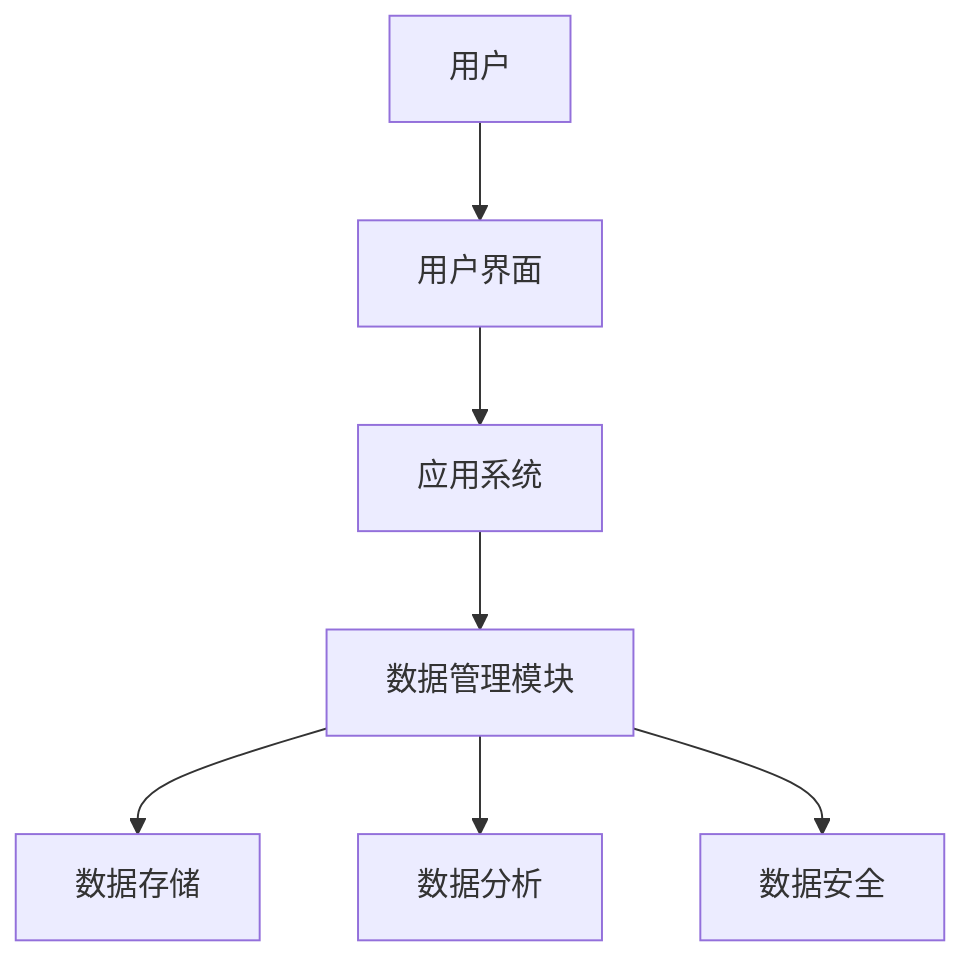

                 


# 巴菲特的资产负债表分析：数字资产和无形资产的重新定义

> 关键词：巴菲特, 资产负债表, 数字资产, 无形资产, 数据价值, 企业架构

> 摘要：本文深入分析了巴菲特的资产负债表分析方法，并探讨了数字资产和无形资产在现代企业中的重新定义。通过技术与投资的结合，文章详细阐述了数字资产的评估方法、系统架构设计以及实际案例分析，为读者提供了全面的理解和实践指南。

---

# 第一部分：巴菲特的资产负债表分析基础

## 第1章：巴菲特的分析方法与投资哲学

### 1.1 巴菲特的价值投资理念

巴菲特以其独特的价值投资理念闻名于世，他强调通过分析企业的基本面来评估其内在价值。他的方法不仅关注企业的财务数据，还注重企业的长期盈利能力、竞争优势和管理团队。

#### 1.1.1 巴菲特的分析方法
- **基本面分析**：巴菲特通过分析企业的财务报表（如资产负债表、利润表和现金流量表）来评估企业的财务健康状况。
- **内在价值计算**：他通过DCF（现金流折现法）等方法估算企业的内在价值，以此决定是否进行投资。
- **长期视角**：巴菲特注重企业的长期盈利能力，而非短期市场波动。

#### 1.1.2 资产负债表分析的重要性
- 资产负债表是企业财务健康状况的晴雨表。
- 通过分析资产负债表，投资者可以了解企业的资产结构、负债情况和所有者权益，从而评估企业的偿债能力、营运能力和成长潜力。

#### 1.1.3 数字资产与无形资产的兴起
- 随着数字化转型的推进，数据成为企业的重要资产。
- 无形资产（如品牌价值、专利技术、客户关系等）在企业价值中的比重逐渐增加。

### 1.2 传统资产负债表的构成与分析

#### 1.2.1 流动资产与非流动资产
- **流动资产**：一年内可以转化为现金或被消耗的资产，包括现金、应收账款、存货等。
- **非流动资产**：无法在一年内转化为现金的资产，包括固定资产、无形资产、长期投资等。

#### 1.2.2 流动负债与非流动负债
- **流动负债**：一年内需要偿还的债务，包括应付账款、短期借款、应交税费等。
- **非流动负债**：长期债务，如长期借款、债券发行等。

#### 1.2.3 所有者权益
- 所有者权益代表企业净资产的价值，包括股本、资本公积、盈余公积和未分配利润等。

### 1.3 数字时代下资产负债表的新变化

#### 1.3.1 数字资产的崛起
- 数据成为企业的核心资产，数据的价值取决于其质量和应用场景。
- 数字资产包括客户数据、交易数据、社交媒体数据等。

#### 1.3.2 无形资产的扩展
- 传统无形资产包括专利、商标、品牌价值等，数字时代新增了数据资产和数字平台价值。
- 无形资产的评估变得更加复杂，需要考虑其带来的长期收益和竞争优势。

#### 1.3.3 数据作为资产的新角色
- 数据可以被量化、交易和变现，成为企业的重要资产。
- 数据的整合和分析能力成为企业竞争力的关键。

---

## 第2章：数字资产与无形资产的重新定义

### 2.1 数字资产的核心概念

#### 2.1.1 数字资产的定义与特征
- **定义**：数字资产是指以数字形式存在的资产，包括数据、算法、软件、数字内容等。
- **特征**：
  - 数字化：以数字形式存在，可以快速复制和传播。
  - 可扩展性：数据可以无限复制，价值可能随着应用的增加而增长。
  - 可流动性：数字资产可以通过网络快速交易和转移。

#### 2.1.2 数字资产的分类与应用场景
- **分类**：
  - 数据资产：包括客户数据、交易数据、社交媒体数据等。
  - 数字内容资产：如音乐、视频、电子书等。
  - 软件资产：包括操作系统、应用程序等。
- **应用场景**：
  - 数据驱动的决策：企业利用数据进行精准营销、风险控制等。
  - 数字化产品和服务：如在线教育、数字广告、金融科技等。

#### 2.1.3 数字资产与传统资产的对比分析

| **属性**         | **传统资产**         | **数字资产**          |
|-------------------|----------------------|-----------------------|
| 存在形式         | 实体形式（如设备、房产） | 数字形式（如数据、软件） |
| 可复制性         | 低                   | 高                   |
| 转移成本         | 高                   | 低                   |
| 价值波动         | 较慢                 | 快                   |
| 管理复杂性       | 较低                 | 较高                 |

---

#### 2.1.4 数字资产的ER实体关系图

```mermaid
erd
actor: 投资者
actor --> 资产负债表
actor --> 数字资产
actor --> 无形资产
```

---

### 2.2 无形资产的扩展与挑战

#### 2.2.1 无形资产的传统定义与范围
- 无形资产是指没有物理形态但具有长期收益能力的资产。
- 主要包括专利权、商标权、版权、品牌价值等。

#### 2.2.2 数字化时代无形资产的新形态
- 数据资产：数据成为企业的重要无形资产。
- 数字平台价值：如社交媒体平台、在线支付平台等。
- 知识资本：员工的知识和技能对企业价值的影响。

#### 2.2.3 无形资产评估的难点与解决方案
- **难点**：
  - 数据的估值难以量化。
  - 无形资产的收益周期不确定。
  - 无形资产的流动性差。
- **解决方案**：
  - 使用数据挖掘和机器学习技术评估数据价值。
  - 将无形资产的贡献与企业整体价值结合起来评估。
  - 建立动态的无形资产评估模型。

---

#### 2.2.4 数字资产与传统资产的关联性分析

| **维度**         | **传统资产**         | **数字资产**          |
|-------------------|----------------------|-----------------------|
| 评估方法         | 历史成本法、公允价值法 | 数据价值法、收益贡献法 |
| 管理方式         | 实物管理和记录       | 数据管理和分析       |
| 风险因素         | 物理损耗、市场波动   | 数据泄露、技术风险   |

---

### 2.3 数字资产与无形资产的关联性分析

#### 2.3.1 数字资产如何影响无形资产的价值
- 数据可以提升无形资产的效率和价值，例如通过数据分析优化品牌推广和客户管理。
- 数字资产的积累可以增强企业的知识资本，从而提升无形资产的价值。

#### 2.3.2 数字资产与无形资产的协同效应
- 数字资产作为数据支持，可以增强无形资产的决策能力。
- 无形资产的积累可以为数字资产的开发和应用提供基础。

---

#### 2.3.3 数字资产与无形资产的协同关系图



---

## 第3章：数字资产的评估与量化方法

### 3.1 数字资产的评估框架

#### 3.1.1 数字资产的评估维度
- 数据质量：数据的准确性、完整性和及时性。
- 数据应用：数据在企业中的应用场景和价值。
- 数据安全：数据的保护和合规性。

#### 3.1.2 数字资产的评估模型
- 数据价值公式：
  $$ \text{数据价值} = f(\text{数据质量}, \text{数据应用}, \text{数据安全}) $$
- 数据应用价值公式：
  $$ \text{应用价值} = \sum_{i=1}^{n} (\text{收益}_i - \text{成本}_i) $$

#### 3.1.3 数据安全的评估
- 数据安全是数字资产价值的重要组成部分。
- 数据泄露可能造成企业损失，因此数据安全的评估至关重要。

---

### 3.2 数字资产的量化方法

#### 3.2.1 数据资产价值的计算
- 数据资产的价值可以通过以下步骤计算：
  1. 确定数据的应用场景。
  2. 评估数据的质量和安全性。
  3. 计算数据带来的收益或成本节约。
  4. 综合评估数据的价值。

#### 3.2.2 数据资产价值计算的数学模型



---

#### 3.2.3 数据资产价值计算的Python代码实现

```python
# 数据质量评分（0-1）
data_quality = 0.9
# 数据应用评分（0-1）
data_application = 0.8
# 数据安全评分（0-1）
data_security = 0.85

# 数据价值计算
data_value = data_quality * data_application * data_security
print(f"数据价值为：{data_value}")
```

---

#### 3.2.4 数据价值计算的实际案例
- 某电商企业通过数据分析优化了精准营销策略，提升了销售额10%。
- 数据价值计算：
  - 数据质量：0.9
  - 数据应用：0.8
  - 数据安全：0.85
  - 数据价值：0.9 * 0.8 * 0.85 = 0.612
- 结论：数据价值为0.612，意味着该数据资产的价值较高，可以为企业带来显著的收益。

---

## 第4章：企业架构与数字资产管理

### 4.1 数字资产管理的系统设计

#### 4.1.1 数字资产管理的需求分析
- 数据存储与管理：如何高效存储和管理海量数据。
- 数据安全与合规：如何确保数据安全和合规性。
- 数据分析与应用：如何利用数据分析提升企业决策。

#### 4.1.2 数字资产管理的领域模型



---

#### 4.1.3 数字资产管理的系统架构



---

### 4.2 数字资产管理系统的核心功能

#### 4.2.1 数据存储与管理
- 数据库设计：选择合适的数据存储方案（如关系型数据库、NoSQL数据库）。
- 数据备份与恢复：确保数据的安全性和可用性。

#### 4.2.2 数据分析与应用
- 数据挖掘：利用数据挖掘技术提取有价值的信息。
- 数据可视化：通过可视化工具（如Tableau、Power BI）展示数据。

#### 4.2.3 数据安全与合规
- 数据加密：保护数据在传输和存储过程中的安全性。
- 数据访问控制：基于角色的访问控制（RBAC）。

---

#### 4.2.4 数字资产管理系统的核心代码实现

```python
# 数据库连接配置
DB_CONFIG = {
    'host': 'localhost',
    'user': 'admin',
    'password': 'secure_password',
    'database': 'data_management'
}

# 数据库连接函数
def connect_db():
    import pymysql
    return pymysql.connect(**DB_CONFIG)

# 数据存储函数
def store_data(data):
    db = connect_db()
    cursor = db.cursor()
    # SQL插入语句
    cursor.execute("INSERT INTO data_table VALUES (%s, %s)", (data['id'], data['value']))
    db.commit()
    db.close()

# 数据分析函数
def analyze_data():
    db = connect_db()
    cursor = db.cursor()
    cursor.execute("SELECT * FROM data_table")
    results = cursor.fetchall()
    db.close()
    return results
```

---

### 4.3 数字资产管理系统的小结

- 数字资产管理系统通过高效的架构设计，确保数据的存储、分析和安全。
- 系统的设计需要结合企业的具体需求，选择合适的技术方案。
- 数据安全和合规性是系统设计中的重点。

---

## 第5章：数字资产管理系统的小结与展望

### 5.1 小结
- 数字资产和无形资产的重新定义为企业财务管理带来了新的挑战和机遇。
- 通过合理的评估方法和系统架构设计，企业可以更好地管理和利用数字资产。

### 5.2 未来展望
- 随着技术的发展，数字资产的种类和价值将不断增加。
- 企业需要持续优化数字资产管理策略，以应对未来的挑战。

---

## 作者信息

作者：AI天才研究院/AI Genius Institute & 禅与计算机程序设计艺术/Zen And The Art of Computer Programming

---

通过以上分析，我们可以看到，数字资产和无形资产的重新定义不仅是技术领域的变革，也是企业管理的重要组成部分。企业需要结合技术与投资的双重视角，才能更好地应对数字化时代的挑战。

