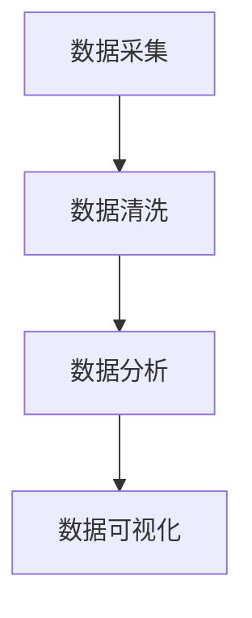

                 


# 巴菲特的资产负债表分析：数字资产时代的财务健康

**关键词：**巴菲特，资产负债表，数字资产，财务健康，投资分析，财务报表，价值投资

**摘要：**  
本文深入分析了巴菲特的资产负债表分析方法，并探讨了数字资产时代对企业财务健康的影响。通过系统化的分析框架，结合实际案例，展示了如何在数字资产快速发展的背景下，利用巴菲特的投资理念进行财务健康评估和价值判断。文章内容涵盖了资产负债表的核心指标、数字资产对财务报表的影响、系统架构与数据处理方法，以及实际项目分析，为投资者和财务分析人员提供了实用的指导。

---

# 第一章：巴菲特的投资理念与资产负债表概述

## 1.1 巴菲特投资理念的核心

### 1.1.1 价值投资的定义与特点
价值投资是一种长期投资策略，强调以低于内在价值的价格买入优质资产。巴菲特的价值投资理念基于以下几个核心原则：
1. **安全边际**：买入价格低于内在价值，以确保本金安全。
2. **长期视角**：关注企业的长期盈利能力，而非短期市场波动。
3. **企业基本面**：深入分析企业的财务报表，尤其是资产负债表，以评估企业的健康状况和内在价值。

### 1.1.2 巴菲特的价值投资体系
巴菲特的价值投资体系可以概括为“三步走”：
1. **寻找具有持续竞争优势的企业**：关注企业的护城河，即企业在市场上长期保持竞争优势的能力。
2. **评估企业的内在价值**：通过分析财务报表，尤其是资产负债表，估算企业的实际价值。
3. **等待合理价格出现**：在市场低估时买入，耐心持有优质资产。

### 1.1.3 资产负债表在投资中的重要性
资产负债表是企业财务报表的核心部分，反映了企业在某一特定时点的资产、负债和所有者权益的构成。巴菲特认为，资产负债表是评估企业财务健康状况和内在价值的重要工具。通过分析资产负债表，投资者可以了解企业的资产质量、负债结构以及财务稳定性。

---

## 1.2 资产负债表的基本构成

### 1.2.1 资产、负债、所有者权益的定义
- **资产**：企业拥有的资源，能够为企业带来经济利益。资产包括流动资产（如现金、应收账款）和非流动资产（如固定资产、无形资产）。
- **负债**：企业对外部的债务，需要在未来某个时间点偿还。负债包括流动负债（如应付账款、短期借款）和非流动负债（如长期借款）。
- **所有者权益**：企业的净资产，即资产减去负债的余额。所有者权益包括股本、资本公积、盈余公积等。

### 1.2.2 资产负债表的编制与结构
资产负债表的编制遵循会计恒等式：  
$$ 资产 = 负债 + 所有者权益 $$  
资产负债表的结构通常分为左右两部分，左边列示资产，右边列示负债和所有者权益。

### 1.2.3 资产负债表的分析方法
1. **横向分析**：比较不同会计期间的资产负债表，观察资产、负债和所有者权益的变化趋势。
2. **纵向分析**：分析资产负债表中各项目占总资产或总负债的比重，评估企业的资产结构和负债结构。

---

## 1.3 巴菲特分析资产负债表的核心要素

### 1.3.1 资产质量的重要性
巴菲特认为，资产质量是企业财务健康的核心指标。他特别关注企业的流动资产质量，尤其是现金和应收账款的占比。例如，他会关注企业的存货周转率和应收账款的账期。

### 1.3.2 负债结构的稳定性
巴菲特强调，企业的负债结构应以长期负债为主，避免过多的短期负债。他通过分析企业的流动比率和速动比率，评估企业的偿债能力。

### 1.3.3 所有者权益的健康度
巴菲特认为，所有者权益是企业价值的重要组成部分。他通过分析企业的净利润率和ROE（净资产收益率），评估企业的盈利能力。

---

## 1.4 本章小结
本章介绍了巴菲特的投资理念，详细讲解了资产负债表的基本构成和分析方法。通过分析资产质量、负债结构和所有者权益的健康度，巴菲特能够准确评估企业的财务健康状况和内在价值。

---

# 第二章：资产负债表的核心分析指标

## 2.1 资产负债表的关键指标

### 2.1.1 流动比率
流动比率是评估企业短期偿债能力的重要指标，计算公式为：  
$$ 流动比率 = \frac{流动资产}{流动负债} $$  
巴菲特认为，流动比率应至少为1.5，以确保企业有足够的流动资产偿还短期负债。

### 2.1.2 速动比率
速动比率是流动比率的进一步优化，排除了存货的影响，计算公式为：  
$$ 速动比率 = \frac{速动资产}{流动负债} $$  
速动资产包括现金、应收账款和其他流动资产。

### 2.1.3 负债率
负债率是评估企业财务杠杆的重要指标，计算公式为：  
$$ 负债率 = \frac{总负债}{总资产} $$  
巴菲特认为，负债率应低于50%，以避免企业过度依赖负债。

### 2.1.4 存货周转率
存货周转率是评估企业库存管理效率的重要指标，计算公式为：  
$$ 存货周转率 = \frac{成本 of goods sold}{平均存货} $$  
巴菲特认为，存货周转率越高，企业的库存管理越高效。

---

## 2.2 巴菲特对关键指标的解读

### 2.2.1 流动资产与流动负债的匹配性
巴菲特关注流动资产与流动负债的匹配性，即企业是否有足够的流动资产偿还短期负债。他特别关注现金和应收账款的占比。

### 2.2.2 长期负债的偿付压力
巴菲特认为，长期负债的偿付压力较小，但需要关注企业的整体财务状况。他通过分析企业的EBITDA（息税折旧及摊销前利润）与利息支出的比率，评估企业的偿债能力。

### 2.2.3 所有者权益的稳定性
巴菲特认为，所有者权益的稳定性是评估企业财务健康的重要指标。他通过分析企业的ROE（净资产收益率）和净利润率，评估企业的盈利能力。

---

## 2.3 财务健康度的综合评估

### 2.3.1 财务健康度模型的构建
巴菲特的财务健康度模型包括以下几个指标：
1. 流动比率（至少1.5）
2. 速动比率（至少1）
3. 负债率（低于50%）
4. 存货周转率（高于行业平均水平）
5. 净利润率（高于行业平均水平）

### 2.3.2 巴菲特的财务健康标准
巴菲特认为，财务健康的企业应满足以下条件：
1. 流动比率和速动比率较高，确保短期偿债能力。
2. 负债率较低，避免过度依赖负债。
3. 存货周转率较高，库存管理高效。
4. 净利润率较高，盈利能力强。

### 2.3.3 财务健康度的动态评估
巴菲特强调，财务健康度是一个动态评估过程。他通过定期分析企业的财务报表，评估企业的财务健康状况。

---

## 2.4 本章小结
本章详细讲解了资产负债表的核心分析指标，包括流动比率、速动比率、负债率和存货周转率。通过分析这些指标，巴菲特能够准确评估企业的财务健康状况。

---

# 第三章：数字资产时代对资产负债表的影响

## 3.1 数字资产的定义与分类

### 3.1.1 数字资产的定义
数字资产是指以数字化形式存在的资产，包括加密货币、NFT（非同质化代币）、智能合约等。

### 3.1.2 数字资产的主要类型
1. **加密货币**：如比特币、以太坊，用于价值转移和存储。
2. **NFT**：用于表示数字艺术品、虚拟资产等。
3. **数字证券**：用于表示传统金融资产的数字化形式。

### 3.1.3 数字资产与传统资产的区别
- 数字资产具有去中心化、透明性和可编程性。
- 数字资产的交易速度快，成本低。
- 数字资产的市场波动较大，风险较高。

---

## 3.2 数字资产对资产负债表的挑战

### 3.2.1 数字资产的会计处理问题
数字资产的会计处理尚未完全统一，导致企业在资产负债表中如何列示数字资产存在争议。例如，加密货币应作为金融资产还是存货列示？

### 3.2.2 数字资产的价值波动性
数字资产的价格波动较大，可能导致企业的资产减值，影响财务报表的稳定性。

### 3.2.3 数字资产的监管不确定性
数字资产的监管政策尚不明确，可能导致企业的财务报表面临合规风险。

---

## 3.3 数字资产时代资产负债表的新特征

### 3.3.1 数字资产在资产负债表中的体现
1. **加密货币**：作为金融资产或存货列示。
2. **NFT**：作为无形资产或投资性资产列示。
3. **数字证券**：作为金融资产列示。

### 3.3.2 数字资产对企业财务健康的影响
1. **资产质量**：数字资产的高波动性可能影响企业的资产质量。
2. **负债结构**：数字资产的使用可能改变企业的负债结构。
3. **所有者权益**：数字资产的升值可能增加企业的所有者权益。

### 3.3.3 数字资产对传统财务分析方法的冲击
数字资产的出现使得传统的财务分析方法不再完全适用，需要引入新的分析指标和方法。

---

## 3.4 本章小结
本章分析了数字资产的定义、分类及其对资产负债表的影响。数字资产的出现对传统的财务分析方法提出了新的挑战，需要投资者和财务分析人员重新思考。

---

# 第四章：巴菲特的分析方法与系统架构

## 4.1 巴菲特的分析方法

### 4.1.1 关键指标分析
1. **流动比率**：评估短期偿债能力。
2. **速动比率**：进一步优化流动比率。
3. **负债率**：评估财务杠杆。
4. **存货周转率**：评估库存管理效率。

### 4.1.2 案例分析
以苹果公司为例，分析其资产负债表的关键指标。

---

## 4.2 系统架构与数据处理

### 4.2.1 系统架构设计
1. **数据采集**：从企业财务报表中获取资产负债表数据。
2. **数据清洗**：对数据进行预处理，确保数据的准确性和完整性。
3. **数据分析**：通过算法计算关键指标，评估企业的财务健康状况。
4. **数据可视化**：将分析结果可视化，便于投资者理解和决策。

### 4.2.2 数据流图


---

## 4.3 本章小结
本章介绍了巴菲特的分析方法，并结合系统架构和数据处理流程，展示了如何利用技术手段辅助财务分析。

---

# 第五章：项目实战与案例分析

## 5.1 项目实战

### 5.1.1 环境安装
1. 安装Python编程环境。
2. 安装Pandas和Matplotlib库。

### 5.1.2 核心实现
1. 数据采集：从互联网获取企业的资产负债表数据。
2. 数据清洗：处理缺失值和异常值。
3. 数据分析：计算关键指标，评估企业的财务健康状况。
4. 数据可视化：绘制图表，展示分析结果。

### 5.1.3 代码示例
```python
import pandas as pd
import matplotlib.pyplot as plt

# 数据采集
df = pd.read_csv('balance_sheet.csv')

# 数据清洗
df.dropna(inplace=True)

# 数据分析
流动资产 = df['流动资产'].sum()
流动负债 = df['流动负债'].sum()
流动比率 =流动资产 /流动负债

print(f"流动比率：{流动比率:.2f}")

# 数据可视化
plt.bar(df['公司'], df['流动比率'])
plt.title('流动比率分析')
plt.show()
```

---

## 5.2 案例分析

### 5.2.1 选择企业
以苹果公司为例，分析其资产负债表的关键指标。

### 5.2.2 分析过程
1. 计算流动比率、速动比率和负债率。
2. 评估存货周转率和利润率。
3. 综合评估企业的财务健康状况。

---

## 5.3 本章小结
本章通过项目实战和案例分析，展示了如何利用技术手段辅助财务分析。通过实际操作，读者可以更好地理解巴菲特的分析方法。

---

# 第六章：总结与展望

## 6.1 总结
本文深入分析了巴菲特的资产负债表分析方法，并探讨了数字资产时代对企业财务健康的影响。通过系统化的分析框架和实际案例分析，展示了如何在数字资产快速发展的背景下，利用巴菲特的投资理念进行财务健康评估和价值判断。

## 6.2 展望
随着数字资产的快速发展，传统的财务分析方法将面临新的挑战。未来，投资者和财务分析人员需要结合数字资产的特点，创新分析方法，提升财务分析的准确性和有效性。

---

# 附录

## 附录A：工具指南
1. **Python编程环境**：安装Python和必要的库（如Pandas、Matplotlib）。
2. **数据采集工具**：使用爬虫工具（如BeautifulSoup）获取财务报表数据。
3. **数据可视化工具**：使用Tableau或Power BI进行数据可视化。

## 附录B：参考文献
1. 巴菲特《巴菲特致股东的信》
2. 罗伯特·希勒《金融与经济周期》
3. 约翰·格雷厄姆《证券分析》

---

**作者：AI天才研究院/AI Genius Institute & 禅与计算机程序设计艺术 /Zen And The Art of Computer Programming**

