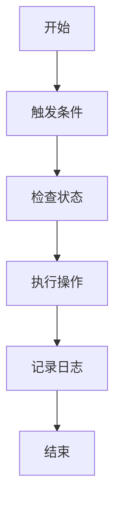
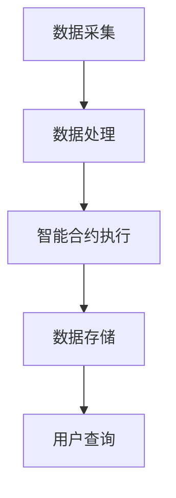

                 


# 巴菲特的资产负债表分析：智能合约对公司治理的影响

> 关键词：巴菲特，资产负债表分析，智能合约，区块链，公司治理，技术影响

> 摘要：本文探讨了智能合约技术如何影响公司治理，并结合巴菲特的资产负债表分析方法，分析了智能合约在公司治理中的潜在应用。通过详细的技术分析和案例研究，本文揭示了智能合约如何优化资产负债表分析，提升公司治理的透明度和效率。

---

# 第一部分: 智能合约与巴菲特的资产负债表分析概述

## 第1章: 巴菲特的资产负债表分析概述

### 1.1 资产负债表的核心概念

#### 1.1.1 资产负债表的基本结构
资产负债表是反映企业在某一特定日期财务状况的报表，主要包括以下三个部分：
1. **资产**：企业拥有的资源，如现金、应收账款、存货、固定资产等。
2. **负债**：企业欠款的金额，如应付账款、短期借款、长期借款等。
3. **所有者权益**：企业净资产的价值，即资产减去负债后的余额。

#### 1.1.2 资产负债表的编制与分析方法
资产负债表的编制需要遵循会计准则，确保数据的准确性和一致性。分析方法包括：
1. **比率分析**：通过计算各项财务比率（如流动比率、速动比率、负债率等）评估企业的财务健康状况。
2. **趋势分析**：分析企业在一定时期内的财务变动趋势，预测未来的发展方向。
3. **比较分析**：将企业的财务数据与其他同类企业进行比较，找出差异和优势。

#### 1.1.3 巴菲特的资产负债表分析特点
巴菲特在分析资产负债表时，注重以下几个方面：
1. **资产的质量**：关注企业的核心资产是否具有长期价值。
2. **负债的结构**：分析企业的负债是否合理，是否存在过高负债的风险。
3. **所有者权益的稳定性**：关注企业的净资产是否稳健，是否受到外部经济波动的影响。

### 1.2 巴菲特的资产负债表分析方法

#### 1.2.1 资产负债表分析的基本步骤
1. **数据收集**：获取企业的财务报表，包括资产负债表、利润表和现金流量表。
2. **数据验证**：核对数据的准确性，确保数据来源可靠。
3. **比率计算**：计算各项财务比率，评估企业的财务状况。
4. **趋势分析**：分析企业在不同时间点的财务数据，找出发展趋势。
5. **比较分析**：将企业的财务数据与行业平均水平或其他竞争对手进行比较。

#### 1.2.2 巴菲特的“三张报表”分析法
巴菲特提出的“三张报表”分析法，包括：
1. **资产负债表**：分析企业的资产、负债和所有者权益。
2. **利润表**：分析企业的收入、成本和利润。
3. **现金流量表**：分析企业的现金流入和流出情况。

#### 1.2.3 巴菲特的资产负债表分析框架
1. **资产分析**：关注企业的核心资产，评估其质量和流动性。
2. **负债分析**：分析企业的债务结构，评估其偿债能力。
3. **所有者权益分析**：关注企业的净资产状况，评估其稳定性。

### 1.3 智能合约的核心概念

#### 1.3.1 智能合约的定义与特点
智能合约是一种基于区块链技术的自动执行合同，具有以下特点：
1. **自动化**：智能合约可以在区块链上自动执行，无需人工干预。
2. **不可篡改**：智能合约一旦部署，无法被修改，确保数据的安全性和可靠性。
3. **透明性**：智能合约的执行过程是公开透明的，所有参与者都可以查看。

#### 1.3.2 智能合约的工作原理
智能合约的工作原理可以分为以下几个步骤：
1. **触发条件**：当满足特定条件时，智能合约自动执行。
2. **状态检查**：智能合约检查当前状态，确定是否满足执行条件。
3. **执行操作**：智能合约执行预定义的操作，如转账、记录数据等。
4. **记录日志**：智能合约记录执行日志，供后续查询和验证。

#### 1.3.3 智能合约的法律与技术挑战
1. **法律挑战**：智能合约的法律地位尚未明确，存在一定的法律风险。
2. **技术挑战**：智能合约的执行依赖于区块链技术，存在一定的技术复杂性。

### 1.4 智能合约与公司治理的关系

#### 1.4.1 智能合约在公司治理中的潜在应用
智能合约可以应用于公司治理的多个方面，如股权管理、股东投票、公司决策等。

#### 1.4.2 巴菲特资产负债表分析与智能合约的结合点
智能合约可以用于实时监控企业的财务数据，自动化资产负债表的更新和分析。

#### 1.4.3 智能合约对公司治理的影响
1. **提高透明度**：智能合约的执行过程公开透明，可以提升公司治理的透明度。
2. **提升效率**：智能合约可以自动化执行公司治理中的某些环节，提高效率。
3. **降低风险**：智能合约可以减少人为干预，降低公司治理中的操作风险。

---

## 第2章: 智能合约的数学模型与算法原理

### 2.1 智能合约的数学模型

#### 2.1.1 智能合约的状态表示
智能合约的状态可以用以下数学模型表示：
$$
\text{状态} = (\text{资产}, \text{负债}, \text{所有者权益})
$$

#### 2.1.2 智能合约的条件判断逻辑
智能合约的条件判断逻辑可以用以下数学表达式表示：
$$
\text{如果} \; \text{条件} \; \text{满足}，\text{则执行操作}
$$

#### 2.1.3 智能合约的执行流程
智能合约的执行流程可以用以下步骤表示：
1. **触发条件**：当满足特定条件时，智能合约开始执行。
2. **状态检查**：智能合约检查当前状态，确定是否满足执行条件。
3. **执行操作**：智能合约执行预定义的操作，如转账、记录数据等。
4. **记录日志**：智能合约记录执行日志，供后续查询和验证。

### 2.2 智能合约的算法原理

#### 2.2.1 智能合约的条件判断算法
智能合约的条件判断算法可以用以下伪代码表示：
```python
def execute智能合约():
    如果条件满足：
        执行操作
    否则：
        不执行操作
```

#### 2.2.2 智能合约的事件触发机制
智能合约的事件触发机制可以用以下数学表达式表示：
$$
\text{事件触发} = \text{条件} \; \text{满足}
$$

#### 2.2.3 智能合约的执行流程图（Mermaid）



### 2.3 智能合约的数学公式

#### 2.3.1 智能合约的状态转移方程
智能合约的状态转移方程可以用以下数学公式表示：
$$
\text{新状态} = \text{旧状态} + \text{操作结果}
$$

#### 2.3.2 智能合约的条件判断公式
智能合约的条件判断公式可以用以下数学表达式表示：
$$
\text{条件满足} = \text{真}
$$

#### 2.3.3 智能合约的事件触发条件
智能合约的事件触发条件可以用以下数学表达式表示：
$$
\text{触发条件} = \text{条件满足}
$$`

### 2.4 本章小结

---

## 第3章: 巴菲特资产负债表分析的系统架构

### 3.1 系统分析与设计

#### 3.1.1 系统功能需求分析
系统需要实现以下功能：
1. 实时监控企业的财务数据。
2. 自动更新资产负债表。
3. 提供智能合约的执行环境。

#### 3.1.2 系统的模块划分
系统可以划分为以下几个模块：
1. 数据采集模块：负责采集企业的财务数据。
2. 数据处理模块：负责处理和分析财务数据。
3. 智能合约模块：负责智能合约的执行和管理。
4. 用户界面模块：提供友好的用户界面，供用户查询和分析。

#### 3.1.3 系统的架构设计
系统的架构设计可以用以下步骤表示：
1. 数据采集：通过API或其他方式采集企业的财务数据。
2. 数据处理：对采集到的数据进行清洗、转换和分析。
3. 智能合约执行：根据分析结果，执行相应的智能合约。
4. 数据存储：将分析结果和智能合约执行日志存储在数据库中。
5. 用户查询：用户可以通过查询数据库，获取分析结果和日志。

### 3.2 系统架构图（Mermaid）



### 3.3 系统接口设计

#### 3.3.1 系统输入接口
系统输入接口包括：
1. 财务数据输入接口。
2. 智能合约输入接口。

#### 3.3.2 系统输出接口
系统输出接口包括：
1. 财务分析结果输出接口。
2. 智能合约执行日志输出接口。

#### 3.3.3 智能合约接口设计
智能合约接口设计可以用以下伪代码表示：
```python
def execute智能合约(条件):
    如果条件满足：
        执行操作
    否则：
        不执行操作
```

### 3.4 本章小结

---

## 第4章: 智能合约在公司治理中的应用

### 4.1 智能合约在公司治理中的应用场景

#### 4.1.1 股权管理与智能合约
智能合约可以用于股权管理，确保股权的透明和不可篡改。

#### 4.1.2 股东投票与智能合约
智能合约可以用于股东投票，确保投票过程的透明和公正。

#### 4.1.3 公司决策的自动化执行
智能合约可以用于公司决策的自动化执行，减少人为干预。

### 4.2 巴菲特资产负债表分析与智能合约的结合

#### 4.2.1 资产负债表数据的智能合约化
智能合约可以用于实时更新和分析资产负债表数据。

#### 4.2.2 智能合约在资产负债表分析中的应用
智能合约可以用于自动化分析资产负债表，提供实时的财务分析结果。

#### 4.2.3 智能合约对资产负债表分析的优化
智能合约可以优化资产负债表分析的效率和准确性，减少人为错误。

### 4.3 智能合约对公司治理的影响

#### 4.3.1 提高公司治理的透明度
智能合约的执行过程公开透明，可以提升公司治理的透明度。

#### 4.3.2 提升公司治理的效率
智能合约可以自动化执行公司治理中的某些环节，提高效率。

#### 4.3.3 降低公司治理的成本
智能合约可以减少人为干预，降低公司治理中的操作风险。

---

# 作者信息

作者：AI天才研究院/AI Genius Institute & 禅与计算机程序设计艺术 /Zen And The Art of Computer Programming

---

# 注意事项

1. 本文内容基于区块链技术和智能合约的实际应用，部分理论和案例可能需要进一步验证和优化。
2. 智能合约的法律地位和实际应用仍需结合具体国家的法律法规和行业规范。
3. 公司治理的优化需要综合考虑多方面因素，智能合约仅为其中的一部分。

---

# 拓展阅读

1. 《区块链技术与智能合约》
2. 《巴菲特的股票投资策略》
3. 《公司治理与信息技术》

---

感谢您的阅读，希望本文能够为您提供关于智能合约对公司治理影响的深入见解。

