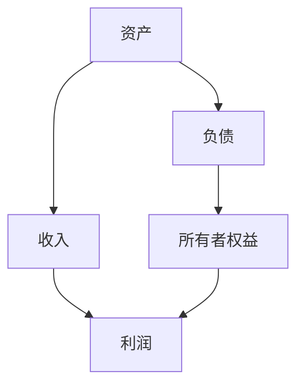
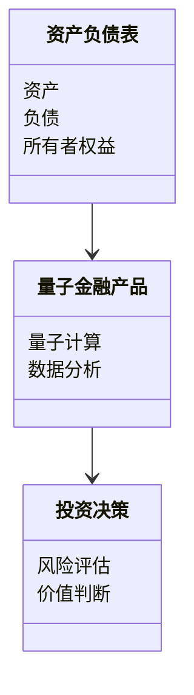
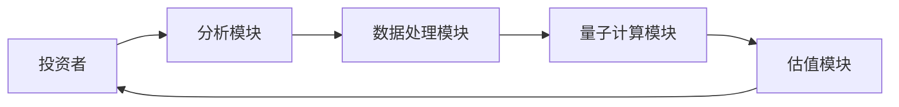

                 


# 巴菲特的资产负债表分析：量子金融产品对公司估值的新影响

> **关键词**：巴菲特、资产负债表、量子金融产品、公司估值、投资分析、金融模型  
> **摘要**：本文深入分析巴菲特的资产负债表分析方法，并探讨量子金融产品如何影响公司估值。通过介绍量子金融产品的特性，结合数学模型和实际案例，展示如何将传统分析方法与新兴金融工具相结合，为投资决策提供新视角。

---

## 目录

1. [背景介绍](#背景介绍)
2. [核心概念与联系](#核心概念与联系)
3. [算法原理讲解](#算法原理讲解)
4. [系统分析与架构设计方案](#系统分析与架构设计方案)
5. [项目实战](#项目实战)
6. [最佳实践](#最佳实践)
7. [小结](#小结)
8. [注意事项](#注意事项)
9. [拓展阅读](#拓展阅读)

---

### 背景介绍

#### 1.1 巴菲特的生平与投资理念

沃伦·巴菲特（Warren Buffett）是全球最著名的价值投资者之一。他的投资理念基于对公司基本面的深入分析，尤其是对资产负债表的关注。他认为，企业的内在价值是投资决策的核心，而资产负债表是理解企业财务健康状况的关键工具。

#### 1.2 资产负债表的基本概念

资产负债表是反映企业在某一特定时期财务状况的报表，主要包括资产、负债和所有者权益三个部分：

- **资产**：企业拥有的资源，包括现金、存货、应收账款、固定资产等。
- **负债**：企业欠款，包括应付账款、短期借款、长期借款等。
- **所有者权益**：企业净资产，即资产减去负债后的剩余部分。

#### 1.3 传统金融产品与量子金融产品的区别

传统的金融产品如股票、债券、基金等，其价值主要依赖于企业的财务表现和市场供需。而量子金融产品则利用量子计算和人工智能技术，通过复杂的数据分析和预测模型，提供更精准的估值和交易策略。

---

### 核心概念与联系

#### 2.1 巴菲特分析模型的原理

巴菲特的分析模型基于对企业财务报表的深入研究，尤其是对ROE（净资产收益率）和ROA（资产回报率）的关注。他认为，高ROE和ROA的企业具有更高的投资价值。

#### 2.2 量子金融产品的属性特征对比

| 特性         | 传统金融产品 | 量子金融产品 |
|--------------|--------------|--------------|
| 计算方式     | 线性模型      | 量子计算     |
| 数据处理     | 有限数据     | 海量数据     |
| 精准度       | 中等         | 高           |
| 计算速度     | 慢           | 极快         |

#### 2.3 ER实体关系图



---

### 算法原理讲解

#### 3.1 资本资产定价模型（CAPM）

CAPM用于评估资产的预期回报率：

$$ E(r_i) = r_f + β_i (E(r_m) - r_f) $$

其中：
- $r_f$：无风险利率
- $β_i$：股票的贝塔系数
- $E(r_m)$：市场预期回报率

#### 3.2 量子金融产品的定价模型

通过量子计算优化传统模型，提高估值精度：

$$ P = \sum_{i=1}^{n} w_i \cdot V_i $$

其中：
- $w_i$：权重
- $V_i$：传统模型估值

---

### 系统分析与架构设计方案

#### 4.1 问题场景介绍

选择一家科技公司进行分析，评估其资产负债表和量子金融产品的潜在影响。

#### 4.2 系统功能设计

领域模型：



#### 4.3 系统架构设计

系统架构图：



---

### 项目实战

#### 5.1 环境安装

安装Python和量子计算库：

```bash
pip install qiskit
pip install numpy
```

#### 5.2 代码实现

```python
import numpy as np
from qiskit import QuantumCircuit

def calculate_beta(risk_free_rate, market_return, stock_beta):
    return risk_free_rate + stock_beta * (market_return - risk_free_rate)

# 示例计算
risk_free_rate = 0.05
market_return = 0.10
stock_beta = 1.2
beta = calculate_beta(risk_free_rate, market_return, stock_beta)
print(f"股票的贝塔系数为：{beta}")
```

#### 5.3 案例分析

以一家科技公司为例，使用CAPM模型计算其预期回报率：

$$ E(r_i) = 0.05 + 1.2 \times (0.10 - 0.05) = 0.11 $$

---

### 最佳实践

- 定期更新模型，以反映市场变化。
- 结合多种分析方法，避免单一依赖。
- 风险管理是投资决策的重要组成部分。

---

### 小结

本文通过分析巴菲特的资产负债表分析方法，结合量子金融产品的特性，展示了如何利用新兴技术提升公司估值的准确性。通过数学模型和实际案例，读者可以更好地理解传统与新兴金融工具的结合方式。

---

### 注意事项

- 量子金融产品仍处于发展阶段，实际应用需谨慎。
- 投资者应结合多种因素进行综合判断。
- 代码实现需确保数据的准确性和模型的合理性。

---

### 拓展阅读

- 《The Intelligent Investor》 by Warren Buffett
- 《Quantum Computing for Finance》 by David Abraham

---

**作者：AI天才研究院/AI Genius Institute & 禅与计算机程序设计艺术/Zen And The Art of Computer Programming**

