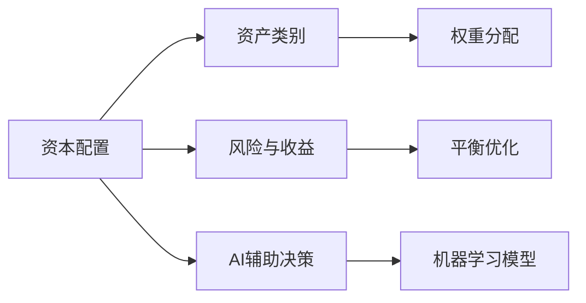

                 


# 巴菲特的资本配置艺术：人工智能辅助的投资组合优化

## 关键词：资本配置，人工智能，投资组合优化，巴菲特，机器学习，投资策略

## 摘要：  
本文探讨了如何将巴菲特的资本配置艺术与人工智能技术相结合，特别是如何利用人工智能优化投资组合。通过介绍资本配置的核心概念、人工智能在投资中的应用，以及基于机器学习和数学模型的投资组合优化算法，本文详细分析了AI在资本配置中的潜力和实际应用。同时，本文还提供了系统的架构设计、项目实战和最佳实践，帮助读者理解如何利用人工智能技术提升投资决策的科学性和效率性。

---

## 第一部分: 背景介绍

### 第1章: 资本配置艺术的背景与概述

#### 1.1 资本配置艺术的定义与重要性
- **1.1.1 资本配置的定义**  
  资本配置是指将资金分配到不同的资产类别（如股票、债券、房地产等）中，以实现投资目标的过程。资本配置的核心在于在不同资产之间找到风险与收益的最佳平衡点。

- **1.1.2 资本配置在投资中的重要性**  
  资本配置是投资组合管理的核心，它决定了投资组合的长期表现。合理的资本配置可以帮助投资者在不同市场环境下降低风险，同时捕捉收益机会。

- **1.1.3 巴菲特的资本配置理念**  
  巴菲特强调长期投资和价值投资，他的资本配置理念基于对企业基本面的深入分析和对市场趋势的把握。他注重资产的质量和可持续性，而非短期市场波动。

#### 1.2 人工智能在投资中的应用
- **1.2.1 人工智能在金融领域的潜力**  
  人工智能（AI）通过处理海量数据、识别复杂模式和预测市场趋势，正在改变传统的投资方式。AI在选股、风险评估、交易策略优化等方面展现了巨大的潜力。

- **1.2.2 投资组合优化的挑战与机遇**  
  投资组合优化是一个复杂的优化问题，涉及多个变量和约束条件。人工智能通过机器学习算法可以有效地解决这些问题，提供更科学的投资决策。

- **1.2.3 巴菲特资本配置理念与AI的结合**  
  将巴菲特的价值投资理念与AI技术相结合，可以利用AI的数据处理能力和预测能力，进一步优化资本配置策略，提升投资组合的收益和稳定性。

#### 1.3 本书的核心目标与结构
- **1.3.1 本书的核心目标**  
  本书旨在探讨如何利用人工智能技术优化资本配置，结合巴菲特的投资理念，为投资者提供科学的投资决策支持。

- **1.3.2 本书的结构安排**  
  本书分为六部分：背景介绍、核心概念、AI技术基础、算法实现、系统架构设计和项目实战。每章都深入探讨相关主题，并通过实例和代码实现来帮助读者理解。

- **1.3.3 读者对象与预期收获**  
  本书适合对投资组合优化和人工智能技术感兴趣的读者，包括投资者、金融从业者和AI工程师。读者将学习到如何将AI技术应用于资本配置，提升投资决策的科学性和效率性。

---

## 第二部分: 核心概念与联系

### 第2章: 资本配置的核心概念与联系

#### 2.1 资本配置的核心概念
- **2.1.1 资产类别与权重分配**  
  不同的资产类别具有不同的风险和收益特征。资本配置的核心在于确定每类资产的权重，以实现投资目标。

- **2.1.2 风险与收益的平衡**  
  投资者需要在风险和收益之间找到平衡点。资本配置通过调整资产权重，可以在不同市场环境下优化风险收益比。

- **2.1.3 资本配置策略的类型**  
  资本配置策略包括战略性配置和战术性配置。战略性配置基于长期投资目标，而战术性配置则根据市场环境进行短期调整。

#### 2.2 AI辅助资本配置的逻辑框架
- **2.2.1 数据驱动的投资决策**  
  AI通过分析历史数据和市场趋势，提供数据驱动的投资建议。这包括对资产价格、市场情绪和经济指标的分析。

- **2.2.2 模型驱动的资产分配**  
  基于机器学习模型的资产分配策略可以通过历史数据训练模型，预测未来市场的表现，从而优化资本配置。

- **2.2.3 机器学习在资本配置中的应用**  
  机器学习算法可以用于风险预测、资产价格预测和组合优化。通过这些应用，AI可以帮助投资者更科学地进行资本配置。

#### 2.3 核心概念与联系的Mermaid流程图


---

## 第三部分: 人工智能技术基础与投资组合优化

### 第3章: 人工智能技术基础与投资组合优化

#### 3.1 机器学习基础
- **3.1.1 机器学习的定义与分类**  
  机器学习是一种人工智能技术，通过数据训练模型，使其能够进行预测或分类。常见的机器学习算法包括回归、分类、聚类等。

- **3.1.2 监督学习与无监督学习**  
  监督学习基于标记数据进行训练，适用于预测任务；无监督学习则适用于数据聚类和异常检测。

- **3.1.3 算法选择与优化**  
  算法选择取决于具体问题和数据特征。优化可以通过调整超参数和模型结构来实现。

#### 3.2 投资组合优化的数学模型
- **3.2.1 投资组合优化的数学公式**  
  投资组合优化的目标是最大化收益或最小化风险。常见的优化目标包括均值-方差优化和风险中性优化。

  $$ \text{目标函数：} \quad \min_w \frac{1}{2}w^T \Sigma w $$
  $$ \text{约束条件：} \quad \sum_{i=1}^n w_i = 1 $$

- **3.2.2 约束条件与目标函数**  
  约束条件通常包括权重的和为1，以及可能的资产类别限制。目标函数可以是方差最小化、风险中性优化或其他自定义目标。

- **3.2.3 数学模型的优化方法**  
  优化方法包括拉格朗日乘数法、二次规划和遗传算法等。

#### 3.3 数据处理与特征工程
- **3.3.1 数据清洗与预处理**  
  数据清洗包括去除缺失值、异常值和重复值。预处理包括标准化、归一化和特征提取。

- **3.3.2 特征选择与降维**  
  特征选择可以通过相关性分析和逐步回归实现。降维技术如主成分分析（PCA）可以减少特征维度。

- **3.3.3 时间序列数据的处理**  
  时间序列数据需要处理趋势、季节性和随机性。常用的处理方法包括差分、移动平均和指数平滑。

---

## 第四部分: 投资组合优化的算法实现

### 第4章: 投资组合优化的算法实现

#### 4.1 基于机器学习的资本配置算法
- **4.1.1 算法原理概述**  
  基于机器学习的资本配置算法通常包括数据获取、特征工程、模型训练和结果分析四个步骤。

- **4.1.2 算法实现步骤**  
  1. 数据获取与预处理：收集历史市场数据并进行清洗。  
  2. 特征工程：提取有用的特征并进行标准化。  
  3. 模型训练：训练机器学习模型，如支持向量机（SVM）或随机森林（Random Forest）。  
  4. 结果分析：根据模型预测结果调整资产权重。

- **4.1.3 算法的优缺点分析**  
  优点：能够捕捉复杂市场模式，适应性强。缺点：需要大量数据和计算资源，且模型可能过拟合。

#### 4.2 基于数学模型的优化
- **4.2.1 线性规划模型**  
  线性规划模型适用于简单的优化问题，如单一目标函数和线性约束。

- **4.2.2 非线性规划模型**  
  非线性规划模型适用于复杂优化问题，但计算复杂度较高。

- **4.2.3 深度学习模型的应用**  
  深度学习模型可以处理高维数据和复杂模式，但在投资组合优化中的应用仍处于研究阶段。

#### 4.3 算法实现的Mermaid流程图


---

## 第五部分: 系统架构设计与实现

### 第5章: 系统架构设计与实现

#### 5.1 问题场景介绍
- **5.1.1 系统目标**  
  开发一个基于AI的资本配置系统，帮助投资者优化投资组合。

- **5.1.2 项目介绍**  
  本项目旨在利用机器学习和数学优化技术，实现自动化资本配置。

#### 5.2 系统功能设计
- **5.2.1 数据获取模块**  
  数据获取模块负责从数据源获取市场数据，如股票价格、经济指标等。

- **5.2.2 模型训练模块**  
  模型训练模块负责训练机器学习模型，生成资本配置建议。

- **5.2.3 结果分析模块**  
  结果分析模块对模型输出进行分析，生成最终的资本配置方案。

#### 5.3 系统架构设计
- **5.3.1 系统架构图**  
  ```mermaid
  graph LR
      A[数据获取] --> B[数据预处理]
      B --> C[特征工程]
      C --> D[模型训练]
      D --> E[结果分析]
      E --> F[资本配置建议]
  ```

- **5.3.2 系统交互设计**  
  ```mermaid
  graph LR
      A[用户输入] --> B[数据获取]
      B --> C[数据预处理]
      C --> D[模型训练]
      D --> E[结果分析]
      E --> F[用户输出]
  ```

---

## 第六部分: 项目实战与经验分享

### 第6章: 项目实战与经验分享

#### 6.1 项目实战
- **6.1.1 环境安装**  
  安装必要的开发工具和库，如Python、Pandas、NumPy、Scikit-learn等。

- **6.1.2 核心代码实现**  
  ```python
  import pandas as pd
  import numpy as np
  from sklearn.linear_model import LinearRegression

  # 数据获取与预处理
  data = pd.read_csv('market_data.csv')
  data = data.dropna()

  # 特征工程
  features = data[['return', 'volatility', 'market_cap']]
  target = data['price']

  # 模型训练
  model = LinearRegression()
  model.fit(features, target)

  # 资本配置建议
  predicted_prices = model.predict(features)
  # 根据预测结果调整资产权重
  ```

- **6.1.3 案例分析与详细解读**  
  通过具体案例分析，展示如何利用AI技术优化资本配置，包括数据处理、模型训练和结果分析。

#### 6.2 经验分享与注意事项
- **6.2.1 数据质量的重要性**  
  数据质量直接影响模型性能，需确保数据的准确性和完整性。

- **6.2.2 模型选择与调优**  
  根据具体问题选择合适的模型，并通过交叉验证和超参数调整优化模型性能。

- **6.2.3 风险管理**  
  资本配置需考虑市场风险、流动性风险等，确保投资组合的稳健性。

#### 6.3 项目小结
- **6.3.1 项目总结**  
  通过本项目，我们展示了如何利用AI技术优化资本配置，提升投资组合的收益和稳定性。

- **6.3.2 未来展望**  
  随着AI技术的不断发展，资本配置的自动化和智能化将更加普及，为投资者带来更多的机会和挑战。

---

## 第七部分: 总结与展望

### 第7章: 总结与展望

#### 7.1 核心观点回顾
- 巴菲特的资本配置理念与AI技术的结合，为投资组合优化提供了新的思路。

#### 7.2 投资策略与风险管理
- AI技术可以辅助投资者制定科学的投资策略，但风险管理仍需依赖人工判断和市场经验。

#### 7.3 未来发展趋势
- 随着AI技术的进步，资本配置的自动化和智能化将更加普及，投资者需不断学习新技术，提升自身竞争力。

---

## 作者：AI天才研究院/AI Genius Institute & 禅与计算机程序设计艺术/Zen And The Art of Computer Programming

