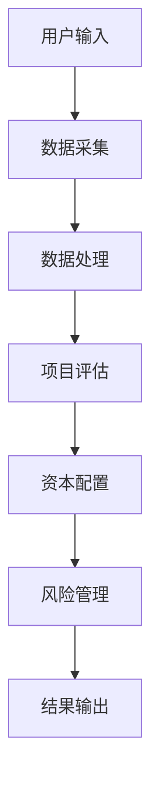
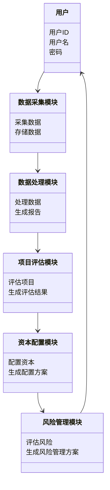
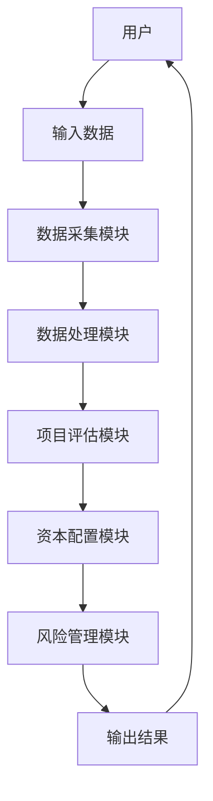
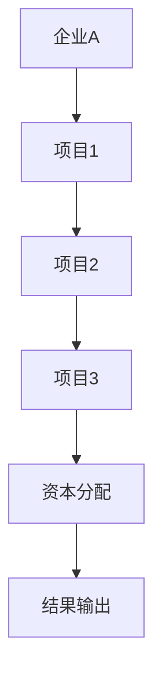
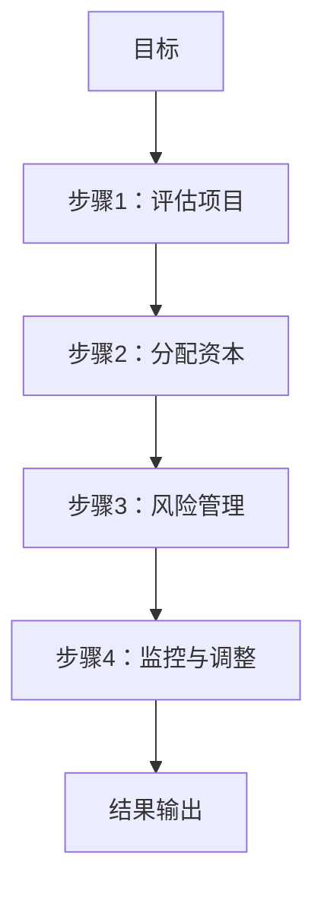

                 


# 巴菲特的资本配置艺术：如何有效分配公司资源

> 关键词：巴菲特，资本配置，投资策略，资本预算，企业价值，风险管理

> 摘要：本文深入探讨了巴菲特的资本配置艺术，分析了其核心理念、投资策略、资本预算模型以及风险管理方法。通过系统化的分析和实战案例，揭示了巴菲特如何在复杂的市场环境中有效分配公司资源，实现长期价值增长。

---

## 第1章：资本配置的背景与重要性

### 1.1 资本配置的基本概念

#### 1.1.1 资本配置的定义
资本配置是指将企业资源（如资金、资产、人力等）分配到不同项目或业务中，以实现最大化的价值增长。资本配置的核心目标是通过优化资源配置，提升企业的整体效益。

#### 1.1.2 资本配置的重要性
- 资本配置决定了企业的成长性和盈利能力。
- 合理的资本配置能够降低风险，提高资金使用效率。
- 不良的资本配置可能导致资源浪费或企业价值下降。

#### 1.1.3 资本配置的核心目标
- 实现股东价值最大化。
- 优化企业资产结构。
- 提高资本回报率（ROE）。

### 1.2 巴菲特的资本配置理念

#### 1.2.1 巴菲特的投资哲学
巴菲特的资本配置哲学基于以下几点：
- 长期投资：关注企业的内在价值，而非短期市场波动。
- 价值投资：寻找具有持续竞争优势的企业。
- 风险控制：通过分散投资降低风险。

#### 1.2.2 巴菲特的资本配置原则
- 集中投资：将大部分资金集中在少数具有长期竞争优势的企业。
- 安全边际：确保投资的安全性，避免过度冒险。
- 股东利益优先：将股东利益放在首位。

#### 1.2.3 巴菲特资本配置的实践案例
- 可口可乐：巴菲特长期持有可口可乐的股票，因为其具备强大的品牌优势和稳定的现金流。
- 巴西国家石油公司（Petrobras）：巴菲特通过分析企业的内在价值，选择合适的时机进行投资。

### 1.3 资本配置的理论基础

#### 1.3.1 资本资产定价模型（CAPM）
CAPM是一种用于评估资产预期收益的模型，公式如下：
$$
E(R_i) = R_f + \beta_i (E(R_m) - R_f)
$$
其中：
- $E(R_i)$：资产$i$的预期收益率。
- $R_f$：无风险利率。
- $\beta_i$：资产$i$的贝塔系数，表示其相对于市场的波动性。
- $E(R_m)$：市场预期收益率。

#### 1.3.2 资本预算与投资决策
资本预算是企业为了实现长期目标而进行的重大投资决策，主要包括：
- 项目评估：通过净现值（NPV）、内部收益率（IRR）等指标评估项目的可行性。
- 资金分配：根据项目的收益和风险进行资金分配。

#### 1.3.3 资本结构与企业价值
资本结构是指企业债务和股权的比例。合理的资本结构能够降低资本成本，提高企业价值。资本成本的计算公式为：
$$
\text{资本成本} = \frac{\text{净利润}}{\text{权益价值}}
$$

---

## 第2章：资本配置的核心概念与模型

### 2.1 资本配置的理论框架

#### 2.1.1 资本配置的基本原理
资本配置的基本原理包括：
- 资源分配的效率：将资源分配到能够产生最大价值的领域。
- 风险与收益的平衡：在追求收益的同时，控制风险。

#### 2.1.2 资本配置的多维度分析
资本配置可以从以下几个维度进行分析：
- 时间维度：短期与长期资本配置。
- 风险维度：高风险与低风险项目。
- 资源维度：资金、人力、技术等资源的分配。

#### 2.1.3 资本配置的数学模型
资本配置的数学模型包括：
- 投资组合优化模型：最大化收益，最小化风险。
- 资本预算模型：评估项目的可行性和资金分配。

### 2.2 巴菲特的资本配置模型

#### 2.2.1 巴菲特的内在价值评估
巴菲特的内在价值评估方法包括：
- 财务指标分析：如ROE、ROA等。
- 行业分析：评估企业的行业地位和竞争优势。
- 管理层评估：评估企业管理层的能力和诚信。

#### 2.2.2 巴菲特的资产配置策略
巴菲特的资产配置策略包括：
- 集中投资：将大部分资金集中在少数优质企业。
- 分散投资：通过投资不同行业的企业降低风险。

#### 2.2.3 巴菲特的资本分配决策
巴菲特的资本分配决策包括：
- 内部投资：将资金用于企业的扩张和并购。
- 股票回购：通过回购股票提高每股收益。
- 股息支付：通过支付股息回报股东。

### 2.3 资本配置的现代发展

#### 2.3.1 现代资本预算理论
现代资本预算理论包括：
- � � 净现值法（NPV）：评估项目的未来现金流的现值。
- 内部收益率法（IRR）：评估项目的回报率。
- 现值指数法（PVIFA）：评估项目的投资效率。

#### 2.3.2 现代资本结构理论
现代资本结构理论包括：
- 米勒-莫迪格里亚尼模型（MM定理）：分析债务与股权的比例对资本成本的影响。
- 权衡理论：权衡债务与股权的成本和风险。

#### 2.3.3 现代资本配置的挑战与创新
现代资本配置的挑战包括：
- 全球化：跨国投资的复杂性。
- 技术进步：技术变革对资本配置的影响。
- 金融市场波动：市场的不确定性和波动性。

---

## 第3章：资本配置的系统分析与架构设计

### 3.1 系统分析与问题场景

#### 3.1.1 系统目标
资本配置系统的目标是：
- 提供资本配置的决策支持。
- 优化资源配置，提高企业价值。

#### 3.1.2 系统输入与输出
系统输入包括：
- 企业的财务数据。
- 市场数据。
- 项目信息。
系统输出包括：
- 资本配置建议。
- 项目评估结果。

#### 3.1.3 系统约束与边界
系统约束包括：
- 数据的准确性和及时性。
- 系统的稳定性和安全性。
- 用户的权限和角色。

### 3.2 系统架构设计

#### 3.2.1 系统功能模块划分
资本配置系统的主要功能模块包括：
- 数据采集与处理模块。
- 项目评估模块。
- 资本配置模块。
- 风险管理模块。

#### 3.2.2 系统功能流程图
以下是资本配置系统的功能流程图：



#### 3.2.3 系统功能类图
以下是资本配置系统的类图：



### 3.3 系统接口与交互设计

#### 3.3.1 系统接口定义
资本配置系统的接口包括：
- 用户界面：提供数据输入和结果查看的功能。
- 数据接口：与其他系统（如财务系统）进行数据交互。
- 报告接口：生成和输出报告。

#### 3.3.2 系统交互流程图
以下是资本配置系统的交互流程图：



#### 3.3.3 系统接口协议设计
资本配置系统的接口协议包括：
- HTTP协议：用于数据传输。
- JSON格式：用于数据结构化。
- REST API：用于接口调用。

---

## 第4章：资本配置的项目实战

### 4.1 环境安装与配置

#### 4.1.1 系统环境要求
- 操作系统：Windows、Linux、macOS。
- 开发工具：Python、Jupyter Notebook。
- 数据库：MySQL、MongoDB。

#### 4.1.2 开发工具安装
- Python安装：使用pip安装必要的库，如pandas、numpy、scipy。
- Jupyter Notebook安装：通过Anaconda安装。

#### 4.1.3 数据库与依赖库安装
- 数据库安装：安装MySQL或MongoDB。
- 依赖库安装：使用pip安装pandas、numpy、scipy等库。

### 4.2 核心功能实现

#### 4.2.1 资本配置模型实现
以下是资本配置模型的Python代码示例：

```python
import pandas as pd
import numpy as np

def calculate_npv(cash_flows, discount_rate):
    npv = 0
    for i, cash_flow in enumerate(cash_flows):
        npv += cash_flow / (1 + discount_rate)**i
    return npv

# 示例数据
cash_flows = [100, 200, 300, 400]
discount_rate = 0.1

# 计算净现值
npv = calculate_npv(cash_flows, discount_rate)
print("净现值：", npv)
```

#### 4.2.2 巴菲特投资策略实现
以下是巴菲特投资策略的Python代码示例：

```python
import pandas as pd

def calculate_intrinsic_value(financial_data, roe, roa, market_share):
    intrinsic_value = financial_data['净利润'] * (1 + roe) * (1 + roa) * (1 + market_share)
    return intrinsic_value

# 示例数据
financial_data = {'净利润': 100, 'ROE': 0.2, 'ROA': 0.15, '市场占有率': 0.3}
intrinsic_value = calculate_intrinsic_value(financial_data, financial_data['ROE'], financial_data['ROA'], financial_data['市场占有率'])
print("内在价值：", intrinsic_value)
```

#### 4.2.3 资本分配算法实现
以下是资本分配算法的Python代码示例：

```python
import numpy as np

def allocate_capital(asset_values, target_allocation):
    total_assets = sum(asset_values)
    allocated_assets = {}
    for asset, value in asset_values.items():
        allocated_assets[asset] = value / total_assets * target_allocation
    return allocated_assets

# 示例数据
asset_values = {'股票': 50, '债券': 30, '现金': 20}
target_allocation = 100

allocated_assets = allocate_capital(asset_values, target_allocation)
print("资产分配结果：", allocated_assets)
```

### 4.3 案例分析与策略设计

#### 4.3.1 案例分析
以下是资本配置的案例分析：



#### 4.3.2 策略设计
以下是资本配置的策略设计：



### 4.4 项目小结

通过以上实战案例，我们可以看到资本配置在实际中的应用。通过合理的资本配置，企业可以实现资源的最优分配，提高整体效益。同时，资本配置也需要注意风险控制，确保企业的长期稳定发展。

---

## 第5章：资本配置的总结与展望

### 5.1 总结

本文详细探讨了巴菲特的资本配置艺术，分析了其核心理念、投资策略、资本预算模型以及风险管理方法。通过系统化的分析和实战案例，揭示了巴菲特如何在复杂的市场环境中有效分配公司资源，实现长期价值增长。

### 5.2 展望

未来，资本配置将面临更多的挑战和机遇。随着全球化和科技的进步，资本配置的复杂性也将增加。企业需要更加灵活和创新，以应对市场的变化。同时，人工智能和大数据技术的应用也将为资本配置提供更多的工具和方法，帮助企业做出更科学的决策。

---

## 附录：资本配置的数学公式与图表

### 附录A：资本配置的数学公式

资本配置的数学公式包括：
- 净现值公式：$$\text{NPV} = \sum_{t=0}^{n} \frac{C_t}{(1 + r)^t}$$
- 内部收益率公式：$$\text{IRR} = r \text{ 满足 } \sum_{t=0}^{n} \frac{C_t}{(1 + r)^t} = 0$$
- 资本成本公式：$$\text{资本成本} = \frac{\text{净利润}}{\text{权益价值}}$$

### 附录B：资本配置的图表

以下是资本配置的图表示例：


---

## 参考文献

1. 巴菲特《股东的资本主义》
2. 现代资本预算理论的相关文献
3. 系统架构设计的经典书籍
4. Python编程与数据分析的相关书籍

---

## 作者

作者：AI天才研究院/AI Genius Institute & 禅与计算机程序设计艺术/Zen And The Art of Computer Programming

