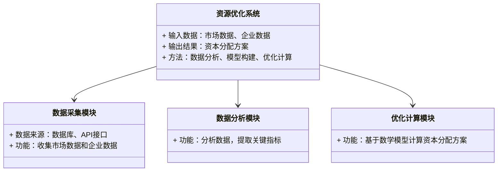
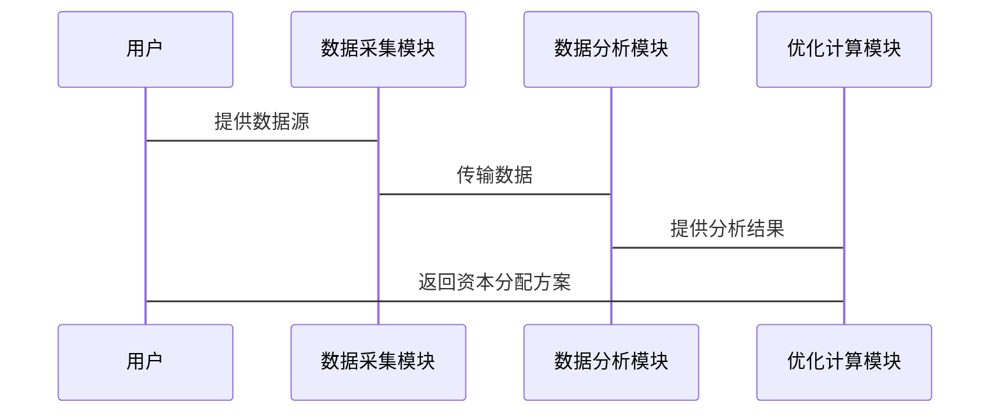

                 


# 巴菲特的资本配置艺术：数字化转型中的资源优化

## 关键词：巴菲特、资本配置、资源优化、数字化转型、投资策略、企业架构、技术应用

## 摘要：本文深入分析了巴菲特的资本配置理论及其在数字化转型中的应用，探讨了如何通过资源优化提升企业的核心竞争力。通过结合实际案例和系统设计，展示了资本配置艺术在技术驱动下的企业战略优化中的重要作用，为企业的数字化转型提供了新的视角和方法。

---

# 第一部分：资本配置艺术的理论基础

## 第1章：资本配置的基本概念

### 1.1 资本配置的定义与特征

资本配置是指将企业的资金分配到不同的资产类别或项目中，以实现企业价值的最大化。其核心特征包括：

- **资源分配的最优性**：通过科学的分配方式，最大化资本回报率。
- **动态调整的灵活性**：根据市场变化和企业战略调整资本分配。
- **风险与收益的平衡**：在追求收益的同时，控制投资风险。

### 1.2 巴菲特的资本配置理论

### 1.2.1 巴菲特资本配置的核心思想

巴菲特的资本配置理论强调长期投资和价值投资，主张将资本投向具有强大护城河的企业，以确保长期稳定的收益。其核心思想包括：

1. **投资优质企业**：选择具有竞争优势、稳定的商业模式和良好管理团队的企业。
2. **长期持有**：避免频繁交易，长期持有优质资产，获取复利效应。
3. **分散与集中相结合**：在投资组合中保持适当的分散，同时集中投资于少数优质企业。

### 1.2.2 巴菲特的资本配置模型

巴菲特的资本配置模型可以表示为：

$$
\text{资本分配} = f(\text{企业价值}, \text{竞争优势}, \text{管理质量})
$$

其中，企业价值是核心，竞争优势是关键，管理质量是保障。

### 1.2.3 资本配置的核心要素

| 要素 | 描述 |
|------|------|
| 企业价值 | 企业的内在价值，包括资产、盈利能力等。 |
| 竞争优势 | 企业在市场中的独特优势，如技术、品牌等。 |
| 管理质量 | 企业管理层的决策能力和执行力。 |

### 1.3 资本配置的实际案例

#### 1.3.1 可口可乐的资本配置案例

可口可乐通过长期持有和投资于其全球分销系统，巩固了其市场领导地位。巴菲特在收购可口可乐的股份后，长期持有并支持其国际化扩张，实现了资本的最优配置。

#### 1.3.2 伯克希尔哈撒韦的资本配置实践

伯克希尔哈撒韦通过集中投资于保险、银行等具有稳定收益的行业，并长期持有优质企业股权，实现了资本的持续增值。

---

## 第2章：数字化转型的背景与挑战

### 2.1 数字化转型的定义与特点

数字化转型是指企业利用数字技术（如大数据、人工智能、云计算等）改造业务流程、商业模式和决策方式，以提升效率和竞争力。其特点包括：

- **技术驱动**：依赖于新兴数字技术的应用。
- **数据导向**：以数据为驱动，优化决策过程。
- **业务融合**：将数字技术与业务深度融合，创造新的价值。

### 2.2 数字化转型中的资源优化问题

#### 2.2.1 资源分配的挑战

在数字化转型中，企业需要在技术投入、人力资源、市场拓展等方面进行合理分配，以实现资源的最优利用。

#### 2.2.2 资源优化的目标

- **提高效率**：通过优化资源配置，提升企业运营效率。
- **降低成本**：合理分配资源，降低不必要的开支。
- **提升竞争力**：通过资源优化，增强企业在市场中的竞争力。

### 2.3 数字化转型中的资源优化策略

#### 2.3.1 数据驱动的资源优化

通过收集和分析数据，优化资源分配策略，例如使用大数据分析技术预测市场需求，调整生产和库存分配。

#### 2.3.2 技术赋能的资源优化

利用人工智能、机器学习等技术，建立资源优化模型，实现智能化的资源分配。

#### 2.3.3 企业文化与组织结构优化

通过优化组织结构和企业文化，提升资源分配的效率和效果。

---

## 第3章：资本配置艺术在数字化转型中的应用

### 3.1 巴菲特资本配置理论与数字化转型的契合点

#### 3.1.1 数据驱动的决策

巴菲特的长期投资策略依赖于对企业内在价值的深入分析，这与数字化转型中数据驱动的决策方式不谋而合。

#### 3.1.2 长期投资与快速变化的技术环境

尽管数字化转型面临技术快速变化的挑战，巴菲特的长期投资策略仍可为企业提供稳定的资本分配方向。

### 3.2 数字化转型中的资本分配策略

#### 3.2.1 数据驱动的资本分配模型

通过大数据分析和预测，优化资本分配，例如使用机器学习模型预测技术趋势，调整资本分配到高增长领域。

#### 3.2.2 技术驱动的资本分配优化

利用人工智能技术优化资本分配，例如使用强化学习算法动态调整投资组合。

### 3.3 资本配置艺术在数字化转型中的具体实践

#### 3.3.1 亚马逊的资本配置案例

亚马逊通过长期投资于技术基础设施（如云计算和人工智能），实现了业务的快速增长和资本的高效配置。

#### 3.3.2 阿里巴巴的数字化转型与资本配置实践

阿里巴巴通过投资于电子商务、金融科技等领域，实现了资本的高效配置和业务的多元化发展。

---

## 第4章：资本配置的数学模型与算法原理

### 4.1 资本配置的优化目标与约束条件

#### 4.1.1 优化目标

最大化投资回报率（ROI）或股东价值。

#### 4.1.2 约束条件

- 投资组合的总资本不超过预算。
- 每个投资项目的最低资本要求。
- 风险可控，资本分配后的投资组合风险不超过设定阈值。

### 4.2 资本配置的数学模型

#### 4.2.1 线性规划模型

$$
\max \sum_{i=1}^{n} r_i x_i
$$

$$
\text{s.t.} \quad \sum_{i=1}^{n} w_i x_i \leq W
$$

$$
x_i \geq 0, \quad i = 1, 2, \ldots, n
$$

其中，\( r_i \) 是项目的回报率，\( w_i \) 是项目的权重，\( x_i \) 是分配给项目的资本，\( W \) 是总资本预算。

#### 4.2.2 动态规划模型

通过动态规划优化资本分配，考虑时间因素和市场变化的影响。

### 4.3 资本配置的算法实现

#### 4.3.1 线性规划算法

使用Python的`scipy.optimize`库进行线性规划求解。

```python
from scipy.optimize import linprog

# 定义目标函数系数
c = [-0.1, -0.2, -0.3]

# 定义约束矩阵
A = [[0.1, 0.2, 0.3]]
b = [1]

# 线性规划求解
result = linprog(c, A=A, b=b, method='highs')

print(result.x)
```

#### 4.3.2 动态规划算法

使用动态规划方法求解资本分配的最优解。

---

## 第5章：系统分析与架构设计

### 5.1 资源优化系统的功能设计

#### 5.1.1 领域模型设计



### 5.2 系统架构设计

```mermaid
rectangle 资源优化系统 {
    界面层
    服务层
    数据层
}

界面层 --> 服务层
服务层 --> 数据层
```

### 5.3 系统接口设计

- **输入接口**：接收市场数据和企业数据。
- **输出接口**：输出资本分配方案。

### 5.4 系统交互流程



---

## 第6章：项目实战

### 6.1 环境安装与配置

- **工具安装**：安装Python、Jupyter Notebook、Scipy库。
- **数据准备**：收集市场数据和企业数据。

### 6.2 系统核心实现

#### 6.2.1 数据分析模块实现

```python
import pandas as pd

# 数据加载
data = pd.read_csv('market_data.csv')

# 数据清洗
data.dropna(inplace=True)
```

#### 6.2.2 优化计算模块实现

```python
from scipy.optimize import linprog

# 定义目标函数系数
c = [-0.1, -0.2, -0.3]

# 定义约束矩阵
A = [[0.1, 0.2, 0.3]]
b = [1]

# 线性规划求解
result = linprog(c, A=A, b=b, method='highs')

print(result.x)
```

#### 6.2.3 系统集成与测试

测试系统各模块的交互和功能是否正常。

### 6.3 案例分析与结果解读

通过具体案例，展示资本分配方案的优化效果，分析其对企业资源优化的贡献。

### 6.4 本章小结

总结项目实施过程中的关键步骤和成果，为读者提供实际操作的参考。

---

## 第7章：总结与展望

### 7.1 核心观点总结

巴菲特的资本配置艺术为数字化转型中的资源优化提供了重要的理论指导和技术启示。

### 7.2 未来展望

随着数字技术的不断进步，资本配置艺术在数字化转型中的应用将更加广泛和深入，为企业创造更大的价值。

---

## 最佳实践 Tips

- **数据驱动决策**：在数字化转型中，数据是资本配置的核心依据。
- **技术赋能优化**：利用人工智能和大数据技术优化资本分配。
- **长期与短期结合**：在追求长期投资收益的同时，注重短期资本流动的优化。

---

## 作者：AI天才研究院 & 禅与计算机程序设计艺术

---

通过本文的分析，我们深入探讨了巴菲特的资本配置理论，并结合数字化转型的实际需求，提出了资本配置艺术在资源优化中的应用方法。希望本文能为企业在数字化转型中提供新的思路和实践指导。

