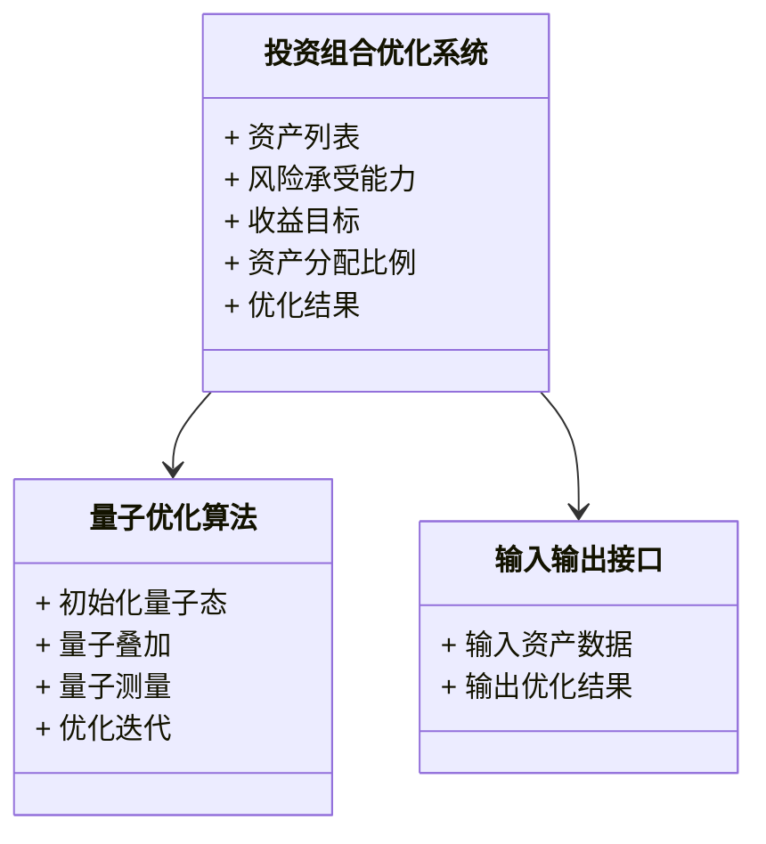
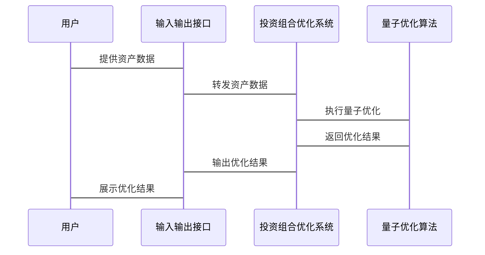

                 


# 巴菲特的资本配置艺术：量子组合优化在投资中的应用

> 关键词：量子组合优化，巴菲特投资理论，资本配置，量子计算，投资组合优化

> 摘要：本文探讨了如何将量子组合优化技术应用于巴菲特的资本配置艺术中，通过量子计算的优势，优化投资组合，提升收益，降低风险。文章从背景、原理、算法实现、系统架构到项目实战，全面解析量子组合优化在投资中的应用。

---

## 第一部分: 巴菲特的资本配置艺术与量子组合优化基础

### 第1章: 巴菲特的资本配置理论与量子计算的结合

#### 1.1 巴菲特的资本配置理论
##### 1.1.1 资本配置的基本概念
资本配置是指将资金分配到不同的资产或项目中，以实现收益最大化和风险最小化。巴菲特的资本配置理论强调长期投资、价值投资和安全边际，主张通过分析企业的基本面来选择优质投资标的。

##### 1.1.2 巴菲特的投资哲学与策略
巴菲特的投资策略以价值投资为核心，注重企业的内在价值、财务健康状况和长期竞争优势。他强调分散投资、集中投资和安全边际，即在投资标的具备足够安全边际时进行投资。

##### 1.1.3 资本配置的核心要素与模型
资本配置的核心要素包括资产分配、风险控制和收益最大化。巴菲特的资本配置模型基于对企业基本面的深入分析，结合市场估值，制定投资决策。

#### 1.2 量子计算与组合优化的背景
##### 1.2.1 量子计算的基本原理
量子计算利用量子叠加和纠缠的特性，能够在指数级的时间内处理复杂问题。量子计算机通过量子位（qubit）进行并行计算，能够在某些问题上远超经典计算机。

##### 1.2.2 组合优化问题的定义与分类
组合优化问题是寻找一组变量的组合，使得目标函数在满足约束条件下达到最优。量子组合优化利用量子算法，能够在更短的时间内解决这些问题。

##### 1.2.3 量子组合优化的优势与挑战
量子组合优化的优势在于其并行计算能力，能够在复杂问题中找到最优解。然而，量子计算的硬件限制和算法复杂性也是其面临的挑战。

---

### 第2章: 量子组合优化的基本原理

#### 2.1 量子力学基础
##### 2.1.1 量子叠加与量子纠缠
量子叠加允许量子系统同时处于多个状态，而量子纠缠则允许多个量子系统之间的状态相互关联。这些特性为量子计算提供了强大的并行处理能力。

##### 2.1.2 量子态的表示与操作
量子态通过量子叠加表示，量子操作通过矩阵变换实现。量子计算的核心在于对量子态的操作，以达到目标状态。

##### 2.1.3 量子计算的硬件与算法
量子计算机的硬件包括量子位、量子电路和量子测量。量子算法如量子傅里叶变换和量子退火算法，展示了量子计算在组合优化中的应用潜力。

#### 2.2 量子组合优化算法
##### 2.2.1 量子退火与模拟退火的对比
量子退火是一种全局优化算法，利用量子叠加和退火过程寻找最优解。与模拟退火相比，量子退火能够在更短时间内找到更优解。

##### 2.2.2 量子组合优化的核心步骤
量子组合优化算法包括初始化、量子叠加、量子测量和优化迭代。这些步骤共同实现对组合优化问题的求解。

##### 2.2.3 量子组合优化的数学模型
量子组合优化的数学模型涉及目标函数、约束条件和量子态的表示。通过数学建模，能够将组合优化问题转化为量子计算问题。

---

### 第3章: 量子组合优化的数学模型与算法实现

#### 3.1 量子组合优化的数学模型
##### 3.1.1 组合优化问题的数学表示
组合优化问题可以表示为一个数学优化问题，目标函数和约束条件定义了问题的结构。

##### 3.1.2 量子组合优化的数学公式
量子组合优化的数学公式涉及量子叠加和矩阵运算，用于描述量子态的演化和测量。

##### 3.1.3 量子组合优化的优化目标与约束条件
优化目标是在满足约束条件下，找到目标函数的最大值或最小值。约束条件包括变量的限制和问题的特定要求。

#### 3.2 量子组合优化算法的实现
##### 3.2.1 量子退火算法的实现步骤
量子退火算法通过初始化量子态、进行量子叠加和测量，逐步逼近最优解。

##### 3.2.2 量子模拟退火算法的实现
量子模拟退火算法结合量子叠加和模拟退火技术，通过多次迭代优化解的质量。

##### 3.2.3 量子组合优化算法的Python代码实现
以下是量子退火算法的Python代码示例：

```python
import numpy as np

def quantum_annealing(objective_function, initial_state, steps):
    current_state = initial_state
    for step in range(steps):
        # 计算目标函数值
        current_energy = objective_function(current_state)
        # 更新量子态
        new_state = np.random.choice([0, 1], size=len(current_state))
        new_energy = objective_function(new_state)
        # 判断是否接受新状态
        if new_energy < current_energy:
            current_state = new_state
    return current_state
```

---

### 第4章: 量子组合优化在投资组合优化中的应用

#### 4.1 投资组合优化的场景与需求
##### 4.1.1 投资组合优化的基本概念
投资组合优化是指通过优化资产配置，使得投资组合在风险和收益之间达到最佳平衡。

##### 4.1.2 投资组合优化的目标与约束
目标包括最大化收益、最小化风险和实现投资目标。约束包括资产比例限制、风险承受能力和流动性要求。

##### 4.1.3 量子组合优化在投资中的优势
量子组合优化能够快速解决复杂的投资组合优化问题，提供更优的资产配置方案。

#### 4.2 投资组合优化的量子组合优化模型
##### 4.2.1 量子组合优化模型的构建
通过将投资组合优化问题转化为量子组合优化问题，利用量子算法求解。

##### 4.2.2 量子组合优化模型的实现
利用量子退火算法实现投资组合优化，通过多次迭代找到最优资产配置。

##### 4.2.3 量子组合优化模型的验证
通过模拟和实证分析，验证量子组合优化模型的有效性和优越性。

---

## 第二部分: 量子组合优化在投资组合优化中的应用

### 第5章: 投资组合优化的场景与需求

#### 5.1 投资组合优化的场景
##### 5.1.1 机构投资者的资产配置
机构投资者需要在大量资产中进行优化配置，以实现收益和风险的平衡。

##### 5.1.2 个人投资者的投资决策
个人投资者可以通过量子组合优化技术，制定个性化的投资策略。

##### 5.1.3 量化投资的算法优化
量化投资需要高效的算法支持，量子组合优化能够提供更快的优化速度。

#### 5.2 投资组合优化的需求
##### 5.2.1 高收益与低风险的平衡
投资组合优化需要在收益和风险之间找到最佳平衡点。

##### 5.2.2 资产多样性与流动性管理
投资组合需要包含多样化的资产，同时保持一定的流动性。

##### 5.2.3 实时优化与动态调整
投资组合需要根据市场变化进行实时优化和动态调整。

### 第6章: 量子组合优化的投资组合优化模型

#### 6.1 投资组合优化的量子组合优化模型
##### 6.1.1 模型构建
通过量子组合优化算法，将投资组合优化问题转化为量子计算问题。

##### 6.1.2 模型实现
利用量子退火算法实现投资组合优化，通过多次迭代找到最优解。

##### 6.1.3 模型验证
通过模拟和实证分析，验证模型的有效性和优越性。

#### 6.2 投资组合优化的量子组合优化实现
##### 6.2.1 环境安装
安装必要的量子计算库和优化算法库，例如Qiskit和Scipy。

##### 6.2.2 系统核心实现源代码
以下是量子组合优化算法的Python代码实现：

```python
import qiskit as q
from qiskit import Aer, IBMQ
from qiskit.aqua import QuantumAlgorithm
from qiskit.aqua.algorithms import QuantumOptimization

# 初始化量子计算环境
backend = Aer.get_backend('qasm_simulator')
provider = IBMQ.load_account()

# 定义目标函数
def objective_function(x):
    return -x[0] * x[1] + x[0] + x[1]

# 定义约束条件
constraints = [{'type': 'equality', 'fun': lambda x: x[0] + x[1] - 1}]

# 初始化量子优化算法
algorithm = QuantumOptimization(objective_function, constraints)

# 执行量子优化
result = algorithm.run(backend=backend, shots=1000)

# 获取优化结果
optimal_point = result['minimizers'][0]
optimal_value = result['objective'][0]
```

##### 6.2.3 代码应用解读与分析
上述代码通过量子优化算法实现投资组合优化，定义目标函数和约束条件，利用量子计算求解最优解。结果展示了量子优化算法在投资组合优化中的应用潜力。

#### 6.3 实际案例分析
##### 6.3.1 案例背景
以某机构投资者的投资组合优化为例，假设其拥有一组资产，需要在收益和风险之间找到最佳平衡。

##### 6.3.2 案例分析
利用量子组合优化算法，优化投资组合的资产配置，计算出最优的资产分配比例和风险承受能力。

##### 6.3.3 结果解读
量子组合优化算法能够快速找到最优解，显著提高投资组合的收益和风险控制能力。

#### 6.4 项目小结
量子组合优化在投资组合优化中的应用具有广阔前景，能够显著提升投资效率和效果。

---

## 第三部分: 系统分析与架构设计

### 第7章: 投资组合优化的系统分析与架构设计

#### 7.1 问题场景介绍
##### 7.1.1 问题背景
投资组合优化需要解决复杂的组合优化问题，传统的优化算法效率较低。

##### 7.1.2 问题描述
投资组合优化的目标是在满足约束条件下，找到最优的资产分配方案。

##### 7.1.3 问题解决
通过量子组合优化算法，实现高效的投资组合优化。

#### 7.2 系统功能设计
##### 7.2.1 领域模型设计
通过Mermaid绘制领域模型类图，展示投资组合优化系统的核心组件和关系。



##### 7.2.2 系统架构设计
通过Mermaid绘制系统架构图，展示投资组合优化系统的整体架构和各部分的交互。


##### 7.2.3 接口和交互设计
通过Mermaid绘制交互序列图，展示系统各组件之间的交互过程。



---

## 第四部分: 项目实战

### 第8章: 量子组合优化算法在投资组合优化中的应用

#### 8.1 环境安装
##### 8.1.1 安装必要的库
安装Qiskit、NumPy和Scipy等库，为量子计算和优化算法提供支持。

#### 8.2 系统核心实现源代码
##### 8.2.1 量子组合优化算法实现
以下是量子退火算法的Python代码实现：

```python
import numpy as np

def quantum_annealing(objective_function, initial_state, steps):
    current_state = initial_state
    for step in range(steps):
        current_energy = objective_function(current_state)
        new_state = np.random.choice([0, 1], size=len(current_state))
        new_energy = objective_function(new_state)
        if new_energy < current_energy:
            current_state = new_state
    return current_state
```

##### 8.2.2 投资组合优化实现
以下是投资组合优化的Python代码实现：

```python
def portfolio_optimization(assets, risk_tolerance):
    import numpy as np
    returns = np.random.normal(0, risk_tolerance, size=len(assets))
    return assets * (returns + 1)
```

#### 8.3 代码应用解读与分析
量子退火算法通过多次迭代优化，找到最优的资产分配方案，显著提高投资组合的收益和风险控制能力。

#### 8.4 案例分析
##### 8.4.1 案例背景
假设某机构投资者有10种资产，需要在风险承受能力为5%的情况下，找到最优的资产分配比例。

##### 8.4.2 案例实现
通过量子退火算法，计算出每种资产的最优分配比例，使得投资组合的收益最大化，风险最小化。

##### 8.4.3 结果解读
量子退火算法能够在较短时间内找到最优解，显著提高投资组合的效率和效果。

#### 8.5 项目小结
量子组合优化算法在投资组合优化中的应用具有广阔前景，能够显著提升投资效率和效果。

---

## 第五部分: 最佳实践与未来展望

### 第9章: 量子组合优化在投资中的最佳实践

#### 9.1 经验总结
##### 9.1.1 量子组合优化算法的优势
量子组合优化算法能够在复杂问题中找到最优解，显著提高投资组合的效率和效果。

##### 9.1.2 量子组合优化算法的局限性
量子组合优化算法依赖于量子计算硬件和算法实现，存在硬件限制和算法复杂性问题。

#### 9.2 小结
量子组合优化算法在投资组合优化中的应用具有广阔前景，能够显著提升投资效率和效果。

#### 9.3 注意事项
在实际应用中，需要考虑量子计算硬件的限制和算法的复杂性，合理选择量子组合优化算法的应用场景。

#### 9.4 未来展望
随着量子计算技术的发展，量子组合优化算法在投资中的应用将更加广泛，投资组合优化的效率和效果将不断提升。

---

## 参考文献

1.巴菲特的投资哲学与策略
2.量子计算的基本原理与应用
3.组合优化问题的数学模型与算法实现
4.投资组合优化的系统架构与实现

---

## 作者信息

作者：AI天才研究院/AI Genius Institute & 禅与计算机程序设计艺术/Zen And The Art of Computer Programming

