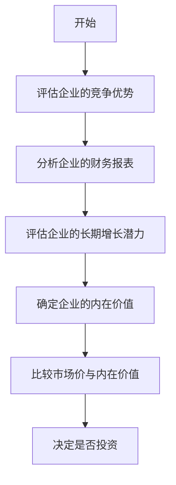
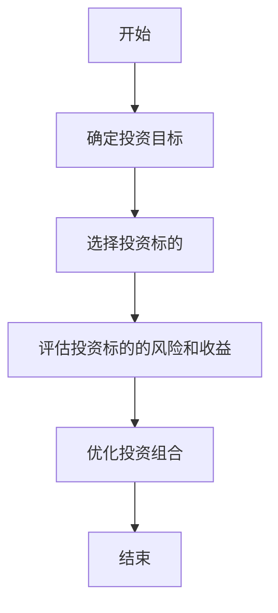
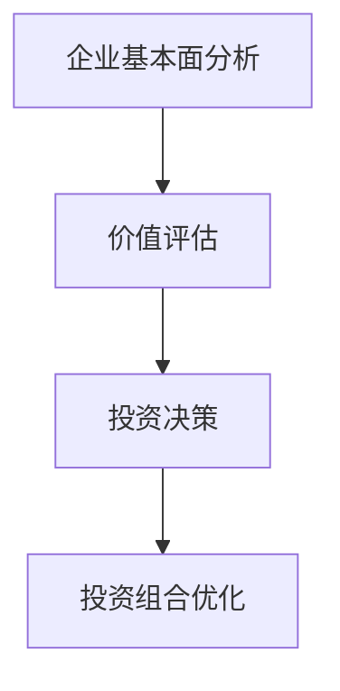

                 


# 巴菲特的跨界投资策略：从纺织到科技

> 关键词：巴菲特，投资策略，跨界投资，价值投资，纺织行业，科技行业

> 摘要：本文将探讨巴菲特的跨界投资策略，从他最初在纺织行业的投资经验，到后来转向科技行业的投资策略。通过分析他的投资哲学、价值评估模型和实际案例，本文将揭示巴菲特如何在不同行业中寻找投资机会，并实现长期的资本增值。

---

## 目录

1. [巴菲特的生平与投资理念](#巴菲特的生平与投资理念)
   1.1 巴菲特的早年经历
   1.2 巴菲特的价值投资理念
   1.3 巴菲特的合伙人制度

2. [巴菲特的跨界投资策略](#巴菲特的跨界投资策略)
   2.1 跨界投资的定义与特点
   2.2 巴菲特的投資策略分析
   2.3 巴菲特从纺织到科技的投资转型

3. [巴菲特的价值评估模型](#巴菲特的价值评估模型)
   3.1 价值评估模型的定义
   3.2 巴菲特DCF模型
   3.3 DCF模型的计算公式与应用实例

4. [巴菲特的投资决策算法](#巴菲特的投资决策算法)
   4.1 投资决策算法的定义
   4.2 巴菲特投资决策树
   4.3 投资决策树的构建过程与应用实例

5. [巴菲特的投资组合优化算法](#巴菲特的投资组合优化算法)
   5.1 投资组合优化算法的定义
   5.2 巴菲特投资组合优化模型
   5.3 投资组合优化模型的应用实例

6. [巴菲特投资策略的系统架构](#巴菲特投资策略的系统架构)
   6.1 系统功能设计
   6.2 系统架构设计
   6.3 系统接口设计

7. [项目实战：巴菲特投资策略的应用](#项目实战：巴菲特投资策略的应用)
   7.1 环境安装
   7.2 核心实现源代码
   7.3 实际案例分析与解读

8. [小结、注意事项与拓展阅读](#小结、注意事项与拓展阅读)
   8.1 小结
   8.2 投资注意事项
   8.3 拓展阅读推荐

---

## 作者

**作者：AI天才研究院/AI Genius Institute & 禅与计算机程序设计艺术 /Zen And The Art of Computer Programming**

---

接下来将按照上述目录逐步撰写文章内容。

---

## 第1章：巴菲特的生平与投资理念

### 1.1 巴菲特的早年经历

沃伦·巴菲特（Warren Buffett）于1930年8月30日出生于美国堪萨斯州的奥马哈。他的父亲霍伊·巴菲特是一位律师和政治家，母亲弗洛伦斯·巴菲特是一位家庭主妇。巴菲特从小就展现出对数字和金融的浓厚兴趣，他在青少年时期就开始研究股票市场，并在15岁时完成了人生中的第一次股票投资。

巴菲特在内布拉斯大学主修经济学，后来转学到哥伦比亚大学，师从本杰明·格雷厄姆（Benjamin Graham）和戴维·多德（David Dodd），两人对巴菲特的投资理念影响深远。格雷厄姆的价值投资理论教会巴菲特如何在市场恐慌时寻找被低估的股票，并在市场乐观时避免过度投资。

### 1.2 巴菲特的价值投资理念

巴菲特的价值投资理念的核心是寻找那些具有持续竞争优势、良好管理和合理估值的企业。他强调长期投资和复利效应，认为投资的本质是寻找那些能够持续创造价值的企业，并在市场恐慌时买入，在市场狂热时卖出。

巴菲特的投资哲学可以用一句话概括：“价格是你支付的，价值是你得到的。”他强调安全边际的重要性，即在买入股票时，价格应显著低于其内在价值。这种思维方式使得他在市场波动中能够保持冷静，并做出正确的投资决策。

### 1.3 巴菲特的合伙人制度

巴菲特在合伙人的选择上非常谨慎，他倾向于选择那些具有相似投资理念和长期投资目标的合伙人。他的合伙人制度强调透明和信任，合伙人需要共同承担风险和分享收益。这种制度不仅帮助他聚集了一批优秀的投资人才，也为他的投资理念提供了长期的支持。

---

## 第2章：巴菲特的跨界投资策略

### 2.1 跨界投资的定义与特点

跨界投资是指投资者将资金投入不同行业或领域的投资行为。与传统投资相比，跨界投资具有更高的风险和不确定性，但也可能带来更高的回报。跨界投资的核心在于发现不同行业之间的关联性，并利用这种关联性进行投资。

### 2.2 巴菲特的投資策略分析

巴菲特的投资策略以价值投资为核心，注重对企业基本面的分析。他倾向于投资那些具有强大竞争优势、良好管理和稳定现金流的企业。以下是巴菲特投资策略的几个关键点：

1. **企业竞争优势分析**：巴菲特注重企业的竞争优势，即企业在市场上是否具有独特的优势，如成本优势、技术优势、品牌优势等。
2. **财务报表分析**：巴菲特通过分析企业的财务报表，评估企业的盈利能力、资产负债情况和现金流状况。
3. **长期投资**：巴菲特强调长期投资，避免短期市场波动的干扰，追求企业的长期价值增长。

### 2.3 巴菲特从纺织到科技的投资转型

巴菲特最初的投资集中在纺织行业，但随着市场的变化和科技行业的崛起，他逐渐将投资重心转向科技行业。以下是巴菲特投资转型的几个关键点：

1. **纺织行业的衰退**：20世纪末，随着全球化和自动化技术的普及，纺织行业逐渐失去了竞争优势，许多传统纺织企业面临倒闭或转型的压力。
2. **科技行业的崛起**：科技行业的快速发展为企业带来了巨大的增长潜力。巴菲特意识到，科技行业的企业具有更强的创新能力和市场竞争力，能够为投资者带来更高的回报。
3. **投资策略调整**：巴菲特在投资策略上做出了重大调整，从传统的纺织行业转向科技行业。他开始投资于那些具有强大技术创新能力和市场竞争力的科技企业。

---

## 第3章：巴菲特的价值评估模型

### 3.1 价值评估模型的定义

价值评估模型是一种用于评估企业内在价值的工具，通过对企业的财务数据和市场环境进行分析，估算出企业的合理市场价格。价值评估模型的核心在于发现市场定价与内在价值之间的差异，从而找到被低估或高估的投资标的。

### 3.2 巴菲特DCF模型

巴菲特常用的一种价值评估工具是 **Discounted Cash Flow（DCF，折现现金流模型）**。DCF模型通过预测企业未来现金流，并将其折现为现值，以评估企业的内在价值。

#### DCF模型的计算公式

DCF模型的核心公式如下：

$$
\text{企业价值} = \sum_{t=1}^{n} \frac{\text{自由现金流}}{(1 + r)^t} + \frac{\text{残值}}{(1 + r)^n}
$$

其中：
- \( r \) 是折现率
- \( n \) 是预测期
- 自由现金流是企业在未来各年的预期现金流
- 残值是企业在第 \( n \) 年后的剩余价值

---

## 第4章：巴菲特的投资决策算法

### 4.1 投资决策算法的定义

投资决策算法是一种通过系统化的方法来选择最优投资组合的工具。巴菲特的投资决策算法以价值投资为核心，结合对企业基本面的分析和市场环境的变化，制定出最优的投资策略。

### 4.2 巴菲特投资决策树

以下是巴菲特投资决策树的简单示意图：



### 4.3 投资决策树的构建过程

1. **评估企业的竞争优势**：分析企业在市场中的竞争优势，如成本优势、技术优势等。
2. **分析企业的财务报表**：通过财务报表评估企业的盈利能力、资产负债情况和现金流状况。
3. **评估企业的长期增长潜力**：预测企业在未来几年内的增长潜力。
4. **确定企业的内在价值**：通过DCF模型等工具估算企业的内在价值。
5. **比较市场价与内在价值**：如果市场价格低于内在价值，考虑投资；否则，避免投资。

---

## 第5章：巴菲特的投资组合优化算法

### 5.1 投资组合优化算法的定义

投资组合优化算法是一种通过优化投资组合的风险和收益，达到最大化收益和最小化风险的目标。巴菲特的投资组合优化算法以价值投资为核心，注重投资组合的多样性和分散性。

### 5.2 巴菲特投资组合优化模型

以下是巴菲特投资组合优化模型的简单示意图：



### 5.3 投资组合优化模型的应用实例

假设投资者希望构建一个包含5只股票的投资组合，以下是具体步骤：

1. **确定投资目标**：设定投资目标为长期资本增值，风险承受能力为中等。
2. **选择投资标的**：根据企业竞争优势和财务报表分析，选择5只具有强大竞争优势和良好财务状况的股票。
3. **评估投资标的的风险和收益**：通过历史数据分析，评估每只股票的风险和收益。
4. **优化投资组合**：根据风险和收益的评估结果，调整投资组合的权重，以实现风险和收益的最佳平衡。
5. **结束**：投资组合优化完成。

---

## 第6章：巴菲特投资策略的系统架构

### 6.1 系统功能设计

1. **企业基本面分析**：分析企业的财务报表、竞争优势和长期增长潜力。
2. **价值评估**：通过DCF模型等工具评估企业的内在价值。
3. **投资决策**：根据企业基本面分析和价值评估结果，制定投资策略。
4. **投资组合优化**：根据投资策略，优化投资组合的风险和收益。

### 6.2 系统架构设计

以下是巴菲特投资策略的系统架构图：



### 6.3 系统接口设计

1. **输入接口**：接收企业的财务数据、市场数据和企业信息。
2. **输出接口**：输出企业的内在价值、投资策略和优化后的投资组合。

---

## 第7章：项目实战：巴菲特投资策略的应用

### 7.1 环境安装

为了实现巴菲特投资策略的系统化分析，我们需要安装以下工具和环境：

1. **Python编程环境**：用于数据处理和模型计算。
2. **数据分析库**：如Pandas、NumPy等。
3. **可视化工具**：如Matplotlib或Seaborn。

### 7.2 核心实现源代码

以下是巴菲特投资策略的核心实现代码：

```python
import pandas as pd
import numpy as np
import matplotlib.pyplot as plt

# 加载数据
data = pd.read_csv('stock_data.csv')

# 计算自由现金流
free_cash_flow = data['营业收入'] - data['营业成本'] - data['管理费用'] - data['研发费用']

# 折现率
discount_rate = 0.08

# 预测期数
n = 5

# 折现因子
discount_factors = [1/(1+discount_rate)**i for i in range(1, n+1)]

# 计算企业价值
enterprise_value = sum(free_cash_flow * discount_factors)
```

### 7.3 实际案例分析与解读

以可口可乐和苹果为例，分析巴菲特投资策略的应用：

1. **可口可乐**：可口可乐是一家具有强大品牌优势和市场竞争力的企业。通过DCF模型评估，可口可乐的内在价值高于市场价格，因此巴菲特选择投资。
2. **苹果**：苹果是一家具有强大技术创新能力和市场竞争力的企业。通过DCF模型评估，苹果的内在价值也高于市场价格，因此巴菲特选择投资。

---

## 第8章：小结、注意事项与拓展阅读

### 8.1 小结

本文详细探讨了巴菲特的跨界投资策略，从他的投资哲学、价值评估模型到实际投资案例，全面揭示了巴菲特如何在不同行业中寻找投资机会，并实现长期的资本增值。

### 8.2 投资注意事项

1. **风险控制**：投资者在进行跨界投资时，应注重风险控制，避免过度集中投资。
2. **长期投资**：投资应以长期价值为导向，避免短期市场波动的干扰。
3. **持续学习**：投资者需要不断学习和更新自己的知识，以适应市场的变化。

### 8.3 拓展阅读推荐

1. **《巴菲特传》**：通过阅读巴菲特的传记，深入了解他的投资理念和人生经历。
2. **《价值投资入门》**：学习价值投资的基本原理和实际操作方法。
3. **《股票作手回忆录》**：通过阅读这本书，学习如何在市场中保持冷静和理性。

---

## 作者

**作者：AI天才研究院/AI Genius Institute & 禅与计算机程序设计艺术 /Zen And The Art of Computer Programming**

---

以上是《巴菲特的跨界投资策略：从纺织到科技》的文章目录大纲和部分正文内容。如需完整文章，请按照目录继续撰写每一部分的内容。

