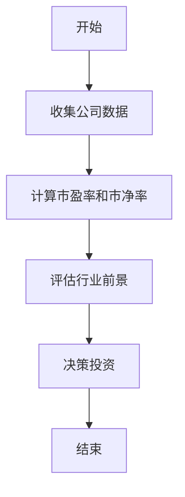
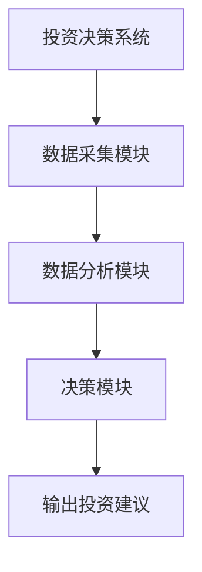
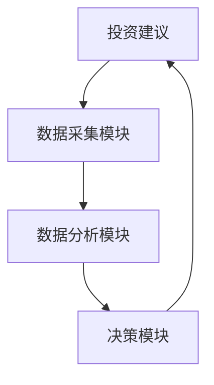
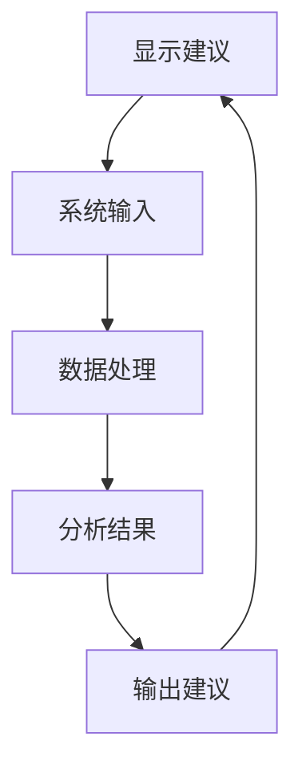

                 


# 巴菲特的跨界投资：从纺织到科技的转变

## 关键词：巴菲特，投资，价值投资，科技投资，投资策略

## 摘要：本文深入探讨了巴菲特从纺织业转向科技投资的过程，分析了他的投资理念和策略，并通过实际案例展示了其投资方法的演变。文章结合技术与投资，为读者提供了全面的视角。

---

## 第三部分：算法原理

### 第3章：巴菲特投资决策的算法原理

#### 3.1 投资决策的量化分析

- 3.1.1 市盈率（P/E Ratio）计算公式
  $$ P/E = \frac{\text{股价}}{\text{每股收益}} $$
  
- 3.1.2 市净率（P/B Ratio）计算公式
  $$ P/B = \frac{\text{股价}}{\text{每股净资产}} $$
  
- 3.1.3 市盈率与市净率的比较

#### 3.2 投资决策流程的mermaid流程图



#### 3.3 投资评估的Python代码实现

```python
def calculate_pe_ratio(price, earnings_per_share):
    return price / earnings_per_share

def calculate_pb_ratio(price, book_value_per_share):
    return price / book_value_per_share

# 示例数据
price = 150  # 假设股价为150美元
earnings_per_share = 5  # 每股收益为5美元
book_value_per_share = 10  # 每股净资产为10美元

pe_ratio = calculate_pe_ratio(price, earnings_per_share)
pb_ratio = calculate_pb_ratio(price, book_value_per_share)

print(f"市盈率：{pe_ratio}\n市净率：{pb_ratio}")
```

#### 3.4 投资决策的数学模型

- 市盈率反映市场对收益的估值，市净率反映市场对资产的估值。
- 通过比较市盈率和市净率与行业平均水平，巴菲特评估投资的潜在价值。

---

## 第四部分：系统分析与架构设计方案

### 第4章：投资决策系统的架构设计

#### 4.1 系统架构图



#### 4.2 数据流图



#### 4.3 系统交互图



---

## 第五部分：项目实战

### 第5章：科技投资的实际案例分析

#### 5.1 环境安装

- 安装必要的Python库，如Pandas、NumPy。

```bash
pip install pandas numpy matplotlib
```

#### 5.2 核心代码实现

```python
import pandas as pd

# 假设数据为苹果公司财务数据
data = {
    '公司': ['苹果'],
    '股价': [150],
    '每股收益': [5],
    '每股净资产': [10]
}

df = pd.DataFrame(data)

pe = df['股价'] / df['每股收益']
pb = df['股价'] / df['每股净资产']

print(f"市盈率：{pe.values[0]}\n市净率：{pb.values[0]}")
```

#### 5.3 代码解读与分析

- 计算苹果的市盈率和市净率，评估其投资价值。
- 对比行业平均水平，判断是否值得投资。

#### 5.4 实际案例分析

- 苹果公司的案例：高市盈率和高市净率，但因其高增长和盈利能力，巴菲特可能认为其有投资价值。

#### 5.5 项目小结

- 通过量化分析和基本面分析，结合行业趋势，做出投资决策。

---

## 第六部分：总结与展望

### 第6章：总结与展望

#### 6.1 总结

- 巴菲特从纺织业转向科技投资，展示了其灵活和深邃的投资智慧。
- 价值投资与科技投资的结合，为投资者提供了新的视角。

#### 6.2 展望

- 未来科技投资将更加依赖数据驱动的决策和量化分析。
- 投资者需持续学习和适应科技行业的变化。

#### 6.3 最佳实践 Tips

- 长期投资，避免短期波动。
- 分散投资，降低风险。
- 持续学习，关注行业动态。

---

## 作者：AI天才研究院/AI Genius Institute & 禅与计算机程序设计艺术 /Zen And The Art of Computer Programming

