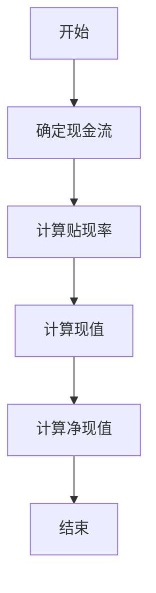
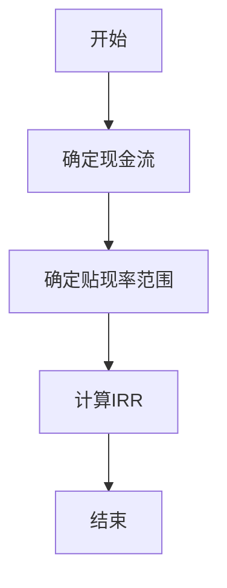
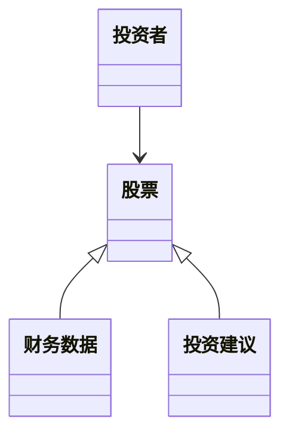
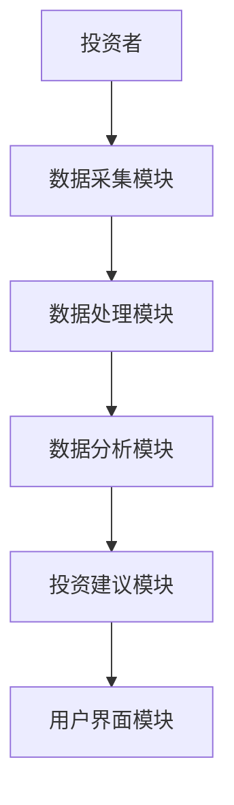

                 


# 巴菲特的逆向投资思维

## 关键词：巴菲特, 逆向思维, 价值投资, 安全边际, 投资策略

## 摘要：  
本文深入探讨了巴菲特的逆向投资思维，从背景介绍到实际操作，详细解析了价值投资的核心理念、安全边际的重要性，以及逆向思维在投资决策中的应用。文章结合算法原理、系统架构和项目实战，为读者提供了全面的投资分析框架，帮助读者在复杂多变的市场中找到投资机会。

---

## 第一部分：背景介绍

### 第1章：投资的基本概念

#### 1.1 投资的基本概念

##### 1.1.1 资产与负债的定义
资产是企业或个人拥有的能够产生经济价值的资源，如现金、股票、房地产等。负债是企业或个人需要偿还的债务，如贷款、应付账款等。

##### 1.1.2 股票与债券的区别
股票代表公司的一部分所有权，投资者通过持有股票成为公司的股东，享有分红和资本增值的收益。债券是公司或政府发行的债务工具，投资者通过购买债券获得固定的利息收入，到期后收回本金。

##### 1.1.3 投资的分类与特点
投资可以分为短期投资和长期投资。短期投资注重资本的流动性，风险较低；长期投资注重资本增值，风险较高但潜在收益也更大。

#### 1.2 巴菲特的生平简介

##### 1.2.1 巴菲特的成长经历
沃伦·巴菲特（Warren Buffett）出生于1930年，成长于美国奥马哈市。他在童年时期就展现出对数字和商业的敏锐洞察力，11岁时购买了第一份报纸，开始接触投资。

##### 1.2.2 巴菲特的投资理念
巴菲特的投资理念以价值投资为核心，强调寻找具有持续竞争优势和良好管理的公司，以低于其内在价值的价格买入并长期持有。

##### 1.2.3 巴菲特的成功案例
巴菲特最著名的投资案例是可口可乐和美国运通。他通过长期持有这些公司的股票，获得了巨额的资本增值。

#### 1.3 逆向思维的定义

##### 1.3.1 正向思维与逆向思维的区别
正向思维是指在市场繁荣时买入，而在市场低迷时卖出。逆向思维则相反，强调在市场低迷时买入，而在市场繁荣时卖出。

##### 1.3.2 逆向思维在投资中的意义
逆向思维帮助投资者在市场恐慌时找到低估的投资机会，避免在市场高点盲目跟风。

##### 1.3.3 逆向思维的应用场景
逆向思维适用于市场周期波动较大的领域，如股票市场、房地产市场等。

---

## 第二部分：核心概念与联系

### 第2章：价值投资的核心要素

#### 2.1 价值投资的定义与特点

##### 2.1.1 价值投资的定义
价值投资是一种投资策略，强调以低于内在价值的价格购买优质资产。

##### 2.1.2 价值投资的核心要素
- 公司基本面：包括盈利能力、财务状况、竞争优势等。
- 安全边际：买入价格低于内在价值的部分。

##### 2.1.3 价值投资与成长投资的区别
价值投资注重安全边际和低估值，而成长投资注重公司的成长潜力和高估值。

#### 2.2 安全边际的概念与计算

##### 2.2.1 安全边际的定义
安全边际是内在价值与市场价格之间的差额，确保在市场价格波动时仍能获得收益。

##### 2.2.2 安全边际的计算方法
计算公式：安全边际 = 内在价值 - 市场价格。

##### 2.2.3 安全边际在投资决策中的作用
安全边际提供了风险缓冲，使投资者能够在市场下跌时减少损失。

#### 2.3 市场逆向思维的原理

##### 2.3.1 市场逆向思维的定义
市场逆向思维是指在市场情绪低落时寻找投资机会，而在市场情绪高涨时避免盲目跟风。

##### 2.3.2 市场逆向思维的原理
市场情绪往往与实际价值相反，逆向思维帮助投资者发现市场错估的机会。

##### 2.3.3 市场逆向思维的应用
逆向思维适用于市场恐慌时买入优质资产，市场疯狂时卖出或避免投资。

---

## 第三部分：算法原理讲解

### 第3章：价值评估模型

#### 3.1 价值评估模型的定义

##### 3.1.1 价值评估模型的定义
价值评估模型是用于计算公司内在价值的工具，帮助投资者判断是否以合理的价格买入股票。

##### 3.1.2 价值评估模型的分类
常见的价值评估模型包括净现值法（NPV）和内部收益率法（IRR）。

#### 3.2 价值评估模型的实现

##### 3.2.1 净现值法（NPV）

###### 使用mermaid流程图展示NPV计算过程



###### 使用Python代码实现NPV计算

```python
def calculate_npv(cash_flows, discount_rate):
    npv = 0
    for i, cash_flow in enumerate(cash_flows):
        npv += cash_flow / (1 + discount_rate) ** i
    return npv

# 示例
cash_flows = [100, 200, 300]
discount_rate = 0.1
print("净现值为：", calculate_npv(cash_flows, discount_rate))
```

###### 使用数学公式解释NPV的计算原理

$$ NPV = \sum_{i=0}^{n} \frac{CF_i}{(1 + r)^i} $$

其中，\( CF_i \) 是第i期的现金流，\( r \) 是贴现率。

##### 3.2.2 内部收益率法（IRR）

###### 使用mermaid流程图展示IRR计算过程



###### 使用Python代码实现IRR计算

```python
import numpy as np

def calculate_irr(cash_flows):
    try:
        irr = np.irr(cash_flows)
        return irr
    except:
        return None

# 示例
cash_flows = [-100, 200, 300]
print("内部收益率为：", calculate_irr(cash_flows))
```

###### 使用数学公式解释IRR的计算原理

IRR是使得净现值等于零的贴现率：

$$ NPV = \sum_{i=0}^{n} \frac{CF_i}{(1 + IRR)^i} = 0 $$

---

## 第四部分：系统分析与架构设计方案

### 第4章：投资决策系统

#### 4.1 问题场景介绍

##### 4.1.1 投资决策系统的目标
构建一个基于逆向思维的价值投资决策系统，帮助投资者在市场中找到低估的投资机会。

#### 4.2 项目介绍

##### 4.2.1 项目目标
开发一个能够分析股票市场数据、评估内在价值并提供投资建议的系统。

#### 4.3 系统功能设计

##### 4.3.1 领域模型mermaid类图



#### 4.4 系统架构设计

##### 4.4.1 系统架构mermaid架构图



#### 4.5 系统接口设计

##### 4.5.1 系统接口设计
- 数据输入接口：接收股票市场数据。
- 数据输出接口：提供投资建议和分析结果。

#### 4.6 系统交互mermaid序列图

```mermaid
graph TD
    A[投资者] --> B[数据采集模块]: 请求数据
    B --> C[数据处理模块]: 提供数据
    C --> D[数据分析模块]: 分析数据
    D --> E[投资建议模块]: 生成建议
    E --> F[用户界面模块]: 显示结果
    F --> A[投资者]: 提供投资建议
```

---

## 第五部分：项目实战

### 第5章：构建投资模型

#### 5.1 项目环境安装

##### 5.1.1 安装必要的Python库
安装numpy、pandas和scipy等库用于数据分析。

#### 5.2 系统核心实现

##### 5.2.1 使用Python代码实现投资模型

```python
import numpy as np
import pandas as pd

# 示例数据
data = {'股票代码': ['A', 'B', 'C'], 
        '股价': [100, 200, 300], 
        '内在价值': [120, 220, 320]}
df = pd.DataFrame(data)

# 计算安全边际
df['安全边际'] = df['内在价值'] - df['股价']
print("安全边际计算结果：", df)
```

##### 5.2.2 代码应用解读与分析
通过计算安全边际，投资者可以识别出哪些股票的价格低于其内在价值，从而提供投资机会。

#### 5.3 实际案例分析

##### 5.3.1 案例分析
以某公司为例，计算其内在价值和安全边际，判断是否值得投资。

##### 5.3.2 案例分析与解读
通过具体案例分析，验证模型的有效性和实用性。

#### 5.4 项目小结

##### 5.4.1 项目总结
通过构建投资模型，投资者可以系统化地应用逆向思维进行投资决策。

##### 5.4.2 经验与教训
模型的成功取决于数据的准确性和分析的深度，同时需要不断更新和优化。

---

## 第六部分：最佳实践

### 第6章：逆向思维的最佳实践

#### 6.1 小结

##### 6.1.1 逆向思维的核心要点
- 识别市场错估的机会
- 计算安全边际
- 长期持有优质资产

#### 6.2 注意事项

##### 6.2.1 风险提示
逆向思维需要投资者具备较高的市场分析能力和心理素质，避免盲目跟风。

#### 6.3 拓展阅读

##### 6.3.1 推荐书籍
- 《巴菲特致股东的信》
- 《投资最重要的简单真理》

---

## 结语

逆向思维是巴菲特投资成功的核心理念之一，通过本文的系统介绍和实际操作，读者可以更好地理解和应用这一策略，提升自己的投资能力。

## 作者

作者：AI天才研究院/AI Genius Institute & 禅与计算机程序设计艺术 /Zen And The Art of Computer Programming

